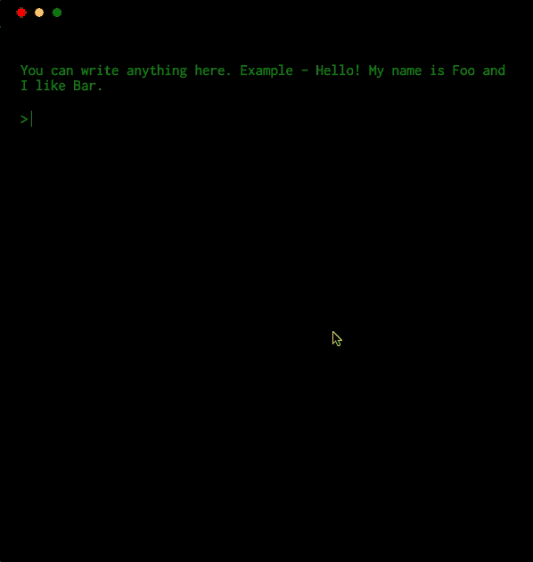
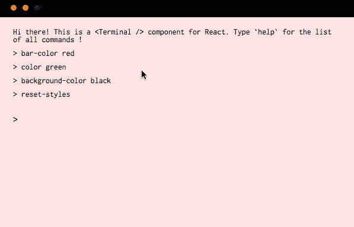
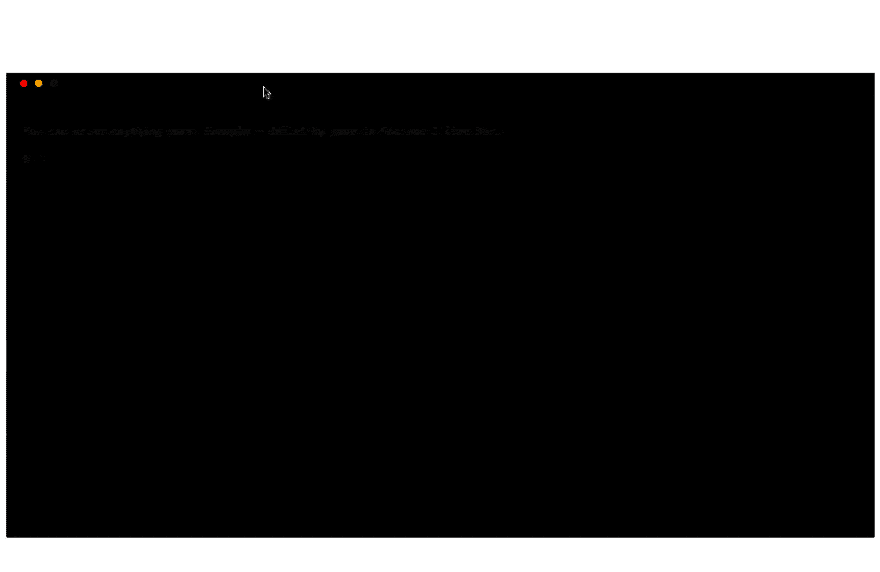
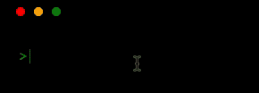
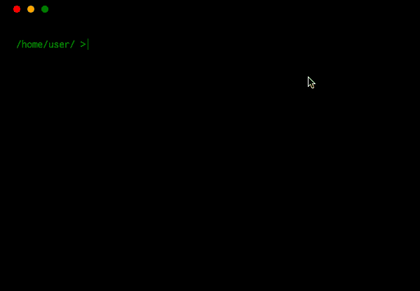
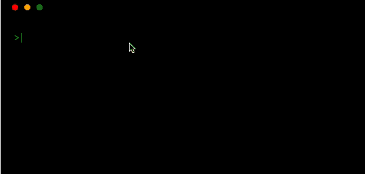
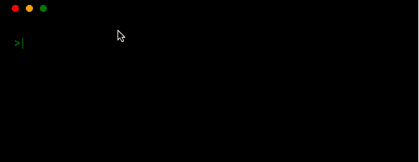
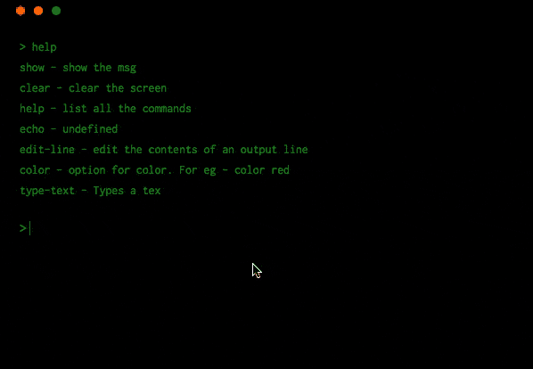

# React JS 中的终端

> 原文:[https://dev.to/ntulswani/terminal-in-react-js](https://dev.to/ntulswani/terminal-in-react-js)

[T2】](https://camo.githubusercontent.com/0cbe60854a20d1c9d17b863dc53c6ae84498af7a/68747470733a2f2f692e6779617a6f2e636f6d2f61376533356633343662393039333439613032343338656531373637383935362e676966)

两周多前，我已经创建了 [terminal-in-react](https://github.com/nitin42/terminal-in-react) ，这是一个在 React JS 中呈现终端的组件。我想用 React 创造一些有趣的东西，然后我有了这个疯狂的想法。

### 工作原理？

该组件呈现一个终端界面，允许您添加自己的命令。例如，让我们添加一个自动输入给定文本的命令。

```
<Terminal
  commands={{
    "type-text": (args, print, runCommand) => {
      const text = args.slice(1).join('  ');
      print('');
      for (let i = 0; i < text.length; i += 1) {
        setTimeout(() => {
          runCommand(`edit-line ${text.slice(0, i + 1)}`);
        }, 100 * i);
      }
    }
  }}
/> 
```

<svg width="20px" height="20px" viewBox="0 0 24 24" class="highlight-action crayons-icon highlight-action--fullscreen-on"><title>Enter fullscreen mode</title></svg> <svg width="20px" height="20px" viewBox="0 0 24 24" class="highlight-action crayons-icon highlight-action--fullscreen-off"><title>Exit fullscreen mode</title></svg>

别担心，我们稍后会研究 API。让我们看看这个命令是如何工作的。

[T2】](https://camo.githubusercontent.com/811a5b86064acd395a6155f0bea1dffa0337262e/68747470733a2f2f692e6779617a6f2e636f6d2f65663234323734363439383962316365313462633434626234666339343638392e676966)

有意思！对吗？但是还有更多…

### 基本示例

```
 import React, { Component } from 'react';
import Terminal from 'terminal-in-react';
import 'terminal-in-react/lib/css/index.css';

class App extends Component {
  showMsg = () => 'Hello World'

  render() {
    return (
      <div style={{ display: "flex", justifyContent: "center", alignItems: "center", height: "100vh" }}>
        <Terminal
          color='green'
          backgroundColor='black'
          barColor='black'
          style={{ fontWeight: "bold", fontSize: "1em" }}
          commands={{
            'open-google': () => window.open('google.com', '_blank'),
            showmsg: this.showMsg,
            popup: () => alert('Terminal in React')
          }}
          descriptions={{
            'open-google': 'opens google.com',
            showmsg: 'shows a message',
            alert: 'alert', popup: 'alert'
          }}
          msg='You can write anything here. Example - Hello! My name is Foo and I like Bar.'
        />
      </div>
    );
  }
} 
```

<svg width="20px" height="20px" viewBox="0 0 24 24" class="highlight-action crayons-icon highlight-action--fullscreen-on"><title>Enter fullscreen mode</title></svg> <svg width="20px" height="20px" viewBox="0 0 24 24" class="highlight-action crayons-icon highlight-action--fullscreen-off"><title>Exit fullscreen mode</title></svg>

在上面的例子中，我添加了三个命令，open-google、showmsg 和 popup。我还用一个描述道具描述了所有三个命令。

### 显示消息

当组件安装时，显示带有`msg` prop 的消息。

```
<Terminal msg="Hello World" /> 
```

<svg width="20px" height="20px" viewBox="0 0 24 24" class="highlight-action crayons-icon highlight-action--fullscreen-on"><title>Enter fullscreen mode</title></svg> <svg width="20px" height="20px" viewBox="0 0 24 24" class="highlight-action crayons-icon highlight-action--fullscreen-off"><title>Exit fullscreen mode</title></svg>

### 定制

要定制终端外观，你可以通过属性`color`来改变文本颜色，`backgroundColor`来改变背景颜色，`barColor`来改变条的颜色。

[T2】](https://res.cloudinary.com/practicaldev/image/fetch/s--G75GhVFa--/c_limit%2Cf_auto%2Cfl_progressive%2Cq_66%2Cw_880/https://cdn-images-1.medium.com/max/800/1%2A2zVFoGsY6PVHT07Kj7UisA.gif)

### 最小化、最大化和关闭

没错。这三个按钮实际上在ðÿ˜…工作

[T2】](https://res.cloudinary.com/practicaldev/image/fetch/s--kWrpBL6m--/c_limit%2Cf_auto%2Cfl_progressive%2Cq_66%2Cw_880/https://cdn-images-1.medium.com/max/1000/1%2AM4SVqbvnrmpndnfGk7ip7A.gif)

### 创建高级命令

您还可以添加一个命令，使用高级命令 api 执行一些异步操作，而不是基本 I/O 操作。它有三个参数-

*   `arguments` -输入数组
*   `print` -写新行的方法
*   `runCommand` -调用命令

```
 <Terminal
  commands={{
    color: {
      method: (args, print, runCommand) => {
        print(`The color is ${args._[0] || args.color}`);
      },
      options: [
        {
          name: 'color',
          description: 'The color the output should be',
          defaultValue: 'white',
        },
      ],
    },
  }}
/> 
```

<svg width="20px" height="20px" viewBox="0 0 24 24" class="highlight-action crayons-icon highlight-action--fullscreen-on"><title>Enter fullscreen mode</title></svg> <svg width="20px" height="20px" viewBox="0 0 24 24" class="highlight-action crayons-icon highlight-action--fullscreen-off"><title>Exit fullscreen mode</title></svg>

[T2】](https://res.cloudinary.com/practicaldev/image/fetch/s--fg4Xmz4Y--/c_limit%2Cf_auto%2Cfl_progressive%2Cq_66%2Cw_880/https://cdn-images-1.medium.com/max/800/1%2A0KIMGya2LgZSFWVaLa8-Yg.gif)

### 使用插件ðÿ”

我们还为这个组件开发了一个插件系统，帮助你开发定制插件。

该插件的一个例子是[terminal-in-react-pseudo-file-system-plugin](https://github.com/jcgertig/terminal-in-react-pseudo-file-system-plugin)，它创建了一个假的文件系统。

```
<Terminal
  plugins={[
    new PseudoFileSystem(),
  ]}
/> 
```

<svg width="20px" height="20px" viewBox="0 0 24 24" class="highlight-action crayons-icon highlight-action--fullscreen-on"><title>Enter fullscreen mode</title></svg> <svg width="20px" height="20px" viewBox="0 0 24 24" class="highlight-action crayons-icon highlight-action--fullscreen-off"><title>Exit fullscreen mode</title></svg>

让我们来看看它的作用，

[T2】](https://res.cloudinary.com/practicaldev/image/fetch/s--tzGaau4p--/c_limit%2Cf_auto%2Cfl_progressive%2Cq_66%2Cw_880/https://cdn-images-1.medium.com/max/800/1%2AIyyiXeHf95GCuajcq3KLUQ.gif)

哇哦。厉害！！让我们知道你是否做了有趣的东西，ðÿ˜ƒ

### 更多特性

*   制表符自动完成

[T2】](https://res.cloudinary.com/practicaldev/image/fetch/s--WOO7aJX8--/c_limit%2Cf_auto%2Cfl_progressive%2Cq_66%2Cw_880/https://cdn-images-1.medium.com/max/800/1%2AxoLnt73ETCMseEvlgFKZDw.gif)

*   多行输入

[T2】](https://res.cloudinary.com/practicaldev/image/fetch/s--mTZq18yf--/c_limit%2Cf_auto%2Cfl_progressive%2Cq_66%2Cw_880/https://cdn-images-1.medium.com/max/800/1%2AmIIyNiXpsIO8BYRAjEA-gQ.gif)

*   检查命令的历史记录

[T2】](https://res.cloudinary.com/practicaldev/image/fetch/s--M1W5DIZk--/c_limit%2Cf_auto%2Cfl_progressive%2Cq_66%2Cw_880/https://cdn-images-1.medium.com/max/800/1%2AXavuSylXlxkidSTJ8m-RtA.gif)

### 键盘快捷键

您也可以定义键盘快捷键。它们必须按操作系统分组。可用的三个版本是 win、darwin 和 linux。你可以通过一个`,`将多个操作系统分组，例如，如果快捷方式适用于所有平台，那么`win,darwin,linux`作为一个键就可以了。快捷方式的值应该是要运行的命令。

```
<Terminal
  shortcuts={{
    'darwin,win,linux': {
      'ctrl + a': 'echo whoo',
    },
  }}
/> 
```

<svg width="20px" height="20px" viewBox="0 0 24 24" class="highlight-action crayons-icon highlight-action--fullscreen-on"><title>Enter fullscreen mode</title></svg> <svg width="20px" height="20px" viewBox="0 0 24 24" class="highlight-action crayons-icon highlight-action--fullscreen-off"><title>Exit fullscreen mode</title></svg>

特定于操作系统的快捷键

```
 <Terminal
  shortcuts={{
    'win': {
      'ctrl + a': 'echo hi windows',
    },
    'darwin': {
      'cmd + a': 'echo hi mac'
    },
    'linux': {
      'ctrl + a': 'echo hi linux'
    }
  }}
/> 
```

<svg width="20px" height="20px" viewBox="0 0 24 24" class="highlight-action crayons-icon highlight-action--fullscreen-on"><title>Enter fullscreen mode</title></svg> <svg width="20px" height="20px" viewBox="0 0 24 24" class="highlight-action crayons-icon highlight-action--fullscreen-off"><title>Exit fullscreen mode</title></svg>

或者混搭

```
 <Terminal
  shortcuts={{
    'win,linux': {
      'ctrl + b': 'echo we are special',
    },
    'win': {
      'ctrl + a': 'echo hi windows',
    },
    'darwin': {
      'cmd + a': 'echo hi mac'
    },
    'linux': {
      'ctrl + a': 'echo hi linux'
    }
  }}
/> 
```

<svg width="20px" height="20px" viewBox="0 0 24 24" class="highlight-action crayons-icon highlight-action--fullscreen-on"><title>Enter fullscreen mode</title></svg> <svg width="20px" height="20px" viewBox="0 0 24 24" class="highlight-action crayons-icon highlight-action--fullscreen-off"><title>Exit fullscreen mode</title></svg>

### 内置命令

*   `clear` -清除屏幕
*   `help` -列出所有命令
*   `show` -显示消息(如果有)
*   `echo` -显示输入信息
*   `edit-line` -使用-l 参数编辑最后一行或给定的一行

### 当前状态

我们正在努力-

*   添加工作区和选项卡
*   解析器(编写 basic 程序)
*   扩展插件系统

因此，期待在下一个版本ðÿ˜ž更多的功能

大声喊出来，感谢 Jonathan Gertig 和 Christian Varisco 对ðÿž‰â项目做出的惊人贡献。非常感谢！！

如果你想为这个项目做贡献，这里的[就是贡献指南。看到你的拉请求我很激动。](https://github.com/nitin42/terminal-in-react/blob/master/CONTRIBUTING.md)

GitHub-[https://github.com/nitin42/terminal-in-react](https://github.com/nitin42/terminal-in-react)

网站-[http://terminal-in-react.surge.sh/](http://terminal-in-react.surge.sh/)

https://github.com/nitin42/terminal-in-react/wiki