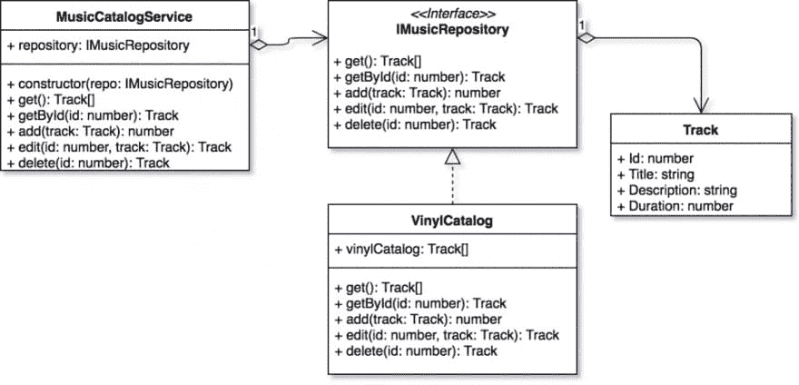

# 类型脚本中的控制反转和依赖注入

> 原文:[https://dev . to/samueleresca/inversion-of-control-and-dependency-injection-in-typescript](https://dev.to/samueleresca/inversion-of-control-and-dependency-injection-in-typescript)

*最初发布于:[samueleresca.net](https://samueleresca.net)T3】*

下面这篇文章是关于 Typescript 中的**控制反转(IoC)**β和 d* *依赖注入(DI)* *。该技术的主要目的是提供模块和类之间的松散耦合。 **IoC** 和 **DI** 是 SOLID 主题的一部分，使用 Typescript 的 [SOLID 原则可以结合 Typescript 世界给你更多关于 SOLID 的概念。我已经写过关于依赖注入的文章:依赖注入概述。这篇文章包含了一些关于依赖注入基本概念的一般信息。我还建议对依赖注入的另一个很酷的解释:如何向一个 5 岁的孩子解释依赖注入？](https://samueleresca.net/2016/08/solid-principles-using-typescript/)。

## 使用控制反转和依赖注入的原因

以下是使用控制反转和依赖注入的一些原因:

*   **解耦:**依赖注入使你的模块耦合度降低，从而产生更易维护的代码库；
*   更简单的单元测试:——不用使用硬编码的依赖项，你可以将它们传递到你想使用的模块中；
*   **更快的开发:**——使用依赖注入，在接口被定义之后，很容易工作而没有任何合并冲突；

## 倒置 JS

InversifyJS 是一个轻量级的控制反转(IoC)容器，用于 TypeScript 和 JavaScript 应用程序。IoC 容器使用类构造函数来标识和注入它的依赖项。InversifyJS 有一个友好的 API，并鼓励使用最好的 OOP 和 IoC 实践。【T2

### 哲学

InversifyJS 的开发有 4 个主要目标:

*   允许 JavaScript 开发人员编写符合坚实原则的代码。
*   促进和鼓励遵守最佳面向对象和国际奥委会惯例。
*   增加尽可能少的运行时开销。
*   提供最先进的开发体验。

## 将 JS 转化为行动

下面的例子将使用 Typescript 结合 InversifyJS 来实现一些基本的逻辑。所有类都将实现接口。用 Jest 编写的单元测试套件将覆盖所有的代码库。它将使用依赖注入来模仿类背后的行为和功能。首先，让我们给你一个项目结构的概述:[](https://res.cloudinary.com/practicaldev/image/fetch/s--UrBm_acf--/c_limit%2Cf_auto%2Cfl_progressive%2Cq_auto%2Cw_880/https://samueleresca.net/wp-content/uploads/2017/07/download-1-1-960x462.png)—`Track`类定义了我们系统的**域模型**。`IMusicRepository`定义了一个独立于**的接口**，其目的是公开存储库的公共功能，比如 CRUD 操作。`VinylCatalog`类实现了`IMusicRepository`并查询一个假的数据库，它将返回/更新一个乙烯基集合。每个`IMusicRepository`消费者，例如`MusicCatalogService`，对`VinylCatalog`一无所知:这是固体编程原则和依赖注入的**主要目的之一。下面的代码显示了先前 UML 模式的 typescript 实现:** 

```
//@file Track.ts
export class Track{

    constructor(id: number, title: string, artist: string, duration:number){
        this.Id= id;
        this.Title= title;
        this.Artist= artist;
        this.Duration= duration;
    }

    public Id : number;
    public Title: string;
    public Artist: string;
    public Duration: number;
}

//@file IMusicRepository.ts 

import { Track } from "../Models/Track";

export interface IMusicRepository {
     get() : Track[];
     getById(id: number) : Track;
     add(track: Track) : number;
     edit(id: number, track: Track) : Track;
     delete(id: number) : Track;
}

//@file VinylCatalog.ts

import {IMusicRepository} from "./IMusicRepository";
import { Track } from "../Models/Track";

export class VinylCatalog implements IMusicRepository{

    private vinylList : Track[] = new Array(
        new Track(1, "DNA.", "Kendrick Lamar", 340),
        new Track(2, "Come Down", "Anderson Paak.", 430),
        new Track(3, "DNA.", "Kendrick Lamar", 340),
        new Track(4, "DNA.", "Kendrick Lamar", 340),
        new Track(5, "DNA.", "Kendrick Lamar", 340)
    );

    get(): Track[] {
        return this.vinylList;
    }
    getById(id: number): Track {
       return this.vinylList.find(track=> track.Id== id);
    }
    add(track: Track): number {
        return this.vinylList.push(track);
    }
    edit(id: number, track: Track): Track {
       var targetIndex = this.vinylList.findIndex((track => track.Id == id));

       this.vinylList[targetIndex].Artist= track.Artist;
       this.vinylList[targetIndex].Title= track.Title;
       this.vinylList[targetIndex].Duration= track.Duration;

       return this.vinylList[targetIndex];

    }
    delete(id: number): Track {
       var targetIndex = this.vinylList.findIndex((track => track.Id == id));
        if (targetIndex < -1) return null;
        return this.vinylList.splice(targetIndex, 1)[0];
    }

}

//@file MusicCatalogService.ts

import { IMusicRepository } from "../Repositories/IMusicRepository";
import { Track } from "../Models/Track";

export class MusicCatalogService{

    private repository: IMusicRepository;

    constructor(repository:IMusicRepository){
        this.repository= repository;
    }

    get(): Track[] {
        return this.repository.get();
    }
    getById(id: number): Track {
       return this.repository.getById(id);
    }
    add(track: Track): number {
        return this.repository.add(track);
    }
    edit(id: number, track: Track): Track {
       return this.repository.edit(id, track);
    }
    delete(id: number): Track {
      return this.repository.delete(id);
    }
} 
```

<svg width="20px" height="20px" viewBox="0 0 24 24" class="highlight-action crayons-icon highlight-action--fullscreen-on"><title>Enter fullscreen mode</title></svg> <svg width="20px" height="20px" viewBox="0 0 24 24" class="highlight-action crayons-icon highlight-action--fullscreen-off"><title>Exit fullscreen mode</title></svg>

最后，我们准备设置 [InversifyJs](http://inversify.io/) ，这是我们的依赖注入容器。InversifyJS 的主要目的是用具体的类注册和映射接口。当我们谈到控制容器的反转时，总有一个关键的组件:**安装程序**。安装程序提供接口和它们的具体类之间的映射。我们可以在每一个 DI 容器框架和每一种语言中找到安装程序的概念，从 Javascript 到 C#。让我们创建安装程序模块:

```
//@file Installer.ts
import "reflect-metadata";
import { Container } from "inversify";

import SERVICE_IDENTIFIER from "../Constants/Identifiers";
import {IMusicRepository} from "../Repositories/IMusicRepository";
import {VinylCatalog} from "../Repositories/VinylCatalog";

let container = new Container();
container.bind<IMusicRepository>(SERVICE_IDENTIFIER.IMusicRepository).to(VinylCatalog);

export default container; 
```

<svg width="20px" height="20px" viewBox="0 0 24 24" class="highlight-action crayons-icon highlight-action--fullscreen-on"><title>Enter fullscreen mode</title></svg> <svg width="20px" height="20px" viewBox="0 0 24 24" class="highlight-action crayons-icon highlight-action--fullscreen-off"><title>Exit fullscreen mode</title></svg>

@ line 9 我们可以找到`IMusicRepository`和`VinylCatalog`之间的映射。InversifyJs 还需要用`@injectable`属性来修饰我们的具体类，比如:

```
//@file VinylCatalog.ts

import {IMusicRepository} from "./IMusicRepository";
import { Track } from "../Models/Track";
import { inject, injectable, named } from "inversify";

@injectable()
export class VinylCatalog implements IMusicRepository{

    private vinylList : Track[] = new Array(
        new Track(1, "DNA.", "Kendrick Lamar", 340),
        new Track(2, "Come Down", "Anderson Paak.", 430),
        new Track(3, "DNA.", "Kendrick Lamar", 340),
        new Track(4, "DNA.", "Kendrick Lamar", 340),
        new Track(5, "DNA.", "Kendrick Lamar", 340)
    );

    get(): Track[] {
        return this.vinylList;
    }
    getById(id: number): Track {
       return this.vinylList.find(track=> track.Id== id);
    }
    add(track: Track): number {
        return this.vinylList.push(track);
    }
    edit(id: number, track: Track): Track {
       var targetIndex = this.vinylList.findIndex((track => track.Id == id));

       this.vinylList[targetIndex].Artist= track.Artist;
       this.vinylList[targetIndex].Title= track.Title;
       this.vinylList[targetIndex].Duration= track.Duration;

       return this.vinylList[targetIndex];

    }
    delete(id: number): Track {
       var targetIndex = this.vinylList.findIndex((track => track.Id == id));
        if (targetIndex < -1) return null;
        return this.vinylList.splice(targetIndex, 1)[0];
    }

} 
```

<svg width="20px" height="20px" viewBox="0 0 24 24" class="highlight-action crayons-icon highlight-action--fullscreen-on"><title>Enter fullscreen mode</title></svg> <svg width="20px" height="20px" viewBox="0 0 24 24" class="highlight-action crayons-icon highlight-action--fullscreen-off"><title>Exit fullscreen mode</title></svg>

至少，我们可以实现我们的复合根(出于演示目的，它将在一个主文件中实现):

```
//@file: main.ts
import {IMusicRepository} from "./Repositories/IMusicRepository";
import container from "./Infrastructure/Installer";
import SERVICE_IDENTIFIER from "./Constants/Identifiers";
import { MusicCatalogService } from '../src/Services/MusicCatalogService';

// Composition root
let musicRepoo = container.get<IMusicRepository>(SERVICE_IDENTIFIER.IMusicRepository);
let service= new MusicCatalogService(musicRepoo);

console.log(service.get()); 
```

<svg width="20px" height="20px" viewBox="0 0 24 24" class="highlight-action crayons-icon highlight-action--fullscreen-on"><title>Enter fullscreen mode</title></svg> <svg width="20px" height="20px" viewBox="0 0 24 24" class="highlight-action crayons-icon highlight-action--fullscreen-off"><title>Exit fullscreen mode</title></svg>

### 单元测试所有的东西

我们的松散耦合结构方便了对服务和类的单元测试。下面的例子将使用—[Jest](https://facebook.github.io/jest/)作为单元测试框架。Jest 是一个由脸书支持的测试平台，脸书用它来测试所有的 JavaScript 代码，包括 React 应用程序。Jest 还提供了一个模仿的内置库，在我们的演示中模仿存储库功能会很有用。让我们从测试`MusicCatalogService.get`方法开始:

```
//@file MusicCatalogService.spec.ts

import { MusicCatalogService } from '../src/Services/MusicCatalogService';
import { IMusicRepository } from '../src/Repositories/IMusicRepository';
import { Track } from '../src/Models/Track';

describe('MusicCatalogService tests', () => {

  let sut: MusicCatalogService;
  let mockRepo: Track[] = new Array(
      new Track(1, "Mock Title 1", "The Mockers", 0),
      new Track(2, "Mock Title 2", "The Mockers 2", 0)
  );

  it('Should return Tracks value', () => {
    //Arrange
    const Mock = jest.fn<IMusicRepository>(() => ({
      get: jest.fn().mockReturnValue(mockRepo)
    }));
    const mock = new Mock();
    sut = new MusicCatalogService(mock);

    //Act
    var result = sut.get();

    //Assert
    expect(mock.get).toHaveBeenCalled();
    expect(result.length).toBe(2);
  });

}); 
```

<svg width="20px" height="20px" viewBox="0 0 24 24" class="highlight-action crayons-icon highlight-action--fullscreen-on"><title>Enter fullscreen mode</title></svg> <svg width="20px" height="20px" viewBox="0 0 24 24" class="highlight-action crayons-icon highlight-action--fullscreen-off"><title>Exit fullscreen mode</title></svg>

之前的测试涵盖了`MusicCatalogService.get`。首先，它为方法`get`生成模拟结果。其次，它通过使用生成的 mock 初始化`MusicCatalogServices`。最后，我们可以通过使用相同的模式来测试`MusicCatalogService`的其他方法:

```
//@file MusicCatalogService.spec.ts
import { MusicCatalogService } from '../src/Services/MusicCatalogService';
import { IMusicRepository } from '../src/Repositories/IMusicRepository';
import { Track } from '../src/Models/Track';

describe('MusicCatalogService tests', () => {

  let sut: MusicCatalogService;
  let mockRepo: Track[] = new Array(
      new Track(1, "Mock Title 1", "The Mockers", 0),
      new Track(2, "Mock Title 2", "The Mockers 2", 0)
  );

  it('Should return Tracks value', () => {
    //Arrange
    const Mock = jest.fn<IMusicRepository>(() => ({
      get: jest.fn().mockReturnValue(mockRepo)
    }));
    const mock = new Mock();
    sut = new MusicCatalogService(mock);

    //Act
    var result = sut.get();

    //Assert
    expect(mock.get).toHaveBeenCalled();
    expect(result.length).toBe(2);
  });

  it('Should return Tracks by id', () => {
    //Arrange
    const Mock = jest.fn<IMusicRepository>(() => ({
      getById: jest.fn().mockReturnValue(mockRepo[0])
    }));
    const mock = new Mock();
    sut = new MusicCatalogService(mock);

    //Act
    var result = sut.getById(1);

    //Assert
    expect(mock.getById).toHaveBeenCalled();
    expect(result.Id).toBe(1);
    expect(result.Title).toBe("Mock Title 1");

  });

  it('Should add Track', () => {
    //Arrange
    const Mock = jest.fn<IMusicRepository>(() => ({
      add: jest.fn().mockImplementation(
          (track : Track)=>{
              return mockRepo.push(track);
          }
        )
    }));
    const mock = new Mock();
    sut = new MusicCatalogService(mock);

    //Act
    var result = sut.add(new Track(3,"Track Test", "Track test",0));

    //Assert
    expect(mock.add).toHaveBeenCalled();
    expect(result).toBe(3);

  });

  it('Should edit Track', () => {
    //Arrange
    const Mock = jest.fn<IMusicRepository>(() => ({
      edit: jest.fn().mockImplementation(
          (id: number, track : Track)=>{
              return track;
          }
        )
    }));
    const mock = new Mock();
    sut = new MusicCatalogService(mock);

    //Act
    var result = sut.edit(1, new Track(1,"Track Test", "Track test",0));

    //Assert
    expect(mock.edit).toHaveBeenCalled();
    expect(result.Title).toBe("Track Test");

  });

   it('Should delete Track', () => {
    //Arrange
    const Mock = jest.fn<IMusicRepository>(() => ({
      delete: jest.fn().mockImplementation(
          (id: number)=>{
            var targetIndex = mockRepo.findIndex((track => track.Id == id));
            return mockRepo.splice(targetIndex, 1)[0];
          }
        )
    }));
    const mock = new Mock();
    sut = new MusicCatalogService(mock);

    //Act
    var result = sut.delete(1);

    //Assert
    expect(mock.delete).toHaveBeenCalled();
    expect(result.Title).toBe("Mock Title 1");

  });

}); 
```

<svg width="20px" height="20px" viewBox="0 0 24 24" class="highlight-action crayons-icon highlight-action--fullscreen-on"><title>Enter fullscreen mode</title></svg> <svg width="20px" height="20px" viewBox="0 0 24 24" class="highlight-action crayons-icon highlight-action--fullscreen-off"><title>Exit fullscreen mode</title></svg>

## 最终的想法

你可以在 GitHub 上找到下面的演示[。总之，我认为我们应该采纳这些建议:](https://github.com/samueleresca/Blog.TypescriptIoCDependencyInjectionSample)

1.  **停止**认为 IoC 容器在 JavaScript 应用中没有位置；
2.  **开始**编写遵循坚实原则的面向对象的 JavaScript 代码；

更多信息:
[坚实的原则使用打字稿](https://samueleresca.net/2016/08/solid-principles-using-typescript/)
[依赖注入概述](https://samueleresca.net/2017/02/dependency-injection-overview/)
干杯:)