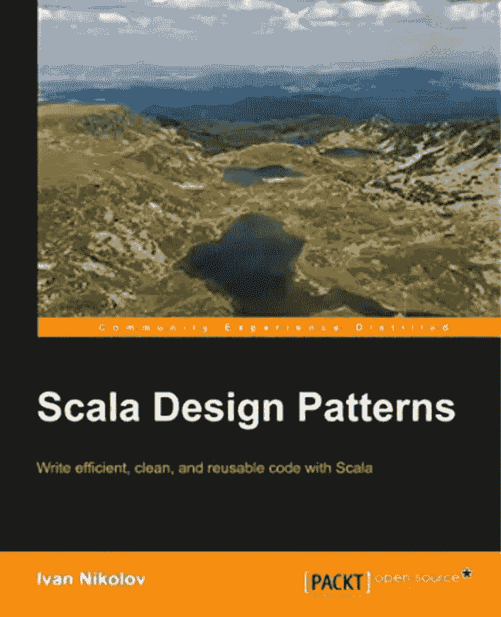

# 面向工人阶级程序员的 Scala 函数式编程第 1 部分

> 原文:[https://dev . to/tomerbendavid/functional-programming-in-Scala-for-working-class-programmer-part-01](https://dev.to/tomerbendavid/functional-programming-in-scala-for-working-class-programmer-part-01)

**简介**

你有没有参加过 scala conf 并告诉自己“我不知道这家伙在说什么？”你是否紧张地环顾四周，看到所有人都微笑着说“是啊，这很明显”，结果却让你更加紧张？。如果是这样，这篇文章是给你的，否则就跳过它，你已经知道 scala 中的 FP；)

这篇文章很乐观，虽然我要说 scala 中的函数式编程并不容易，但我们的目标是理解它，所以跟我说吧。面对现实吧，如果你只是一个主要来自 java 背景的工人阶级程序员，那么 scala 中的函数式编程是很难的。如果你有哈斯克尔的背景，那就简单了。如果你有很重的数学背景，那当然很简单。但是如果你是一个标准的工人阶级 java 后端工程师，以前有过 OOP 设计背景，那就太难了。

**本文的视频/播客版本**

**Scala 和设计模式**

scala 的一个有趣的观点是，将它的一系列特性视为设计模式。这正是 Ivan Nikolov 在 [Scala 设计模式](http://devatrest.blogspot.com/2017/07/scala-design-patterns-book-review.html)中所说的。他实际上展示了 scala 编程语言的混合特性如何使一些传统的面向对象设计模式变得过时，或者可能，在他的伟大著作中使用了其他更简洁的技术。虽然我完全同意他的观点，但我也认识到，浏览所有的标准设计模式将会花费很多时间，不仅是标准设计模式，还有许多其他编写的模式、最佳实践，以及查看 scala 编程语言中的匹配情况。

 [T3】](http://devatrest.blogspot.com/2017/07/scala-design-patterns-book-review.html)

**术语**

先说术语，单子，半群，函子，类型类，高阶函数，高阶类型，部分应用函数，部分函数，你还在吗？如果你已经知道了以上的概念，那么这篇文章就不适合你，但是如果你不知道，那好吧，但是我没有机会在一篇文章中讲述它们，所以请继续关注下一篇文章。

**举例，简单吗**

问题，下面的代码简单吗？

```
 object Request {
    def pure[A](a: A): Free[Requestable, A] =
      Free.liftFC(Pure(a) : Request[A])

    def fetch[A](service: Service[A]): Free[Requestable, A] =
      Free.liftFC(Fetch(service) : Request[A])
  } 
```

对我来说不是，那些“免费的”、“免费的”、“纯粹的”都是什么，泛型在那里做什么？我可以找到成千上万个这样的例子，只要在谷歌上搜索很酷的 FP 术语，我们的目标就是分解这个结构，拨开迷雾。

哈斯克尔

我认为，如果你想学习 scala，你首先需要学习 haskell 或其他东西，然后才能接触 scala。看起来通过 scala 很难理解这些概念。是的，当我需要在 scala 中学习一个概念的时候，猜猜我首先在 haskell 中学习它，然后才接触到 scala。如果 haskell 只有所有的 java 库并在 jvm 上运行...

**FP 很重要**

但是 FP 很重要，并发，更好的代码，大数据，并行计算，更好的测试。我的意思是，FP 是一个希望用干净的内核和所有围绕它的 IO 来编写干净代码的程序员的事情，这是干净代码的梦想，所以我们将做出努力。

**FB 的好处**

FP 的好处是制造了所有的问题和噪音。对于 FP，你使用纯函数，我想我们都知道它的意思。问题是现实世界的应用并不纯粹，它们有副作用。这就是复杂性发挥作用的地方，这是一个挑战，此外，你不能改变事物，所以你开始使用递归:)

**命令式程序员的好处**

在我被函数式程序员暗杀之前，我想告诉你，命令式编程有好的一面。如果你对干净的代码实践有一些基本的了解，而且你用命令式编程写了组织良好的干净的代码，(小函数，需要的地方有变化，但不总是)，你使用 for 循环而不是 map/flatMap twin brothers。那你知道吗？你使用 java util 并发构建模块和非阻塞 io 以及多线程，你可以编写具有高性能利用率的优秀应用程序，我从第一手资料中了解到这一点，我编写了许多这样的应用程序，其中一些具有非常高的规模需求，我不得不说，对于其他没有掌握大量 FP 知识的程序员来说，这些命令式程序比他们的 FP 镜像兄弟姐妹程序更容易理解。所以命令式也是好的。但我们是来解决外交政策问题的，而不是迫不得已的。这就是我们要走的路。

**陈述性 vs 命令性**

所以第一步是理解声明性代码的含义。

我喜欢 jenkov 的文章《声明性代码的错觉》。他给出了下面的命令式代码:

```
function capitalWithInterest(capital, interest, periods) {
    var result = capital;
    for(var i = 0; i < periods; i++) {
        result = result * (1 + interest);
    }
    return result;
} 
```

现在他问这段代码的声明版本是什么？他回答说:

```
var result = capitalWithInterest(100, 0.1, 5); 
```

这里是声明性的，我们没有强制性地说我们要如何计算本金和利息，我们只是告诉计算机，我们要它为我们计算本金和利息。

**使用 scala 的声明性代码**

所以在 scala 中，声明性代码最常见的例子是使用“map”和 friends，而不是 for 循环，for 循环是告诉计算机如何执行循环的明确命令方式，而 map 和 friends 是声明性的，你只需告诉计算机检查列表中的项目，并从每个项目中减去 2

```
val listOfNumbers = List(1,2,3)
listOfNumbers.map(_ - 2).foreach(println) 
```

因此，在这种情况下，我们告诉 odersky，请对列表中的每一项(地图)减去 2，并对每一项打印它(在你从中减去 2 之后)，而不是强制遍历列表并打印每一项

**函数编程和不变性**

因为在函数式编程中，我们更愿意使用纯函数，这就产生了一个后果，就是我们越来越多地使用不可变性，越来越多地支持可变数据结构。在 John Hunt 的名著《Scala 设计模式》中，作者说:“不变性是 Scala 的一个重要原则，应该优先考虑。带有 case 类的生成器设计模式使用不可变的字段，这被认为是一个好的实践。”。是的，从 sealed traits 继承的 case 类不仅是建模数据的好方法，而且在使用不可变数据结构而不是可变数据结构方面有很大帮助。

**总结**

这里我们只是触及了冰山的一角，但是不要担心，在全球变暖取而代之之前，我们将会触及所有你想知道的关于 scala 的概念，但是有关于自由单子、管理状态、函子和朋友的噩梦。