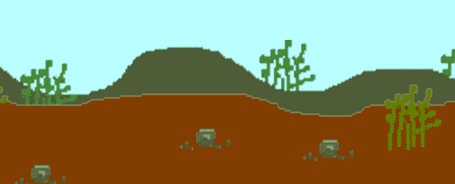

# 在 Lua/Love2D 中制作一个射手-动画和粒子

> 原文:[https://dev.to/jeansberg/make-a-shooter-in-lualove2d 动画和粒子](https://dev.to/jeansberg/make-a-shooter-in-lualove2d---animations-and-particles)

在本教程的前三部分，我们实现了[移动](https://dev.to/jeansberg/make-a-shooter-in-lualove2d---part-1)、[射击](https://dev.to/jeansberg/make-a-shooter-in-lualove2d---part-2)和[敌人](https://dev.to/jeansberg/make-a-shooter-in-lualove2d---part-3)，这意味着我们现在有一个工作，如果基本的话，射击他们。现在是时候添加一些天赋了！在这篇文章中，我将介绍动画、粒子效果和滚动背景。

## 动画

在这一点上，玩家和敌人是没有动画的。他们的图像只是在屏幕上移动。为了让它们更加逼真，我们将为它们垂直移动时引入倾斜动画。

```
if down and player.yPos<love.graphics.getHeight()-player.height then
  player.yPos = player.yPos + dt * speed
  player.angle = 0.1
  player.pSystem:setLinearAcceleration(-75, -15, -150, -15)
elseif up and player.yPos>0 then
  player.yPos = player.yPos - dt * speed
  player.angle = -0.1
  player.pSystem:setLinearAcceleration(-75, 15, -150, 15)
else
  player.angle = 0
  player.pSystem:setLinearAcceleration(-75, 0, -150, 0)
end 
```

<svg width="20px" height="20px" viewBox="0 0 24 24" class="highlight-action crayons-icon highlight-action--fullscreen-on"><title>Enter fullscreen mode</title></svg> <svg width="20px" height="20px" viewBox="0 0 24 24" class="highlight-action crayons-icon highlight-action--fullscreen-off"><title>Exit fullscreen mode</title></svg>

我们向播放器表中添加一个“angle”键，在 updatePlayer()函数中对其进行修改。然后，我们将 player.angle 作为“方向”参数传递给 draw()函数。请注意，角度是以弧度而不是度数给出的，这就是数字如此之小的原因。

```
love.graphics.draw(player.img, player.xPos, player.yPos, player.angle, 2, 2) 
```

<svg width="20px" height="20px" viewBox="0 0 24 24" class="highlight-action crayons-icon highlight-action--fullscreen-on"><title>Enter fullscreen mode</title></svg> <svg width="20px" height="20px" viewBox="0 0 24 24" class="highlight-action crayons-icon highlight-action--fullscreen-off"><title>Exit fullscreen mode</title></svg>

我们将类似的代码添加到敌人行为函数和更新敌人()函数中。

我在考虑给敌人添加一些游泳的动画，但是决定这不在本教程的范围之内。要阅读更多关于 Love2D 中的动画，你可以查看类似于的[内容。](https://github.com/kikito/anim8)

## 粒子特效

粒子系统被用来在游戏中创造灰尘、烟雾和爆炸的效果。粒子系统发射出一串粒子，这些粒子根据一组变量移动。使用基本形状或图像来渲染粒子。我们将使用 Love2D 内置的粒子系统功能来为玩家和鱼雷创建轨迹，以及为玩家和敌人的破坏创建爆炸。

### 小径

我们首先绘制一个椭圆形状，得到一个看起来像气泡的东西，这将用于我们的潜艇和鱼雷轨迹。因为我们想要不同大小的粒子，所以我们创建了一个接受大小参数的函数。

```
function getBubble(size)
  local bubble = love.graphics.newCanvas(size, size)
  love.graphics.setCanvas(bubble)
  love.graphics.setColor(255, 255, 255, 255)
  love.graphics.ellipse("fill", size/2, size/2, size/2, size/4)
  love.graphics.setCanvas()
  return bubble
end 
```

<svg width="20px" height="20px" viewBox="0 0 24 24" class="highlight-action crayons-icon highlight-action--fullscreen-on"><title>Enter fullscreen mode</title></svg> <svg width="20px" height="20px" viewBox="0 0 24 24" class="highlight-action crayons-icon highlight-action--fullscreen-off"><title>Exit fullscreen mode</title></svg>

我们创建了一个新的“canvas”对象，这是 Love2D 让您在“屏幕外”绘制一些东西供以后使用的方式。然后，我们在画布上绘制一个白色椭圆形状，并返回它。

```
function getBubbleTrail(image)
  pSystem = love.graphics.newParticleSystem(image, 50)
  pSystem:setParticleLifetime(1, 1)
  pSystem:setSpeed(-50)
  pSystem:setColors(255, 255, 255, 200, 255, 255, 255, 100, 255, 255, 255, 0)
  pSystem:setSizes(0.2, 0.8)
  return pSystem
end 
```

<svg width="20px" height="20px" viewBox="0 0 24 24" class="highlight-action crayons-icon highlight-action--fullscreen-on"><title>Enter fullscreen mode</title></svg> <svg width="20px" height="20px" viewBox="0 0 24 24" class="highlight-action crayons-icon highlight-action--fullscreen-off"><title>Exit fullscreen mode</title></svg>

下一步是创建一个返回实际粒子系统的函数。作为参数，我们传入一个图像和同时保持活动的粒子数量的限制。然后，我们将粒子的寿命设置为一秒，速度设置为-50，因为我们希望它们向屏幕左侧喷射。我们设置颜色来绘制粒子——我们在 RGBA 对中传递三个颜色参数，这将使不透明度随着粒子的老化而降低到零。最后，我们设置大小在 0.2 和 0.8 之间变化，并返回粒子系统。

```
if(left) then
  player.pSystem:setEmissionRate(10)
elseif(right) then
  player.pSystem:setEmissionRate(20)
else
  player.pSystem:setEmissionRate(15)
end

player.pSystem:setPosition(player.xPos, player.yPos + player.height / 2)
player.pSystem:update(dt) 
```

<svg width="20px" height="20px" viewBox="0 0 24 24" class="highlight-action crayons-icon highlight-action--fullscreen-on"><title>Enter fullscreen mode</title></svg> <svg width="20px" height="20px" viewBox="0 0 24 24" class="highlight-action crayons-icon highlight-action--fullscreen-off"><title>Exit fullscreen mode</title></svg>

在 updatePlayer()函数中，我们添加了一些代码来控制粒子发射率，以便在播放器加速时创建更多的粒子。我们还将粒子系统的位置设置在播放器的后面。然后我们对它调用 update，传入 delta 时间。

```
love.graphics.draw(player.pSystem, 0, 0) 
```

<svg width="20px" height="20px" viewBox="0 0 24 24" class="highlight-action crayons-icon highlight-action--fullscreen-on"><title>Enter fullscreen mode</title></svg> <svg width="20px" height="20px" viewBox="0 0 24 24" class="highlight-action crayons-icon highlight-action--fullscreen-off"><title>Exit fullscreen mode</title></svg>

确保添加粒子系统的绘图代码，否则我们什么也看不到！我们在左上角绘制系统，因为它使用 setPosition()的值作为实际粒子的偏移。

如果你看看源代码，你会发现鱼雷轨迹的代码非常相似。

### 爆炸

对于爆炸，我们创建另一个函数来返回圆形而不是椭圆形。我们还在这里添加了一个尺寸参数，因为我们想要两个不同的尺寸。

```
function getBlast(size)
  local blast = love.graphics.newCanvas(size, size)
  love.graphics.setCanvas(blast)
  love.graphics.setColor(255, 255, 255, 255)
  love.graphics.circle("fill", size/2, size/2, size/2)
  love.graphics.setCanvas()
  return blast
end 
```

<svg width="20px" height="20px" viewBox="0 0 24 24" class="highlight-action crayons-icon highlight-action--fullscreen-on"><title>Enter fullscreen mode</title></svg> <svg width="20px" height="20px" viewBox="0 0 24 24" class="highlight-action crayons-icon highlight-action--fullscreen-off"><title>Exit fullscreen mode</title></svg>

返回爆炸粒子系统的函数也非常类似于返回气泡轨迹系统的函数。

```
function getExplosion(image)
  pSystem = love.graphics.newParticleSystem(image, 30)
  pSystem:setParticleLifetime(0.5, 0.5)
  pSystem:setLinearAcceleration(-100, -100, 100, 100)
  pSystem:setColors(255, 255, 0, 255, 255, 153, 51, 255, 64, 64, 64, 0)
  pSystem:setSizes(0.5, 0.5)
  return pSystem
end 
```

<svg width="20px" height="20px" viewBox="0 0 24 24" class="highlight-action crayons-icon highlight-action--fullscreen-on"><title>Enter fullscreen mode</title></svg> <svg width="20px" height="20px" viewBox="0 0 24 24" class="highlight-action crayons-icon highlight-action--fullscreen-off"><title>Exit fullscreen mode</title></svg>

我们不只是设置粒子的速度，而是使用 setLinearAcceleration()使爆炸粒子随机向不同的方向运动。我们还将颜色从黄色设置为橙色，然后逐渐变为深灰色。

然后，只要敌人或玩家被摧毁，就可以在爆炸表中添加新的爆炸粒子系统。请注意，我们现在调用 emit()函数是为了创建粒子的单次爆发，而不是连续的流。

```
local explosion = getExplosion(smallBlast)
explosion:setPosition(enemy.xPos + enemy.width/2, enemy.yPos + enemy.height/2)
explosion:emit(10)
table.insert(explosions, explosion) 
```

<svg width="20px" height="20px" viewBox="0 0 24 24" class="highlight-action crayons-icon highlight-action--fullscreen-on"><title>Enter fullscreen mode</title></svg> <svg width="20px" height="20px" viewBox="0 0 24 24" class="highlight-action crayons-icon highlight-action--fullscreen-off"><title>Exit fullscreen mode</title></svg>

```
local explosion = getExplosion(blast)
explosion:setPosition(enemy.xPos + enemy.width/2, enemy.yPos + enemy.height/2)
explosion:emit(20)
table.insert(explosions, explosion) 
```

<svg width="20px" height="20px" viewBox="0 0 24 24" class="highlight-action crayons-icon highlight-action--fullscreen-on"><title>Enter fullscreen mode</title></svg> <svg width="20px" height="20px" viewBox="0 0 24 24" class="highlight-action crayons-icon highlight-action--fullscreen-off"><title>Exit fullscreen mode</title></svg>

我们还添加了一个功能来更新我们的爆炸，并在所有粒子都被摧毁后移除它们。

```
function updateExplosions(dt)
  for i = table.getn(explosions), 1, -1 do
    local explosion = explosions[i]
    explosion:update(dt)
    if explosion:getCount() == 0 then
      table.remove(explosions, i)
    end
  end
end 
```

<svg width="20px" height="20px" viewBox="0 0 24 24" class="highlight-action crayons-icon highlight-action--fullscreen-on"><title>Enter fullscreen mode</title></svg> <svg width="20px" height="20px" viewBox="0 0 24 24" class="highlight-action crayons-icon highlight-action--fullscreen-off"><title>Exit fullscreen mode</title></svg>

> 在最后一部分，我们让游戏在玩家被摧毁后立即重启。我通过添加一个“playerAlive”标志和一个短定时器来修改这个行为。否则玩家爆炸就没时间做动画了。

## 滚动背景

为了让背景看起来更生动，我决定画一个海底，并让它沿着屏幕底部滚动。我绘制了一个前景图像和一个背景图像，并在 load()函数中加载它们。

```
if groundPosition > -800 then
  groundPosition = groundPosition - dt * 100
else
  groundPosition = 0
end
if backgroundPosition > -800 then
  backgroundPosition = backgroundPosition - dt * 50
else
  backgroundPosition = 0
end 
```

<svg width="20px" height="20px" viewBox="0 0 24 24" class="highlight-action crayons-icon highlight-action--fullscreen-on"><title>Enter fullscreen mode</title></svg> <svg width="20px" height="20px" viewBox="0 0 24 24" class="highlight-action crayons-icon highlight-action--fullscreen-off"><title>Exit fullscreen mode</title></svg>

因为我们知道屏幕宽度是 800 像素，我们让 groundPosition 从 0 下降到-800 并重新开始。背景图像将移动得更慢，以增加深度的错觉。这叫做[视差滚动](https://en.wikipedia.org/wiki/Parallax_scrolling)。

```
love.graphics.setColor(100, 200, 200, 200)
love.graphics.draw(backgroundImage, backgroundPosition, 380, 0, 2, 2)
love.graphics.draw(backgroundImage, backgroundPosition + 800, 380, 0, 2, 2)
love.graphics.setColor(255, 255, 255, 255)
love.graphics.draw(groundImage, groundPosition, 400, 0, 2, 2)
love.graphics.draw(groundImage, groundPosition + 800, 400, 0, 2, 2) 
```

<svg width="20px" height="20px" viewBox="0 0 24 24" class="highlight-action crayons-icon highlight-action--fullscreen-on"><title>Enter fullscreen mode</title></svg> <svg width="20px" height="20px" viewBox="0 0 24 24" class="highlight-action crayons-icon highlight-action--fullscreen-off"><title>Exit fullscreen mode</title></svg>

在 draw()方法中，我们需要以 800 像素的偏移量绘制两幅图像两次，以使它们无缝滚动。我们在绘制背景图像之前修改了绘制颜色，以便使它变得更暗一些。然后我们重置颜色，像平常一样绘制前景图像，就这样！
[T3】](https://res.cloudinary.com/practicaldev/image/fetch/s--6L_8G_yi--/c_limit%2Cf_auto%2Cfl_progressive%2Cq_66%2Cw_880/https://thepracticaldev.s3.amazonaws.com/i/tkyaysrbzx050gehju4m.gif)

我已经决定发表最后一篇关于[音效和音乐](https://dev.to/jeansberg/make-a-shooter-in-lualove2d---music-and-sound-effects)的文章，所以请继续关注并感谢您的阅读！

## 链接

[来源- part 4](https://github.com/jeansberg/GreatDeep/blob/1f6a66f9eeed63e11cc696139060001ca774a0e7/main.lua)
[最新来源](https://github.com/jeansberg/GreatDeep)
[love 2d wiki](https://love2d.org/wiki/Main_Page)
[Lua 参考](https://www.lua.org/manual/5.1/)