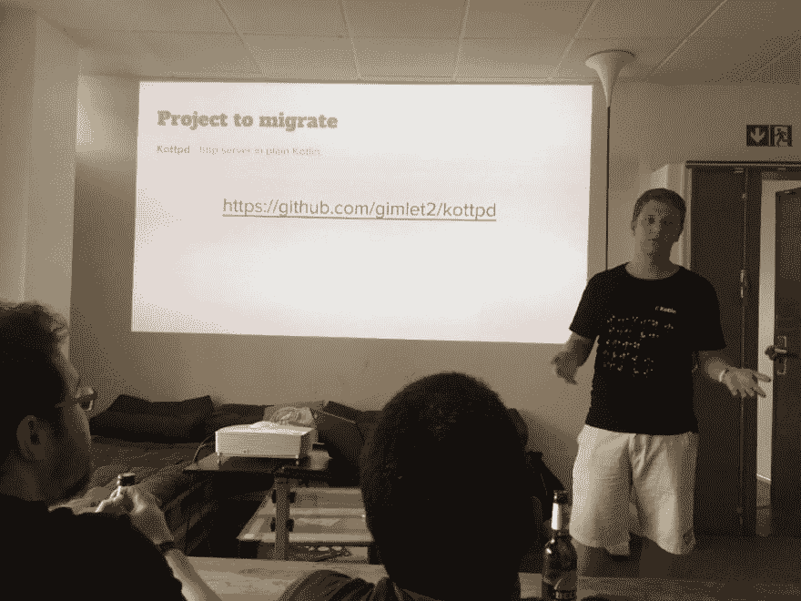

# Kotlin 和 Kotlin-Native 之间的代码共享

> 原文：<https://dev.to/gimlet2/code-sharing-between-kotlin-and-kotlin-native-4cij>

[T2】](https://res.cloudinary.com/practicaldev/image/fetch/s--ZMl9u8lA--/c_limit%2Cf_auto%2Cfl_progressive%2Cq_auto%2Cw_880/https://cdn-images-1.medium.com/max/1024/1%2AISVo7EQ7xi5KNd5QrF0xOg.jpeg)

如今，当科特林的受欢迎程度越来越高时，JetBrains 投入了大量精力为我们带来新的科特林宇宙。Kotlin-Native 允许我们构建本地应用程序。它基于 [LLVM](http://llvm.org/) 编译器，支持各种平台。它离生产就绪还有一段距离，但我们已经有了第三个版本——0.3 版

我有一个我已经[写了](https://dev.to/gimlet2/kottpd--http-server-in-pure-kotlin-3bi7-temp-slug-3595491)的关于 [kottpd](https://github.com/gimlet2/kottpd) 的宠物项目。这是一个完全用 Kotlin 编写的简单的 HTTP-server。根据这两个事实，我做出了明显的决定——我需要尝试将我的库移植到 Kotlin-Native！但这不仅仅是为了好玩。它的背后有一个梦想——让用 Kotlin 构建 web 应用程序成为可能，并有可能以本机性能运行它们。

嗯，老实说，目前这只是一个实验。但让我们看看这个实验以后会走向何方。

作为第一步，我去掉了所有不重要的部分——SSL 支持、文件服务、异常处理甚至多线程支持。它仍然能够处理 HTTP 请求。太好了！我们继续吧。

第二步有点难。我必须检查所有的代码库，删除所有对 JVM 类的直接引用。对我来说，是 java.net。服务器插座，java.net。 **Socket** ，java.io. **OutputStream** ，Java . io .**output streamwriter**，java.io. **PrintWriter** ，Java . io .**buffered reader**，java.io. **InputStream** ，Java . io .**InputStreamReader**，java.io. **IOException** ，java.lang. **系统没那么大的单子。**

代替所有这些类，我引入了相应的接口和异常。这有助于我将所有平台相关的逻辑与库的业务逻辑隔离开来。在那一刻，我再次检查了它是如何工作的。一切都很好。是时候搬到科特林本土了！

代码被复制到单独的文件夹中。我不知道下一步该做什么。但是，感谢 JetBrains 团队，我们有一些 Kotlin-Native 的例子。为了获得灵感我选择了 [**插座**](https://github.com/JetBrains/kotlin-native/tree/master/samples/socket) 样品。在那里，我使用了 **build.gradle** 文件和 **sockets.def** 来配置 C interop。在那一刻，我意识到 Kotlin-Native 现在离生产使用还有多远——没有 IDE 支持。这让我想起了在 Pascal 上学时的美好时光——修改代码、编译、阅读错误信息、修复代码=)！这就是我们现在拥有的科特林土著。大多数情况下，错误消息给了你足够的信息，让你知道到底是哪里出了问题。

除了纯工具之外，我还没有遇到太多问题——fun main(args:Array<String>)——必须在一个没有包的文件中，从原生世界和返回的类型转换是其中两个最大的问题。

但不管怎样，我做到了！在一个线程中，由于分段错误而不时崩溃，但仍然服务于 HTTP 请求！

有更多的想法来改进它——将因简化而删除的所有部分带回来，引入多线程并改进构建过程，使它实际上成为一个具有公共代码库的应用程序！

如果你对这个实验感兴趣，请关注 github 。