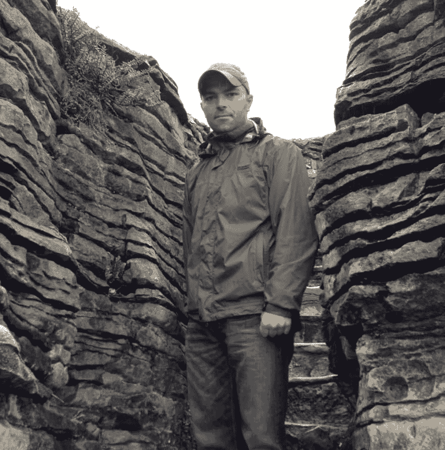

# 开发聊天:尼克帕芬

> 原文:[https://dev.to/samjarman/dev-chats-nick-parfene-4ilf](https://dev.to/samjarman/dev-chats-nick-parfene-4ilf)

[T2】](https://res.cloudinary.com/practicaldev/image/fetch/s--z_QVh5m6--/c_limit%2Cf_auto%2Cfl_progressive%2Cq_auto%2Cw_880/https://static1.squarespace.com/static/58bfb8c059cc68cc36914ea9/t/596b03fdff7c5001fe683cba/1500185647553/%3Fformat%3D1000w)

尼克·帕芬...石头！

这是我的“开发聊天”系列中的一篇文章，在这篇文章中，我大约每周都会与一位出色的开发人员或技术人员交谈。你可以在这里阅读更多。如果你觉得这些对你有用，请在评论中告诉我！

### 自我介绍！你是谁？你在哪里工作？

我是尼克，我身兼数职:我是 [Trade Me](http://www.trademe.co.nz/) 的移动主管，我是[的联合创始人](http://www.improved.by)，我非常热衷于将移动爱好者聚集在一起，这也是我创办 Cocoaheads Wellington 和 Google Developer Group Wellington 的原因。

### 是谁或什么让你开始编程的？

我学的是数学，慢慢对计算机科学产生了热情。编程对我来说很神奇，尤其是因为它可以用来连接虚拟世界和现实世界。

### 从 Trade Me 的一名独立开发者到领导一个团队是什么感觉？有什么见解可以分享吗？

大约从 2000 年开始，我就一直在 IT 行业工作。当我在大学学习计算机科学的时候，我开始是一名独立的软件测试人员，以一种伪自主的方式工作。毕业后，我找了一份程序员的工作，在我的职业生涯中，我既作为团队的一员，也作为独立开发者工作。显然，这两种方法各有利弊。然而，团队环境吸引我的一点是有机会利用不同人群的集体智慧。在 Trade Me，我曾有一段时间是单独的 iOS 程序员(实际上我是从一个更后端的开发型角色过渡到这个角色的)，一旦 iOS 应用证明了自己，管理层就看到了发展团队的价值。差不多八年后，我很幸运地和几乎 50 名专注于我们的原生应用和库家族的人一起工作。想想真的很神奇。为了适应这种增长，工作确实需要不断变化。我学到了新技能，经历了我从未想过会感兴趣的培训。除了每年复习 iOS 和 Android APIs，我还参加了设计课程、管理和领导力培训，我强迫自己做更多的公开演讲，最困难的是，我主动选择停止编码(在工作中)。

### 将管理与全职开发结合在一起的感觉如何？你“怀念”写代码吗？

我作弊。虽然我不再在工作中编写代码(除了偶尔的概念验证、代码审查或技术演示)，但我在业余时间编写代码。现实情况是，我的团队需要我解决不总是与代码有关的问题。我会错过发布自己的代码吗？是的，我知道。我认为如果我编写我们的应用程序会更好吗？不，我没有。我的哲学一直是努力雇佣那些比我优秀或者有潜力变得比我优秀的人。这很大程度上意味着，如果我编码，我会拖大家的后腿...

### 对于试图在 Trade Me 这样的大公司和小公司之间做出选择的初级开发人员，你有什么话要说？

我可以告诉你为什么我喜欢在 Trade Me 工作:我觉得我的贡献对我朋友的生活有直接的积极影响。吸引我交易我的另一个原因是我想尽我所能让垃圾填埋场空着…

同样，每个开发人员可能都有一些不一定与技术相关的激情。无论是时尚、游戏还是公共交通，都不重要。我认为重要的是尝试将技术与某种或更大的理想结合起来。这会给你目标。然后 Trade Me，或者其他一些更小(或更大)的公司，将会显示自己是你实现更高目标的管道。

### 迄今为止，在你的软件生涯中，你学到的最难的一课是什么？

我花了比我希望的更长的时间来接受最终用户永远不会弄错他们的感受。在我职业生涯的每一年，UX 研究的价值几乎都在成倍增长...

### 对于成功的软件职业生涯，你的第一条建议是什么？

努力让你的用户在使用你的软件时微笑。

### 我听说你对家庭自动化很感兴趣——你认为这个领域会走向何方？你对 IoT 感到兴奋吗？

撇开谦虚不谈，我对家庭自动化几乎是狂热的。我为这个领域的开源项目做贡献，我有 3 个家庭自动化平台在家里运行。我已经“自动化”了所有东西，从咖啡机、电视、Sonos 和热泵，到灯和婴儿监视器……看到我 3 岁的女儿在不知不觉中触发的运动传感器点亮圣诞树时欣喜若狂，绝对是无价之宝。我对家庭自动化感兴趣有几个原因:

*   每天创造让我和我的家人开心的神奇时刻
*   研究和解决越来越多的设备接入互联网所带来的安全和隐私问题

我最近关于这个主题的演讲和会议集中在保护现有设备的方法上，这些设备不能升级固件，以提高其安全性并防止恶意攻击。

每一个可以开关的设备都可以自动化。你是否应该，是一个不同的问题。

如果让你的家庭/生活中的电子产品自动化可以提高你的生活质量，那么它可能值得考虑。以下是我每天说“早上好，Siri”时发生的事情:我的咖啡机打开了，热泵将我的客厅温暖到 21 度，楼下的灯打开了，我的 Sonos 系统开始播放我最喜欢的播放列表。当然，我可以手动完成所有这些事情，但对我来说，这就是酒店房间和我家的区别。在家里，一切都是为了满足家人的需求。它是家常的...

### 你会推荐什么书/资源？

关于编码:我认为每个开发人员都应该阅读罗伯特·c·马丁的《干净的代码:敏捷软件工艺手册》。

关于与人合作: [Drive:关于激励我们的令人惊讶的真相](http://amzn.to/2tfuup8)，作者丹尼尔·平克。

### 最后，做出你的大喊！你想让读者去看什么？

你可以在 parfene.com 找到我，也可以在推特上关注 T2。

我的一些长篇漫谈可以在[媒体](https://medium.com/@nicktmro)上找到。

交易我的应用程序都可以在 trademe.co.nz/mobile 找到

最后，我最近的一个项目叫做[改良版](http://www.improved.by)。我们的愿景是消除为每项工作寻找合适人选的猜测。