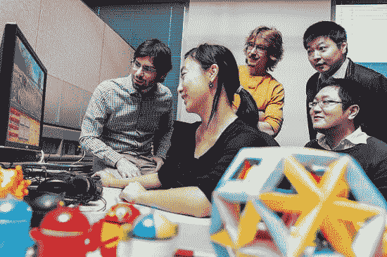

# 过程不能代替文化

> 原文:[https://dev . to/pbeekums/process-is-no-substitute-for-culture](https://dev.to/pbeekums/process-is-no-substitute-for-culture)

我喜欢软件过程。我的热情是寻找更快构建软件的方法，但是更好的技术只是成功的一半。另一半是人和组织的问题。过程可以为那一半人创造奇迹。

[T2】](https://res.cloudinary.com/practicaldev/image/fetch/s--zypHilKb--/c_limit%2Cf_auto%2Cfl_progressive%2Cq_auto%2Cw_880/https://blog.professorbeekums.com/img/2017/7/airesearch.jpg)

过程可以给项目带来的一些好处包括:

*   确保每个人都在做最重要的事情
*   协调努力，有效分配工作
*   添加一些小的推动来提高代码质量，比如自动化测试和代码审查

不过，最后一点可能会成为一场灾难。过程作为轻推是最有效的。构建软件是一个复杂的过程，开发人员很容易忘记做他们不断思考的数百件事情中的一小部分。过程可以为开发人员提供安全保障，让他们记住做那些事情。

进程不能用作强制。

这与许多观点相反。他们对待它就像我们对待我们的法律系统一样。每当不好的事情发生时，简单的解决方案*必须*是一个新的过程，以防止这种情况再次发生。

有时这行得通，但它需要所有的开发人员都相信新的过程。让我们以自动化测试为例。

你的产品有一个错误。非常糟糕。自动化测试很容易发现这个错误。在修复了 bug 之后，实现了一个新的过程，其中所有的新代码都需要自动化测试。太好了！现在我们所有的未来代码都没有 bug 了，对吗？

不完全是。

如果团队中的开发人员不相信自动化测试，那么他们可能不会编写它。可以强制执行代码审查来检查它们，但是如果审查者不相信自动化测试，那就行不通了。

解决办法可能是对它进行工程管理检查。但是报告率是多少？4 个开发人员对 1 个经理？8 比 1？并非所有的测试都是平等的。一个拥有不相信自动化测试的开发团队的经理将只能检查他们已经构建了一些测试。那个经理将没有时间去检查他们已经构建了好的测试，这些测试实际上可以防止错误的引入。

过程可以用来帮助提醒相信自动化测试的开发人员，他们应该编写自动化测试。过程不能强迫一个不相信自动化测试的开发人员去写真正有用的自动化测试。

另一件要考虑的事情是，所有的过程都有成本。唯一应该使用的流程是收益大于成本的流程。例如:拥有大规模软件系统的公司将拥有足够复杂的系统，需要高级开发人员或软件架构师审查新系统的设计。执行评审至少需要两个人的时间:评审者和其工作被评审的开发人员。

但是，没有这种审查可能会导致重写大量设计不良的代码。审查过程中几个小时的成本超过了修复代码所需的几天、几周或几个月的成本。

需要得到一两个人的认可是有道理的。但是如果一些评论者遗漏了什么呢？我们要开始增加更多的评论者吗？现在每个项目都需要 6-8 个人审批吗？我们如何确保你真的能和所有这些人安排一次会议？为了确保每个人都能参加会议，项目的开始会推迟多长时间？

现在我们进入了审查成本将超过收益的领域。大多数问题可能只被一两个人发现。为了通过要求更多的人审查软件设计来获得剩余的问题数量，我们将项目推迟几天(甚至几周)。我们也在消耗更多人的时间。我们没有相信我们的评审员会学习并变得更好，而是让整个组织负担了一个昂贵的过程。

许多人将过程视为从软件项目中消除风险的一种方式。但是软件开发本质上是有风险的活动。试图消除流程中的所有风险最终会带来巨大的时间成本。最终这种成本变得难以承受。

我曾经和一位经理一起工作，他相信从软件中移除所有风险是可能的。他希望 5 个主要开发人员审查所有 24 个开发人员编写的代码。因此，每个领导都要对超过 24 个人进行代码审查，每个开发人员都要对他们的代码进行至少 5 次审查。如果做得好的话，一天中会有超过 24 小时的时间来处理一条线索。即使有足够的时间，额外的评论又能给我们带来多少好处呢？

时间不是无限的。花在做一件事情上意味着不花在做其他事情上。当时间被不明智地花费在低价值的过程上时，它会阻止开发团队从事能够为业务产生大量价值的工作。围绕流程做出更好决策的竞争对手最终会在更短的时间内为客户带来更多价值。这有助于他们抢走顾客。

不惜一切代价降低软件风险的追求无意中造成了巨大的商业风险。

我喜欢把软件过程想象成食物的调味品。如果你有一大块煮得很好的牛排，那么一点调味料只会让它更美味。太多会毁了牛排，因为你尝到的只是调味料。另一方面:如果你有一堆便便，再多的调料也不会让它尝起来不像一堆便便。调味料只能增强伟大食物的强大基础。

过程只能增强已经工作良好的团队。如果一个团队沟通良好，每个成员都相互信任，那么就有一个强大的合作基础。添加流程调整了团队的工作流程，使他们更有效率。

再多的过程也不能帮助一个功能失调的团队。这里的问题不是没有足够的流程，或者有错误的流程。这里的问题在于团队文化。流程是一个很容易修复的东西，这可能是为什么很多人首先想到流程解决方案的原因。但这只是在回避真正需要解决的根本问题。

*本帖最初发表于[blog.professorbeekums.com](https://blog.professorbeekums.com/process-no-substitute/)T3】*