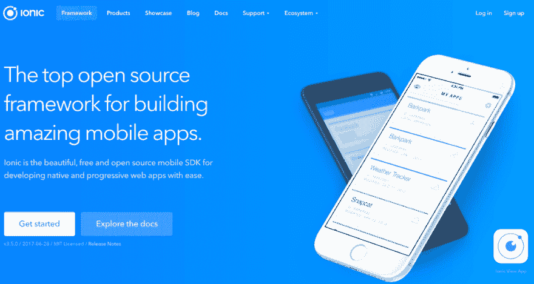
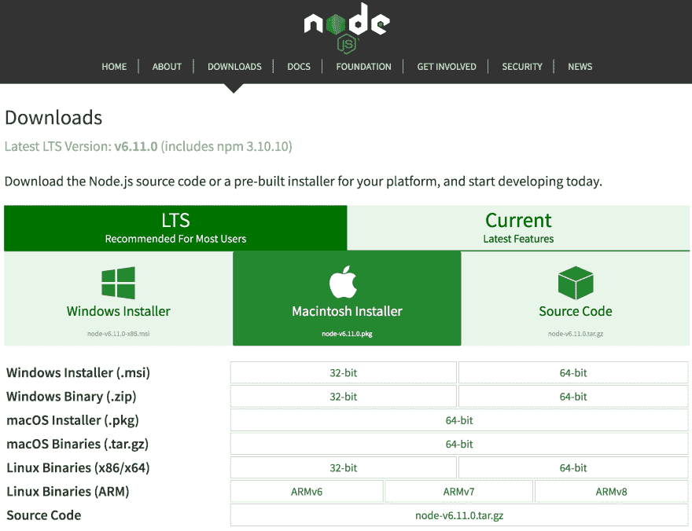
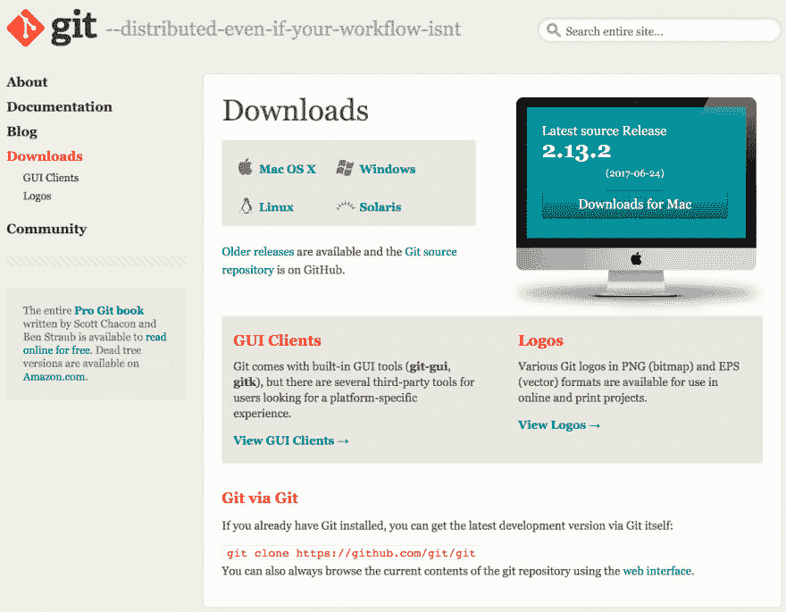
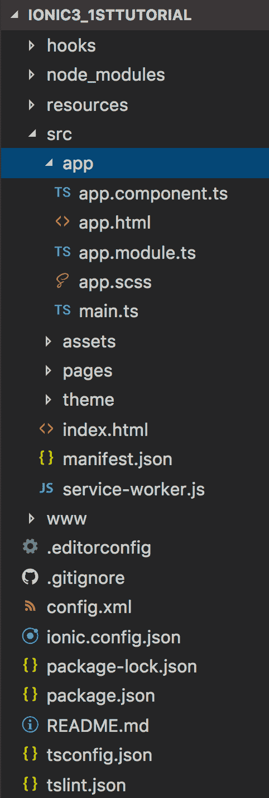
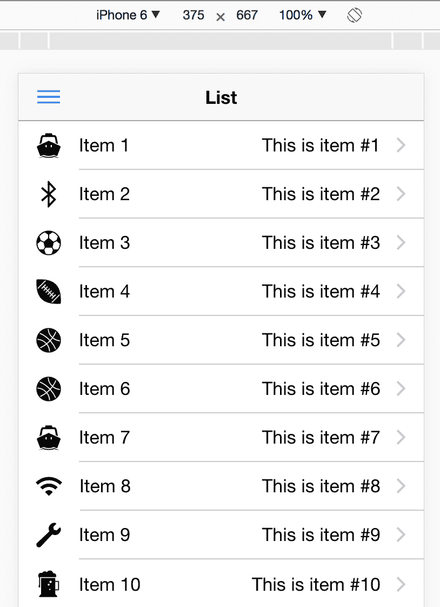
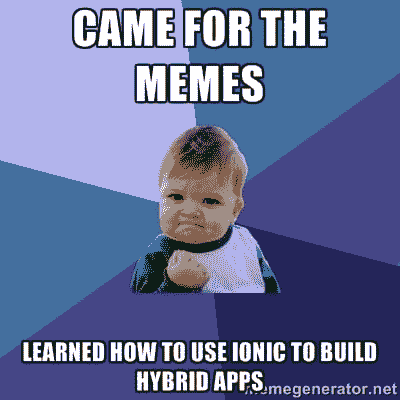

# 如何在 Mac 和 Windows 上开始使用 Ionic framework 3

> 原文：<https://dev.to/nikola/how-to-get-started-with-ionic-framework-3-on-mac-and-windows>

[T2】](https://res.cloudinary.com/practicaldev/image/fetch/s--KcYK6xO3--/c_limit%2Cf_auto%2Cfl_progressive%2Cq_auto%2Cw_880/https://thepracticaldev.s3.amazonaws.com/i/cw3vo1ia88wtczgitd3f.png)

*最初发布于[我的博客](http://www.nikola-breznjak.com/blog/javascript/ionic3/get-started-ionic-framework-3-mac-windows/)T3】*

这是一系列帖子中的第一篇，这些帖子将教你如何利用你的 web 开发知识，用 Ionic framework 3 为 iOS 和 Android 构建混合应用程序(*我将在剩余的帖子*中使用`Ionic`)。

> 第二个帖子在这里:[如何使用 Ionic Creator for UI](https://dev.to/hitman666/how-to-create-a-calculator-application-with-ionic-framework-3-by-using-ionic-creator-for-ui) 用 Ionic framework 3 创建计算器应用。
> 
> 这是我为 Ionic 框架的最初版本所做的一系列帖子的更新，你可以在这里阅读。

第一篇文章解释道:

*   这年头怎么做 app
*   离子框架到底是什么
*   离子 3 与离子 1 和离子 2 有何不同
*   如何在 Mac 和 Windows 上安装 Ionic
*   如何使用离子 CLI 启动离子项目
*   如何运行离子应用程序

## 你为什么要听我的？

> 这绝不是我试图满足我的自我，这只是为了让你头脑清醒，我在这里写的东西实际上可能对你有用。

*   写了一本关于最初的 Ionic 框架的书，你可以[免费得到](https://leanpub.com/ionic-framework)
*   为 Pluralsight 撰写关于 Ionic 的主题: [Ionic 框架:权威的 10，000 字指南](https://www.pluralsight.com/guides/front-end-javascript/ionic-framework-a-definitive-10-000-word-guide)
*   在 [StackOverflow](https://stackoverflow.com) 上`ionic`标签的所有时间回答者中排名前三。如果你想知道这些答案到底是什么，你可以看看[我的 StackOverflow 简介](http://stackoverflow.com/users/534755/nikola?tab=answers)。
*   是《离子入门》一书的技术评论员

## 简介

> ...高达 90%的移动时间花在应用程序上

你被像这样的报告轰炸和[这样的](http://www.smartinsights.com/mobile-marketing/mobile-marketing-analytics/mobile-marketing-statistics/attachment/percent-time-spent-on-mobile-apps-2016/)，用户倾向于花更多的时间在他们的手机上，尤其是在应用程序上(而不是用他们的手机上网)，你决定**是时候学习如何制作一个应用程序**。

如果你是一名 web 开发人员，你对 HTML、CSS 和 JavaScript 有相当的了解；此外，你最有可能使用的是目前稍微流行的框架之一，比如 Angular、React 或 Ember 等等。如果你对普通的栈足够精通，你就是一个全面的全栈开发者，你基本上已经拥有了一切。除了应用程序，对吧？

> 如果你想知道平均堆栈有什么大惊小怪的，你可以看看我为 HackHands 写的免费的四部分教程系列，从第一篇关于[如何开始平均堆栈](https://hackhands.com/how-to-get-started-on-the-mean-stack/)的文章开始。

但是，做 app 从哪里入手呢？你能利用你现有的技能吗？直到最近，如果你想为(目前)两个最流行的移动操作系统(iOS 和 Android——对不起，windows phoneðÿ˜‰)开发一个应用程序，你唯一的选择就是通过使用目标平台的 SDK 开发所谓的**原生应用程序**。

[T2】](https://res.cloudinary.com/practicaldev/image/fetch/s--lbyQReFE--/c_limit%2Cf_auto%2Cfl_progressive%2Cq_auto%2Cw_880/http://i.imgur.com/fx677DH.jpg)

当然，这意味着您需要制作两个版本的应用程序；一个用于 iOS，一个用于 Android。如果你是一个单独的开发者，你精通这两者的机会并不大。*即使你是；我敢打赌你更喜欢一个平台而不是另一个，对吗？*

因此，有一段时间，开发者要么选择 iOS，要么选择 Android，而大公司有两个开发部门，每个平台一个。

如今，幸运的是，借助于 [Ionic Framework](https://ionicframework.com/) ，以及少数像 [React Native](https://facebook.github.io/react-native/) 、 [NativeScript](https://www.nativescript.org/nativescript-is-how-you-build-native-mobile-apps-with-angular) 、 [Fuse](https://www.fusetools.com/) 这样的人，你可以使用你作为一名 web 开发人员已经拥有的技能来创建一个应用程序。如果你不是 web 开发人员，不要担心——这不是火箭科学或机器学习...ðÿ˜ž

[T2】](https://res.cloudinary.com/practicaldev/image/fetch/s--ReBvwuI2--/c_limit%2Cf_auto%2Cfl_progressive%2Cq_auto%2Cw_880/http://i.imgur.com/G09oGwh.jpg)

## 这年头怎么做 app？

在**简介**部分，我们已经触及了这三个方面，但是让我们保持简洁，在这里也列出它们。所以，现在你可以为移动设备开发应用程序的方式其实很少:

*   原生应用
*   移动网站(PWA)
*   混合应用程序
*   Xamarin，ReactNative，NativeScript！？

现在，让我们更详细地讨论一下它们各自的优缺点。

### 原生 app

如前所述，你可以通过使用 iOS 和 Android 的特定 SDK 来制作一个专门针对它们的应用程序。如果您想为 **iOS** 构建一个本地应用程序，您必须:

*   有一台 Mac 电脑。当然，有一些方法可以绕过它，但是我真的不推荐它们；首先，一台便宜的 Mac Mini 就足够了
*   从 App Store 下载 [Xcode](https://developer.apple.com/xcode/) (实际上是免费的)
*   购买[苹果开发者许可证](https://developer.apple.com/programs/)，费用**每年 99 美元**。*即使你在将你的应用程序发布到应用程序商店后没有制作任何新的应用程序，你仍然需要每年**更新你的订阅**以将你的应用程序保留在应用程序商店*ðÿžðÿ

你可以使用 [Swift](https://developer.apple.com/swift/) 语言或者它的前身 [ObjectiveC](https://developer.apple.com/library/mac/documentation/Cocoa/Conceptual/ProgrammingWithObjectiveC/Introduction/Introduction.html) 来编写应用程序。

[T2】](https://res.cloudinary.com/practicaldev/image/fetch/s--lLWvgShy--/c_limit%2Cf_auto%2Cfl_progressive%2Cq_auto%2Cw_880/http://i.imgur.com/sqjUwGg.jpg)

如果我们在这里是诚实的，我认为 Swift 是从笨重的 ObjectiveC 上迈出的一大步，但这只是我自己的观点(当然，有些人[不同意](http://www.infoworld.com/article/2968287/application-development/stop-the-funeral-apple-swift-versus-objective-c-alive-and-kicking.html))。不管怎样，如果你决定去本地化，一定要用 Swift，因为你会比用 ObjectiveC 更快地熟悉它，特别是如果你有 web 开发的背景。

如果你想为 Android 开发一个本地应用，你必须:

*   有任何一台电脑
*   下载适当的 SDK(我们将在下一节中讨论)
*   购买[谷歌开发者许可证](https://play.google.com/apps/publish/signup/)这是一个**一次性 25 美元购买**

原生应用的优势之一是它的速度和对 T2 原生 API 的直接访问(你不需要像混合应用那样使用任何中间人包装)。本机应用程序的一个明显缺点是，您需要构建两个(或更多)应用程序，每个应用程序对应一个所需的平台。

### 手机网站(PWA)

一个移动网站其实就是一个*【正常】*的网站(*是啊，不要因为术语而去跳；你很聪明，你知道你用手机上的浏览器访问的点*，它是专门为适应手机屏幕而设计的。正如我们在引言部分提到的，研究表明，在当今世界，移动网站的参与度比过去有所下降。

开发者过去只为移动浏览器制作特定的网站(在它自己的领域；通常是这样，但事实证明这很难维持。现在有一种叫做 **[响应式网站设计](https://developers.google.com/web/fundamentals/layouts/rwd-fundamentals/)** 的做法，你基本上有一个 HTML 代码库，你通过使用所谓的 **[媒体查询](https://developer.mozilla.org/en-US/docs/Web/Guide/CSS/Media_queries)** 来确定特定设备的外观(基于分辨率)。

移动框架的一个很好的例子是 jQuery mobile，它很快将推出新的 1.5 版本(这是他们的 [alpha changelog](https://jquerymobile.com/changelog/1.5.0-alpha1/) ，所以我们将会看到他们是否会带来一些新的东西。从我四年前对这个框架的个人经验来看，我对它只有赞美之词；所以，如果你“仅仅”制作一个移动版本的 web 应用程序，一定要使用它。

手机网站的一个明显优势是，你可以在你认为合适的时候更新它们，而不需要等待苹果或谷歌的批准。其中一个不利因素是，如今手机网站的参与度比以前低了很多，而且你基本上不能使用任何附加的手机功能，比如相机或 GPS。

由于这是一个更新的职位，很少有事情发生变化，如果你只想做一个'移动网站'。我建议研究一下 [PWA](https://developers.google.com/web/progressive-web-apps/) (渐进式网络应用程序)，因为它们是如今*新的酷*，有些人甚至说[本地应用程序因 PWA](https://medium.com/javascript-scene/why-native-apps-really-are-doomed-native-apps-are-doomed-pt-2-e035b43170e9)而注定失败，但我们在这里不会关注这个。

对于那些还想为你的应用程序创建 PWAs 的人来说，这是个好消息——有了 Ionic，你就可以了！Ionic 可以让你两全其美:在 iOS、Android 和 Windows 上跨平台部署应用商店，同时使用相同的代码作为渐进式 web 应用部署到移动 Web。但是，不要着急，我们将在下一节中讨论这个问题。

### 混合 app

混合应用程序基本上是一个移动应用程序，使用构建网站时使用的相同语言编写，另外它包含一个独立的浏览器实例，称为 **WebView** ，它在本地应用程序中运行这个 web 应用程序。混合应用程序可以访问移动设备，并使用附加的手机功能，例如相机或 GPS。

混合应用程序的一个明显优势是，您可以通过插件访问附加的手机功能，并且您可以使用与开发*【普通】* web 应用程序相同的技能来完成所有开发。

其中一个缺点是，尽管有所改进，所谓的*网络视图*在速度上有其局限性。此外，如果你正在使用许多额外的手机功能，它可能不是最适合选择混合，因为你将不得不使用许多插件，这会降低应用程序的速度。但是，从我个人的经验来看，我们有 30 多个插件(是的，不要问)在我们的应用程序中使用，我们正在摆脱它ðÿ˜ž.

最后，如果你想制作下一个最好的 3D 图形游戏，你肯定不会用它。

### Xamarin，ReactNative，NativeScript！？

我们必须在这里公平地提及新玩家，他们承诺在没有任何额外插件的情况下拥有完整的 API 访问权限，并制作出共享代码比例非常高的“实际”原生应用。因此，应用程序不像 Ionic 那样在网络视图中运行，这提高了应用程序的速度。

如果你来自。NET 背景并且你想创建一个 app 那么你可以在这里停止阅读，因为据我所见 [Xamarin](http://www.nikola-breznjak.com/blog/meetups/64th-sqldev-user-group-meeting-xamarin/) 对你来说是一个肯定的赌注，你会立刻有宾至如归的感觉。

如果你是一个反应型的人，那么[反应型](https://facebook.github.io/react-native/)可能正合你的胃口。正如他们在网站上所说:

> 使用 React Native，您不必构建“移动 web 应用程序”、“HTML5 应用程序”或“混合应用程序”。您构建了一个真正的移动应用程序，它与使用 Objective-C 或 Java 构建的应用程序没有什么区别。React Native 使用与常规 iOS 和 Android 应用相同的基本 UI 构建块。您只需使用 JavaScript 和 React 将这些构件放在一起。

至于[native script](https://www.nativescript.org/)；老实说，我没有这方面的经验，但看起来他们的处境相似，反应也很快，因为他们也给了你没有网络视图的 NativeUI。

你可以在这里查看一篇关于 Ionic vs . native script vs . react native 的博文。

## 什么是离子，为什么它这么好

正如我在 StackOverflow 上给出的[答案:](http://stackoverflow.com/questions/31179211/use-ionic-or-cordova/31180666)

> 免责声明:这听起来像是一个广告，所以我必须说我与爱奥尼亚没有任何关系，我只是碰巧非常喜欢它，所以我分享了对它的爱。
> 
> Ionic 不仅仅是一个 UI 框架。Ionic 允许您:
> 
> *   真正只有一个代码库，并部署到 iOS、Android 和 Windows，以及移动网络，作为一个渐进的网络应用
> *   用一个命令为所有设备和设备尺寸生成图标和闪屏:`ionic cordova resources`。仅此一项就可以为您节省至少一天的时间来准备各种尺寸的图像。
> *   使用代码更改即时更新您的应用程序，即使直接在您的设备上使用`ionic cordova run --livereload`运行
> *   并排构建和测试 iOS 和 Android 版本，使用`ionic lab`立即查看变化
> *   与世界各地的客户、顾客和测试人员分享您的 Ionic 应用程序，而无需使用`ionic upload`通过应用程序商店
> *   使用 [Ionic Native](https://ionicframework.com/docs/native/) 轻松访问设备的全部原生功能
> *   此外，[drift y](http://drifty.com/)(Ionic 框架背后的团队)正在为你的 Ionic 应用建立一个全栈后端服务和工具，比如 [Live updating](https://ionicframework.com/products/#updates) (用于部署新版本而无需经过苹果审查过程！- **这是巨大的！**)、[推送通知](https://docs.ionic.io/services/push/)、[云打包](https://ionicframework.com/products/#packaging)、[离子创造者](https://creator.ionic.io)等。
> *   Ionic CLI(命令行界面)在后端使用 Cordova，并允许你为 iOS 和 Android 构建(直接使用 Ionic CLI)应用程序(只需做`ionic cordova build ios`或`ionic cordova build android`)。
> *   Ionic 使用 Angular 作为前端框架，所以如果你熟悉它，这将是一个额外的收获。是的，最新版本的 Ionic(目前是 3)使用了最新最酷的 Angular(目前是 4) ( *是 Angular 1 版本*的完全重写)
> *   总的来说，我个人认为 Ionic framework 有一个光明的未来，所以如果没有其他的事情——试试吧，我打赌你会喜欢用它制作应用程序的便利性。

你现在注意到我了吗？太好了，让我们在下一节安装所有需要的先决条件，并开始使用离子！

## 爱奥尼亚 3 与爱奥尼亚 1、2 有何不同

[Josh Morony](https://www.joshmorony.com) 写了关于[爱奥尼亚 2 优于爱奥尼亚 1 的 7 个理由](https://www.joshmorony.com/7-reasons-why-ionic-2-is-better-than-ionic-1/)并制作了一个关于[爱奥尼亚 3 对爱奥尼亚 2 的意义](https://www.youtube.com/watch?v=-HHEC_yQKcM)的视频，我鼓励你查看这些视频以了解更多信息:

*   为什么爱奥尼亚 2 和爱奥尼亚 1 完全不同(而且更好)
*   为什么爱奥尼亚 3 号和爱奥尼亚 2 号差别不大

最大的变化可以归结为这样一个事实，离子 2 和 3 使用了新的角形(现在是版本 4)，而离子 1 使用了旧的角形 1。

现在，不要误解我——我们似乎都喜欢“新的闪亮的东西”,但我可以根据我的经验告诉你，即使有了 Ionic 1，你仍然可以制作出伟大的应用程序！所以，即使你很擅长 Angular 1，我也建议你选择 Ionic 3，因为它的好处真的很惊人。另外，你不想在一个 5 年前的技术上工作，对吗？😊

## 安装 Mac 和 Windows 的必备软件

为了安装 Ionic 和 Cordova，我们需要安装 **Node.js** 和 **Git** 。如果你已经安装了这些工具(如果你是一个 web 开发人员，很有可能你已经安装了)，你可以跳过这一节，直接安装 Ionic。

### 安装 Node.js

为了下载 Node.js，请访问[https://nodejs.org/en/download/](https://nodejs.org/en/download/)，在那里您会看到以下选项:

[T2】](https://res.cloudinary.com/practicaldev/image/fetch/s--Qi09_a7d--/c_limit%2Cf_auto%2Cfl_progressive%2Cq_auto%2Cw_880/http://i.imgur.com/Ja6VwgB.png)

在 Windows 和 Mac OS 上安装非常简单，因为您只需下载并运行适当的安装程序，然后按照熟悉的说明(`next, next, next, sure I accept, next, finish`)进行操作。

如果你的 Mac 上有`brew`,那么你也可以安装 Node.js:

`brew install node`

在这两种情况下，`npm`(节点包管理器-用于安装其他包)将与 Node.js 一起安装。

要验证您是否在一台 **Windows** 机器上正确安装了 Node.js，请在您的命令提示符下运行以下命令(或者，更好的做法是，使用[控制台 2](http://www.nikola-breznjak.com/blog/quick-tips/customize-console-2-on-windows-machine/) ):

`node -v`

您应该得到类似于:`v8.0.0`的输出。

为了验证您是否在您的 **Mac** 上正确安装了 Node.js，在您的终端上运行与上面相同的命令(或者，更好的是，使用 [iTerm](https://www.iterm2.com/) ，您应该会得到与上面相同的类似输出。

要验证您已经安装了`npm`，只需运行:`npm -v`，您应该会得到类似于:`5.0.1`的输出

### 安装 Git

为了安装 Git，请访问[http://git-scm.com/download](http://git-scm.com/download)，在那里您会看到以下选项:

[T2】](https://res.cloudinary.com/practicaldev/image/fetch/s--ApADWcG2--/c_limit%2Cf_auto%2Cfl_progressive%2Cq_auto%2Cw_880/http://i.imgur.com/5g5re2P.png)

在 Windows 和 Mac OS 上的安装与 Node.js 一样简单，您只需下载并运行适当的安装程序，然后按照熟悉的说明进行操作。

要验证是否在 Windows/Mac 计算机上正确安装了 Git，请在命令提示符/终端中运行以下命令:

`git`

您应该得到类似于:
的输出

```
usage: git [--version] [--help] [-C <path>] [-c name=value]
           [--exec-path[=<path>]] [--html-path] [--man-path] [--info-path]
           [-p | --paginate | --no-pager] [--no-replace-objects] [--bare]
           [--git-dir=<path>] [--work-tree=<path>] [--namespace=<name>]
           <command> [<args>]

These are common Git commands used in various situations:

start a working area (see also: git help tutorial)
   clone      Clone a repository into a new directory
   init       Create an empty Git repository or reinitialize an existing one

work on the current change (see also: git help everyday)
   add        Add file contents to the index
   mv         Move or rename a file, a directory, or a symlink
   reset      Reset current HEAD to the specified state
   rm         Remove files from the working tree and from the index

examine the history and state (see also: git help revisions)
   bisect     Use binary search to find the commit that introduced a bug
   grep       Print lines matching a pattern
   log        Show commit logs
   show       Show various types of objects
   status     Show the working tree status

grow, mark and tweak your common history
   branch     List, create, or delete branches
   checkout   Switch branches or restore working tree files
   commit     Record changes to the repository
   diff       Show changes between commits, commit and working tree, etc
   merge      Join two or more development histories together
   rebase     Reapply commits on top of another base tip
   tag        Create, list, delete or verify a tag object signed with GPG

collaborate (see also: git help workflows)
   fetch      Download objects and refs from another repository
   pull       Fetch from and integrate with another repository or a local branch
   push       Update remote refs along with associated objects

'git help -a' and 'git help -g' list available subcommands and some
concept guides. See 'git help <command>' or 'git help <concept>'
to read about a specific subcommand or concept. 
```

如果您不知道如何使用 Git，您不必担心，因为您不会直接需要它(npm 使用它来下载包)。然而，如果你想学习(没有理由不扩大你的知识面)，你可以看看 CodeSchool 制作的这个[好的互动教程](https://try.github.io/levels/1/challenges/1)。

## 安装离子

如果您已经安装了前一节中所需的先决条件，那么为了安装 Ionic(在 Mac 和 Windows 上)，您只需运行以下命令:

`npm install ionic cordova -g`

Ionic 在后台使用 [Cordova](https://cordova.apache.org/) 来打包原生应用，因此需要它。我们在这里使用了 **-g** 标志，以便全局安装 **ionic** 和**Cordova**T8 包。

要验证您是否在 Windows/Mac 计算机上正确安装了 Ionic，请在命令提示符/终端中运行以下命令:

`ionic -v`

您应该得到类似于以下内容的输出:

`3.4.0`

要验证您是否在 Windows/Mac 计算机上正确安装了 Cordova，请在命令提示符/终端中运行以下命令:

`cordova -v`

您应该得到类似于以下内容的输出:

`7.0.1`

如果您之前安装了 Node.js(之后就没怎么用了)，您可能会收到这样的通知:

```
******************************************************
 Upgrade warning - for the CLI to run correctly,
 it is highly suggested to upgrade the following:

 Please update your Node runtime to version  >=0.12.x
****************************************************** 
```

要解决这个问题，只需更新 Node.js 通过重新下载(在 Windows 上)或在终端中执行以下命令(在 Mac 上):

`brew update; brew upgrade node`

> 我想在这里花一点时间，并鼓励您发表评论，谈谈您在这些(看似简单)安装任务中可能遇到的任何问题(根据我从 StackOverflow 获得的经验，这些问题往往相当多，ðÿ˜•)。总是倾向于安装一些旧版本的 Node.js，或者缓存和 npm 的问题，诸如此类...我会尽最大努力解决你的问题。

## 使用离子 CLI

如果您在终端/命令提示符下运行`ionic`,您将得到类似下面的输出:

```
 _             _
  (_)           (_)
   _  ___  _ __  _  ___
  | |/ _ \| '_ \| |/ __|
  | | (_) | | | | | (__
  |_|\___/|_| |_|_|\___|  CLI 3.4.0

  Usage:

    $ ionic <command> [--help] [--verbose] [--quiet] [<args>] [options]
    $ ionic [--confirm] [--no-interactive] [--yarn] [--no-timeout]

  Global Commands:

    docs ..................... Open the Ionic documentation website
    info ..................... Print system/environment info
    login .................... Login with your Ionic ID
    signup ................... Create an Ionic account
    start .................... Create a new project
    telemetry ................ Opt in and out of telemetry

  Project Commands:

    You are not in a project directory. 
```

您得到的实际上是您可以使用 ionic CLI 运行的全局命令的一个很好的总结，以及它们的简短描述。顺便说一句，如果你想知道这是什么 CLI 的东西(你还没有谷歌过它)；它实际上是命令行界面的首字母缩写，在 Ionic 术语中，它实际上是一个工具，使启动、构建、运行和仿真(以及更多)Ionic 应用程序变得更加容易。

在接下来的章节中，我们将介绍这些命令中的大部分，但是现在，让我们不要给你太多的负担，让我们通过使用`ionic start`命令创建一个简单的项目来做一个快速的深入研究。

## 通过使用现有模板，使用 Ionic CLI 启动项目

酷，你已经做到了——我保证，你现在会看到一些代码！

[T2】](https://res.cloudinary.com/practicaldev/image/fetch/s--dr6zNBWw--/c_limit%2Cf_auto%2Cfl_progressive%2Cq_auto%2Cw_880/http://i.imgur.com/Y8FXaWm.jpg)

Ionic CLI 允许您使用前面提到的`ionic start`命令来启动和初始化您的项目。如果你看一下启动命令的官方文档，你会看到如下定义:

`ionic start [<name>] [<template>]`

> ——如果你熟悉 Ionic 1，那么你会注意到他们对它做了一些改动。

如果你还想用 Ionic CLI 版本 3 或更高版本运行 Ionic 1 应用，你需要像这样传入`--type`标志:

`ionic start myApp --type ionic1`

如果你只是运行`ionic start appname`，Ionic CLI 将使用 **appname** 文件夹中所有需要的部分，以及所谓的**空白**模板，创建一个引导应用程序。

如果您想查看所有启动项目的列表，您可以运行`ionic start --list` :

```
ionic start --list
tabs ............... ionic-angular A starting project with a simple tabbed interface
blank .............. ionic-angular A blank starter project
sidemenu ........... ionic-angular A starting project with a side menu with navigation in the content area
super .............. ionic-angular A starting project complete with pre-built pages, providers and best practices for Ionic development.
conference ......... ionic-angular A project that demonstrates a realworld application
tutorial ........... ionic-angular A tutorial based project that goes along with the Ionic documentation
aws ................ ionic-angular AWS Mobile Hub Starter
tabs ............... ionic1 A starting project for Ionic using a simple tabbed interface
blank .............. ionic1 A blank starter project for Ionic
sidemenu ........... ionic1 A starting project for Ionic using a side menu with navigation in the content area
maps ............... ionic1 An Ionic starter project using Google Maps and a side menu 
```

此外，您可以使用 Github repo 启动器和 Codepen URL 启动器。

在我们的例子中，我们将使用 **sidemenu** 模板，因此从您的终端/命令提示符执行以下命令:

`ionic start Ionic3_1stTutorial sidemenu`

您应该会看到类似下面的输出:

```
✔ Creating directory ./Ionic3_1stTutorial - done!
[INFO] Fetching app base (https://github.com/ionic-team/ionic2-app-base/archive/master.tar.gz)
✔ Downloading - done!
[INFO] Fetching starter template sidemenu (https://github.com/ionic-team/ionic2-starter-sidemenu/archive/master.tar.gz)
✔ Downloading - done!
✔ Updating package.json with app details - done!
✔ Creating configuration file ionic.config.json - done!
[INFO] Installing dependencies may take several minutes!
> npm install
✔ Running command - done!
> npm install --save-dev --save-exact @ionic/cli-plugin-ionic-angular@latest
✔ Running command - done!
> git init
✔ Running command - done!
> git add -A
✔ Running command - done!
> git commit -m "Initial commit" --no-gpg-sign
✔ Running command - done!

♬ ♫ ♬ ♫  Your Ionic app is ready to go! ♬ ♫ ♬ ♫

Run your app in the browser (great for initial development):
  ionic serve

Run on a device or simulator:
  ionic cordova run ios

Test and share your app on a device with the Ionic View app:
  http://view.ionic.io

? Link this app to your Ionic Dashboard to use tools like Ionic View? No

Go to your newly created project: cd ./Ionic3_1stTutorial 
```

## 运行离子应用程序

既然我们已经基于**侧菜单**模板初始化了我们的 Ionic 应用程序，我们必须运行它以查看 Ionic CLI 为我们生成了什么。

首先，将目录更改为您在`ionic start`命令中给出的应用程序的名称。在我们这里，那就是:`cd Ionic3_1stTutorial`。

如果你在你的编辑器中打开这个项目(我现在用的是 [Visual Studio 代码](https://code.visualstudio.com/)带有日晒的黑暗主题，忠诚之后，支付给[崇高文本 3](http://www.sublimetext.com/3) 的客户ðÿ')你会看到下面的文件夹结构:

[T2】](https://res.cloudinary.com/practicaldev/image/fetch/s--oCDXbRIS--/c_limit%2Cf_auto%2Cfl_progressive%2Cq_auto%2Cw_880/http://i.imgur.com/cecGiB3.png)

在接下来的章节中，我们将大部分时间花在 **app** 文件夹中。

> ——来自 Ionic 1 背景的人要小心`www`文件夹——不要碰它，因为这是保存所有传输/压缩代码的地方。`src/app`是您新的`www`文件夹。
> 
> 由于 Ionic 3 基于 [Angular](https://angular.io/) 框架，你至少需要对它有一个基本的了解，你可以通过 CodeSchool 的[免费互动教程](https://www.codeschool.com/courses/accelerating-through-angular)开始探索它，或者你可以查看我的帖子 Pluralsight: [通过构建 Giphy 搜索应用](https://www.pluralsight.com/guides/front-end-javascript/getting-started-with-angular-2-by-building-a-giphy-search-application)开始使用 Angular 2。请注意，这与你(和我ðÿ”)习惯的 Angular 1 非常不同。

有几种方法可以让您的 Ionic 应用程序运行起来:

*   `ionic serve` -在本地网络浏览器中启动应用程序
*   `ionic cordova emulate android` -在模拟器中启动应用程序(本例中使用的是 Android 如果你在 Mac 上并且安装了所有的先决条件，你也可以使用 **ios**
*   `ionic cordova run android` -在插入电脑的实际设备上启动应用程序
*   `ionic cordova build android` -创建一个**。apk** 文件，你可以物理复制到你的 Android 设备上运行它(这种情况在正常情况下不适用于 iOS 设备；你必须通过 Xcode，我们将在下一章详细描述)

因此，现在在您的终端/命令提示符下运行以下命令:

`ionic serve`

您应该会看到如下类似的输出:

```
[INFO] Starting app-scripts server: --port 8100 --p 8100 --livereload-port 35729 --r 35729 --address 0.0.0.0 - Ctrl+C to
       cancel
[13:56:20]  watch started ...
[13:56:20]  build dev started ...
[13:56:20]  clean started ...
[13:56:20]  clean finished in 1 ms
[13:56:20]  copy started ...
[13:56:20]  transpile started ...
[13:56:22]  transpile finished in 2.03 s
[13:56:22]  preprocess started ...
[13:56:22]  deeplinks started ...
[13:56:22]  deeplinks finished in 11 ms
[13:56:22]  preprocess finished in 13 ms
[13:56:22]  webpack started ...
[13:56:22]  copy finished in 2.20 s
[13:56:29]  webpack finished in 6.91 s
[13:56:29]  sass started ...
[13:56:30]  sass finished in 953 ms
[13:56:30]  postprocess started ...
[13:56:30]  postprocess finished in 10 ms
[13:56:30]  lint started ...
[13:56:30]  build dev finished in 9.95 s
[13:56:30]  watch ready in 10.03 s
[13:56:30]  dev server running: http://localhost:8103/

[INFO] Development server running
       Local: http://localhost:8103

[13:56:35]  lint finished in 5.13 s 
```

此外，您应该自动启动您的本地浏览器，指向地址**[http://localhost:8100/](http://localhost:8100/)**，输出类似于下图所示(为了清晰起见，我调整了窗口大小- *如果您使用的是 [Chrome](https://www.google.com/chrome/) ，您可以获得[窗口大小调整插件](https://chrome.google.com/webstore/detail/window-resizer/kkelicaakdanhinjdeammmilcgefonfh)，或者使用 [Chrome 开发工具模拟功能](https://developer.chrome.com/devtools/docs/device-mode)* ):

[T2】](https://res.cloudinary.com/practicaldev/image/fetch/s--nKyzJk2W--/c_limit%2Cf_auto%2Cfl_progressive%2Cq_auto%2Cw_880/http://i.imgur.com/Z2CI0zF.png)

令人惊叹的是，你已经自动设置了**实时重新加载**功能，这意味着只要你改变了**应用**文件夹中的代码，应用就会自动重新加载，这样你就不必在 Windows (Mac)电脑上一直按 F5 (⌘+R)键了。

> 如果你愿意，你可以在 [Github](https://github.com/Hitman666/Ionic3_1stTutorial) 上获得这个项目。

## 结论

在这一章中，我们已经讨论了目前你在制作应用程序时的选择。然后我们解释了什么是 Ionic 框架，以及如何在 Mac 和 Windows 上安装它。通过使用 Ionic CLI，我们开始了一个基于*侧菜单*模板的项目，最后，我们使用`ionic serve`命令在浏览器中本地运行它。在下一章，我将向你展示如何利用 Ionic Creator 创建你自己的计算器应用程序。

[T2】](https://res.cloudinary.com/practicaldev/image/fetch/s--C_JR1zod--/c_limit%2Cf_auto%2Cfl_progressive%2Cq_auto%2Cw_880/http://i.imgur.com/pkjp2eR.jpg)