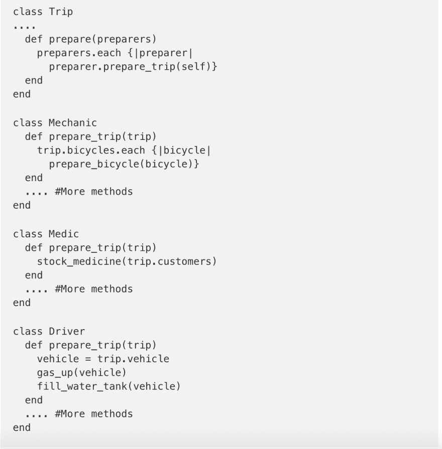

# 这是关于传递一个信息——关注可伸缩的面向对象的设计

> 原文:[https://dev.to/michaelyatco/its-about-sending-a-message——一个聚焦于可扩展的面向对象的设计](https://dev.to/michaelyatco/its-about-sending-a-message---a-focus-on-scalable-object-orienteddesign)

* * *

学习如何使用像 Ruby on Rails 这样的面向对象框架创建应用程序是一回事。

知道如何很好地创建一个应用程序是另一回事，我的意思是，应用程序中的代码是*可伸缩的*、*可重用的*和*以最小的成本灵活地改变*。

[T2】](https://res.cloudinary.com/practicaldev/image/fetch/s--HKrBh8LL--/c_limit%2Cf_auto%2Cfl_progressive%2Cq_auto%2Cw_880/https://thepracticaldev.s3.amazonaws.com/i/7o96zc3p7xfc873xam74.png)

当构建简单的应用程序时，不熟悉面向对象的开发人员，包括我自己，往往会有一个`class-based perspective`。**“我知道我需要这个类，它应该做什么？”**是这种心态的基础。

然而，采用一个`message-based perspective`，将问题变为，**“我需要发送这个消息，谁应该响应它？”**

举一个具体的例子，如果我要为一家安排自行车旅行的自行车商店创建一个应用程序，我最初的编程可能会创建一个`Trip class`来响应客户输入旅行日期、课程难度以及他们是否需要自行车，如果需要，需要什么类型的自行车，并检查自行车是否可以骑。

不要把许多责任塞进一个单独的类中，而要把注意力集中在信息上，“应该让`Trip class`接收到关于自行车可用性的信息吗？`Trip class`是否应该收到关于自行车状况的信息？”现在，创建一个`Bicycle class`或`Mechanic class`的想法成为一个合乎逻辑的选择。

* * *

在 OOD 中拥有基于消息的视角并不会使你成为反类，相反，它允许你基于对象之间传递的消息创建适当数量的单一责任类。

* * *

在 OOD 中委派职责是很重要的。如果你的`Trip class`有办法让机械师清洁自行车的车架，让机械师给轮胎打气，让机械师给链条上润滑油，让机械师检查刹车，那么你的`Trip class`就有了过多的依赖。

[T2】](https://res.cloudinary.com/practicaldev/image/fetch/s--jT_I2Mbc--/c_limit%2Cf_auto%2Cfl_progressive%2Cq_auto%2Cw_880/https://thepracticaldev.s3.amazonaws.com/i/6iec1o3hh3h33tey3xm5.png)

`Trip class`指示你的`Mechanic class`应该如何行动。特里普告诉这里的机械师**“我知道我想要什么，也知道你怎么做。”**不仅如此，如果`Mechanic class`改变它的准备方法，`Trip class`就会崩溃。

* * *

OOD 中的一个关键概念是通过“鸭式输入”使消息尽可能抽象。例如，不要把这些具体的方法塞进一个单独的`Trip class`中，而是找到最重要的简单消息，在这个例子中是**“我想准备一次旅行。”**从那里，对象(即类)可以协作，而不需要将它们自己绑定到上下文，新的对象可以被引入，而不需要重新调整每个创建的类。

[T2】](https://res.cloudinary.com/practicaldev/image/fetch/s--Wm-b4CNk--/c_limit%2Cf_auto%2Cfl_progressive%2Cq_auto%2Cw_880/https://thepracticaldev.s3.amazonaws.com/i/47gafwp9dpoururr4m82.png)

与第一个例子相反，这个例子让`Trip class`告诉每一个其他的类**“我知道我想要什么，我相信你会做好你的那部分。”**这是 OOD 的一个关键组成部分，因为有更多的增长和变化空间。

如果这个例子看起来很熟悉，那是因为它改编自 Sandi Metz 的作品*Ruby 中的实用面向对象设计——敏捷入门*。我在我通常的编码练习、算法和 Git 提交之外阅读了这本书，因为我想超越对编码数量的关注。相反，我现在关注的是我的编码质量；可*扩展的*、*可重用的*和*灵活改变的*——忠实于面向对象设计的编码。