# 用堆排序法把所有的东西堆起来

> 原文:[https://dev . to/vaidehijoshi/heapify-all-the-this-with-heap-sort](https://dev.to/vaidehijoshi/heapify-all-the-things-with-heap-sort)

有人曾经告诉我，计算机科学中所有重要的东西都可以归结为树。实际上只是树。我们可以用它们来构建事物、解析事物和解释事物(是的，这里可能会有一些伏笔，如果你还不明白，不要担心，因为很快就会明白了！).我们甚至可以用它们来——你猜对了！——*整理东西*。

啊，分类。在过去的几周里，我们已经做了这么多，但是我们现在已经接近我们分类冒险的尾声了。然而，谈论排序而不谈论一种特殊的排序是不可能的，也是不公平的，这种排序使用了我们的数据结构工具带中最新的数据结构。

我们最近[学会了爱堆](https://dev.to/vaidehijoshi/learning-to-love-heaps)，这是一种特殊的二叉树，遵循一套严格的规则，用于实现优先级队列和后台作业之类的事情。但是这些并不是堆唯一有用的东西。事实证明，二进制堆通常只用于*高效排序*。许多程序将依赖堆排序，因为它是对数组排序的最有效的方法之一。现在我们知道了什么是堆，我们可以试着理解为什么它在处理排序问题时如此有效！

### 把所有的东西都堆起来！

在我们深入堆排序之前，让我们确保我们头脑中有一个堆。我们可能还记得， ***堆*** 实际上只不过是一棵二叉树，它必须遵循一些额外的规则:首先，它必须始终有一个堆结构，二叉树的所有级别都从左到右填满，其次，它必须按最大堆或最小堆排序。出于堆排序的目的，我们将专门处理 ***max heaps*** ，其中每个父节点(包括根节点)都大于或等于其子节点的值。

好了，让我们开始回答这个小时的问题:我们如何使用堆进行排序？为了回答这个问题，我们首先需要理解什么是堆排序算法*和*！

<figure>[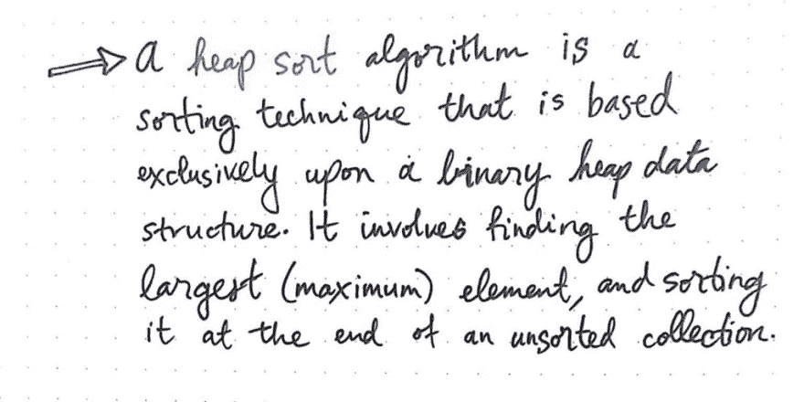](https://res.cloudinary.com/practicaldev/image/fetch/s--Q0J_w5Fn--/c_limit%2Cf_auto%2Cfl_progressive%2Cq_auto%2Cw_880/https://cdn-images-1.medium.com/max/1024/1%2AgL7afN4ItGy5oE409q0DVg.jpeg) 

<figcaption>堆排序:一个定义</figcaption>

</figure>

***堆排序算法*** 是一种依靠二进制堆数据结构的排序技术。因为我们知道堆必须总是遵循特定的顺序，所以我们可以利用该属性并使用它来查找最大的、最大值的元素，并通过选择堆的根节点并将其添加到数组的末尾来对元素进行顺序排序。

我们已经知道堆排序是对未排序数组进行排序的一种有效方式；但是数组和堆有什么关系呢？我们如何使用堆对数组进行排序？实际操作中有三个关键步骤。我们稍后会更深入地讨论这些，但首先让我们从高层次上看一下这三个步骤是什么。

<figure>[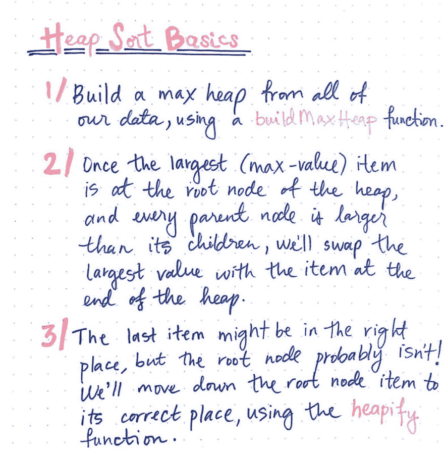](https://res.cloudinary.com/practicaldev/image/fetch/s--hBCwbFht--/c_limit%2Cf_auto%2Cfl_progressive%2Cq_auto%2Cw_880/https://cdn-images-1.medium.com/max/1024/1%2A5TQSbehEDfyEN5WtlIQzIQ.jpeg) 

<figcaption>堆排序基础知识</figcaption>

</figure>

1.  首先，我们有一个未排序的数组。第一步是获取数组并将其转换为堆；在我们的例子中，我们想把它变成一个最大堆。因此，我们必须从未排序的数组数据中转换并构建一个最大堆。通常，这由一个函数封装，该函数可能被命名为 buildMaxHeap 之类的东西。
2.  一旦我们有了 max heap 格式的数组数据，我们就可以确定最大值在堆的根节点。请记住，即使整个堆不会被排序，如果我们已经正确无误地构建了最大堆，堆中的每个父节点的值都将大于其子节点的值。因此，我们将通过与最后一个元素交换，将位于根节点的最大值移动到堆的末尾。
3.  现在，堆中最大的项位于最后一个节点，这很好。我们知道它在排序后的位置，所以它可以从堆中完全移除。但是，还有一个步骤:确保新的根节点元素在正确的位置！我们交换到根节点位置的项目不太可能在正确的位置，所以我们将使用一个通常被命名为 heapify 之类的函数将根节点项目向下移动到正确的位置。

基本上就是这样了！该算法继续重复这些步骤，直到堆只剩下一个节点。此时，它知道未排序数组中的所有元素都在它们排序后的位置上，并且剩余的最后一个节点将成为排序后数组中的第一个元素。

好吧，我知道我说过堆排序只有这三个步骤。但是如果这三个步骤看起来很混乱，不要担心；它们可能非常复杂，很难理解，直到你看到它们在实际中发挥作用。事实上，我认为这个算法用一个说明性的例子更有意义。由于堆是树的一种类型，这有助于将它们可视化，就像我们处理二叉树一样。所以让我们现在就开始吧！

### 你有没有在 heap sort 的引擎盖下找过？

好了，是时候学习堆排序中我最喜欢的部分了:把它画出来！万岁！为了理解堆排序下发生了什么，我们将使用一个小的、未排序的数据集。

<figure>[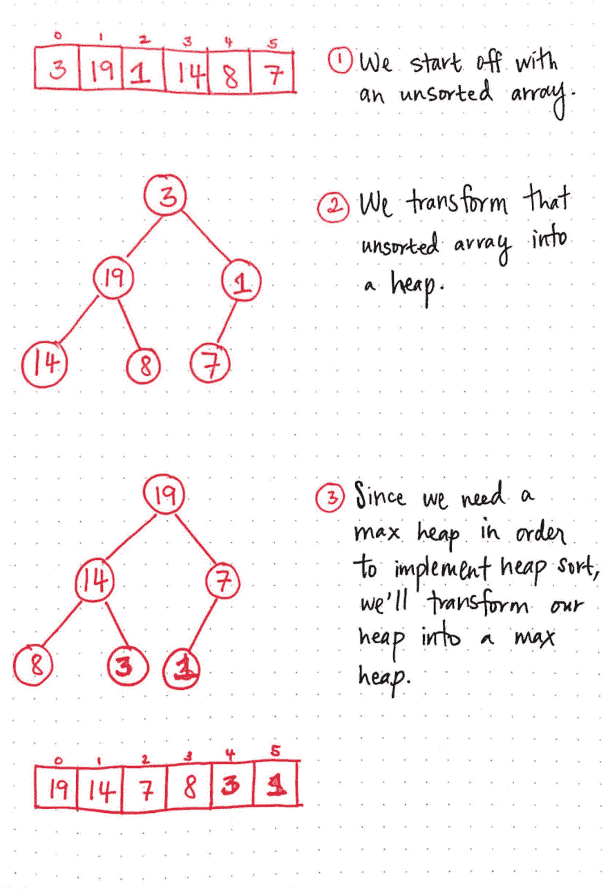](https://res.cloudinary.com/practicaldev/image/fetch/s--2LfcgKrf--/c_limit%2Cf_auto%2Cfl_progressive%2Cq_auto%2Cw_880/https://cdn-images-1.medium.com/max/1024/1%2AKBafG8K6xaO7cY8O30XHdQ.jpeg) 

<figcaption>实现堆排序，part 1</figcaption>

</figure>

我们将从一个无序数组开始，该数组包含五个超级无序的元素:[3，19，1，14，8，7]。

请记住，因为这是我们正在使用的堆排序，我们将需要把数组变成一个堆，开始。

在此处显示的插图中，您可以看到该数组已经变形为一棵树——它还不是堆，因为它仍然不在任何最大或最小堆顺序中！我们可以看到这种情况，因为 3 不是最大或最小的元素，然而，它是根节点。这只是一棵树，数组中的元素被直接转换成二叉树格式。

但是，由于我们需要处理一个最大堆，我们需要将我们的结构从二叉树转换成一个最大堆。请注意，在 max 堆中，父节点都比它们的子节点大。上周，[我们学习了允许我们从数组的索引中确定子节点的算法](https://dev.to/vaidehijoshi/learning-to-love-heaps)；本周，我们将看到他们的行动。这些算法就是我们用来把这个数组转换成树，然后转换成堆的算法。

好了，现在我们有了一个*实际最大堆*。太好了！现在进行实际的分类工作。

<figure>[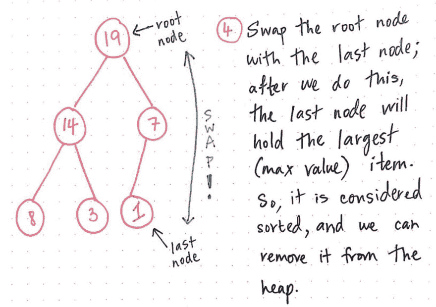](https://res.cloudinary.com/practicaldev/image/fetch/s--mfzEC20h--/c_limit%2Cf_auto%2Cfl_progressive%2Cq_auto%2Cw_880/https://cdn-images-1.medium.com/max/1024/1%2AKm1jk3hsH2cc751KKY41EA.jpeg) 

<figcaption>实现堆排序，part 2</figcaption>

</figure>

因为我们知道最大的元素在根节点，我们知道我们需要把它放在数组的最末端，最后一个可用的索引点。因此，我们将交换根节点和最后一个节点。一旦我们进行了这种交换，我们的最后一个节点将保存最大、最大值的项目。

<figure>[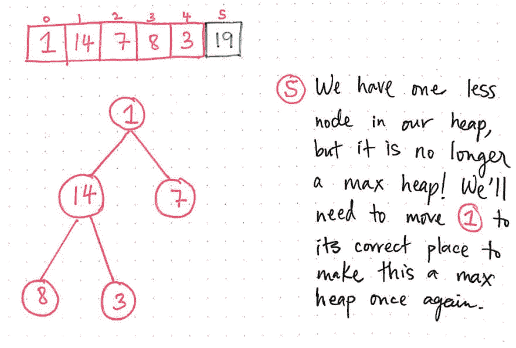](https://res.cloudinary.com/practicaldev/image/fetch/s--2IgVFqg3--/c_limit%2Cf_auto%2Cfl_progressive%2Cq_auto%2Cw_880/https://cdn-images-1.medium.com/max/1024/1%2ARUt3itnTRK00-q3mek8F6g.jpeg) 

<figcaption>实现堆排序，part 3</figcaption>

</figure>

酷！现在我们可以看到，最大的元素 19，曾经是根节点，现在位于数组的最后一个位置。而且，由于它相对于其他元素被有效地“排序”,我们可以将它从堆中完全移除。

现在，好消息是我们的堆中少了一个需要排序的节点！坏消息呢？我们的堆实际上不再是堆了:它完全违反了它的堆顺序规则，因为它不是最大堆。请注意，1 是根节点，但它肯定比它的两个子节点 14 和 7 大。因此，我们需要将它移到树中正确的位置。

让我们把这棵树堆起来，让它再次成为最大堆！

<figure>[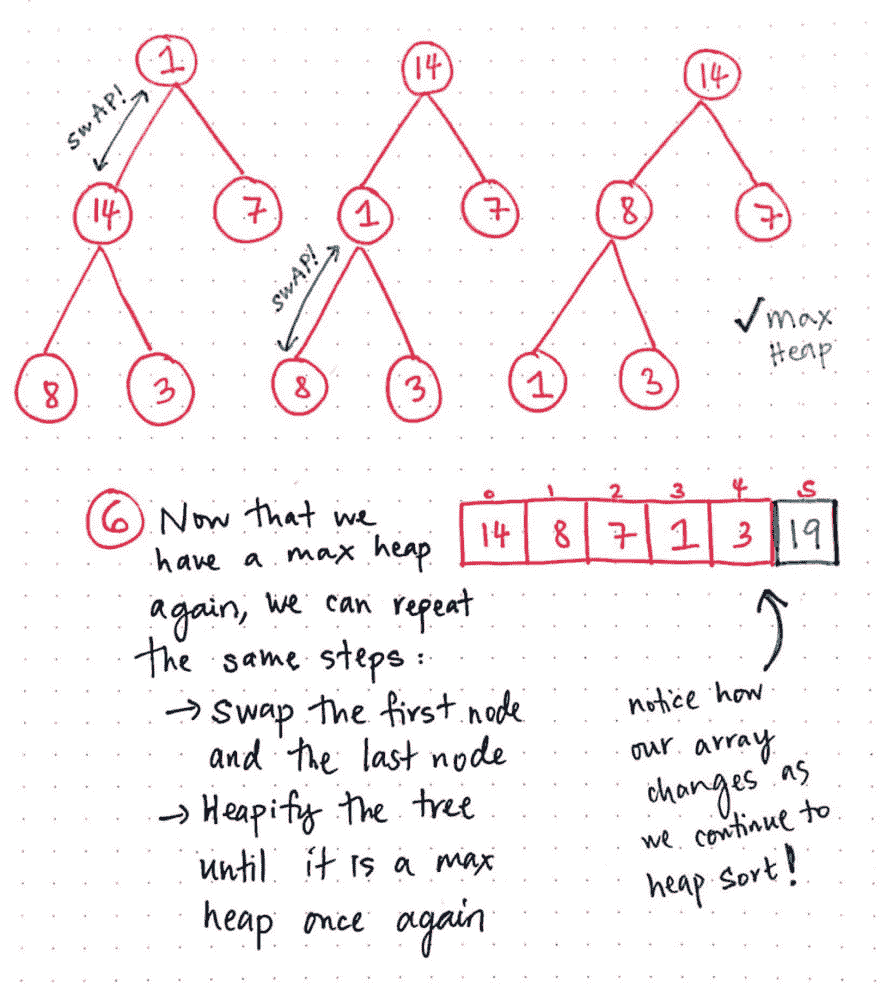](https://res.cloudinary.com/practicaldev/image/fetch/s--NnWbwLAa--/c_limit%2Cf_auto%2Cfl_progressive%2Cq_auto%2Cw_880/https://cdn-images-1.medium.com/max/1024/1%2AZfdxyIDgK3GABnDPeP-IQw.jpeg) 

<figcaption>实现堆排序，part 4</figcaption>

</figure>

厉害！在上图中，我们可以看到我们首先交换了 1 和 14，然后交换了 1 和 8。现在，我们又回到了一个合适的最大堆。我们可以重复对元素 19 排序时的相同步骤:

“我们将首先交换第一个和最后一个节点。然后，我们将堆积这棵树，直到它再次成为一个合适的最大堆。

让我们用新的根节点，元素 14 来做这件事。下面是我们接下来的两个步骤:

<figure>[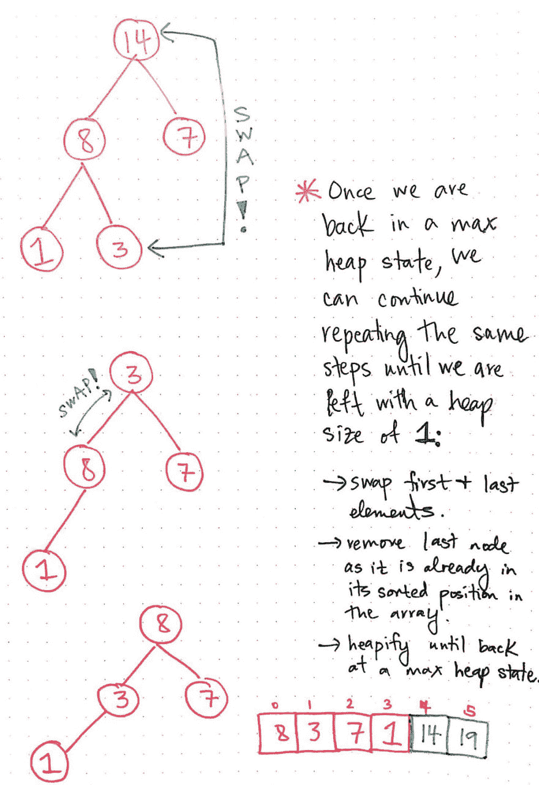](https://res.cloudinary.com/practicaldev/image/fetch/s--ohKI3pk3--/c_limit%2Cf_auto%2Cfl_progressive%2Cq_auto%2Cw_880/https://cdn-images-1.medium.com/max/1024/1%2AxjOjmTdKM9ZTQCpbARzp0w.jpeg) 

<figcaption>实现堆排序，part 5</figcaption>

</figure>

拉德。我们交换了第一个和最后一个节点，然后我们删除了最后一个节点 14，因为它在排序后的位置。接下来我们要做的唯一一件事就是将根节点移动到正确的位置，并堆化元素 3，直到我们回到最大堆状态。

我们将继续这样做三次以上。最终，我们只剩下 1，堆中的最后一个节点。此时，堆排序算法将完成，我们将知道 1 将是数组中的第一个元素，我们将知道数组最终被排序。

这是我们刚刚走过的整个过程的一个很好的可视化。注意在每次迭代排序中，最大的未排序元素如何在堆中的正确位置结束，然后在数组中结束。

<figure>[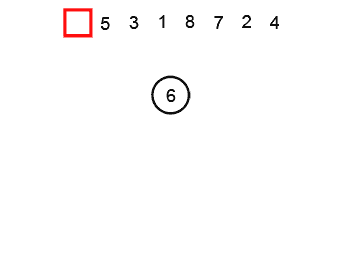](https://res.cloudinary.com/practicaldev/image/fetch/s--Rk6T9CB9--/c_limit%2Cf_auto%2Cfl_progressive%2Cq_auto%2Cw_880/https://cdn-images-1.medium.com/max/350/1%2APocnZSHk9ez6vxPUP9l1Nw.png) 

<figcaption>堆排序可视化，[维基共享](https://upload.wikimedia.org/wikipedia/commons/4/4d/Heapsort-example.gif)</figcaption>

</figure>

### 堆排序:有什么用？

当我第一次读到堆排序时，我对这种算法有一种奇怪的熟悉感。只有在演示了堆排序之后，我才意识到我的似曾相识的感觉来自哪里:堆排序几乎和选择排序一模一样！您可能还记得本系列前面的内容，即[选择排序](https://dev.to/vaidehijoshi/exponentially-easy-selection-sort)是一种排序算法，它通过遍历元素列表，找到最小的元素，并将其放在排序列表中，从而对未排序的项目列表进行排序。它继续通过查找最小的未排序元素进行排序，并将其添加到排序列表中。

这听起来是不是很像堆排序，只是反过来了？

> 事实证明，堆排序在逻辑上很像选择排序:两种算法都找到最小或最大的元素，“选择”它，并将该项放在排序列表中的正确位置。

然而，尽管它们很相似，堆排序在一个重要方面比选择排序好得多:它的性能！堆排序基本上是选择排序的超级改进版本。是的，它确实在未排序的集合中找到最大的元素，并将其排序在列表的后面——但是，它完成所有这些工作的速度比选择排序快得多！

<figure>[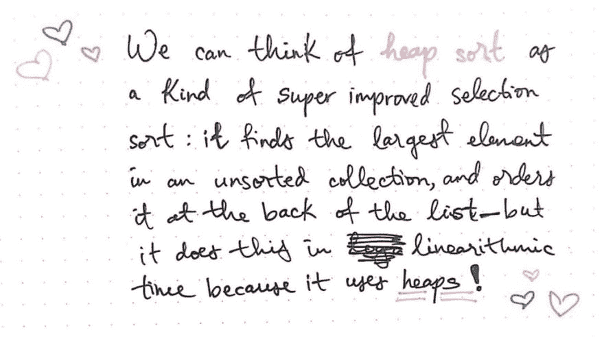](https://res.cloudinary.com/practicaldev/image/fetch/s--1LF6WpiL--/c_limit%2Cf_auto%2Cfl_progressive%2Cq_auto%2Cw_880/https://cdn-images-1.medium.com/max/1024/1%2AsQ7yRCXpFUCUTbbIxd6IcQ.jpeg) 

<figcaption>堆排序:有点像选择排序，但是更好！</figcaption>

</figure>

好的，那么堆排序要快多少呢？还有*为什么*更快？

好吧，让我们来看看代码。堆排序有各种实现，下面的代码改编自 Rosetta Code 的堆排序的 [JavaScript 实现](http://rosettacode.org/wiki/Sorting_algorithms/Heapsort#JavaScript)。您会记得堆排序有两个重要部分:buildMaxHeap 和 heapify。我们可以在下面的 heapSort 版本中看到它们的运行。

```
function heapSort(array) {
  // Build our max heap.
  buildMaxHeap(array);

  // Find last element.
  lastElement = array.length - 1;

  // Continue heap sorting until we have
  // just one element left in the array.
  while(lastElement > 0) {
    swap(array, 0, lastElement);

    heapify(array, 0, lastElement);

    lastElement -= 1
  }
} 
```

buildMaxHeap 函数负责实际创建最大堆。注意，即使这个函数也调用 heapify，它一次将一个元素移动到它在堆中的正确位置。

```
function buildMaxHeap(array) {
  var i;
  i = array.length / 2 - 1;
  i = Math.floor(i);

  // Build a max heap out of
  // all array elements passed in.
  while (i >= 0) {
    heapify(array, i, array.length);
    i -= 1;
  }
} 
```

heapify 函数非常重要，让我们来看看。请注意，它依赖于算法来确定节点的左右子节点，上周我们第一次学习堆时讨论过这个问题。

```
function heapify(heap, i, max) {
  var index, leftChild, righChild;

  while(i < max) {
    index = i;

    leftChild = 2*i + 1;
    righChild = leftChild + 1;

    if (leftChild < max && heap[leftChild] > heap[index]) {
      index = leftChild;
    }

    if (righChild < max && heap[righChild] > heap[index]) {
      index = righChild;
    }

    if (index == i) {
      return;
    }

    swap(heap,i, index);

    i = index;
  }
} 
```

最后但并非最不重要的，交换函数，我们以前在其他排序算法中见过，但值得快速查看以提醒我们自己它做了什么:

好了，现在我们已经对这些函数如何相互作用和调用有了一些了解，让我们回到我们最初的问题:堆排序如何比选择排序更有效？如果我们深入研究代码，我们会注意到两件事:首先，我们必须构建一次 max 堆，将数组的所有元素传递给它；其次，除了第一个根节点元素之外，我们必须一次又一次地堆中的所有项目。

<figure>[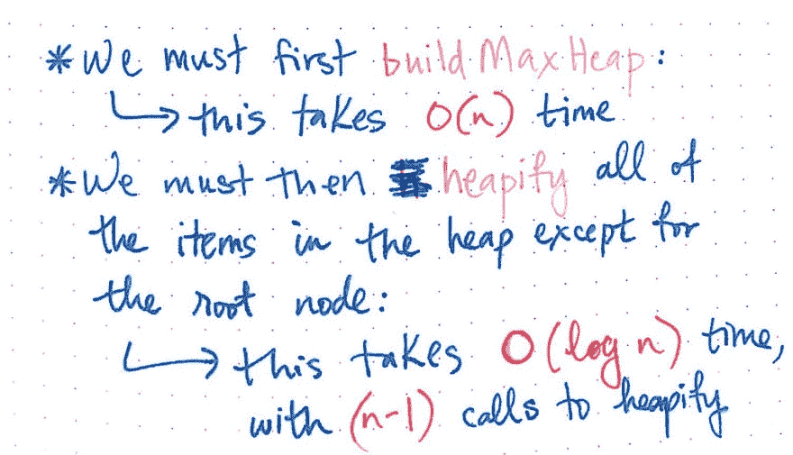](https://res.cloudinary.com/practicaldev/image/fetch/s---F84bVC0--/c_limit%2Cf_auto%2Cfl_progressive%2Cq_auto%2Cw_880/https://cdn-images-1.medium.com/max/1024/1%2A-oV9Rwk_47MwW6GstO1JPA.jpeg) 

<figcaption>理解堆排序的时间复杂度</figcaption>

</figure>

这两个观察事实上是*如何*和*为什么*堆排序这么快这个问题的关键。调用 buildMaxHeap 需要花费 *O(n)* 的时间，因为每一项都必须被添加到堆中，并且更大量的元素意味着更大的堆。但是，请记住，我们处理的是一棵二叉树，[二叉树本质上是对数](https://dev.to/vaidehijoshi/leaf-it-up-to-binary-trees)。因此，即使我们不得不一次又一次地调用 heapify，调用这个函数实际上是相当快的，因为它将以对数时间运行，或者说 *O(log n)* 。

这两种时间复杂性的结合是我们以前已经见过的！堆排序在*线性算法*时间内运行，或者用大 O 表示法， *O(n log n)* 。所以，尽管堆排序*看起来*很像选择排序，但是它要快得多！选择排序在二次时间内运行，或者说*O(n \)*，这比线性时间效率低得多。

让我们快速地看一下堆排序与其他排序算法相比的其他方面。

<figure>[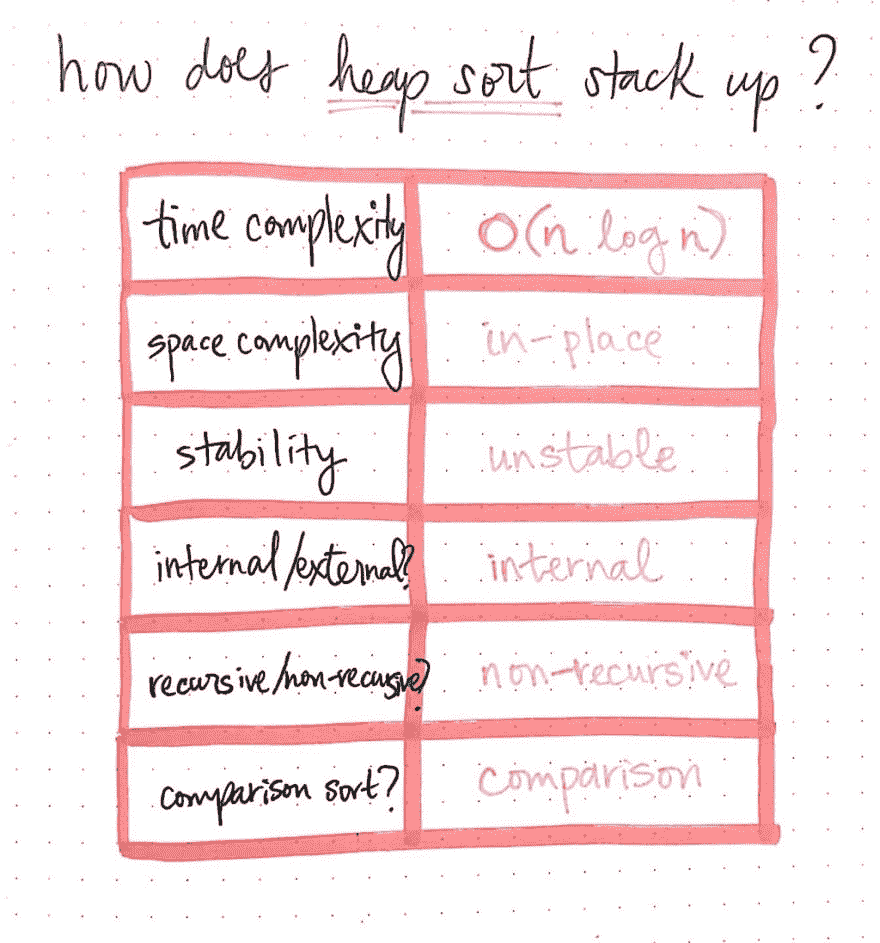](https://res.cloudinary.com/practicaldev/image/fetch/s--DxKwr1aa--/c_limit%2Cf_auto%2Cfl_progressive%2Cq_auto%2Cw_880/https://cdn-images-1.medium.com/max/1024/1%2AFmz1Fapal4GZePsoBWUx1Q.jpeg) 

<figcaption>堆如何排序 stack up？</figcaption>

</figure>

堆排序在排序时转换传递给它的数组；与某些排序算法不同，它不会创建输入数据的完全独立的副本。这使得它成为一种 ***就地*** 排序算法。堆排序也不需要外部内存，是一种 ***内部*** 排序算法。它迭代运行(因此是 ***非递归*** )，并且在交换和调用 heapify 函数时一次比较两个元素，使其成为一个 ***比较*** 排序算法。

然而，由于堆的性质和 heapify 函数，如果有重复的元素，我们不能依赖元素来保持它们的顺序！所以，堆排序是*不稳定；这是合并排序和堆排序之间的主要区别，它们都依赖于树结构来高效地执行。然而，合并排序在稳定性之战中获胜，而堆排序在这一方面失败了。*

 *尽管合并排序和堆排序有所不同，但它们在一点上是一致的:如果没有二叉树，它们都会丢失！

### 资源

有一些关于堆排序的非常棒的课程笔记和讲座，以及一些很好的视频教程。我做了些谷歌搜索，这样你就不用这么做了！如果您有兴趣了解更多关于堆排序的知识，可以从这里开始。

1.  [算法简介:堆排序](https://ocw.mit.edu/courses/electrical-engineering-and-computer-science/6-006-introduction-to-algorithms-fall-2011/lecture-videos/MIT6_006F11_lec04.pdf)，麻省理工学院
2.  [算法:堆排序](http://ind.ntou.edu.tw/~litsnow/al98/pdf/Algorithm-Ch6-Heapsort.pdf)，程教授“池琳
3.  [堆排序](http://www.growingwiththeweb.com/2012/11/algorithm-heapsort.html)，与网络一起成长
4.  [4 分钟堆排序](https://www.youtube.com/watch?v=2DmK_H7IdTo)，迈克尔·桑波尔
5.  [堆排序:最大堆](https://www.youtube.com/watch?v=8ezAttfIKJM)，strohtennis

* * *

*本帖最初发表于[medium.com](https://medium.com/basecs/heapify-all-the-things-with-heap-sort-55ee1c93af82)T3】**