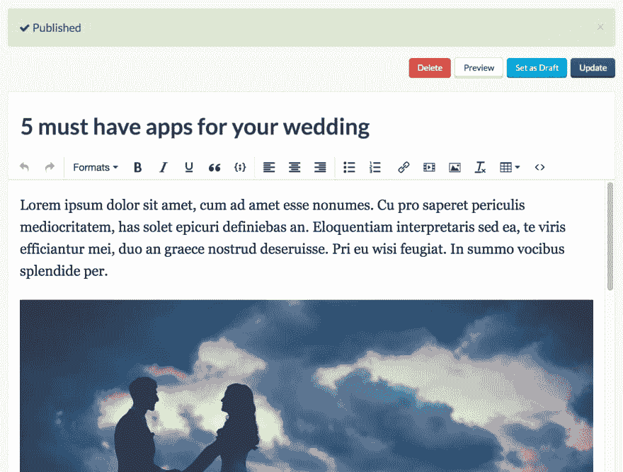
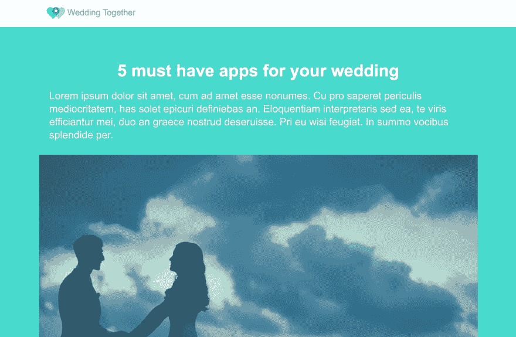

# 如何在 5 分钟内将博客添加到 Django 应用程序中

> 原文:[https://dev . to/Roger Jin 12/how-wedding-together-add-a-blog-to-their-django-app-in-5 分钟](https://dev.to/rogerjin12/how-wedding-together-added-a-blog-to-their-django-app-in-5-minutes)

*想了解更多类似的内容，请在推特上关注 [ButterCMS，并订阅我们的](https://twitter.com/ButterCMS)[博客](https://buttercms.com/blog/)。*

## 我们的问题

我们是 python 开发人员，我们想给 [Wedding Together](https://weddingtogether.co) 添加一个博客。Wedding Together 是一款手机应用程序，允许参加婚礼的宾客分享他们在婚礼上拍摄的照片。在网站上添加博客是一个和互联网一样古老的问题。如果我们发现自己在重新发明轮子，我们可能做错了。我可以讨论从零开始建立我们自己的博客系统，但是已经有很多关于如何做的文章了。

## 我们的要求

*   我们不想担心 SEO。它应该是内置的。
*   我们想把我们从 GitHub 得到的任何代码放在 weddingtogether.co/blog，而不使用任何 NGINX/Apache 巫术。
*   我们不希望每次内容发生变化时都要编辑 HTML 文件或编写代码。

有一个要求明确区分了我们可以选择的所有路径。我们希望保护和改进我们的开发流程。

如果我们不想要:

*   这个博客有一套单独的 SASS 样式表。
*   花时间管理安全更新。
*   打乱我们目前的配置。
*   扮演我们自己的解决方案。

我们的选择是选择托管解决方案。我们将回顾这些秒钟。如果我们对这些事情中的一些没问题，那么我们有两个自我管理的选项。

## 我们的选项

### 自我管理

两个最流行的 python web 框架是 [Django](https://www.djangoproject.com/) 和 [Flask](http://flask.pocoo.org/) 。Wedding Together 的后端是用 Django 构建的，所以我们将从那里开始。几个谷歌搜索之后，我们发现[夹层](http://mezzanine.jupo.org/)是最活跃的 Django 博客项目。如果最佳选择涉及创建额外应用程序的负面影响，我们不妨在 Flask 中查找选项。两个最常用的选项是 [flask-blog](https://github.com/dmaslov/flask-blog) 和[Flask-blog](https://github.com/gouthambs/Flask-Blogging)。flask-blog 已经 3 年没有更新了。烧瓶-博客是我们的“夹层”博客选项，但在烧瓶。夹层博客和 Flask-Blogging 都有以下优点和缺点:

*   优点:
    *   把所有的铃铛和口哨都从盒子里拿出来了。我们不想处理类似 SEO 和 meta what-not 这样的事情。
    *   如果我们想修改的话，是可以破解的
    *   制作博客帖子的简单非开发人员界面
    *   “免费”(解释如下)
*   骗局
    *   **要求我们管理和维护另一个应用**

根据您的基础架构的设置，添加另一个应用程序可能像在服务器上安装 pip 一样简单，也可能像在已经增长的架构中添加另一台机器一样困难。

大多数网络/软件公司都有一种永远不会满足的资源，那就是开发人员的时间。如果不考虑开发人员的时间，Mezzanine 和 Flask-Blogging 是“免费”的。如果将开发人员实现这些选项的时间考虑在内，它们是您可以选择的最昂贵的选项。

### 替我们管理

让我们来看一个在开发人员时间意义上几乎免费的托管选项。ButterCMS 是一个管理博客的选项，拥有尽可能对开发者友好的 API。我已经尝试了半打博客 API 选项，ButterCMS 确实是最容易和最简单的。

我们登录他们网站的界面写一篇博文。

[T2】](https://res.cloudinary.com/practicaldev/image/fetch/s--6nUhLcnA--/c_limit%2Cf_auto%2Cfl_progressive%2Cq_auto%2Cw_880/https://cdn.buttercms.com/S7L9ewu7TR6Cpx31uJmQ)

我们安装 python 模块。

```
pip install buttercms-python 
```

我们撤下我们的博客帖子:

```
 from butter_cms import ButterCMS

    def blog(request):
        client = ButterCMS('your-token-goes-here')
        posts = client.posts.all()
        return render(request, 'blog.html', {'posts': posts}) 
```

将它放入我们的模板:

```
 
        <h1>{{ post.title }}</h1>

        <p>{{ post.body|safe }}</p>
     
```

就是这样！

[T2】](https://res.cloudinary.com/practicaldev/image/fetch/s--QDu48o4T--/c_limit%2Cf_auto%2Cfl_progressive%2Cq_auto%2Cw_880/https://cdn.buttercms.com/U7oBxCIR1uW8sv1htFrV)

我的例子中缺少了一些小的调整来使 Django 完美地运行他们的 API，所有这些都包含在他们的文档中。

## 我们的选择

创建一个 Mezzanine 或 Flask-blog 的实例是绝对有可能的，但是我花了比我愿意承认的更多的时间。随着时间的推移，我也不太期待处理另一个数据库和 django 应用程序。

添加一个像 ButterCMS 这样的管理选项花了我大约 5 分钟，我知道我再也不会去弄乱它了。

大多数其他的博客 API 都充满了神秘的术语，比如“博客建模”或者“内容交付 API”和“内容管理 API”。ButterCMS 兜售一个简单直接的系统，让你专注于建立你的公司和产品。

*此文原帖[此处](https://buttercms.com/blog/options-for-adding-a-blog-to-python-application)。*