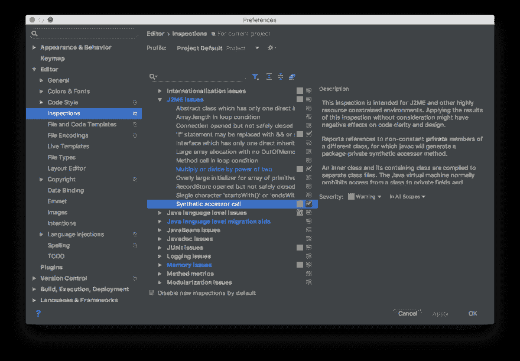

# Kotlin 中的合成访问器

> 原文：<https://dev.to/ditn/synthetic-accessors-in-kotlin>

所以这是一个相当乏味的博客，应该很快，但我只是想分享我的发现。

如您所知，从嵌套或匿名内部类访问 Java 中的私有方法或字段会导致创建合成访问器方法(T2)。如果你不知道我在说什么，杰克·沃顿关于 Java 隐藏成本的[演讲](http://jakewharton.com/exploring-java-hidden-costs/)值得一看。

这些合成的访问器是由编译器生成的，在 Android 上有很大的缺点——可能会在整个项目中添加数百个甚至数千个不必要的方法，每个方法都会影响 dex 的极限。直接访问这些方法或字段的速度也比使用 getter 快 7 倍，这一点不容小觑。

因此，在 Blockchain，我们使用 [Thunk](https://android.googlesource.com/platform/packages/apps/Launcher3/+/master/src/com/android/launcher3/util/Thunk.java) 注释向开发人员发出信号，为了避免合成访问器的创建，我们已经更改了字段或方法的范围。Android Studio 还内置了一个方便的检查功能，可以突出显示您可能遗漏的案例:

[T2】](https://res.cloudinary.com/practicaldev/image/fetch/s--MAjXWn1w--/c_limit%2Cf_auto%2Cfl_progressive%2Cq_auto%2Cw_880/https://cdn-images-1.medium.com/max/1600/1%2ARZhTqGk5RSrDWEKdxANeSQ.png)

这是众所周知的。但这是新的热点问题吗，科特林？

简而言之，是的。

最终这不应该太令人惊讶:Kotlin 向下编译成等价的 Java 字节码，所以这确实也是一个问题。我想应该是这样，但我想核实一下，所以我找到了以下内容:

```
class SyntheticAccessorTest {

    private var counter = 0

    fun main(args: Array<String>) {

        val someClass = SomeClass(object : SomeInterface {
            override fun doSomething() {
                printSomething()
            }

            override fun doSomethingElse() {
                counter++
            }
        })
    }

    private fun printSomething() {
        print("Something")
    }
}

class SomeClass(var listener: SomeInterface)

interface SomeInterface {

    fun doSomething()

    fun doSomethingElse()

} 
```

Enter fullscreen mode Exit fullscreen mode

这里我们有一个简单的测试类，它调用另一个简单类的构造函数，并接受一个`interface`的匿名实现。在一个回调中，我们调用一个函数`private`，在另一个回调中，我们增加一个计数器，这个计数器也是`private`。不幸的是，由此产生的`.class file`绝对会有合成的访问器方法，一旦我们深入了解，就很容易明白为什么会这样。

在 Android Studio 中，如果我们选择`Kotlin Bytecode`，然后选择`Decompile`，我们会得到这个 Java(为了可读性，我对它做了一些简化):

```
public final class SyntheticAccessorTest {
   private int counter;

   public final void main(@NotNull String[] args) {
      new SomeClass(new SomeInterface() {
         public void doSomething() {
            SyntheticAccessorTest.this.printSomething();
         }

         public void doSomethingElse() {
            int var1;
            SyntheticAccessorTest.this.counter = (var1 = SyntheticAccessorTest.this.counter) + 1;
         }
      });
   }

   private final void printSomething() {
      String var1 = "Something";
      System.out.print(var1);
   }
} 
```

Enter fullscreen mode Exit fullscreen mode

如果我们用`javap -p -c SyntheticAccessorTest.class`反编译这个文件，我们会得到这个:

```
public final class SyntheticAccessorTest {
  private int counter;
public final void main(java.lang.String[]);
    Code:
       [...]
private final void printSomething();
    Code:
       [...]
public SyntheticAccessorTest();
    Code:
       [...]
public static final void access$printSomething(SyntheticAccessorTest);
    Code:
       [...]
public static final int access$getCounter$p(SyntheticAccessorTest);
    Code:
       [...]
public static final void access$setCounter$p(SyntheticAccessorTest, int);
    Code:
       [...]
} 
```

Enter fullscreen mode Exit fullscreen mode

它们就在那里:这些`access$`方法就是问题所在。事实上，我们为`counter`字段得到两个；一个给`set`，一个给`get`。你可以很容易地看到这是如何在 Android 项目中快速增加的。

如果我们将`counter`和`printSomething()`都改为`internal`，我们得到的是:

```
public final class SyntheticAccessorTest {
  private int counter;
public final int getCounter$Test_Project();
    Code:
       [...]
public final void setCounter$Test_Project(int);
    Code:
       [...]
public final void main(java.lang.String[]);
    Code:
       [...]
public final void printSomething$Test_Project();
    Code:
       [...]
public SyntheticAccessorTest();
    Code:
       [...]
} 
```

Enter fullscreen mode Exit fullscreen mode

好多了。但是有趣的是，虽然我们失去了`printSomething()`的合成访问器，但是我们仍然得到了设置和获取`counter`属性的两个方法。这是由于 Kotlin 自动向属性添加 getters 和 setters，事实上，如果我们检查生成的 Java，我们会看到:

```
public final int getCounter$production_sources_for_module_Test_Project() {
   return this.counter;
}

public final void setCounter$production_sources_for_module_Test_Project(int var1) {
   this.counter = var1;
} 
```

Enter fullscreen mode Exit fullscreen mode

这看起来是否没有必要取决于你。在大多数 Java 类中，您可能已经编写了 setters 和 getters，所以在许多情况下您并没有真正获得任何不需要的方法。然而，在这种情况下，由于属性是在父类内部访问的:这些显然是多余的。对等价的 Java 代码应用同样的检查只会产生 3 种方法；比科特林少两个。

如果这是你的一个大问题，有一个简单的解决方法；将`@JvmField`注释添加到属性中，将不会生成 getter/setter(感谢 Kirill Rakhman 的提醒)。

所以，是的，你确实需要像在 Java 中一样小心访问 Kotlin 中的私有函数，简单地使用属性似乎有隐藏的成本。遗憾的是，目前还没有对此进行检查，但我希望 IntelliJ/Google 很快会添加这一功能。同时，如果您担心 dex 方法计数，请仔细检查您的代码。