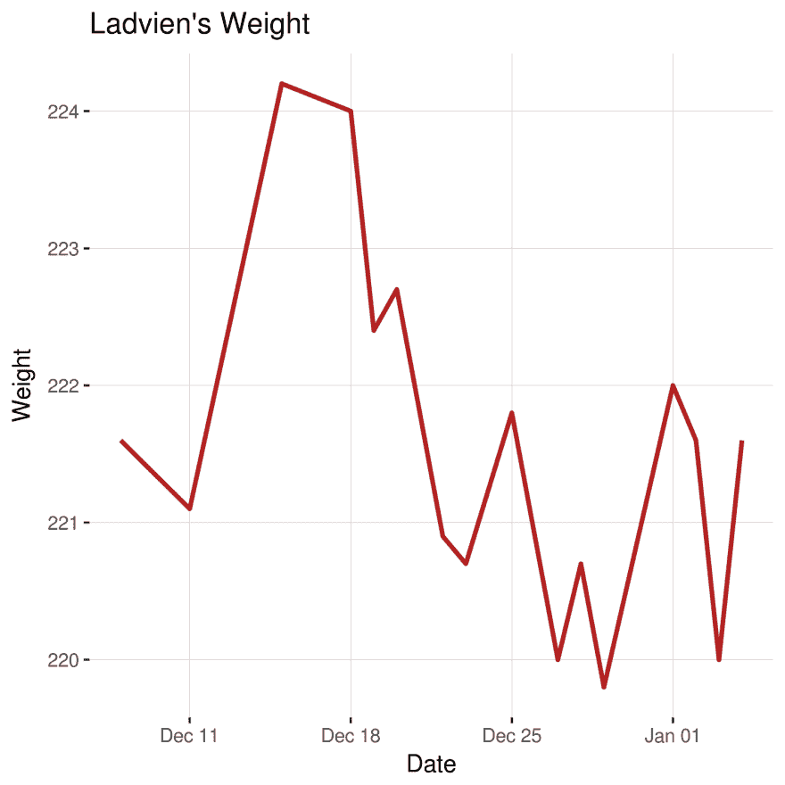
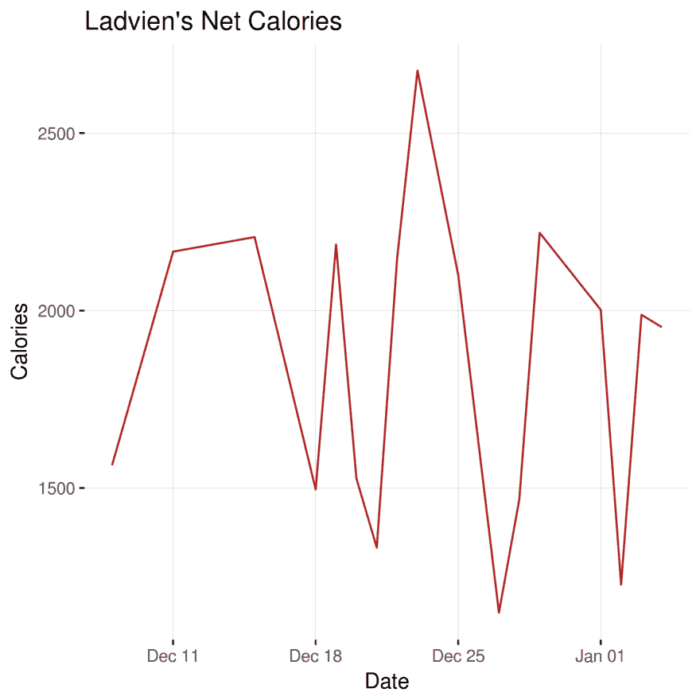

# 给我 MyFitnessPal 数据！

> 原文:[https://dev.to/ladvien/give-me-myfitnesspal-data-5g59](https://dev.to/ladvien/give-me-myfitnesspal-data-5g59)

我很胖。比我想的要胖。我并不总是很胖，我在 2008 年的时候瘦到了 180 磅。它需要虔诚地计算卡路里和体重。对我来说最重要的是有一张图表，我每天看着它显示我的结果。一年下来，我瘦了 40 磅。好吧，是时候再来一次了。10 年来，我的体重增加了 40 磅——现在我需要减肥了。

早在 2008 年，我用谷歌给我提供我吃的每样东西的卡路里，并把它们记录在一个 Excel 文档中。这本食品杂志很棒，但是比它应该做的多了一点工作。

当时，我并不知道自己是一名黑客。现在，我打算把我所有的黑客技能都扔在这个减肥计划上(见鬼，我甚至可能去健身房！)

我注册了 MyFitnessPal。计算卡路里曾经有效，我想如果它没有坏的话。但是后来我开始考虑要做多少工作才能看到我的进步。我的意思是，我必须打开手机上的应用程序，点击减肥部分。谁设计了这个应用程序？两次行动到达我需要的地方-没人有时间。

输入黑客技能。我发现有一个 Python 库允许抓取数据。

*   [MyFitnessPal Python 库](https://github.com/coddingtonbear/python-myfitnesspal)

这个奇妙的小库是由 CoddingtonBear 编写和提供的。

我想，我会编写一个 Python 脚本来废弃数据，将其保存到 CSV，创建一个 SQL-R 脚本来连接营养和体重信息，使用 ggplot 来绘制数据，将绘图保存为 a.png，然后将此绘图复制到 Ladvien.com 的一个专用点。最后，我会编写一个 bash 脚本，每天晚上运行并更新图表。简单！

拜托，打开一个网页比点击两次要容易得多。

嗯，经过几个小时的编码，我已经完成了项目的第一步。

```
import myfitnesspal
import csv, sys, os
from datetime import datetime

# Get account info client = myfitnesspal.Client('cthomasbrittain')
# Set start year startYear = "2008"
# Get limits beginningDate = datetime.strptime(startYear, "%Y").date()
beginningYear = beginningDate.year
daysInMonth = {1:31, 2:28, 3:31, 4:30, 5:31, 6:30, 7:31, 8:31, 9:30, 10:31, 11:30, 12:31}
emptyNutrition = [None, None, None, None, None, None]

print("")
print("################################################")
print("# Scraping MyFitnessPal                        #")
print("# Make sure your account is set to public      #")
print("# and your username and pass are in keychain   #")
print("################################################")
print("")

today = datetime.now().date()
currentYear = today.year

print("")
print("################################################")
print("# Get nutrition and weight information         #")
print("################################################")
print("")

# Loop over years from beginingYear.  Make sure last year is inclusive. for yearIndex in range(beginningYear, currentYear+1):

    # Create a file name based on this year's data
    thisFileName = "healthData_%s.csv" % yearIndex

    # Open CSV as read and write.
    # If file exists, open for read / write
    #   else, create file, write only.
    try:
        f = open(thisFileName, "r+")        # Check to see if file is complete,
        row_count = sum(1 for row in f)     # else, overwrite the file
        if(row_count != 366):               # A year of rows plus headers, and an empty line at end.
            f = open(thisFileName, "w+")
            row_count = 0
    except EnvironmentError:
        f = open(thisFileName, "w+")        # If file does not exist, create it.
        row_count = 0

    writer = csv.writer(f)

    # Check number of lines. If the year wasn't captured, start over.
    if(row_count < 365):
        # Write headers for totals
        writer.writerow(["Date", "Sodium", "Carbohydrates", "Calories", "Fat", "Sugar", "Protein", "Weight"])
        sys.stdout.write(str(yearIndex)+": ")   # Print has a linefeed.
        sys.stdout.flush()
        for monthIndex in range(1, 12+1):

            beginningOfMonthStr = "%s-%s-%s" % (yearIndex, monthIndex, 1)
            endOfMonthStr = "%s-%s-%s" % (yearIndex, monthIndex, daysInMonth[monthIndex])

            beginningOfMonth = datetime.strptime(beginningOfMonthStr, "%Y-%m-%d").date()
            endOfMonth = datetime.strptime(endOfMonthStr, "%Y-%m-%d").date()

            thisMonthsWeights = dict(client.get_measurements('Weight', beginningOfMonth, endOfMonth))

            for dayIndex in range(1, daysInMonth[monthIndex]+1):

                fullDateIndex = "%s-%s-%s" % (yearIndex, monthIndex, dayIndex)
                thisDate = datetime.strptime(fullDateIndex, "%Y-%m-%d").date()
                if(thisDate > today):
                    break;

                thisDaysNutritionData = client.get_date(yearIndex, monthIndex, dayIndex)
                thisDaysNutritionDataDict = thisDaysNutritionData.totals
                thisDaysNutritionValues = thisDaysNutritionDataDict.values()

                thisDaysWeight = [(thisMonthsWeights.get(thisDate))]

                if(len(thisDaysNutritionValues) < 6):
                    thisDaysNutritionValues = emptyNutrition

                dataRow = [fullDateIndex] + thisDaysNutritionValues  + thisDaysWeight
                if dataRow:
                    writer.writerow(dataRow)

            sys.stdout.write("#")
            sys.stdout.flush()
        print(" -- Done.")
        f.close()
    else:
        print((str(yearIndex)+": Exists and is complete.")) 
```

<svg width="20px" height="20px" viewBox="0 0 24 24" class="highlight-action crayons-icon highlight-action--fullscreen-on"><title>Enter fullscreen mode</title></svg> <svg width="20px" height="20px" viewBox="0 0 24 24" class="highlight-action crayons-icon highlight-action--fullscreen-off"><title>Exit fullscreen mode</title></svg>

然后，我们添加一些 R 来将数据连接在一起，并自动绘图，并将绘图保存为图像。

```
library(ggplot2)  library(scales)  cat("*****\n")  cat("* Starting R                                          *\n")  cat("*****\n")  cat("\n")  cat("*****\n")  cat("* Combining Health Data                               *\n")  cat("*****\n")  cat("\n")  # Thanks Rich Scriven  # https://stackoverflow.com/questions/25509879/how-can-i-make-a-list-of-all-dataframes-that-are-in-my-global-environment  healthDataRaw  <-  do.call(rbind,  lapply(list.files(pattern  =  ".csv"),  read.csv))  # Fill in missing values for calories  healthDataRaw$Calories[is.na(healthDataRaw$Calories)]  <-  mean(healthDataRaw$Calories,  na.rm  =  TRUE)  date30DaysAgo  <-  Sys.Date()  -  30  date90DaysAgo  <-  Sys.Date()  -  90  date180DaysAgo  <-  Sys.Date()  -  180  cat("*****\n")  cat("* Creating Weight Graph                               *\n")  cat("*****\n")  healthData  <-  healthDataRaw[!(is.na(healthDataRaw$Weight)),]  healthData$Date  <-  as.Date(healthData$Date)  healthData  <-  with(healthData,  healthData[(Date  >=  date30DaysAgo),  ])  p  <-  ggplot(healthData,  aes(x  =  Date,  y  =  Weight))+  geom_line(color="firebrick",  size  =  1)  +  labs(title  ="Ladvien's Weight",  x  =  "Date",  y  =  "Weight")  p  ggsave("ladviens_weight.png",  width  =  5,  height  =  5)  cat("\n")  cat("*****\n")  cat("* Creating Calories Graph                             *\n")  cat("*****\n")  cat("\n")  #healthData <- healthDataRaw[!(is.na(healthDataRaw$Calories)),]  healthData$Date  <-  as.Date(healthData$Date)  healthData  <-  with(healthData,  healthData[(Date  >=  date30DaysAgo),  ])  p2  <-  ggplot(healthData,  aes(x  =  Date,  y  =  Calories))+  geom_line(color="firebrick")  p2  png(filename="ladviens_calories.png")  plot(p2)  dev.off()  cat("*****\n")  cat("* Finished R Script                                   *\n")  cat("*****\n")  cat("\n") 
```

<svg width="20px" height="20px" viewBox="0 0 24 24" class="highlight-action crayons-icon highlight-action--fullscreen-on"><title>Enter fullscreen mode</title></svg> <svg width="20px" height="20px" viewBox="0 0 24 24" class="highlight-action crayons-icon highlight-action--fullscreen-off"><title>Exit fullscreen mode</title></svg>

最后，让我们编写一个 bash 脚本来运行 Python 和 R 代码，然后将图像复制到 Ladvien.com

```
#!/bin/sh
PASSWORD=("$(keyring get system ladvien.com)")

Python myfitnesspall_scraper.py

Rscript myfitnesspal_data_sort.R

ECHO ""
ECHO "*****"
ECHO "* Syncing files to Ladvien.com                        *"
ECHO "*****"
ECHO ""

# Used SSHPass
# https://gist.github.com/arunoda/7790979

sshpass -p "$PASSWORD" scp ladviens_weight.png ladviens_calories.png root@ladvien.com:/usr/share/nginx/htmlhttps://ladvien.cimg/ 
```

<svg width="20px" height="20px" viewBox="0 0 24 24" class="highlight-action crayons-icon highlight-action--fullscreen-on"><title>Enter fullscreen mode</title></svg> <svg width="20px" height="20px" viewBox="0 0 24 24" class="highlight-action crayons-icon highlight-action--fullscreen-off"><title>Exit fullscreen mode</title></svg>

这是结果:

我的体重:

[T2】](https://res.cloudinary.com/practicaldev/image/fetch/s--dkv8nVVR--/c_limit%2Cf_auto%2Cfl_progressive%2Cq_auto%2Cw_880/https://ladvien.cimg/ladviens_weight.png)

我的卡路里:

[T2】](https://res.cloudinary.com/practicaldev/image/fetch/s--jxPwW4YN--/c_limit%2Cf_auto%2Cfl_progressive%2Cq_auto%2Cw_880/https://ladvien.cimg/ladviens_calories.png)

接下来，我可能会调整 ggplot2，使图形更漂亮一点。此外，我将设置一个 Raspberry Pi 或其他程序每晚运行一次 bash 脚本。为什么？Lolz。