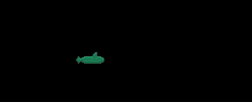

# 在 Lua/Love2D 中制作一个射手-设置和玩家移动

> 原文:[https://dev.to/jeansberg/make-a-shooter-in-lualove2d-第一部分](https://dev.to/jeansberg/make-a-shooter-in-lualove2d---part-1)

你好！这将是使用 Lua 编程语言和 Love2D 框架开发一个简单的射击游戏的系列文章的第一篇。我决定把这个游戏作为我已经工作了一段时间的另一个游戏项目的一点突破。我选择 Lua 和 Love2D 是因为它们注重简单和高效。我会边学边写这些帖子。

## 入门

为了运行我们正在制作的游戏，你需要安装来自 https://love2d.org 的 Love2D 框架。您可能还想为您最喜欢的文本编辑器使用 IDE 或插件来获得诸如自动完成和语法检查之类的功能。以下是这类[工具](http://www.gamefromscratch.com/post/2016/01/25/Editors-and-IDEs-for-Lua-and-Love-Development.aspx)的列表。就我个人而言，我选择了 Atom 编辑器插件，因为 Atom 是我目前最喜欢的文本编辑器。

## 我们写点代码吧！

设置好工具后，我们要做的第一件事就是创建一个包含 main.lua 文件的文件夹，这是 Love2D 可执行文件寻找游戏代码入口点的地方。这是我们现在要放所有代码的地方。

我们将从编写三个非常重要的函数开始:

*   love.load()
*   love.draw()
*   love.update()

这些函数由 Love2D 引擎调用，是运行任何代码所必需的。当游戏开始时，load()函数只被调用一次。一旦游戏开始运行，draw()函数就会被连续调用，这也是放置任何图形代码的地方。update()函数也被连续调用，它是应该更新游戏状态的地方。

### love.load()

```
function love.load()
  xPos = 0
  yPos = 0
  playerWidth = 64
  playerHeight = 64
  playerSpeed = 200
  submarineImage = love.graphics.newImage("resourcimg/submarine.png")
end 
```

<svg width="20px" height="20px" viewBox="0 0 24 24" class="highlight-action crayons-icon highlight-action--fullscreen-on"><title>Enter fullscreen mode</title></svg> <svg width="20px" height="20px" viewBox="0 0 24 24" class="highlight-action crayons-icon highlight-action--fullscreen-off"><title>Exit fullscreen mode</title></svg>

load()函数是各种初始化代码的最佳位置。我们首先为球员的位置、大小和速度定义一些整数值。然后我们加载一张位于硬盘上的图片——我用的是我画的这个小像素艺术潜水艇。这个图像将代表我们游戏中的玩家。注意，Lua 是一种动态类型语言，所以我们不需要为这些变量声明任何类型。

### love.draw()

```
function love.draw()
  love.graphics.draw(submarineImage, xPos, yPos, 0, 2, 2)
end 
```

<svg width="20px" height="20px" viewBox="0 0 24 24" class="highlight-action crayons-icon highlight-action--fullscreen-on"><title>Enter fullscreen mode</title></svg> <svg width="20px" height="20px" viewBox="0 0 24 24" class="highlight-action crayons-icon highlight-action--fullscreen-off"><title>Exit fullscreen mode</title></svg>

现在，我们的 draw()函数将包含一行代码来绘制玩家当前位置的图像。通常情况下，您只需要图像、x 位置和 y 位置参数。最后三个参数在这里，因为我想让我小小的 32x32 像素的图像变大一点。0 表示图像不会旋转，2 表示图像的宽度和高度加倍。

### love.update()

```
function love.update(dt)
  downUp = love.keyboard.isDown("down") or love.keyboard.isDown("up")
  leftRight = love.keyboard.isDown("left") or love.keyboard.isDown("right")

  speed = playerSpeed
  if(downUp and leftRight) then
    speed = speed / math.sqrt(2)
  end

  if love.keyboard.isDown("down") and yPos<love.graphics.getHeight()-playerHeight then
    yPos = yPos + dt * speed
  elseif love.keyboard.isDown("up") and yPos>0 then
    yPos = yPos - dt * speed
  end

  if love.keyboard.isDown("right") and xPos<love.graphics.getWidth()-playerWidth then
    xPos = xPos + dt * speed
  elseif love.keyboard.isDown("left") and xPos>0 then
    xPos = xPos - dt * speed
  end
end 
```

<svg width="20px" height="20px" viewBox="0 0 24 24" class="highlight-action crayons-icon highlight-action--fullscreen-on"><title>Enter fullscreen mode</title></svg> <svg width="20px" height="20px" viewBox="0 0 24 24" class="highlight-action crayons-icon highlight-action--fullscreen-off"><title>Exit fullscreen mode</title></svg>

update()函数将包含监听键盘输入和移动播放器的代码。你可能注意到这个函数有一个名为 dt 的参数。这由 Love2D 引擎传递给该函数，并指示自上次 update()调用以来已经过去了多长时间。这被用作一个乘数来决定我们的变量应该改变多少。如果没有这种调整，我们游戏的速度将直接取决于运行它的计算机的速度！

#### 输入处理

我们首先使用内置的 keyboard.isDown()函数来检查当前是否有任何箭头键被按下。我们将这些信息存储在两个变量中。其中一个将指示是否按下了向下或向上键。另一个将对左右键做同样的操作。如果这两个值都为真，这意味着玩家将沿对角线移动。在这种情况下，我们需要将速度值除以 2 的平方根，然后再将其应用于 x 和 y 位置。否则，对角线运动将比水平或垂直运动快得多。

#### 运动约束

然后，我们检查是否再次按下了向下或向上键(这不是最佳代码，但对于教程来说已经足够了！).如果向下键被按下，我们增加 y 位置，因为屏幕顶部的 y 坐标从 0 开始。如上所述，我们使用 dt 作为乘数。然而，仅仅检查玩家输入是不够的。我们不希望潜艇消失在屏幕下方，所以我们确保 yPos 变量永远不会大于屏幕高度减去播放器高度(播放器宽度和高度是 64 像素，因为我在绘制图像时将图像的宽度和高度增加了一倍)。类似地，我们希望确保潜艇不会超出屏幕，所以我们检查 yPos 是否大于零。水平移动的代码非常相似。

### 结论

你现在可以使用 love.exe 来运行游戏了！只需确保将包含 main.lua 文件的文件夹的路径作为参数提供给它。你应该可以用键盘上的箭头键来控制潜艇。如果你的笔记本电脑没有箭头键，只需将“向下”、“向上”、“向左”和“向右”参数改为字母键。
[T3】](https://res.cloudinary.com/practicaldev/image/fetch/s--JDRe-NUD--/c_limit%2Cf_auto%2Cfl_progressive%2Cq_66%2Cw_880/https://thepracticaldev.s3.amazonaws.com/i/owpawi4rta5pnmnypqao.gif)

在下面的帖子中，我们将会看到一些拍摄，敬请期待！
[第二部](https://dev.to/jeansberg/make-a-shooter-in-lualove2d---part-2)

## 链接

[来源为 part 1](https://github.com/jeansberg/GreatDeep/blob/dfd04ebdf0e2084ecbb2d6de9bedcf7c697b77c0/main.lua)
[最新来源](https://github.com/jeansberg/GreatDeep)
[love 2d wiki](https://love2d.org/wiki/Main_Page)
[Lua 引用](https://www.lua.org/manual/5.1/)