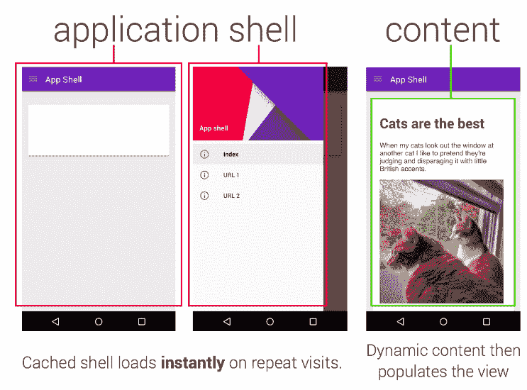
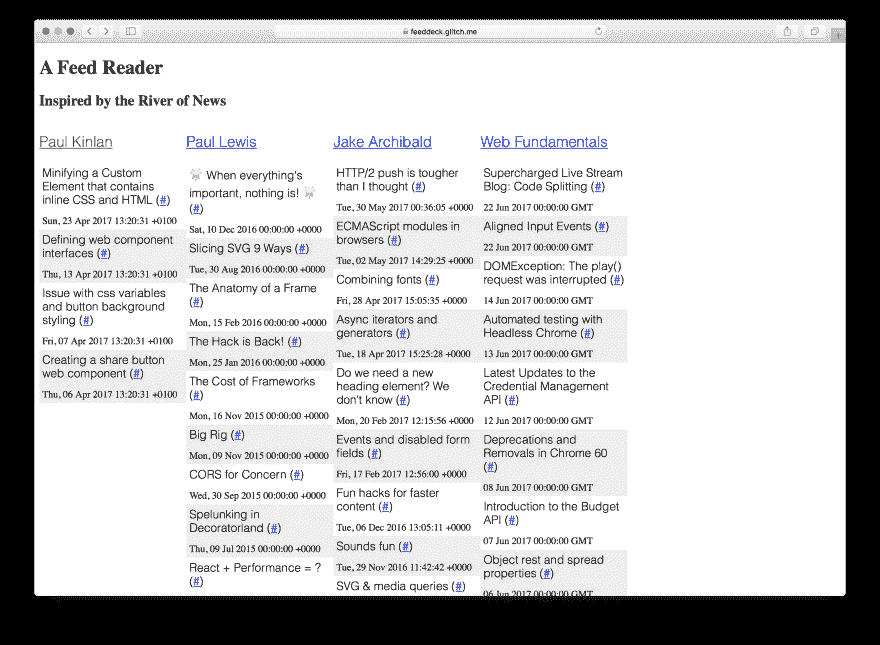
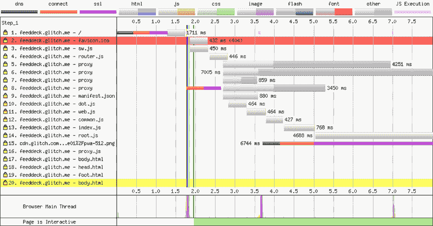
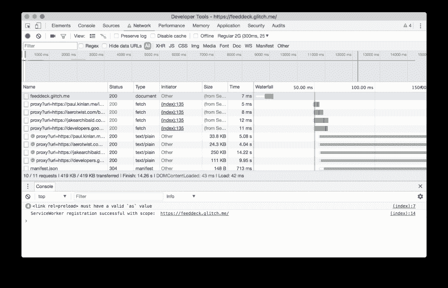

# 渐进式网络应用

> 原文:[https://dev . to/Paul _ kin LAN/progressive-progressive-we B- apps-2 hnl](https://dev.to/paul_kinlan/progressive-progressive-web-apps-2hnl)

我喜欢[渐进式网络应用](https://developers.google.com/web/progressive-web-apps/)。我喜欢它为你如何构建优秀、可靠的网站和应用程序提供的模型。我喜欢原理平台 API——服务工作者——它使 PWA 模型能够工作。

我们已经陷入的一个陷阱就是“ [App Shell](https://developers.google.com/web/fundamentals/architecture/app-shell) ”。应用程序外壳模型认为你的站点应该呈现一个完整的应用程序外壳(这样即使你离线也能体验一些东西),然后你可以控制如何以及何时引入内容。

[](https://res.cloudinary.com/practicaldev/image/fetch/s--ARr7lT_7--/c_limit%2Cf_auto%2Cfl_progressive%2Cq_auto%2Cw_880/https://paul.kinlan.img/app-shell.png)

<figcaption>App 外壳</figcaption>

应用程序外壳模型大致类似于“SPA”(单页应用程序)——你加载外壳，然后 JS 直接在你的页面中处理每个后续的导航。它在许多情况下都很有效。

我不认为 App Shell 是唯一的也不是最好的模式，你的选择总是因情况而异；例如，我自己的博客使用了一种简单的“陈旧-同时-重新验证”模式，当你浏览网站时，每个页面都会被缓存，更新会在稍后的刷新中显示；在这篇文章中，我想探索一个我最近实验过的模型。

# 为 App Shell 或非 App Shell

在 App Shell 的经典模型中，支持渐进式渲染几乎是不可能的，我希望实现一个真正的“渐进式”模型，用于构建一个具有服务人员的站点，该站点具有以下属性:

*   没有 JS 也能工作
*   当没有对服务人员的支持时，它起作用
*   它很快

我开始通过创建一个我一直想建立的项目来证明这一点:一条新闻+ TweetDeck 混合的河流。对于给定的 RSS 提要集合，以列的形式呈现。

[](https://res.cloudinary.com/practicaldev/image/fetch/s--rj8Lymci--/c_limit%2Cf_auto%2Cfl_progressive%2Cq_auto%2Cw_880/https://paul.kinlan.img/feeddeck.png) 

<figcaption>饲料舱——请忽略造型</figcaption>

“Feed Deck”是一个很好的参考经验，可以用来试验服务工作者和渐进式改进。它有一个服务器渲染组件，它需要一个“外壳”来快速向用户显示一些内容，并且它有动态生成的内容，需要定期更新。最后，因为这是一个个人项目，我不需要太多的服务器基础设施来保存用户配置和认证。

我实现了其中的大部分，在这个过程中我学到了很多。有些东西仍然需要 JS，但是理论上的应用程序没有 JS 也能运行；我渴望 NodeJS 与 DOM APIs 有更多的共同点；我完全是在 Chrome 操作系统上构建的，有一点小故障，但这最后一个部分是另一天的故事。

在项目早期，我对“工作”的含义做了一些定义。

*   “它不需要 JS 也能工作”——内容加载到屏幕上，未来任何不需要 JS 的工作都有一个清晰的路径(或者有一个明确的理由说明为什么不启用它)。我不能只说“不”。
*   “它在没有服务人员支持的情况下也能工作”——一切都应该加载、运行并快得惊人，但如果它不能在任何地方脱机工作，我会很高兴。

但这不是唯一的故事，如果我们有 JS 和对服务人员的支持，我有责任确保:

*   它立即加载
*   它是可靠的，并且具有可预测的性能特征
*   它完全离线工作

我的过失:如果你看着代码并在一个旧的浏览器中运行，它很有可能不能工作，我确实选择了使用 ES6，但是这不是一个不可逾越的障碍。

如果我们要专注于构建一个不启用 JavaScript 的体验，那么我们应该尽可能多地在服务器上渲染。

最后，我还有一个次要目标:我想探索在你的服务人员和你的服务器之间共享逻辑的可行性。我撒了一个谎，这是最让我兴奋的事情，进步故事的很多好处都在这背后。

# 什么先来。服务员还是服务人员？

两者是同时发生的。我必须从服务器进行渲染，但是因为服务人员位于浏览器和网络之间，所以我必须考虑这两者是如何相互影响的。

我处于一个幸运的位置，因为我没有很多独特的服务器逻辑，所以我可以从整体上解决这个问题，并且同时解决这两个问题。我遵循的原则是，无论有没有服务人员，都要考虑我希望通过页面的第一次呈现(每个用户都会获得的体验)和后续呈现(参与的用户会获得的体验)实现什么。

**第一次呈现** —没有可用的服务人员，所以我需要确保第一次呈现包含尽可能多的页面内容，并在服务器上生成。

如果用户有一个支持服务人员的浏览器，那么我可以做一些有趣的事情。我已经在服务器上创建了模板逻辑，它们没有任何特殊之处，那么它们应该与我在客户端上直接使用的模板完全相同。服务人员可以在`oninstall`时间获取模板并存储它们以备后用。

[](https://res.cloudinary.com/practicaldev/image/fetch/s--5zpyCe63--/c_limit%2Cf_auto%2Cfl_progressive%2Cq_auto%2Cw_880/https://paul.kinlan.img/wpt-feeddeck-first-load.png) 

<figcaption>进给甲板—首次装载</figcaption>

**没有服务人员的第二次渲染** —它应该完全像第一次渲染一样。我们可能会受益于普通的 HTTP 缓存，但理论是一样的:快速呈现体验。

**第二次渲染*与*服务人员**——它应该像第一次服务器渲染一样扮演*，但是，都在服务人员内部。我没有传统的外壳。如果你观察网络，你所看到的是完全缝合在一起的 HTML: structure *和*内容。*

[T2】](https://res.cloudinary.com/practicaldev/image/fetch/s--I5pm4cVN--/c_limit%2Cf_auto%2Cfl_progressive%2Cq_auto%2Cw_880/https://paul.kinlan.img/devtools-feeddeck-second-load.png)

### “呈现”——串流是我们的朋友

我试图尽可能地进步，这意味着我需要在服务器上尽可能快地渲染。我遇到了一个挑战，如果我合并来自所有 RSS 提要的所有数据，那么第一次呈现会被对 RSS 提要的网络请求阻塞，因此我们会降低第一次呈现的速度。

我选择了下面这条路:

*   呈现页面的头部——它是相对静态的，将它快速呈现在屏幕上有助于提高性能。
*   基于配置(列)呈现页面的结构—对于给定的用户，这是当前静态的，让它快速可见对用户来说很重要。
*   呈现列数据**如果**我们已经缓存了内容并且内容可用，那么我们可以在服务器和服务人员上这样做
*   呈现包含定期动态更新页面内容的逻辑的页面页脚。

考虑到这些限制，一切都需要异步，我需要尽可能快地把一切都放到网络上。

网上真正缺乏的是流式模板库。我使用了我的好朋友和同事苏尔马的 streaming-dot，这是模板框架,[doT ,](https://github.com/olado/doT)的一个端口，但是增加了生成器，这样它可以写入节点或 DOM 流，而不会阻塞整个可用的内容。

呈现列数据(即提要中的内容)是最重要的部分，目前这需要在客户机上首次加载 JavaScript。该系统设置为能够在第一次加载时呈现服务器上的所有内容，但我选择不阻止网络。

如果数据已经获取，并且在服务人员那里可用，那么我们可以快速地将它提供给用户，即使它可能很快变得陈旧。

在 aysnc 中呈现内容的代码是相对程序化的，并遵循前面描述的模型:当模板准备好时，我们将标题呈现给流，然后将正文内容呈现给流，流可能依次等待内容，内容在可用时也将被刷新到流，最后，当一切就绪时，我们在页脚中添加内容，并将其刷新到响应流。

下面是我在服务器和服务人员上使用的代码。

```
const root = (dataPath, assetPath) => {

  let columnData = loadData(`${dataPath}columns.json`).then(r => r.json());

  let headTemplate = getCompiledTemplate(`${assetPath}templates/head.html`);
  let bodyTemplate = getCompiledTemplate(`${assetPath}templates/body.html`);
  let itemTemplate = getCompiledTemplate(`${assetPath}templates/item.html`);

  let jsonFeedData = fetchCachedFeedData(columnData, itemTemplate);

  /*
   * Render the head from the cache or network
   * Render the body.
     * Body has template that brings in config to work out what to render
     * If we have data cached let's bring that in.
   * Render the footer - contains JS to data bind client request.
  */

  const headStream = headTemplate.then(render => render({ columns: columnData }));
  const bodyStream = jsonFeedData.then(columns => bodyTemplate.then(render => render({ columns: columns })));
  const footStream = loadTemplate(`${assetPath}templates/foot.html`);

  let concatStream = new ConcatStream;

  headStream.then(stream => stream.pipeTo(concatStream.writable, { preventClose:true }))
                .then(() => bodyStream)
                .then(stream => stream.pipeTo(concatStream.writable, { preventClose: true }))
                .then(() => footStream)
                .then(stream => stream.pipeTo(concatStream.writable));

  return Promise.resolve(new Response(concatStream.readable, { status: "200" }))
} 
```

有了这个模型，让上面的代码和流程在服务工作者的服务器*和*上工作实际上是相对简单的。

## 统一逻辑服务器和服务工作者逻辑—障碍和障碍

在服务器和客户端之间共享代码库当然不容易，Node + NPM 生态系统和 Web JS 生态系统就像在不同家庭中长大的同卵双胞胎，当他们最终相遇时，有许多相似之处和许多差异需要克服……这听起来像是一个伟大的电影创意。

在整个项目中，我选择了 Web。我之所以这样做，是因为我不想将代码捆绑和加载到用户的浏览器中，而是因为我可以在服务器上承受这种冲击(我可以扩展这一点，用户不能)，所以如果节点中不支持 API，我就必须找到一个兼容的垫片。

以下是我面临的一些挑战。

### 一个破碎的模块系统

随着节点和 Web 生态系统的成长，它们都开发了不同的组件化、分段和在设计时导入代码的方式。这是一个真正的问题，当我试图建立这个项目。

我不想在浏览器中出错。我有一种非理性的愿望，即尽可能远离构建工具，并加入我对捆绑工作方式的鄙视，这让我没有太多的选择。

我在浏览器中的解决方案是使用扁平的`importScripts`方法，它可以工作，但是它依赖于非常具体的文件排序，正如可以在服务人员中看到的那样:

**软件 js**

```
importScripts(`/scripts/router.js`);
importScripts(`/scripts/dot.js`);
importScripts(`/scripts/platform/web.js`);
importScripts(`/scripts/platform/common.js`);
importScripts(`/scripts/routes/index.js`);
importScripts(`/scripts/routes/root.js`);
importScripts(`/scripts/routes/proxy.js`); 
```

然后对于 node，我在同一个文件中使用了普通的 CommonJS 加载机制，但是它们在一个简单的`if`语句之后被控制以导入模块。

```
if (typeof module !== 'undefined' && module.exports) {
    var doT = require('../dot.js');
    ... 
```

我的解决方案不是一个可扩展的解决方案，它可以工作，但也会在我的代码中留下我不想要的代码。

我期待着 Node 支持浏览器所支持的`modules`的那一天……我们需要简单、合理、共享和可扩展的东西。

如果你检查一下代码，你会看到这种模式用在几乎每个共享文件中，而且在很多情况下它是必需的，因为我需要导入 [WHATWG 流引用实现](https://github.com/whatwg/streams/tree/master/reference-implementation)。

### 跨过溪流

流可能是我们在计算中拥有的最重要的原语(也可能是最不被理解的)，节点和 Web 都有自己完全不同的解决方案。在这个项目中处理这是一场噩梦，我们真的需要标准化一个统一的解决方案(理想情况下是 DOM 流)。

幸运的是，有一个完整的 [Streams API](https://github.com/whatwg/streams/tree/master/reference-implementation) 实现，您可以将它引入到 Node 中，您所要做的就是编写几个实用程序来映射 Web 流- >节点流和节点流- > Web 流。

```
const nodeReadStreamToWHATWGReadableStream = (stream) => {

  return new ReadableStream({
    start(controller) {
      stream.on('data', data => {
        controller.enqueue(data)
      });
      stream.on('error', (error) => controller.abort(error))
      stream.on('end', () => {
        controller.close();
      })
    }
  });
};

class FromWHATWGReadableStream extends Readable {
  constructor(options, whatwgStream) {
    super(options);
    const streamReader = whatwgStream.getReader();

    pump(this);

    function pump(outStream) {
      return streamReader.read().then(({ value, done }) => {
        if (done) {
          outStream.push(null);
          return;
        }

        outStream.push(value.toString());
        return pump(outStream);
      });
    }
  }
} 
```

这两个辅助函数只在这个项目的节点端使用，它们用于让我将数据输入到不接受 WHATWG 流的节点 API 中，同样也用于将数据传递到不理解节点流的 WHATWG 流兼容 API 中。我特别需要这个用于 Node 中的`fetch` API。

一旦我对流进行了排序，最后的问题和不一致性是路由(巧合的是这是我最需要流工具的地方)。

### 共享路由

节点生态系统，尤其是 Express，非常出名，而且非常健壮，但是我们在客户端和服务人员之间没有共享的模型。

几年前我写了 [LeviRoutes](https://github.com/PaulKinlan/leviroutes) ，这是一个简单的浏览器端库，处理类似 ExpressJS 的路线，并与历史 API 和`onhashchange` API 挂钩。没有人使用它，但我很高兴。我设法掸去蜘蛛网上的灰尘(做了一两处调整)并将其部署在这个应用程序中。看下面的代码，你会发现我的路由几乎是一样的。

**server.js**

```
app.get('/', (req, res, next) => {
  routes['root'](dataPath, assetPath)
    .then(response => node.responseToExpressStream(res, response));         
});

app.get('/proxy', (req, res, next) => {
  routes['proxy'](dataPath, assetPath, req)
    .then(response => response.body.pipe(res, {end: true}));
}) 
```

**软件 js**

```
// The proxy server '/proxy'
router.get(`${self.location.origin}/proxy`, (e) => {
  e.respondWith(routes['proxy'](dataPath, assetPath, e.request));
}, {urlMatchProperty: 'href'});

// The root '/'
router.get(`${self.location.origin}/$`, (e) => {
  e.respondWith(routes['root'](dataPath, assetPath));
}, {urlMatchProperty: 'href'}); 
```

我希望*T2 能够看到一个统一的解决方案，将服务人员`onfetch` API 引入节点。*

我也希望看到一个类似“Express”的框架，统一节点和浏览器代码请求路由。有足够的差异，这意味着我不能在任何地方都有相同的来源。我们可以在客户端和服务器端处理几乎完全相同的路由，所以我们离成功不远了。

### 渲染之外没有 DOM

当用户没有可用的服务人员时，站点的逻辑是非常传统的，我们在服务器上呈现站点，然后通过传统的 AJAX 轮询逐步刷新页面中的内容。

该逻辑使用`DOMParser` API 将 RSS 提要转换成我可以在页面中过滤和查询的内容。

```
// Get the RSS feed data.
fetch(`/proxy?url=${feedUrl}`)
      .then(feedResponse => feedResponse.text())
      // Convert it in to DOM
      .then(feedText => {
        const parser = new DOMParser();
        return parser.parseFromString(feedText,'application/xml');
      })
      // Find all the news items
      .then(doc => doc.querySelectorAll('item'))
      // Convert to an array
      .then(items => Array.prototype.map.call(items, item => convertRSSItemToJSON(item)))
      // Don't add in items that already exist in the page
      .then(items => items.filter(item => !!!(document.getElementById(item.guid))))
      // DOM Template.
      .then(items => items.map(item => applyTemplate(itemTemplate.cloneNode(true), item)))
      // Add it into the page
      .then(items => items.forEach(item => column.appendChild(item))) 
```

在浏览器中使用标准 API 访问 RSS 提要的 DOM 非常有用，它允许我使用自己的模板机制(这是我引以为豪的)来动态更新页面。

```
<template id='itemTemplate'>
  <div class="item" data-bind_id='guid'>
    <h3><span data-bind_inner-text='title'></span> (<a data-bind_href='link'>#</a>)</h3>
    <div data-bind_inner-text='pubDate'></div>
  </div>
</template>
<script>

const applyTemplate = (templateElement, data) => {
  const element = templateElement.content.cloneNode(true);    
  const treeWalker = document.createTreeWalker(element, NodeFilter.SHOW_ELEMENT, () => NodeFilter.FILTER_ACCEPT);

  while(treeWalker.nextNode()) {
    const node = treeWalker.currentNode;
    for(let bindAttr in node.dataset) {
      let isBindableAttr = (bindAttr.indexOf('bind_') == 0) ? true : false;
      if(isBindableAttr) {
        let dataKey = node.dataset[bindAttr];
        let bindKey = bindAttr.substr(5);
        node[bindKey] = data[dataKey];
      }
    }
  }

  return element;
};
</script> 
```

我对自己非常满意，直到我意识到我不能在服务器或服务人员中使用这些。我唯一的解决方案是引入一个定制的 [XML 解析器](https://www.npmjs.com/package/xml-parser)，然后遍历它来生成 HTML。这增加了一些复杂性，让我开始诅咒网络。

从长远来看，我希望看到更多的 DOM API 被引入 workers 并在 Node 中得到支持，但我的解决方案即使不是最佳的也能工作。

# 可能吗？

这个帖子里真的有两个问题:

*   构建共享公共服务器和服务人员的系统可行吗？
*   有没有可能建立一个完全渐进式的渐进式 Web App？

## 构建共享一个公共服务器和服务工作者的系统可行吗？

构建共享一个公共服务器和服务人员的系统是可能的，但是实际可行吗？我喜欢这个想法，但我认为它需要更多的研究，因为如果你一直使用 JS，那么在节点和 Web 平台之间有很多问题需要解决。

就个人而言，我希望在节点生态系统中看到更多的“Web”API。

## 有没有可能建立一个完全渐进式的渐进式 Web App？

是的。

我很高兴我做到了这一点。即使你在客户端和服务端的语言不同，我想我已经展示了很多重要的东西。

1.  AppShell 不是你可以遵循的唯一模型，重要的一点是服务人员*你*获得对网络的控制，而*你*可以决定什么最适合你的用例。
2.  可以构建一种渐进的体验，使用服务人员带来性能和弹性(如果您愿意，还可以有一种安装的感觉)。你需要整体考虑，你需要首先在服务器上尽可能多地渲染，然后在客户端取得控制权。
3.  可以考虑使用通用代码库、通用路由结构和通用逻辑在客户端、服务人员和服务器之间共享的“三态”体验(我仍然认为术语同构是最好的)。

我把这作为最后一个想法:我们需要更多地研究如何构建渐进式 web 应用程序，我们需要继续推动让我们实现这一目标的模式。AppShell 是一个很好的开始，但不是结束。渐进式渲染和增强是 web 长期成功的关键，没有其他媒体能像 web 一样做到这一点。

如果你对代码感兴趣，[可以在 Github](https://github.com/PaulKinlan/streaming-server-sw-demo) 上查看，但你也可以直接玩它[并在 glitch](https://glitch.com/edit/#!/feeddeck) 上重新混合它