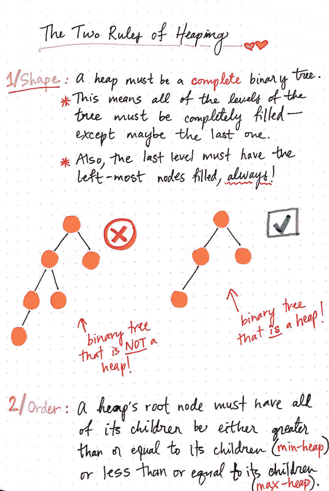
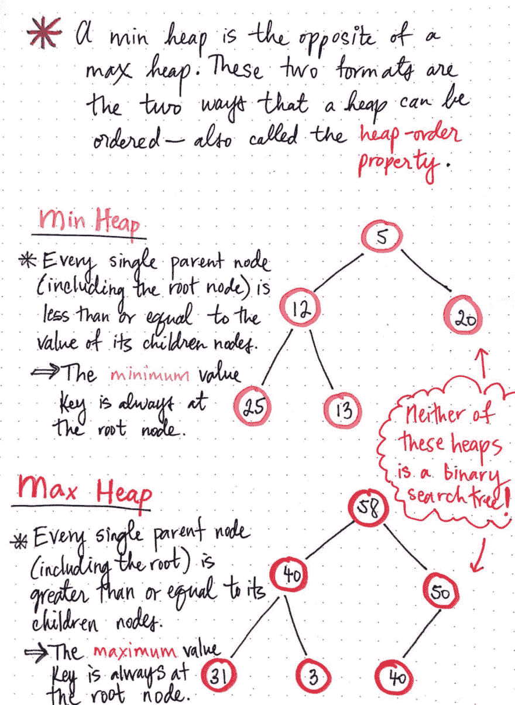
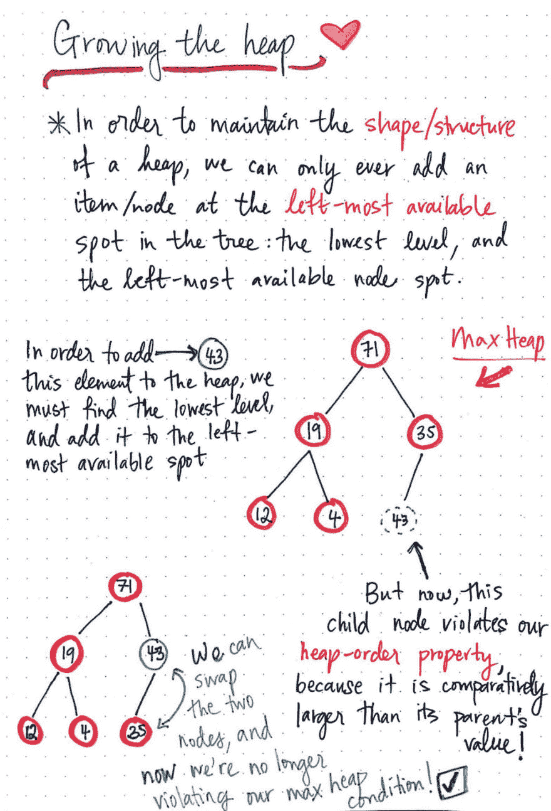
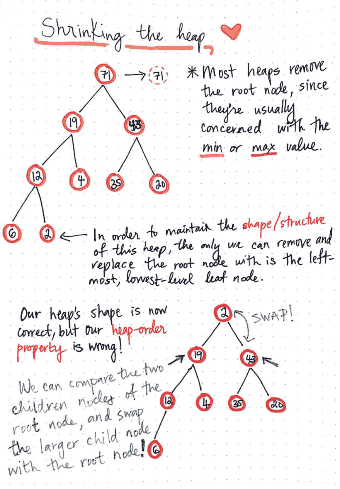
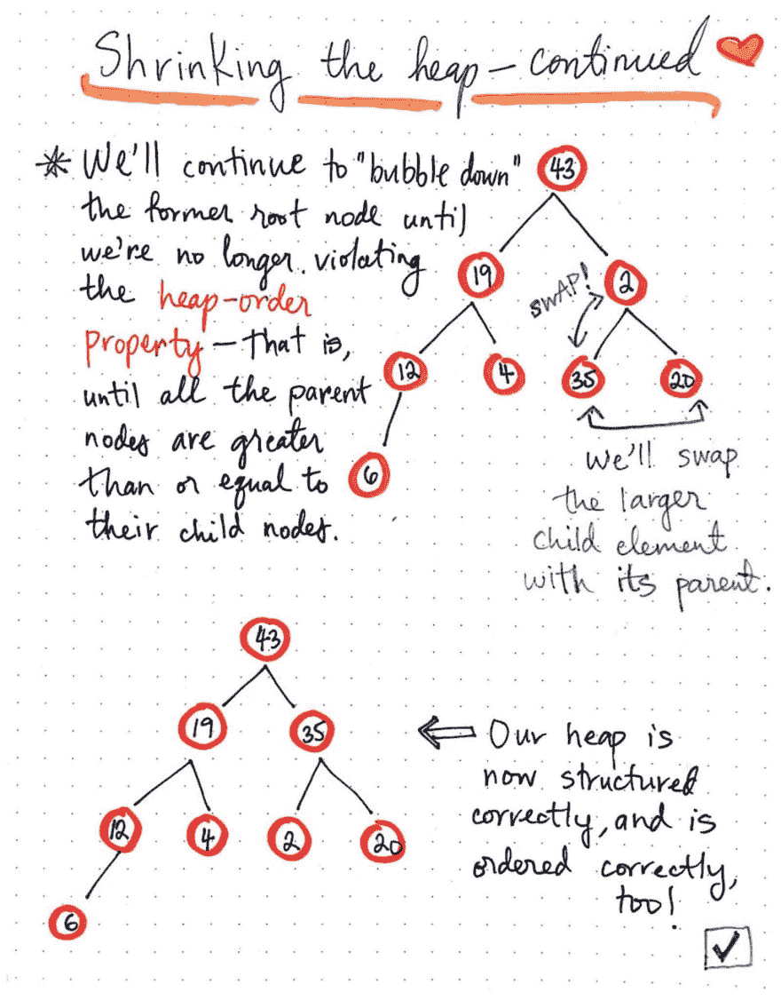
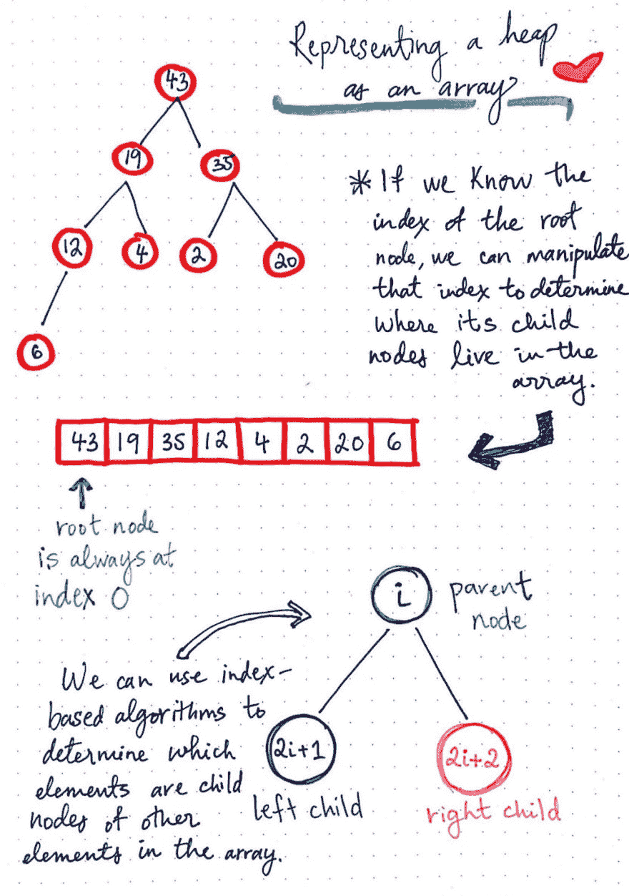
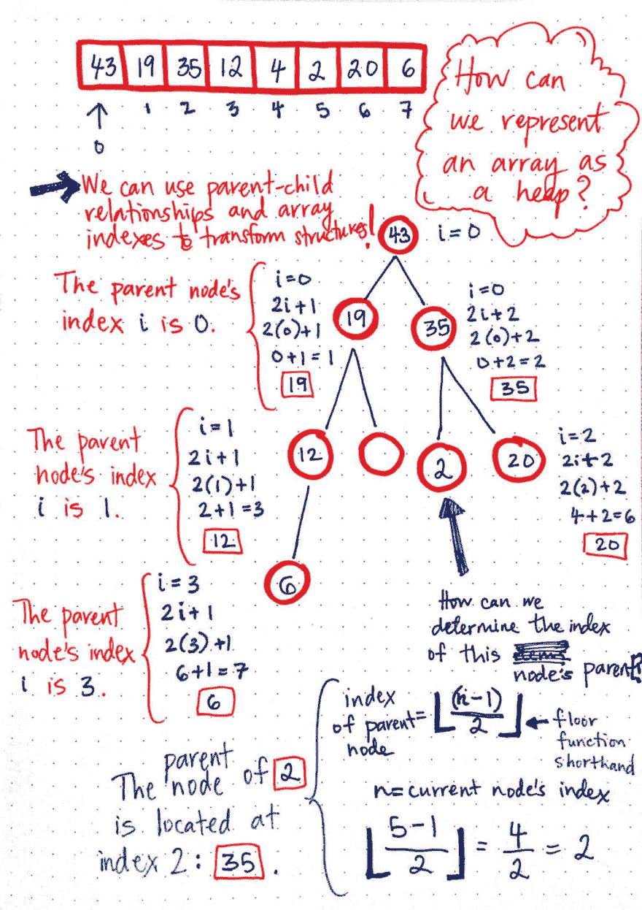
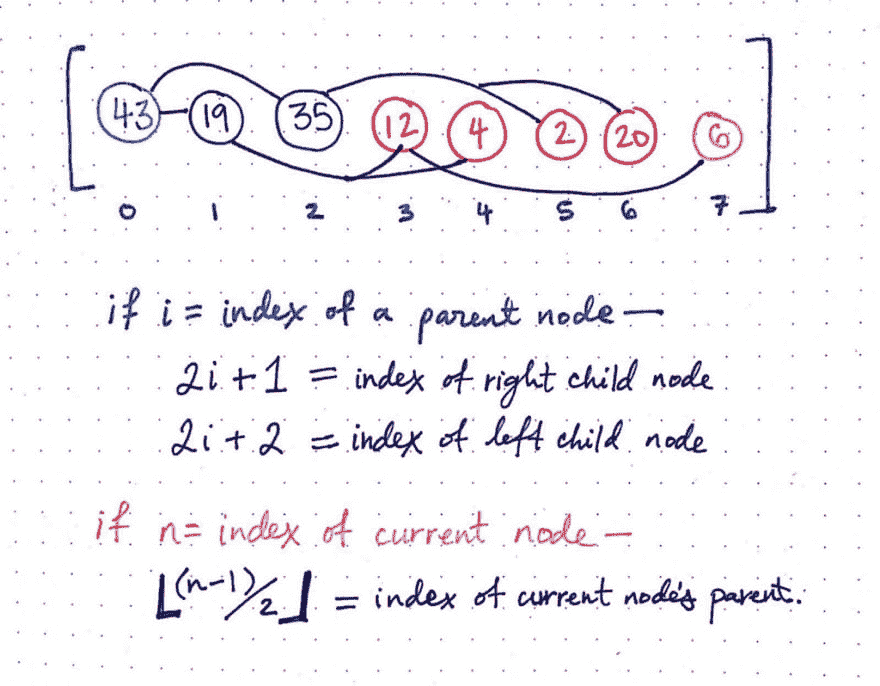
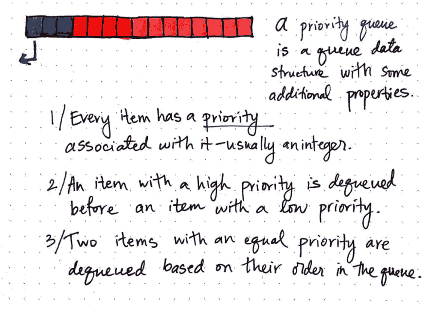
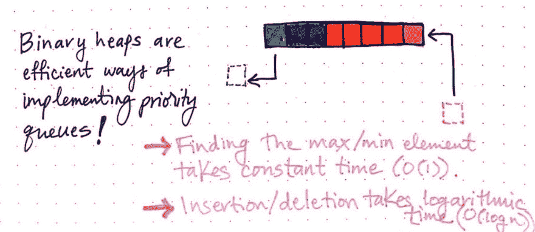

# 学会爱堆

> 原文:[https://dev.to/vaidehijoshi/learning-to-love-heaps](https://dev.to/vaidehijoshi/learning-to-love-heaps)

今天是这个系列的中间点——我们已经正式通过了 basecs 的前半部分！这当然是值得庆祝的。相信我，我和你一样惊讶，我们今年不仅一起讨论了这么多话题，而且你还在读这个系列，还没有无聊到发疯。

我们最近花了很多时间学习的一个概念是排序；特别是，我们已经深入研究了排序算法，以及对一组项目进行排序的许多不同方法。但是今天，我很高兴地告诉大家，我们*不会*在这篇文章中讨论排序(放心吧，松了一口气！).相反，我们将使用我最喜欢的新数据结构:一个 ***堆*** 。

事实证明，我们已经有了了解这种数据结构的工具——或者说，核心概念。我一直在等待分享堆的喜悦，直到现在，因为它们实际上与排序算法有很大关系。然而，它们有点复杂，所以在我们深入研究堆如何成为有效的排序方式之前，先了解一些排序算法会有所帮助。

等一等——我答应过你这个星期不整理的。所以，我们暂时先不说这个。相反，让我们坚持从基础开始。比如是堆什么连*？他们从哪里来的？谁会用它们呢？T2，我们应该使用它们吗？如果这些问题中的任何一个(或全部)突然出现在你的脑海中，不要害怕:你很快就会得到所有的答案。但是首先:我们必须学会爱！*

### 先规则后堆

我在前面提到过，在本系列中，我们已经讨论了足够多的重要核心概念，可以学习堆作为一种数据结构。我推迟探索堆的主要原因是，为了真正理解堆及其价值，我们需要熟悉一些不同的主题，包括[队列](https://dev.to/vaidehijoshi/to-queue-or-not-to-queue)、[树](https://dev.to/vaidehijoshi/how-to-not-be-stumped-by-trees)、[二分搜索法](https://dev.to/vaidehijoshi/leaf-it-up-to-binary-trees)和[大 O 符号](https://dev.to/vaidehijoshi/looking-for-the-logic-behind-logarithms)，仅举几例。(最终，堆也与[排序算法](https://dev.to/vaidehijoshi/sorting-out-the-basics-behind-sorting-algorithms)联系在一起！)

如果这看起来像是要知道很多事情，不要担心——我有好消息！如果您已经按顺序阅读了本系列，那么从一开始，您就已经准备好学习关于 heaps 的所有知识了！我经常说，计算机科学中的一切(以及软件，就此而言)都是由小抽象一个接一个地构建而成的。

> 堆是许多核心计算机科学概念一起工作以形成一个非常大的抽象的一个很好的例子，它是由我们已经熟悉的更小的部分组成的！

所以，让我们一点一点地建立起我们对堆的概念:就像积木一样！我们将从回答一些相当简单的问题开始:什么是堆？

<figure> 

<figcaption>堆:一个定义</figcaption>

</figure>

一个 ***堆*** 实际上只不过是一棵二叉树，它必须遵循一些额外的规则。这两个规则是定义堆结构区别于任何其他树结构的两个属性。

在本系列的前面，我们学习了[树](https://dev.to/vaidehijoshi/how-to-not-be-stumped-by-trees)，它总是有一个根节点，并且可以有许多子节点。我们还发现了奇怪的二叉树，它是树结构的子集，有自己的一套规则可以遵循。我们可以[回忆起二叉树的节点](https://dev.to/vaidehijoshi/leaf-it-up-to-binary-trees)只能有两个子节点:一个左子节点和一个右子节点。

堆基本上就是这些二叉树中的一个；它只是有更多的规则需要遵守！堆是最近由[约翰·威廉姆斯](https://en.wikipedia.org/wiki/J._W._J._Williams)在 1964 年发明的，当大多数人谈论堆时，他们指的是二进制堆，其形状完全像二叉树。堆实际上是具有更多规范和属性的二叉树。

那么，堆的两个属性是什么呢？嗯，这一切都归结为树的形状和节点的 T2 顺序。如果我们能记住这两个方面，我们将很容易从任何其他二叉树中识别出一个堆。

<figure> 

<figcaption>堆积的两个法则:形状+β顺序。</figcaption>

</figure>

先说**形**吧。二叉树要想有资格成为堆，必须是*完全*树；换句话说，树的每一层都必须完全填充，最后一层是唯一的例外。此外，树的最后一级必须总是首先填充最左边的节点。

另一种思考方式是，一个完整级别的节点必须都添加了子节点，才能拥有孙节点。

在这里显示的例子中，左边的树在根部有两个子节点；但是，左边的子节点有孙子，右边的子节点连子都没有！这使得树*不完整*，这意味着它不能被认为是堆。

相比之下，右边的树有一个包含两个子节点的根节点。我们可以看到，两个子节点都没有自己的子节点，只有左边的子节点有自己的一个子节点。但是，这仍然是一个堆，因为最后一级的节点是从左侧开始填充的。但是，如果不是左孩子，而是右孩子有一个节点，这将不再是堆，因为它将违反堆数据结构的形状顺序属性。

堆的**顺序**呢——规则是什么？

堆的顺序属性的基本规则是:堆的父节点(包括根节点)必须*大于或等于其子节点的值，*或*小于或等于其子节点的值。对于堆来说，这两种格式都是可以接受的，并且根据父子节点的顺序，我们可以根据它们的顺序对堆进行分类。*

 *<figure> 

<figcaption>最小堆 vs 最大堆</figcaption>

</figure>

最小堆是这样一种堆，其中每个父节点，包括根节点，都小于或等于其子节点的值。在此处显示的示例中，粉色堆是一个最小堆，因为父节点 5 和 12 小于或等于其子节点的值。最小堆的最重要的属性是具有最小的，或*最小值*的节点将总是根节点。

最大堆实际上是最小堆的逆堆；在这种格式中，每个父节点(包括根节点)都大于或等于其子节点的值。在这里展示的红色堆中，父节点是 58、40 和 50，它们的大小都大于或等于它们的子节点。最大堆的重要特征是具有最大值或*最大值*的节点总是在根节点。

这里有两件重要的事情需要注意，根据我们刚才看到的例子，我们可能已经注意到了。首先，我们总是可以在一个堆中有重复的值——对此没有限制。第二，堆不遵循二叉查找树的规则；与二分搜索法树不同，左边的节点*不是*一定要比右边的节点小！事实上，在上面显示的两棵树中，左边的节点通常比右边的大！子节点的顺序对于堆来说并不重要；唯一重要的排序是**堆顺序属性**，或者父节点相对于其子节点的排序。

### 增长和收缩一堆

现在我们知道了什么是堆*确切地说是*，我们终于可以开始探索如何使用它们了。让我们从弄清楚如何向我们的堆中添加东西开始，因为数据结构的全部意义在于能够向它添加东西！

当增加或减少一个堆时，要始终记住的关键事情是我们如何在这个过程中操纵或改变它的结构。

> 我们必须始终保持堆的形状和结构——否则，我们就违反了它的两个属性中的一个！

当增加一个堆时，我们只能在树的最左边添加一个节点；也就是说，在尽可能低的级别上，最左边的可用节点。

<figure> 

<figcaption>增长堆:添加一个 anβ元素。</figcaption>

</figure>

在下图中，我们有一个最大堆，根节点为 73，总共有五个节点。我们想在这个堆中添加一个元素:43。为此，我们必须找到最低层，并将该元素添加到最左侧的可用位置。

我们可以将其添加为节点 35 的左子节点。太好了！嗯，*差不多*。我们的堆遵循 shape 属性，但是现在我们违反了 order 属性，因为父节点 35 小于它的子节点 43。

我们如何解决这个问题，使我们既遵循形状规则*又遵循顺序规则*？

解决方案相当简单:我们可以交换两个顺序错误的节点！如果我们把子节点 43 换成父节点 35，我们就不再违反最大堆的排序规则了！现在，我们的堆结构正确，排序正确。不算太可怕吧？

好的，那么从堆中移除一个元素呢？记住:我们不能在这样做的时候打破我们的形状和顺序规则，所以我们需要在这里变得聪明一点。因为我们在增加堆的同时做了一些交换魔法，所以你可能已经有了一个想法，关于如何在减少堆的同时做这件事！

在下面的例子中，我们仍然像以前一样处理相同的 max heap 它增长了一点，现在我们总共有 9 个节点，包括根节点。当删除或移除元素时，大多数堆通常与移除根节点有关，因为根总是最大值元素或最小值元素，这取决于堆是最大堆还是最小堆。

<figure> 

<figcaption>收缩一个堆:移除一个元素</figcaption>

</figure>

因此，假设我们正在删除根节点 71，这是我们最大的值元素。

酷——我们可以毫无问题地移除它。除了…现在我们的树没有根节点，这意味着我们完全搞乱了堆的结构！我们需要移动一些东西，这样我们的堆看起来就像二叉树一样。

好的，我们知道我们不能随意移除节点，因为我们需要保持所有的关卡都填满。然而，我们*可以*在最低层移除最右边的节点。在这种情况下，节点值为 2；我们可以删除这个节点，并把它放在我们的根节点的位置，这样我们的树看起来仍然像一个堆。太好了！现在我们的堆的形状是正确的，但是顺序是完全错误的:2 肯定小于它的子节点，19 和 43。我们知道它在这个位置违反了我们的堆顺序属性。

所以，让我们再次尝试使用我们聪明的交换技巧！我们可以比较无序根节点的两个子节点。在这种情况下，这两个节点是 19 和 43。因为它们都比 2 大，我们可以取两个子节点中较大的一个，并与无序的根节点交换。因为 43 比 19 大，所以它是两个孩子中较大的一个；我们可以把它和 2 互换，现在 43 成为我们的根节点，2 成为它的子节点！

现在，虽然 2 不再是根节点，但它仍然是比它大的两个元素的父节点:35 和 20。所以，我们还没有完全完成这个节点！

<figure> 

<figcaption>缩小一堆，续:去掉一个元素</figcaption>

</figure>

好消息是，我们基本上可以继续做这种比较和交换的把戏，直到我们用来替换根节点的元素 node 2 位于一个可接受的位置。

> 正如我们在添加元素时将一个节点过滤到它在堆中的正确位置一样，当我们从堆中删除一个元素时，我们会将一个节点向下冒泡到适当的位置。

最终，我们“向下冒泡”一个节点，直到不再违反堆顺序属性，也就是说，直到所有父节点都大于或等于其子节点(对于最大堆)或小于或等于其子节点(对于最小堆)。这种交换方法允许我们轻松地维护堆的结构，因此我们只需要担心节点本身的排序。

### 在堆上排队堆

到目前为止，我们(希望)对堆的工作方式以及它们必须遵守的两条规则已经相当熟悉了。但是还有一些问题需要讨论:*我们如何*实现堆，以及*为什么*我们应该使用它们？事实证明，这两个问题的答案是交织在一起的。

> 说到堆，形式确实遵循功能。

让我们先回答*如何*，然后我们再来看*为什么*。

虽然完全有可能将堆实现为链表，就像我们在本系列前面的中实现树[的方式一样，但是有一种更有趣的方式来表示堆:*一个数组*。](https://dev.to/vaidehijoshi/how-to-not-be-stumped-by-trees)

我们可能已经注意到堆是部分排序的数据结构；它们有“排序”的成分，但也不像二叉查找树那样完全排序。然而，堆最重要的方面是最大值或最小值元素总是根节点*。*

<figure> 

<figcaption>表示一个堆为一个数组的结构</figcaption>

</figure>

因为我们总是可以相信这个事实是正确的，所以我们总是可以将堆的根节点表示为数组的第*个元素*。换句话说，根节点总是位于数组的索引 0 处。

非常有趣的是，如果我们知道根节点的索引，我们就可以操作这个索引来确定它的子节点在堆的同一个数组表示中的位置。

有一些有用的算法/公式可以帮助我们找出子元素的位置。例如，如果一个父节点的索引由数组中的索引 I 表示，那么它的左子节点将总是位于 2i + 1。类似地，如果一个父节点的索引由数组中的索引 I 表示，那么它的右子节点将总是位于 2i + 2。

让我们来看一个将堆转换成数组的例子，这些算法将会变得更加清晰明了。

<figure> 

<figcaption>将堆转化为数组</figcaption>

</figure>

在下图中，我们有一个包含八个节点的堆，包括根节点。我们可以使用父子关系和数组索引将这个数组转换成堆，反之亦然。

首先，我们知道我们的根节点 43 的索引是 0。如果我们知道 i = 0，那么我们可以用我们的左孩子和右孩子公式来确定前两个孩子的指数，19 和 35。如果我们用根节点的索引 0 代替 I，那么我们可以很快计算出节点 19 应该位于索引 1 处，因为(2°—0)+1 等于 1。

我已经说明了这对于每个子节点和孙节点是如何工作的。注意，随着我们在堆中向下移动每一级，父节点 I 的索引也相应地改变。

我们还可以通过从当前节点的索引 n 中减去 1，除以 2，并找到该数字的下限来确定节点父节点的索引。如果你以前从未见过楼层速记，不要担心——它的意思是[将一个小数向下舍入到最接近的整数](https://en.wikipedia.org/wiki/Floor_and_ceiling_functions)(即 2.9 将向下舍入到 2)。例如，我们可以通过找出(5–1)除以 2 的底来确定节点 2 的父节点的索引。这给了我们它的父节点 2 的索引，也就是节点 35。

<figure> 

<figcaption>确定数组</figcaption>

</figure>

中节点的索引

这两个公式有效地解释了如何构建和创建堆，以及确定哪些节点位于其对应的数组结构中的哪个索引处的逻辑！我们可以看到如何使用这些公式维护父子关系，即使堆是以数组格式表示的。

好了，现在我们知道了*如何*表示一个堆，当然，有待回答的问题是*为什么*我们需要将它们表示为数组！你猜怎么着？你已经知道答案了。是因为*排队*！

我们可能还记得[队列是遵循先入先出(FIFO)原则的数据结构](https://dev.to/vaidehijoshi/to-queue-or-not-to-queue)，它被用在很多地方:管理请求、作业、CPU 调度，这只是几个例子。堆经常被实现为数组，因为它们是表示 ***优先级队列*** 的超级有效的方式。

<figure> 

<figcaption>优先级队列是具有附加属性的队列数据结构。</figcaption>

</figure>

优先级队列是具有一些附加属性的队列数据结构。优先级队列中的每个 it 都有一个与之相关的“优先级”(通常是一个数值)。优先级高的项目在优先级低的项目之前出队。如果两个项目具有相同的优先级，它们将根据在队列中的顺序出队；换句话说，它们是根据它们在数组中的位置被移除的。

二进制堆对于实现优先级队列来说是非常高效的，因为知道并检索/删除具有最高优先级的元素非常容易:它将始终是根节点！

<figure> 

<figcaption>二进制堆是实现优先级队列的有效方式！</figcaption>

</figure>

我们反复提到的堆的一个具体特征就是*正是*使得堆成为优先级队列的首选数据结构！寻找最小值元素的最大值需要恒定的时间量，这使得将项目出队变得很有效率。类似地，由于它们的二叉树结构，添加或删除一个元素需要对数时间，因为我们在添加/删除一个元素时要遍历每一层，消除一半的可能节点。

当我们使用库来帮助我们处理作业调度、后台工作人员，甚至我们的机器用来处理内部任务的东西时，堆正是我们(无意中)与之交互的抽象概念！即使我们不知道这些宏伟的数据结构就在我们身边，这也是我们热爱它们的充分理由。

### 资源

很多教程视频和技术面试准备文章有时会忽略堆数据结构。然而，它们确实值得学习，因为它们往往出现在计算机科学课程中，并用于 CPU 调度等基础工作。如果您想更深入地研究优先级队列和堆，我建议您从大量的资源中进行选择！

1.  [堆和优先级队列](https://www.hackerearth.com/practice/notes/heaps-and-priority-queues/)，黑客地球
2.  [介绍一堆](https://www.youtube.com/watch?v=c1TpLRyQJ4w)，保罗编程
3.  二进制堆，维克多·亚当奇克教授
4.  [优先队列(堆)](http://www.eecs.wsu.edu/~ananth/CptS223/Lectures/heaps.pdf)，Ananth Kalyanaraman 教授
5.  [优先队列](http://pages.cs.wisc.edu/~vernon/cs367/notes/11.PRIORITY-Q.html)，玛丽·k·弗农教授
6.  [优先级队列](http://www.geeksforgeeks.org/priority-queue-set-1-introduction/)，GeeksforGeeks

* * *

*本帖最初发表于[medium.com](https://medium.com/basecs/learning-to-love-heaps-cef2b273a238)T3】**