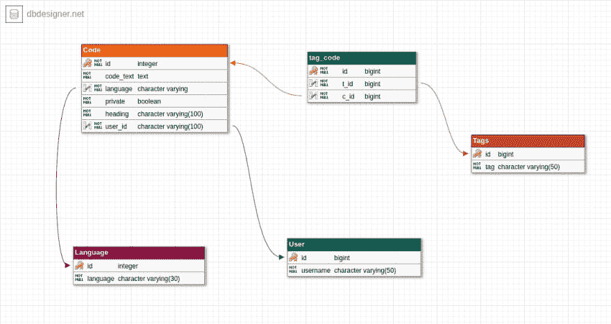

# 建模时间到了

> 原文：<https://dev.to/sroy8091/its-modeling-time>

完成所有设置后，我们进入了数据建模阶段，我必须定义我将在 web 应用程序中使用的数据的模式。

## 特性

*   使用代码镜像粘贴代码
*   将片段设为私有
*   添加带有随机片段选项的搜索页面

即将推出的功能包括主演某人的代码片段，并添加该片段的查看次数计数。

这许多特性将要求我添加几个表:-

*   存储用户数据的一个表
*   一个用于标记
*   最后一个是代码

## 建模

你必须遵守的一个基本规则是-

> 不要把相同的字符串数据放两次。用关系代替。

这意味着如果您使用名为“cities_info”的表

| 身份证明（identification） | 城市 | 状态 |
| --- | --- | --- |
| one | 金奈 | 泰米尔纳德邦 |
| Two | 坎奇普拉姆 | 泰米尔纳德邦 |
| three | 加尔各答 | 西孟加拉邦 |

这里“泰米尔纳德邦”出现了两次，这对我们的数据库不利。因此，应该有另一个表来存储所有的状态

| 身份证明（identification） | 州 |
| --- | --- |
| one | 泰米尔纳德邦 |
| Two | 西孟加拉邦 |
| three | 古杰拉特 |

然后在表‘cities _ info’中添加一个外键，而不是 State 列。因此，结果表“cities_info”将是

| 身份证明（identification） | 城市 | 状态标识 |
| --- | --- | --- |
| one | 金奈 | one |
| Two | 坎奇普拉姆 | one |
| three | 加尔各答 | Two |

在这里，整数是重复的，但这不是问题。问题在于重复的字符串。

在我的例子中，表和它们的关系如下

[T2】](https://res.cloudinary.com/practicaldev/image/fetch/s--A5hEKPVD--/c_limit%2Cf_auto%2Cfl_progressive%2Cq_auto%2Cw_880/https://thepracticaldev.s3.amazonaws.com/i/npk4szuxdvcs8hx82vyc.png)

我是用 [dbdesigner 工具](http://dbdesigner.net/)设计的。也可以通过任何其他方式完成，例如[小马奥姆](https://ponyorm.com/)。

这些表满足了我的 web 应用程序的所有功能，比如在代码表中存储代码片段，在语言表中存储语言，在标记表中存储标记。

一个有趣的表是 tag_code，它是我前面讨论的基本规则的完美例子。

下一篇文章，将会是关于 hasura 数据 API 和 postman 集合来查询它们。

*这里是关于这一系列 snipcode 开发的所有帖子的索引*

[第一部分:App Idea](https://dev.to/sroy8091/app-idea-for-hasura-internship)
[第二部分:App 原型](https://dev.to/sroy8091/app-prototype)
[第三部分:本地开发](https://dev.to/sroy8091/hasura-local-development)
[第四部分:G for Git](https://dev.to/sroy8091/g-for-git)
[第五部分:数据建模](https://dev.to/sroy8091/its-modeling-time)
[第六部分:Data&Auth API](https://dev.to/sroy8091/postman-a-major-tool-for-developers)
[第七部分:基本功能](https://dev.to/sroy8091/i-love-cookies-expressjscookies)
[第八部分:App 屏幕 1](https://dev.to/sroy8091/i-built-it-with-codemirror)
[第九部分](https://dev.to/sroy8091/app-screen-2)