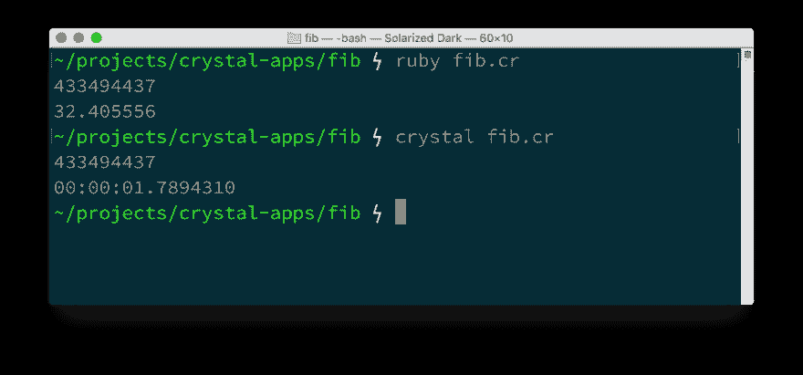

# 使用 Crystal 和 Twilio 发送短信

> 原文：<https://dev.to/twilio/send-sms-messages-with-crystal-and-twilio>

Crystal 是一门年轻的编程语言，有着巨大的潜力，在过去的几周里，使用它是一件非常有趣的事情。我想和你分享使用 Crystal 用 Twilio 向[发送短信](https://www.twilio.com/docs/api/rest/sending-messages)是多么容易。

水晶项目始于 2012 年 9 月，目前仍在强劲发展。这种语言还没有达到版本 1，但是它有很多令人兴奋的地方。这种语言的目标在 Crystal 网站的前面和中心列出，但简单来说，它是一种类型推断的编译语言，具有类似 Ruby 的语法，速度惊人。首先，我们来看一个简单的水晶程序:

```
def fib(n)
  if n <= 1
    1
  else
    fib(n - 1)   fib(n - 2)
  end
end

time = Time.now
puts fib(42)
puts Time.now - time 
```

Enter fullscreen mode Exit fullscreen mode

如果你以前使用过 Ruby，那么这将立即被识别为计算第 n 个斐波那契数的函数。它非常容易识别，如果你用 Ruby 运行它，程序会正确运行。当然，您也可以使用 Crystal 运行它。

[T2】](https://res.cloudinary.com/practicaldev/image/fetch/s--HiBRooK6--/c_limit%2Cf_auto%2Cfl_progressive%2Cq_auto%2Cw_880/https://twilioinc.wpengine.com/wp-content/uploads/2016/11/SuNpEnzR8dABrzGkPDJ8ovwrd1OJoLg6XlS65qo27hlcCFR1CN89T4Ge6-8TRt3G6hDjvhQGOARjz5G5S-qe1K22vvFagyfIPL6hSzyJhsHFmoCQW-YovaTDlOg9Es2ZJmN38mI.png)

很神奇，对吧？在这个测试中，Crystal 比 Ruby 快几个数量级。当然，斐波那契数列是一个糟糕的基准，[这也不是一个公平的测试](https://crystal-lang.org/2016/07/15/fibonacci-benchmark.html)，但看到相似之处很有趣。然而，当你开始钻研 Crystal 时，这种语言和 Ruby 之间的差异就开始显现出来了。

现在让我们这样做，并使用 Crystal 对 Twilio API 进行一些调用。

## 水晶入门

要使用 Crystal，首先需要安装编译器。对于 Linux，遵循 Crystal 文档中的[安装说明。如果你在苹果电脑上，你可以用](https://crystal-lang.org/docs/installation/index.html)[自制软件](http://brew.sh/)安装 Crystal，如下:

```
$ brew update
$ brew install crystal-lang 
```

Enter fullscreen mode Exit fullscreen mode

遗憾的是，Crystal 目前不能在 Windows 操作系统上编译。

您可以通过运行:
来检查 Crystal 是否安装成功

```
$ crystal --version
Crystal 0.19.4 (2016-10-21) 
```

Enter fullscreen mode Exit fullscreen mode

下一部分我们需要一个 Twilio 账户，所以如果你还没有账户，[在这里免费注册](https://www.twilio.com/try-twilio)。我们还需要一个可以发送短信的 [Twilio 号码](https://www.twilio.com/console/phone-numbers/incoming)。

是时候用 Crystal 进行一些 API 调用了！

## 用水晶发送短信

通常当我写关于发送短信的时候，我会把你指向我们的官方助手库。由于 Crystal 仍然相对较新，还没有这样的库，所以我们必须卷起袖子研究 HTTP 模块。

创建一个名为`sms.cr` :
的新水晶文件

```
$ touch sms.cr 
```

Enter fullscreen mode Exit fullscreen mode

打开文件，从要求标准库中的 [`http/client`类](https://crystal-lang.org/api/0.19.4/HTTP/Client.html)开始。使用 Ruby 熟悉的`def`语法启动发送 SMS 消息的新功能。我们需要三个论据。接收消息的号码、我们发送的号码和消息正文。

```
require "http/client"
def send_sms(to, from, body)

end 
```

Enter fullscreen mode Exit fullscreen mode

### 设置 HTTP 客户端

使用 API 的基本 URL、端口号以及应用程序是否使用 TLS 来初始化一个`HTTP::Client`。然后，我们可以将一个块传递给这个初始化器，一旦完成，客户端将被关闭。

```
require "http/client"
def send_sms(to, from, body)
  HTTP::Client.new("api.twilio.com", 443, true) do |client|

  end
end 
```

Enter fullscreen mode Exit fullscreen mode

现在我们有了客户机，我们需要使用 Twilio 帐户 SID 和 Auth Token 作为用户名和密码来添加身份验证头。我将我的凭证保存为环境变量，这样我就不会意外地公开共享它们。您可以使用`export`命令在命令行上设置环境变量。

```
$ export TWILIO_ACCOUNT_SID=AC123456789abcdef
$ export TWILIO_AUTH_TOKEN=1q2w3e4r5t6y7u8i9op0 
```

Enter fullscreen mode Exit fullscreen mode

在`HTTP::Client`实例上使用`basic_auth`方法对客户端进行身份验证。

```
require "http/client"
def send_sms(to, from, body)
  HTTP::Client.new("api.twilio.com", 443, true) do |client|
    client.basic_auth(ENV["TWILIO_ACCOUNT_SID"], ENV["TWILIO_AUTH_TOKEN"])
  end
end 
```

Enter fullscreen mode Exit fullscreen mode

### 发出 HTTP 请求

现在我们可以提出要求了。为了向[发送 SMS 消息，我们需要向消息资源](https://www.twilio.com/docs/api/rest/sending-messages)发出 POST 请求。我们使用帐户 SID 构建 URL。我们需要将消息的属性作为`application/x-www-form-urlencoded`参数发送，我们可以使用 Crystal 的内置`post_form`方法来实现这个目的:

```
require "http/client"
def send_sms(to, from, body)
  HTTP::Client.new("api.twilio.com", 443, true) do |client|
    client.basic_auth(ENV["TWILIO_ACCOUNT_SID"], ENV["TWILIO_AUTH_TOKEN"])
    response = client.post_form("/2010-04-01/Accounts/#{ENV["TWILIO_ACCOUNT_SID"]}/Messages.json", {
      "To"   => to,
      "From" => from,
      "Body" => body,
    })
  end
end 
```

Enter fullscreen mode Exit fullscreen mode

我们现在可以调用这个函数，从 Crystal 发送我们的第一条 SMS 消息。但是我们只有在收到信息后才能知道它是否成功。让我们再做一点工作来检查 API 调用是否成功，如果成功，打印出消息 SID，否则打印出错误消息。

### 处理响应

包括标准库中的 JSON 模块，并解析响应体。如果成功，我们可以寻找 SID，否则[错误响应](https://www.twilio.com/docs/api/rest/response#response-formats-exceptions)将有一个消息字段告诉我们哪里出错了。

```
require "http/client"
require "json"
def send_sms(to, from, body)
  HTTP::Client.new("api.twilio.com", 443, true) do |client|
    client.basic_auth(ENV["TWILIO_ACCOUNT_SID"], ENV["TWILIO_AUTH_TOKEN"])
    response = client.post_form("/2010-04-01/Accounts/#{ENV["TWILIO_ACCOUNT_SID"]}/Messages.json", {
      "To"   => to,
      "From" => from,
      "Body" => body,
    })
    result = JSON.parse(response.body)
    if response.success?
      puts result["sid"]
    else
      puts result["message"]
    end
  end
end 
```

Enter fullscreen mode Exit fullscreen mode

现在给`sms.cr`添加最后一行代码，在`to`位置使用您自己的电话号码，在`from`位置使用 Twilio 号码和您的 SMS 消息来调用该方法。

```
# sms.cr
def send_sms(to, from, body)
  # function code
end

send_sms(ENV["MY_NUMBER"], ENV["MY_TWILIO_NUMBER"], "Hello from Crystal!") 
```

Enter fullscreen mode Exit fullscreen mode

### 编译运行

编译并运行该函数，庆祝您从 Crystal 发送的第一条短信！

```
$ crystal sms.cr
SMadca071a5bab4848892d9f24863e99e6 
```

Enter fullscreen mode Exit fullscreen mode

crystal 命令编译并运行您传递给它的文件。您还可以使用`build`命令构建一个完全优化的可执行文件，为生产做好准备。

```
$ crystal build sms.cr --release
$ ./sms
SMadca071a5bab4848892d9f24863e99e6 
```

Enter fullscreen mode Exit fullscreen mode

我们已经发送了第一条消息，但在完成本章之前，还有更多内容需要了解。使用`JSON.parse`方法进行 JSON 解析是没问题的，但是您会记得我在本文开始时将 Crystal 描述为类型推断的。在类型化语言中解析 JSON 这样的任意数据结构可能会很困难，需要在使用属性之前将其转换为预期的类型。碰巧的是，使用`JSON.parse`解析的每个属性的类型是 [`JSON::Any`](https://crystal-lang.org/api/0.19.4/JSON/Any.html) ，当我们用对象调用`puts`时，它被转换成一个带有`to_s`的字符串。

### 改进了 JSON 解析

代替使用这个`JSON::Any`类型，我们实际上可以用一个 [JSON 映射](https://crystal-lang.org/api/0.19.4/JSON.html#mapping-macro)告诉 Crystal 的 JSON 解析器寻找什么。根据文档的[，这将具有“简单、类型安全和高效”的效果。](https://crystal-lang.org/api/0.19.4/JSON.html)

再次打开`sms.cr`,为我们的消息和错误对象添加简单的映射。

```
# sms.cr
class Message
  JSON.mapping(
    sid: String,
    body: String
  )
end

class Error
  JSON.mapping(
    message: String,
    status: Int32
  )
end 
```

Enter fullscreen mode Exit fullscreen mode

这些对象中的每一个都有更多可用的字段，但是我们现在只对这些感兴趣。现在，我们可以为每个`Message`和`Error`类使用`from_json`构造函数，而不是使用`JSON.parse`。映射为我们定义的字段创建了实例变量、getters 和 setters，因此我们可以使用点符号来访问它们。

```
def send_message(to, from, body)
  client = HTTP::Client.new("api.twilio.com", 443, true) do |client|
    client.basic_auth(ENV["TWILIO_ACCOUNT_SID"], ENV["TWILIO_AUTH_TOKEN"])
    response = client.post_form("/2010-04-01/Accounts/#{ENV["TWILIO_ACCOUNT_SID"]}/Messages.json", {
      "To"   => to,
      "From" => from,
      "Body" => body,
    })
    if response.success?
      message = Message.from_json(response.body)
      puts message.sid, message.body
    else
      error = Error.from_json(response.body)
      puts error.status, error.message
    end
  end
end 
```

Enter fullscreen mode Exit fullscreen mode

如果您再次使用`crystal sms.cr`运行该文件，您将会收到您的消息，并且知道您的`Message`对象现在已经被正确地键入，并且从 JSON 响应中被有效地解析，这是安全的。

### 水晶挺酷的

在我早期对 Crystal 的探索中，我发现像 Ruby 一样写东西是一件令人愉快的事情，还增加了类型安全性和速度。在这篇文章中，我们看到了使用 Crystal 对 Twilio API 发出 HTTP 请求和[发送 SMS 消息](https://www.twilio.com/docs/api/rest/sending-messages#post)是多么容易。如果你想看完整的代码，可以在 [GitHub](https://github.com/philnash/crystal-experiments) 上查看这个库。

如果你喜欢水晶的外观，你可以在[官方网站](https://crystal-lang.org/)和查看[文档](https://crystal-lang.org/api/0.19.4/)了解更多。在 [awesome-crystal](https://github.com/veelenga/awesome-crystal) repo 上列出了一堆有趣的项目，如果你像我一样来自 Ruby，可以通读一下 Ruby 爱好者的书。

你觉得克里斯托怎么样？对你来说它看起来像一种有前途的语言吗？请在下面的评论中告诉我你的想法，或者给我发一封电子邮件或者在 T2 的推特上留言。

* * *

*[与 Crystal 和 Twilio 发短信](https://www.twilio.com/blog/2016/11/send-sms-messages-crystal.html)原载于 [Twilio 博客](https://www.twilio.com/blog)2016 年 11 月 3 日。*