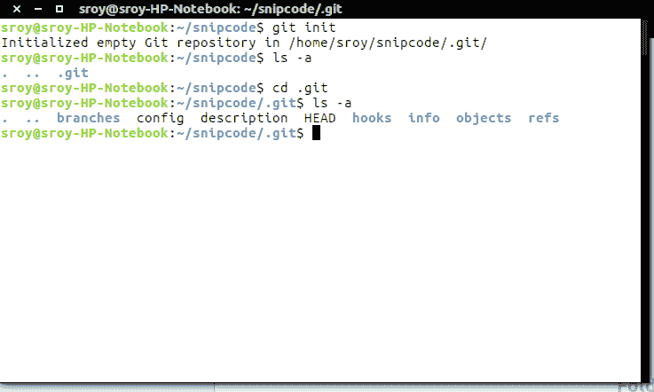
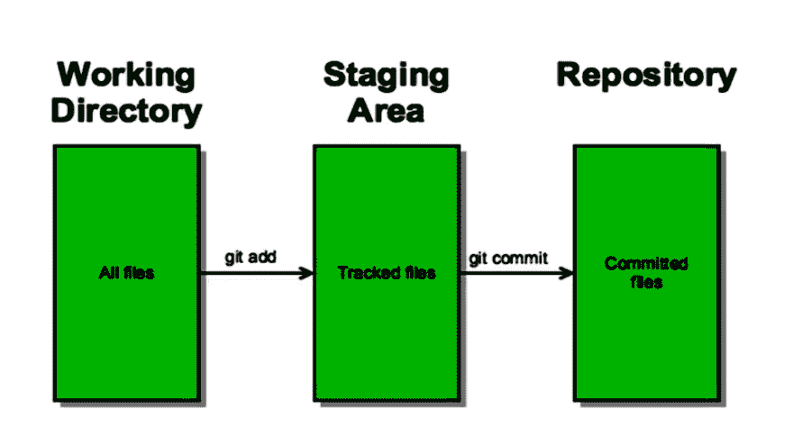
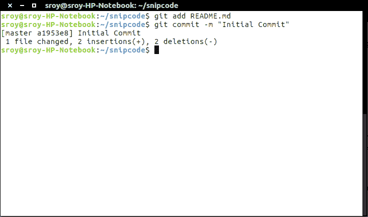
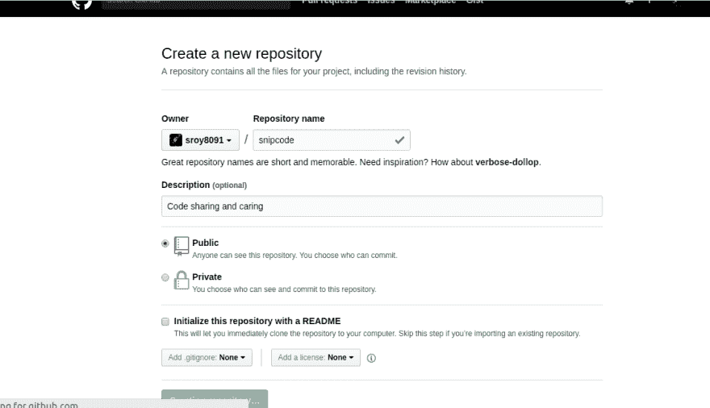
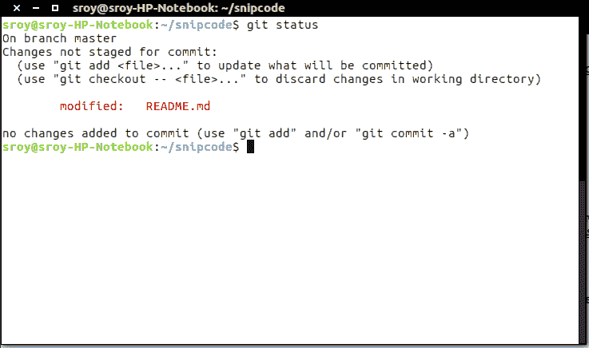
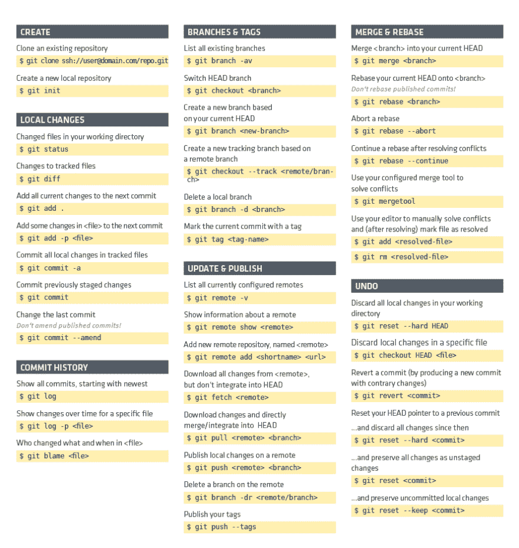

# g 代表 Git

> 原文:[https://dev.to/sroy8091/g-for-git](https://dev.to/sroy8091/g-for-git)

## 什么是 git？

Git 是一个分布式版本控制系统，帮助开发者进行全球协作。

## 为什么我们需要这样的版本控制系统？

我们需要版本控制系统，原因如下

*   它保留了开发人员所做更改的历史。
*   我们知道谁做了什么改变。
*   它合并冲突的更改(例如两个人同时修改了一个文件，那么它将合并两个更改)。

## 让你的项目流畅的工作流程

Github 中有 3 个工作流程，即

*   集中式工作流程

    > 它通常用于小型团队，其中每个人都在中央存储库中的单个分支上工作

*   特征分支工作流

    > 在专用分支中开发的功能，然后使用 pull request 与主代码库合并。在这里，主要的代码库保持干净和正常工作

*   工作流程

    > 每个开发人员从主 repo 派生出来，进行更改并发送拉请求。在这里，每个开发商将有自己的在线回购项目

由于这是一个小项目，现在我将从集中工作流程开始。

## 理论够多了让我们来做点实际的

由于 hasura 在其平台中提供了 git 集成，我将使用 GitHub 作为我的代码库。所以让我们初始化我们的代码库。关于在你的电脑上安装 git 的说明，请点击[链接](https://git-scm.com/book/en/v2/Getting-Started-Installing-Git)。首先，我必须创建一个文件夹并键入命令

`git init`

这将初始化我的代码库，并跟踪我的变化。你会看到一个隐藏的文件夹被创建在我的文件夹里，名字叫做**。git** 。它包含版本控制所需的所有文件。

[T2】](https://res.cloudinary.com/practicaldev/image/fetch/s--q-zFHXvE--/c_limit%2Cf_auto%2Cfl_progressive%2Cq_auto%2Cw_880/https://thepracticaldev.s3.amazonaws.com/i/gmv5tsol49qhnxkjf5q6.png)

在添加了 readme 文件以提交 snip 代码中的以下更改后，我们必须将它添加到暂存区，然后提交。

[T2】](https://res.cloudinary.com/practicaldev/image/fetch/s--pgha1yYh--/c_limit%2Cf_auto%2Cfl_progressive%2Cq_auto%2Cw_880/https://thepracticaldev.s3.amazonaws.com/i/k9xeci60zygpagirwi4a.png)

`git add README.md`
T1】

[T2】](https://res.cloudinary.com/practicaldev/image/fetch/s--XRMPu5Yq--/c_limit%2Cf_auto%2Cfl_progressive%2Cq_auto%2Cw_880/https://thepracticaldev.s3.amazonaws.com/i/47ksqza3o99h5drq51kx.png)

git commit 有一个向提交添加消息的选项。

现在这些都发生在我所在的地方环境里。为了在 GitHub 中推送我的代码库，我必须创建一个名为 snipcode 的 repo。

[T2】](https://res.cloudinary.com/practicaldev/image/fetch/s--5ETaZ-lV--/c_limit%2Cf_auto%2Cfl_progressive%2Cq_auto%2Cw_880/https://thepracticaldev.s3.amazonaws.com/i/vgry0lysq9phkkuec9qn.png)

在这之后，我将用名称 origin 将远程添加到我的本地 repo 中(一般约定)。

`git remote add origin https://github.com/sroy8091/snipcode.git`

最后，我将使用主分支中的 push 命令将本地回购推送到 GitHub

`git push origin master`

[T2】](https://res.cloudinary.com/practicaldev/image/fetch/s--QalIrPCQ--/c_limit%2Cf_auto%2Cfl_progressive%2Cq_auto%2Cw_880/https://thepracticaldev.s3.amazonaws.com/i/5pjpu4qd2vro7p39m4fz.png)

其中一个有用的命令是 ***git 状态*** 。我们应该经常用这个来了解工作树的状态。我的项目状态的一个快照是

[T2】](https://res.cloudinary.com/practicaldev/image/fetch/s--_UanwKzS--/c_limit%2Cf_auto%2Cfl_progressive%2Cq_auto%2Cw_880/https://thepracticaldev.s3.amazonaws.com/i/w9y8p0aitupptgde6brm.png)

这里是塔提供的 git 的备忘单。

[T2】](https://res.cloudinary.com/practicaldev/image/fetch/s--BITCHkLW--/c_limit%2Cf_auto%2Cfl_progressive%2Cq_auto%2Cw_880/https://thepracticaldev.s3.amazonaws.com/i/4wd1073qq4gk3nf4luvz.png)

*这里是关于这一系列 snipcode 开发的所有帖子的索引*

[第一部分:App Idea](https://dev.to/sroy8091/app-idea-for-hasura-internship)
[第二部分:App 原型](https://dev.to/sroy8091/app-prototype)
[第三部分:本地开发](https://dev.to/sroy8091/hasura-local-development)
[第四部分:G for Git](https://dev.to/sroy8091/g-for-git)
[第五部分:数据建模](https://dev.to/sroy8091/its-modeling-time)
[第六部分:Data&Auth API](https://dev.to/sroy8091/postman-a-major-tool-for-developers)
[第七部分:基本功能](https://dev.to/sroy8091/i-love-cookies-expressjscookies)
[第八部分:App 屏幕 1](https://dev.to/sroy8091/i-built-it-with-codemirror)
[第九部分](https://dev.to/sroy8091/app-screen-2)

| 喜欢我的帖子吗？ |
| --- |
| [T2】](https://ko-fi.com/A0A5WBC1) |