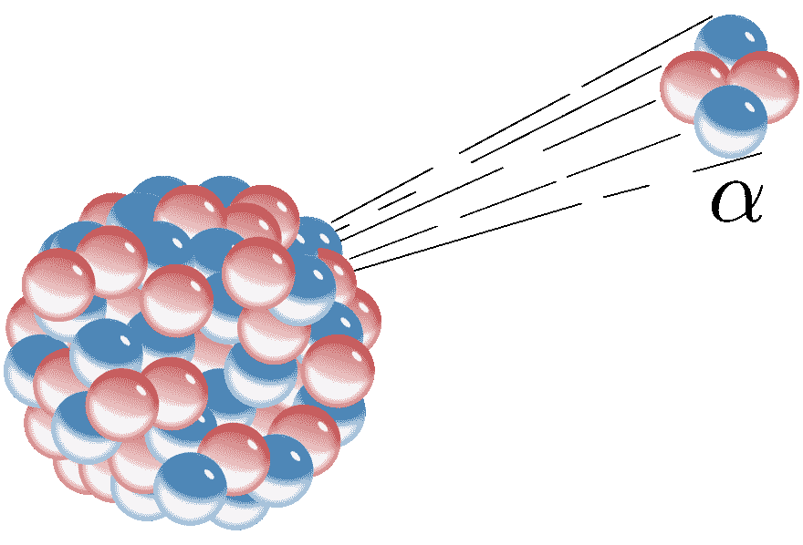
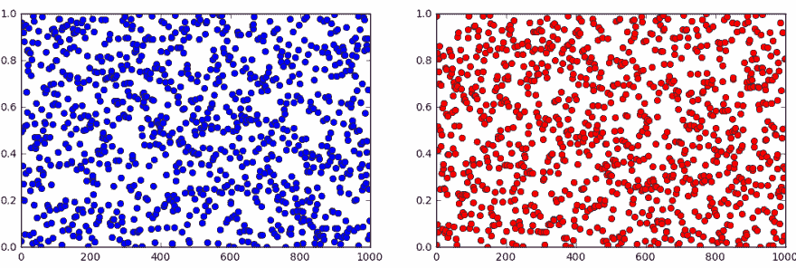
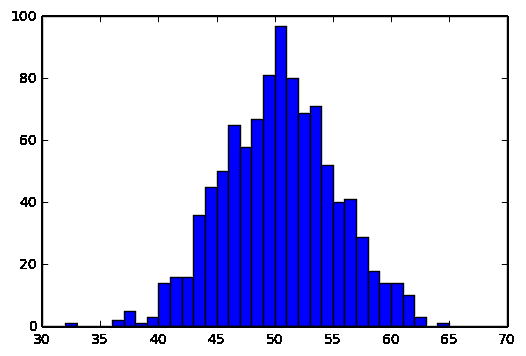

# Python 中的伪随机数:从算术到概率分布

> 原文:[https://dev . to/walker/pseudo-random-numbers-in-python-from-算术-概率分布](https://dev.to/walker/pseudo-random-numbers-in-python-from-arithmetic-to-probability-distributions)

在我们的日常生活中，随机性是我们往往认为理所当然的东西。“那太随机了！”我们会说，当有人做了不正常或意想不到的事情时，即使有[证据表明人类无法有意识地实现随机性](https://www.ncbi.nlm.nih.gov/pubmed/17888582)。对于真正的随机过程，我们求助于自然:细菌的生长、放射性衰变的时间以及电流产生的热噪声都声称是真正的随机序列。

然而，每当我们需要使用真正的随机性时，并不总是有一些钚-239 存在，所以计算机科学家开发了称为伪随机数发生器(PRNGs)的近似方法。今天，这些算法在软件开发中无处不在。[正如维基百科所指出的](https://en.wikipedia.org/wiki/Pseudorandom_number_generator)，“伪随机数发生器在模拟(如蒙特卡罗方法)、电子游戏(如程序生成)和密码学等应用中至关重要。”

[T2】](https://res.cloudinary.com/practicaldev/image/fetch/s--a5PO0hoH--/c_limit%2Cf_auto%2Cfl_progressive%2Cq_auto%2Cw_880/https://upload.wikimedia.org/wikipedia/commons/thumb/7/79/Alpha_Decay.svg/2000px-Alpha_Decay.svg.png)

<center>*Radioactive decay is considered a truly random process.*</center>

今天我将介绍一种相对简单的 PRNG，叫做线性同余发生器(LCG)。在现代实现中，大多数随机数依赖于更复杂的 PRNGs，但是 LCG 为我们提供了一个坚实的基础，并且对于我们适度的意图来说将是足够随机的。

作为先决条件，您应该熟悉模运算，它本质上是将数字表示为除以“模数”后的余数换句话说，数字可以增加，直到它们达到一个设定的模数并开始循环:5 模 3 等于 2，25 模 2 等于 1。大多数时钟是以 12 为模的系统。

对于 LCG，我们需要一个模数， *m* ，一个初始值(或“种子”)，X <sub>0</sub> ，一个乘数， *a* ，以及一个增量， *c* 。从那里，要从一个数 X <sub>n</sub> 到下一个数 X <sub>n+1</sub> ，只需执行以下算法:

<center>**X<sub>n+1</sub> = (aX<sub>n</sub> + c) mod m**</center>

让我们用 Python 把它写成一个函数，然后分配一些简单的值:模数 10，乘数 3，增量 1，种子值 5。

```
def lcg(n, m, a, c, seed):
    sequence = []
    Xn = seed
    for i in range(n):
        Xn = (a*Xn + c) % m
        sequence.append(Xn)
    return(sequence)

lcg(10, 10, 3, 1, 5)
# => [6, 9, 8, 5, 6, 9, 8, 5, 6, 9] 
```

<svg width="20px" height="20px" viewBox="0 0 24 24" class="highlight-action crayons-icon highlight-action--fullscreen-on"><title>Enter fullscreen mode</title></svg> <svg width="20px" height="20px" viewBox="0 0 24 24" class="highlight-action crayons-icon highlight-action--fullscreen-off"><title>Exit fullscreen mode</title></svg>

如您所见，我们要求十个随机数，并得到了序列`[6, 9, 8, 5, 6, 9, 8, 5, 6, 9]`。虽然这符合 LCG 的要求，但这是一个真正可怕的 PRNG。首先，在模 10 中，一个数只有 10 个可能的值，此外，在我们的情况下，还有一个牢不可破的 6-9-8-5 循环，这进一步将我们的状态空间减少到只有 4 个数。

我们需要的是一个更大的模数，并保证每一个可能的数字都将由任何输入的种子值产生一次，也就是所谓的“完整周期”进入高等数论。根据赫尔和多贝尔定理，一个 LCG 将有完整的周期，如果:

1.  *c* 和 *m* 互质(即除 *c* 和 *m* 的唯一正整数是 1)。

2.  如果 *q* 是除 *m* 的任意素数，那么 *q* 也除*a–1*。

3.  如果 4 除了 *m* ，那么 4 也除了*a–1*。

你可以在这里阅读证明这个定理的[原文 1962 年的论文。我们不去想出一些有效的数字，而是去偷一些语言中实际用于随机数生成的数字，包括 C++: *m* = 2 <sup>32</sup> ， *a* = 22695477， *c* = 1。](http://chagall.med.cornell.edu/BioinfoCourse/PDFs/Lecture4/random_number_generator.pdf)

但在尝试这些新的输入之前，我们需要解决 LCG 的确定性:插入相同的种子，你会得到相同的输出，这在某种程度上使我们声称的任何随机性失效。一般来说，这是 PRNGs 的一个基本缺陷。

然而，它们的可预测性有一个好处——即通过设定和共享种子，人们可以创造出可重复的结果，这在科学中至关重要——以及一些绕过它的方法。通过将种子与看不见的、不断变化的东西联系起来，比如当前每秒过去的微秒数，我们可以重新引入一些人为的随机性。因此，除了我们的新输入，我们将使用内置的 Python `datetime`库作为种子:

```
from datetime import datetime
lcg(10, 2**32, 11695477, 1, datetime.now().microsecond)
# => [1090430687, 498347756, 2363706845, 1780651778, 1345777131,
#        826090344, 275756681, 2092763550, 396794679,3763540772] 
```

<svg width="20px" height="20px" viewBox="0 0 24 24" class="highlight-action crayons-icon highlight-action--fullscreen-on"><title>Enter fullscreen mode</title></svg> <svg width="20px" height="20px" viewBox="0 0 24 24" class="highlight-action crayons-icon highlight-action--fullscreen-off"><title>Exit fullscreen mode</title></svg>

那看起来好多了。然而，通常我们对 0 和 2 之间的随机数不感兴趣，而是对 0 和 1 之间的随机数感兴趣——标准的均匀分布 *U(0，1)* 。因为这个分布的界限是 0 和 1，所以它可以乘以更大的数来创建更大的均匀分布，并且还可以平滑地映射到概率空间，这在以后会派上用场。

通过将我们的输出除以模数(或者，准确地说，模数减 1)，我们可以将随机数转移到 0 和 1 之间的线上。从技术上来说，只有有限的一组数字可以输出，所以我们还没有实现真正的均匀分布，即 0 和 1 之间的每个可以想象的实数都是可能的，并且在任何地方都没有点质量。但是对于像 2 <sup>32</sup> 这样的大数量来说，这种区别可以忽略不计。让我们重写我们的 LCG，吐出 0 到 1 之间的数字，然后绘制一个一千个随机数的序列，与 Python 内置的`random()`函数生成的一千个随机数进行比较:

```
from random import random
import matplotlib.pyplot as plt

def uni(n, m, a, c, seed):
    sequence = []
    Xn = seed
    for i in range(n):
        Xn = ((a*Xn + c) % m)
        sequence.append(Xn/float(m-1))
    return(sequence)

x = range(1000)
y_1 = uni(1000, 2**32, 11695477, 1, datetime.now().microsecond)
y_2 = [random() for i in range(1000)]

plt.plot(x, y_1, "o", color="blue")
plt.show()

plt.plot(x, y_2, "o", color="red")
plt.show() 
```

<svg width="20px" height="20px" viewBox="0 0 24 24" class="highlight-action crayons-icon highlight-action--fullscreen-on"><title>Enter fullscreen mode</title></svg> <svg width="20px" height="20px" viewBox="0 0 24 24" class="highlight-action crayons-icon highlight-action--fullscreen-off"><title>Exit fullscreen mode</title></svg>

[T2】](https://res.cloudinary.com/practicaldev/image/fetch/s--MphTyKgh--/c_limit%2Cf_auto%2Cfl_progressive%2Cq_auto%2Cw_880/https://thepracticaldev.s3.amazonaws.com/i/xnlz8wlxqobv5hidts26.png)

<center>*Two pseudo-random outputs: our LCG on the left and Python's built-in PRNG on the right.*</center>

左边是我们产生的序列中绘制的一千个随机数，右边是 Python 内置的`random()`函数发出的一千个随机数，该函数依赖于[梅森图](https://en.wikipedia.org/wiki/Mersenne_Twister)，这是一种相对现代的算法，如今是 PRNGs 的黄金标准。尽管任何计算机科学家都会告诉你，第二种算法要健壮得多，但肉眼看来，它们是不相上下的。

此外，标准的均匀分布充当了通向各种其他更复杂分布的门户，因为它在从 0 到 1 的概率空间上操作(任何事情发生的概率都在 0%到 100%之间)。因此，只要我们能找到一种方法将我们的事件映射到均匀分布，我们就可以从中随机取样。

作为一个简单的例子，我们可以通过调用任何大于 0.5 a 的随机数和任何小于 a 的随机数来模拟从均匀分布投掷硬币。这里有一个函数，它接受多次抛硬币，并返回有多少人头朝上(形式上是一个二项式分布，试验次数为 *n* ，T2 p 为 0.5)。我们将进行 1000 次试验，每次数百次翻转，然后用结果建立一个直方图:

```
def coin_flips(n):
    flips = uni(n, 2**32, 11695477, 1, datetime.now().microsecond)
    heads = sum([i<0.5 for i in flips])
    return heads

trials = [coin_flips(100) for i in range(1000)]

plt.hist(trials, bins=range(min(trials), max(trials)))
plt.show() 
```

<svg width="20px" height="20px" viewBox="0 0 24 24" class="highlight-action crayons-icon highlight-action--fullscreen-on"><title>Enter fullscreen mode</title></svg> <svg width="20px" height="20px" viewBox="0 0 24 24" class="highlight-action crayons-icon highlight-action--fullscreen-off"><title>Exit fullscreen mode</title></svg>

[T2】](https://res.cloudinary.com/practicaldev/image/fetch/s--6G279u1i--/c_limit%2Cf_auto%2Cfl_progressive%2Cq_auto%2Cw_880/https://thepracticaldev.s3.amazonaws.com/i/f3znly2c1x0dgm5dsq38.png)

<center>*A histogram of thousand trials of our PRNG flipping a coin a hundred times and counting the heads.*</center>

如你所见，我们的试验数据是单峰的，几乎是对称的，这是我们对二项随机变量的预期。

现在，正如我们已经提到的，这些 PRNGs 是无可争议的缺陷。它们是确定性的，不是真正一致的。著名的数学家和计算机科学家约翰·冯·诺依曼曾经说过，“任何考虑用算术方法产生随机数的人，当然都是有罪的。”

尽管如此，我发现非常值得注意的是，通过加法和乘法这两个最基本的数学构建模块，我们可以从像二项式分布这样的随机变量中近似出一个样本。