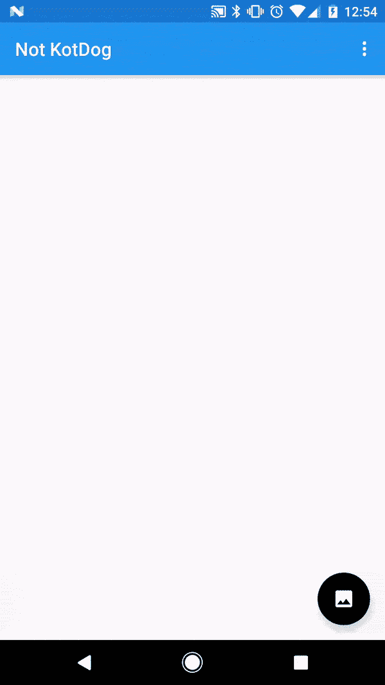

# 不是 Kotdog:用计算机视觉检测 Kotlin 的热狗

> 原文:[https://dev . to/clari fai/not-kot dog-using-computer-vision-detect-dogs-in-kot Lin](https://dev.to/clarifai/not-kotdog-using-computer-vision-to-detect-hot-dogs-in-kotlin)

Kotlin 是一种来自 JetBrains 的编程语言，它使得实现 RESTful API 变得非常容易。现在它已经正式支持 Android 开发，我想用 Kotlin 和 Clarifai 开发一个应用程序。幸运的是，HBO《硅谷》(Silicon Valley)的创作者在上周的一集里给了我所有我需要的灵感，杨健开发了一个应用程序，它使用机器学习来识别某物是否是“热狗”而不是热狗。我的意思是，如果 Clarifai 知道什么，它知道热狗(见:[美食模型](https://developer.clarifai.com/models/food-image-recognition-model/bd367be194cf45149e75f01d59f77ba7?utm_campaign=devto-org-account&utm_medium=blog&utm_source=dev-to&utm_content=article-link)或 [NSFW 模型](https://developer.clarifai.com/models/nsfw-image-recognition-model/e9576d86d2004ed1a38ba0cf39ecb4b1?utm_campaign=devto-org-account&utm_medium=blog&utm_source=dev-to&utm_content=article-link))！

[https://www.youtube.com/embed/AJsOA4Zl6Io](https://www.youtube.com/embed/AJsOA4Zl6Io)

我们将假设一些 Android 的基础知识，但如果你不熟悉，你可以在这里学习如何构建你的第一个应用程序。如果你有 Android Studio 之前的版本，你可以参考这些关于[启动 Kotlin 项目](https://kotlinlang.org/docs/tutorials/kotlin-android.html)的指南。否则，请继续阅读，了解如何使用 Clarifai 和 Kotlin 构建自己的 Not HotDog KotDog 应用程序！

## 定义我们的模型

让我们从讨论我们的模型对象开始。如果你看一下 [Clarifai Predict 文档](https://developer.clarifai.com/guide/predict#predict?utm_campaign=devto-org-account&utm_medium=blog&utm_source=dev-to&utm_content=article-link)，你会看到 Curl 请求的主体是这样的:

```
{
    "inputs": [
        {
            "data": {
                "image": {
                  "base64": "'"$(base64 /home/user/image.jpeg)"'"
                }
            }
        }
    ]
} 
```

<svg width="20px" height="20px" viewBox="0 0 24 24" class="highlight-action crayons-icon highlight-action--fullscreen-on"><title>Enter fullscreen mode</title></svg> <svg width="20px" height="20px" viewBox="0 0 24 24" class="highlight-action crayons-icon highlight-action--fullscreen-off"><title>Exit fullscreen mode</title></svg>

这里我们有一个图像对象，在一个数据对象中，在一个输入对象中，它是数组的一部分。所以最终我们需要四个类。我会尊敬地称呼他们每个人`ClarifaiImage`、`ClarifaiData`、`ClarifaiInput`、`ClarifaiPredictRequest`。以下是他们在科特林的定义:

```
data class ClarifaiImage(val base64: String? = "")

data class ClarifaiData(val image: ClarifaiImage? = null)

data class ClarifaiInput(val data: ClarifaiData? = null)

data class ClarifaiPredictRequest(val inputs: List<ClarifaiInput>? = ArrayList()) 
```

<svg width="20px" height="20px" viewBox="0 0 24 24" class="highlight-action crayons-icon highlight-action--fullscreen-on"><title>Enter fullscreen mode</title></svg> <svg width="20px" height="20px" viewBox="0 0 24 24" class="highlight-action crayons-icon highlight-action--fullscreen-off"><title>Exit fullscreen mode</title></svg>

是的，这是真的，每个类只需要一行代码！Kotlin 为我们提供了[数据类](https://kotlinlang.org/docs/reference/data-classes.html)，它们为常见的方法提供了默认的实现，比如`toString()`、`equals()`和`copy()`。Kotlin 类已经为我们提供了 getter 和 setter 方法。与其他语言相比，Kotlin 的另一个好处是在构造函数中使用默认参数。例如，如果我们看一下`ClarifaiImage`，构造函数接受一个 base64 值的参数，但是如果没有传入，它将被赋给一个空字符串。你可以在这里了解更多关于那些[。](https://kotlinlang.org/docs/reference/functions.html#default-arguments)

除此之外，我们还需要创建一个从我们的授权调用中返回的`AuthToken`类，这将在下面讨论:

```
data class AuthToken(
        @Json(name = "access_token") val accessToken: String? = "",
        @Json(name = "expires_in") val expiresIn: Int? = 0
) 
```

<svg width="20px" height="20px" viewBox="0 0 24 24" class="highlight-action crayons-icon highlight-action--fullscreen-on"><title>Enter fullscreen mode</title></svg> <svg width="20px" height="20px" viewBox="0 0 24 24" class="highlight-action crayons-icon highlight-action--fullscreen-off"><title>Exit fullscreen mode</title></svg>

注意，在这个类中，我们使用了`@Json(name = "")`注释来指定字段的 JSON 键。如果你不指定这个，翻新将只使用变量名。不过，在这种情况下，JSON 约定与 Kotlin 变量名约定冲突，所以我们使用注释来覆盖它。
如果你想看到这个项目的所有模型类，包括用于`ClarifaiPredictResponse`的那些，你可以在这里查看它们[。](https://github.com/AdamMc331/Not-KotDog/blob/master/app/src/main/java/com/clarifai/notkotdog/models/ClarifaiModels.kt)

## 改型&授权

既然我们已经定义了用于进行调用的必要模型，接下来我们需要在应用程序中实现的是授权调用。我们将使用 Square 为 Android 开发的 HTTP 客户端[改型](http://square.github.io/retrofit/)来实现。这是一个用于发出网络请求的行业标准库。让我们从向 build.gradle 文件添加必要的依赖项开始:

```
compile 'com.squareup.retrofit2:retrofit:2.1.0'
compile 'com.squareup.retrofit2:converter-moshi:2.1.0'
compile 'com.squareup.okhttp3:logging-interceptor:3.3.1'
compile 'com.jakewharton.timber:timber:4.5.1' 
```

<svg width="20px" height="20px" viewBox="0 0 24 24" class="highlight-action crayons-icon highlight-action--fullscreen-on"><title>Enter fullscreen mode</title></svg> <svg width="20px" height="20px" viewBox="0 0 24 24" class="highlight-action crayons-icon highlight-action--fullscreen-off"><title>Exit fullscreen mode</title></svg>

虽然只有前两个是必需的，但我已经包含了一个用于调试目的的 HTTP 调用的日志拦截器，以及一个由 Jake Wharton 开发的名为 [Timber](https://github.com/JakeWharton/timber) 的公共日志库。

为了实现翻新，我们首先创建一个接口，定义我们想要进行的任何调用。到目前为止，我们需要一个用于`authorize()`的函数，它接受一个`RequestBody`对象，并返回一个`AuthToken`结果。下面是接口代码的样子:

```
interface ClarifaiAPI {
    @POST("/v2/token")
    fun authorize(@Body requestBody: RequestBody): Call<AuthToken>
} 
```

<svg width="20px" height="20px" viewBox="0 0 24 24" class="highlight-action crayons-icon highlight-action--fullscreen-on"><title>Enter fullscreen mode</title></svg> <svg width="20px" height="20px" viewBox="0 0 24 24" class="highlight-action crayons-icon highlight-action--fullscreen-off"><title>Exit fullscreen mode</title></svg>

注释告诉 retrofit 这是一个 POST 请求，并提供对基本 URL 的任何扩展。基本 URL 来自哪里？很高兴你问了！让我们建立我们的`ClarifaiManager`类吧！

```
class ClarifaiManager(context: Context, apiId: String, apiSecret: String) {
    private val clarifaiApi: ClarifaiAPI

    init {
        val authInterceptor = AuthorizationInterceptor(apiId, apiSecret, context)
        val loggingInterceptor = HttpLoggingInterceptor().setLevel(HttpLoggingInterceptor.Level.BODY)
        val client = OkHttpClient.Builder().addInterceptor(authInterceptor).addInterceptor(loggingInterceptor).build()

        val retrofit = Retrofit.Builder()
                .baseUrl("https://api.clarifai.com/")
                .addConverterFactory(MoshiConverterFactory.create())
                .client(client)
                .build()

        clarifaiApi = retrofit.create(ClarifaiAPI::class.java)
    }

    fun authorize(requestBody: RequestBody): Call<AuthToken> {
        return clarifaiApi.authorize(requestBody)
    }
} 
```

<svg width="20px" height="20px" viewBox="0 0 24 24" class="highlight-action crayons-icon highlight-action--fullscreen-on"><title>Enter fullscreen mode</title></svg> <svg width="20px" height="20px" viewBox="0 0 24 24" class="highlight-action crayons-icon highlight-action--fullscreen-off"><title>Exit fullscreen mode</title></svg>

`ClarifaiManager.kt`类维护了对我们的`ClarifaiApi`接口的引用。这个类定义了我们想要使用的 OkHttp 客户端，以及任何初始化。在这里，我们定义了我们的日志拦截器，一个授权拦截器(接下来解释)，以及我们的客户端，它有一个 https://api.clarifai.com/的基本 URL“，并使用 Moshi 将 JSON 响应转换成我们的 Kotlin 对象。

`AuthorizationInterceptor.kt`文件是一个拦截器类，它将拦截所有传出的改造调用，并执行任何必要的操作。在这种情况下，我们知道我们需要在每个调用中包含一个授权头，因此在拦截器中定义它比在`ClarifaiApi.kt`接口中将其应用于每个调用更容易。拦截器的代码如下:

```
class AuthorizationInterceptor(val apiId: String, val apiSecret: String, val context: Context) : Interceptor {
    override fun intercept(chain: Interceptor.Chain?): Response {
        // Get request path.
        val uri = chain?.request()?.url()?.uri()
        val path = uri?.path

        val authValue: String
        if (path == "/v2/token") {
            authValue = Credentials.basic(apiId, apiSecret)
        } else {
            val prefs = context.getSharedPreferences(App.PREFS_NAME, Context.MODE_PRIVATE)
            val authString = prefs.getString(App.AUTH_TOKEN_KEY, "")
            val authResponse = Moshi.Builder().build().adapter(AuthToken::class.java).fromJson(authString)
            authValue = "Bearer ${authResponse?.accessToken}"
        }

        val request = chain?.request()?.newBuilder()?.addHeader("Authorization", authValue)?.build()

        return chain?.proceed(request)!!
    }
} 
```

<svg width="20px" height="20px" viewBox="0 0 24 24" class="highlight-action crayons-icon highlight-action--fullscreen-on"><title>Enter fullscreen mode</title></svg> <svg width="20px" height="20px" viewBox="0 0 24 24" class="highlight-action crayons-icon highlight-action--fullscreen-off"><title>Exit fullscreen mode</title></svg>

该类接受两个字符串，它们是您的 API ID 和 API Secret(在您的应用程序的[下找到)，以及一个用于共享首选项的上下文。我们的拦截器做两件事之一:](https://developer.clarifai.com/account/applications/?utm_campaign=devto-org-account&utm_medium=blog&utm_source=dev-to&utm_content=article-link)

1.  如果我们试图访问令牌端点，我们使用基本的授权凭证。

2.  如果我们试图访问任何其他端点，我们使用存储在共享首选项中的授权令牌。我们将`AuthToken.kt`对象作为字符串读回，并使用 Moshi 将其转换回对象。接下来我们将讨论如何保存它。

既然我们已经定义了改造服务，那么是时候实现它了。我们将在我们的`onCreate()`方法内的`MainActivity.kt`文件中这样做。这里是我们的活动文件的一个片段，与此相关:

```
class MainActivity : AppCompatActivity() {
    val manager: ClarifaiManager by lazy { ClarifaiManager(this, getString(R.string.api_id), getString(R.string.api_secret)) }

    override fun onCreate(savedInstanceState: Bundle?) {
        super.onCreate(savedInstanceState)
        setContentView(R.layout.activity_main)

        authorizeUser()
    }

    private fun authorizeUser() {
        val call = manager?.authorize(RequestBody.create(MEDIA_TYPE_JSON, GRANT_TYPE_CREDENTIALS))

        call?.enqueue(object : Callback<AuthToken> {
            override fun onFailure(call: Call<AuthToken>?, t: Throwable?) {
                Timber.e(t)
            }

            override fun onResponse(call: Call<AuthToken>?, response: Response<AuthToken>?) {
                Timber.v("Success! Token ${response?.body()?.accessToken}")

                val authString = Moshi.Builder().build().adapter(AuthToken::class.java).toJson(response?.body())
                val prefs = getSharedPreferences(App.PREFS_NAME, Context.MODE_PRIVATE)
                val editor = prefs.edit()
                editor.putString(App.AUTH_TOKEN_KEY, authString)
                editor.apply()
            }
        })
    }

    companion object {
        private val MEDIA_TYPE_JSON = MediaType.parse("application/json; charset=utf8")
        private val GRANT_TYPE_CREDENTIALS = "\"grant_type\":\"client_credentials\""
    }
} 
```

<svg width="20px" height="20px" viewBox="0 0 24 24" class="highlight-action crayons-icon highlight-action--fullscreen-on"><title>Enter fullscreen mode</title></svg> <svg width="20px" height="20px" viewBox="0 0 24 24" class="highlight-action crayons-icon highlight-action--fullscreen-off"><title>Exit fullscreen mode</title></svg>

在`onCreate()`方法中，我们使用我们的 API 凭证创建我们的`ClarifaiManager`实例，然后使用`authorizeMember()`方法，我们获得调用并使用匿名类实现一个`Callback`，该匿名类将处理成功或失败响应。如果失败，我们只需记录错误。如果我们成功了，我们使用 Moshi 将`AuthToken`响应转换成一个字符串，并存储在`SharedPreferences`中，这样我们已经创建的拦截器就可以读取它了。

## 断点

这将是暂停教程并测试您的应用程序工作的好时机。在运行之前，这里有一些没有包括的附加步骤:

1.  通过在`<application>`标签之外添加`<uses-permission android:name="android.permission.INTERNET" />`，在 AndroidManifest.xml 文件中包含 internet 权限。

2.  添加一个 App.kt 文件，它定义了您的应用程序，包含一些常量和 Timber 设置。你可以在这里复制源代码。

3.  按照教程，你现在应该能够运行你的应用程序。当活动开始时，您应该在您的 logcat 中看到类似这样的内容:

    > 05-25 13:54:34.619 24830-24830/com . clari fai . not kot dog V/main activity $ author izeu:成功！令牌 jU85Sdyz2moNlGOK6Pl4MVHEu2ZJJj

如果您遇到任何错误，请仔细检查 GitHub 的源代码，并在评论中告诉我们，这样我们就可以相应地更新教程。

## 附加代码

在开始实现预测调用之前，有一些额外的代码需要添加到您的示例应用程序中，**，前提是您遵循了**。如果您只是通读，请跳到预测来电部分。

这段代码不在这篇文章的设计范围之内。如果你想要更多的澄清，请在评论中提问！

*   添加一个可绘制的照片图标，用于 FAB。

*   抢[串](https://github.com/AdamMc331/Not-KotDog/blob/master/app/src/main/res/values/strings.xml)和[色](https://github.com/AdamMc331/Not-KotDog/blob/master/app/src/main/res/values/colors.xml)资源。

*   更新您的 [`AndroidManifest.xml`](https://github.com/AdamMc331/Not-KotDog/blob/master/app/src/main/AndroidManifest.xml#L28-L36) 文件以包含`FileProvider`和附加权限。您还必须添加作为 XML 文件的[提供者路径](https://github.com/AdamMc331/Not-KotDog/blob/master/app/src/main/res/xml/provider_paths.xml)。

*   从[这里](https://github.com/AdamMc331/Not-KotDog/tree/master/app/src/main/res/layout)更新你的`activity_main.xml`和`content_main.xml`文件。

*   完整的`MainActivity.kt`代码可以在这里找到[，但是我们仍然会讨论其中的一些。](https://github.com/AdamMc331/Not-KotDog/blob/master/app/src/main/java/com/clarifai/notkotdog/activities/MainActivity.kt)

## 预测呼叫

一旦您确认您可以运行应用程序并成功获得授权令牌，我们就可以开始实现预测调用。

首先，让我们对`ClarifaiAPI.kt`和`ClarifaiManager.kt`进行相应的修改。这些变化并不令人惊讶，它们的实现方式与`authorize()`调用的方式相同:

```
interface ClarifaiAPI {

    ...

    @POST("/v2/models/{model_id}/outputs")
    fun predict(@Path("model_id") modelId: String, @Body requestBody: ClarifaiPredictRequest): Call<ClarifaiPredictResponse>
}

class ClarifaiManager(context: Context, apiId: String, apiSecret: String) {

    ...

    fun predict(modelId: String, request: ClarifaiPredictRequest): Call<ClarifaiPredictResponse> {
        return clarifaiApi.predict(modelId, request)
    }
} 
```

<svg width="20px" height="20px" viewBox="0 0 24 24" class="highlight-action crayons-icon highlight-action--fullscreen-on"><title>Enter fullscreen mode</title></svg> <svg width="20px" height="20px" viewBox="0 0 24 24" class="highlight-action crayons-icon highlight-action--fullscreen-off"><title>Exit fullscreen mode</title></svg>

接下来，我们可以在活动中实现预测调用。下面是 Not KotDog 应该遵循的逻辑:

1.  显示我们预测的图像和加载状态。

2.  将图像字节编码为 base64 字符串，并构建我们的`ClarifaiPredictRequest`。

3.  使用“翻新”打电话，确定图片是否是热狗，并相应地更新视图。

为了确定我们是否有热狗，我们将使用响应中返回的概念以及 Kotlin 的`Collection.Any`方法来查看是否有任何概念与我们正在寻找的名称相匹配。

```
private fun predict(modelId: String, imageBytes: ByteArray?) {
    // If bytes are null just return
    if (imageBytes == null) {
        return
    }

    // Clear out previous and show loading
    resultView?.visibility = View.GONE
    progressBar?.visibility = View.VISIBLE
    imageView?.setImageBitmap(BitmapFactory.decodeByteArray(imageBytes, 0, imageBytes.size))

    // Build out the request
    val image = ClarifaiImage(
            Base64.encodeToString(imageBytes, 0)
    )
    val data = ClarifaiData(image = image)
    val input = ClarifaiInput(data)
    val request = ClarifaiPredictRequest(arrayListOf(input))

    val call = manager?.predict(modelId, request)

    call?.enqueue(object : Callback<ClarifaiPredictResponse> {
        override fun onResponse(call: Call<ClarifaiPredictResponse>?, response: Response<ClarifaiPredictResponse>?) {
            Timber.v("Success!")
            Timber.v("${response?.body()}")

            val matchedConcept = response?.body()?.outputs?.first()?.data?.concepts?.any { it.name == HOTDOG_KEY } ?: false

            val resultTextResource = if (matchedConcept) R.string.hotdog_success else R.string.hotdog_failure
            val resultColorResource = if (matchedConcept) R.color.green else R.color.red

            resultView?.text = getString(resultTextResource)
            resultView?.setBackgroundColor(ContextCompat.getColor(this@MainActivity, resultColorResource))
            resultView?.visibility = View.VISIBLE
            progressBar?.visibility = View.GONE
        }

        override fun onFailure(call: Call<ClarifaiPredictResponse>?, t: Throwable?) {
            Timber.e(t)

            resultView?.text = getString(R.string.hotdog_error)
            resultView?.setBackgroundColor(ContextCompat.getColor(this@MainActivity, R.color.red))
            resultView?.visibility = View.VISIBLE
            progressBar?.visibility = View.GONE
        }
    })
} 
```

<svg width="20px" height="20px" viewBox="0 0 24 24" class="highlight-action crayons-icon highlight-action--fullscreen-on"><title>Enter fullscreen mode</title></svg> <svg width="20px" height="20px" viewBox="0 0 24 24" class="highlight-action crayons-icon highlight-action--fullscreen-off"><title>Exit fullscreen mode</title></svg>

要修改它以满足您的需要，您只需要传入适当的模型 id(可以在这里找到)[[https://developer.clarifai.com/models](https://developer.clarifai.com/models)]，并更改`onResponse()`逻辑以查找热狗以外的东西。

在实现了预测调用以及上面提到的其他必要的代码更改之后，您应该会看到如下内容:

[T2】](https://res.cloudinary.com/practicaldev/image/fetch/s--ACajgerU--/c_limit%2Cf_auto%2Cfl_progressive%2Cq_66%2Cw_880/http://blog.clarifai.com/wp-content/uploads/2017/06/image1.gif)