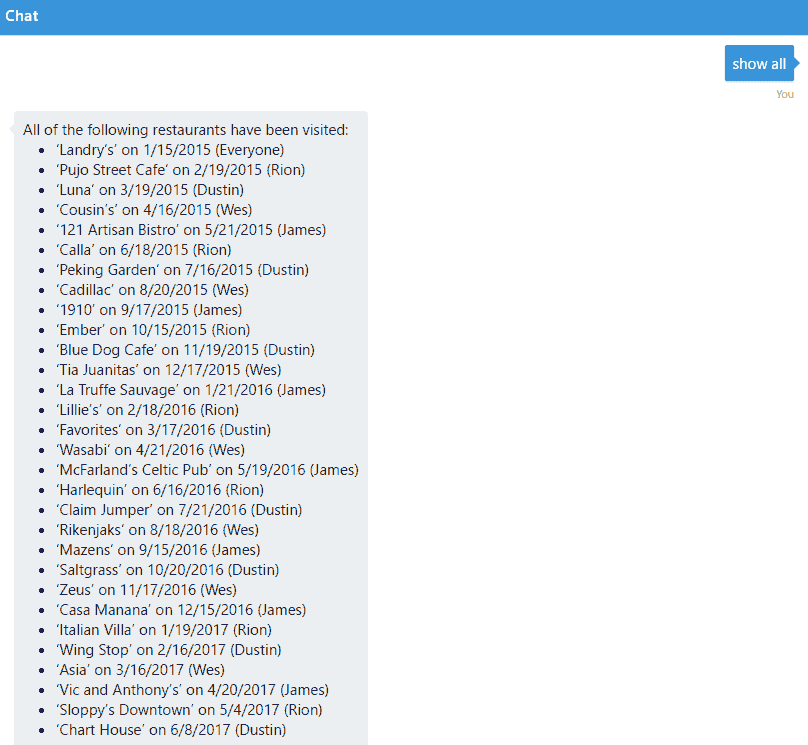
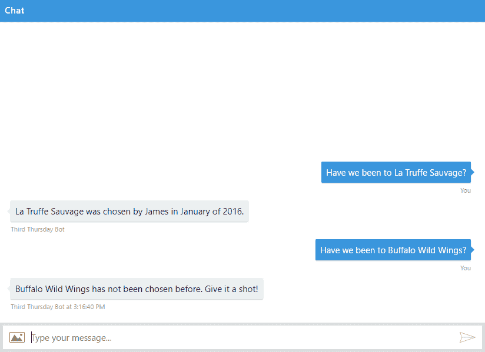
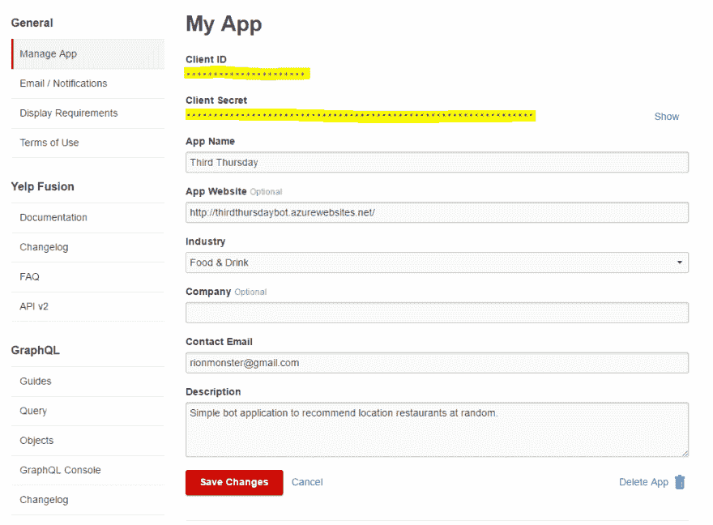
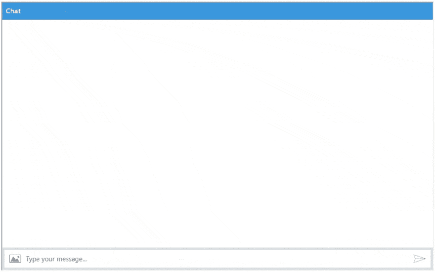
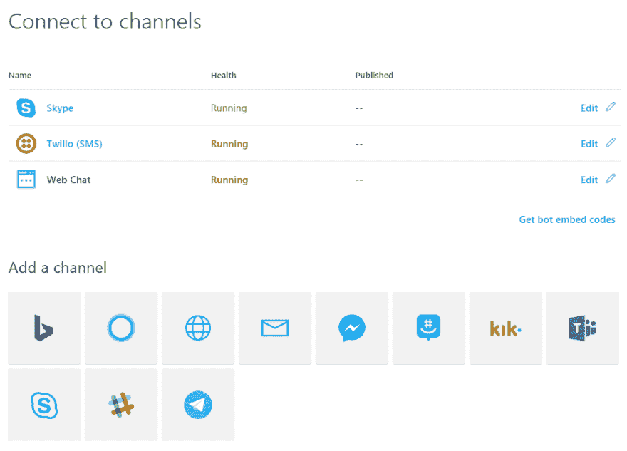
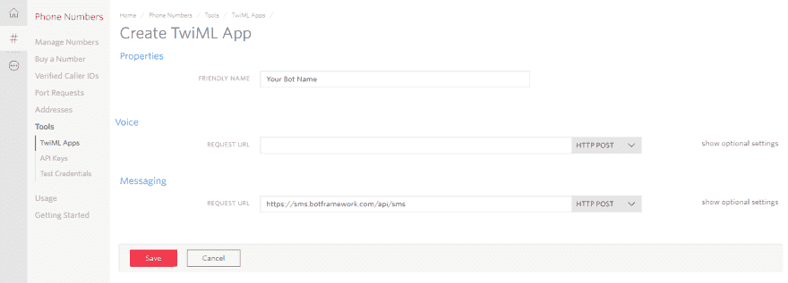
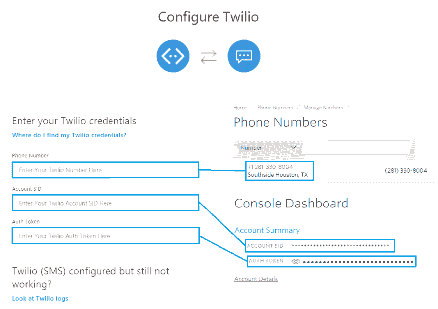
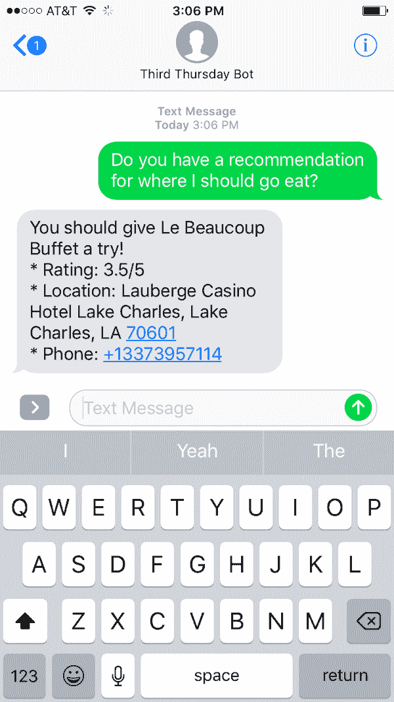

# 微软机器人框架如何改变我和我的朋友吃饭的地方:第 2 部分

> 原文:[https://dev . to/rion monster/how-the-Microsoft-bot-framework-changed-where-my-friends-and-I-eat-part-2](https://dev.to/rionmonster/how-the-microsoft-bot-framework-changed-where-my-friends-and-i-eat-part-2)

*这篇文章最初发表在[我的博客](http://rion.io)上。*

在我的上一篇文章中，我强烈建议在开始这篇文章之前阅读一下，我讨论了使用微软的[机器人框架](https://dev.botframework.com/)构建我的第一个机器人的过程。这篇文章介绍了如何设置、注册和部署机器人到野外。

本帖将重点介绍为使机器人成为今天的样子而添加的几项功能，即:

*   决定轮到谁去挑选餐馆。
*   回答关于特定餐馆的询问。
*   与第三方 API 对话。
*   配置短信/文本支持

## 我们在哪里？

如果您还记得，我们刚刚配置了这个机器人，简单地列出所有已经访问过的可用餐馆、访问过的日期，以及谁通过`show all`命令选择了它们:

[T2】](https://res.cloudinary.com/practicaldev/image/fetch/s--ueXWr5Ju--/c_limit%2Cf_auto%2Cfl_progressive%2Cq_auto%2Cw_880/https://rion.io/conteimg/2017/06/show-all.PNG)

因此，让我们通过确定轮到谁进行下一次选择来扩展这一点。这实际上是一个极其琐碎的操作，但是它确实增加了一些有用的功能(因为我们经常会忘记这些事情)。

首先，让我们发出一个命令，在`MessageController.cs`文件的`Post()`方法中向机器人请求这一点，以接受关于该类型问题的粗略请求:

```
if Regex.IsMatch(message, "who's next|who is next|whose (pick|turn) is it", RegexOptions.IgnoreCase))
{
     await ReplyWithNextMemberToChoose(activity, connector);
} 
```

添加后，`Post()`方法看起来如下:

```
public async Task<HttpResponseMessage> Post([FromBody]Activity activity)  
{
    var connector = new ConnectorClient(new Uri(activity.ServiceUrl));
    if (activity.Type == ActivityTypes.Message)
    {
        var message = activity.Text;

        if (Regex.IsMatch(message, "show|all|list all", RegexOptions.IgnoreCase))
        {
            await ReplyWithRestaurantListingAsync(activity, connector);
        }
        else if Regex.IsMatch(message, "who's next|who is next|whose (pick|turn) is it", RegexOptions.IgnoreCase))
        {
            await ReplyWithNextMemberToChoose(activity, connector);
        }
        else
        {
            await ReplyWithDefaultMessageAsync(activity, connector);
        }
    }

    return Request.CreateResponse(HttpStatusCode.OK);
} 
```

接下来，我们将需要配置基本逻辑来处理这个问题，这仅仅使用了一点基本的数学知识(例如，用户数量对当前用户取模，等等。) :

```
private async Task<ResourceResponse> ReplyWithNextMemberToChoose(Activity activity, ConnectorClient connector)
{
    try
    {
        var lastRestaurantVisited = await GetLastVisitedRestaurantAsync();
        var members = await GetAllMembers();

        var currentMember = Array.IndexOf(members, lastRestaurantVisited?.PickedBy ?? "");
        var nextMember = members[(currentMember + 1) % members.Length];
        var nextMonth = lastRestaurantVisited?.Date.AddMonths(1) ?? DateTime.Now.AddMonths(1);

        var replyMessage = string.Format(Constants.NextChooserFormattingMessage, nextMember, nextMonth.ToString("MMMM"));
        var reply = activity.CreateReply(replyMessage);
        return await connector.Conversations.ReplyToActivityAsync(reply);
    }
    catch
    {
        var reply = activity.CreateReply("I'm not sure who has the next pick. Try again later.");
        return await connector.Conversations.ReplyToActivityAsync(reply);
    }
} 
```

在这一点上，我们可以问机器人谁有下一个选择:

[T2】](https://res.cloudinary.com/practicaldev/image/fetch/s--WxKfJwiC--/c_limit%2Cf_auto%2Cfl_progressive%2Cq_auto%2Cw_880/https://rion.io/conteimg/2017/06/wes-is-next.PNG)

既然我们已经知道小组中的谁将选择下一个，让我们允许用户询问小组先前在哪里用餐的问题，以确保我们不会重复任何先前的选择。我们可以通过在下面的`PostMessage()`方法中以“我们去过{restaurant}”的形式向机器人添加另一个短语来做到这一点:

```
if (Regex.IsMatch(message, "(?<=have we been to )(?<restaurant>[^?]+)", RegexOptions.IgnoreCase))
{
   var restaurant = Regex.Match(message, @"(?<=have we been to )(?<restaurant>[^?]+)", RegexOptions.IgnoreCase)?.Groups["restaurant"]?.Value ?? "";
    if (!string.IsNullOrWhiteSpace(restaurant))
    {
          var vistedRestaurants = await _service.GetAllVisitedRestaurantsAsync();
          var visitedRestaurant = vistedRestaurants.FirstOrDefault(r => string.Equals(r.Location, restaurant, StringComparison.OrdinalIgnoreCase));
          if (visitedRestaurant != null)
          {
              await ReplyWithVisitedRestaurantAsync(visitedRestaurant, activity, connector);
          }
          else
          {
              await ReplyWithUnchosenRestaurantAsync(restaurant, activity, connector);
          }
    }
    else
    {
          await ReplyWithUnrecognizableRestaurantAsync(activity, connector);
    }
} 
```

很基本，对吧？所有这些都是:

*   检查所请求的餐馆以前是否被访问过。
*   如果有，请指出访问时间和选择人。
*   如果没有，让用户知道这一点。
*   否则，让用户知道识别餐馆有问题。

您可以在下面的演示中看到这一点:

[T2】](https://res.cloudinary.com/practicaldev/image/fetch/s--1KpH_G1i--/c_limit%2Cf_auto%2Cfl_progressive%2Cq_auto%2Cw_880/https://rion.io/conteimg/2017/06/choices.PNG)

所以现在我们知道谁可以选择下一家餐馆，我们需要帮助他们做出明智的决定，这就是一些外部 API 的作用。

## Yelp！我跌倒了，爬不起来了！

作为一个狂热的美食家和旅行者，我一直在使用像 [Yelp](http://www.yelp.com) 这样的网站，所以毫不奇怪，我们将利用他们的 API 来获得我们的团队应该去哪里吃饭的建议。

为了能够从我们现有的机器人中调用 Yelp，我们需要一些东西，我们需要通过 [Yelp 的开发者程序](https://www.yelp.com/developers)注册才能访问，即:

*   **一个客户端 ID**——用来唯一识别我们对 Yelp API 的请求，并确保我们没有做任何不正当的事情
*   **客户秘密**——用来证明我们是向 Yelp 发出请求时所说的那个人

当使用大多数第三方 API 时，这两个都是非常标准的，所以如果您使用其他东西，您的收益可能会有所不同。

因此，在 Yelp 上创建帐户后，你需要注册一个应用程序，这将是你的机器人。这是一个相当简单的过程，通常只需要填写几个字段，然后，您应该会在门户中看到类似这样的内容:

[T2】](https://res.cloudinary.com/practicaldev/image/fetch/s--8vU-PyO9--/c_limit%2Cf_auto%2Cfl_progressive%2Cq_auto%2Cw_880/https://rion.io/conteimg/2017/06/YelpSecrets.PNG)

这主要是我们在 Yelp 方面需要的所有东西，但接下来我们需要设置我们的应用程序，以便我们可以实际上*使用*这些信息。

## 储存您的 Yelp 凭证

通常，你可以简单地把你的 Yelp 凭证放在一个简单的配置文件中，然后在运行时读取它，没有任何问题，这在大多数用例中是一个非常有效的解决方案，正如在前面的帖子中看到的:

```
<appSettings>  
    <add key="BotId" value="ThirdThursdayBot" />
    <add key="MicrosoftAppId" value="foo" />
    <add key="MicrosoftAppPassword" value="bar" />
    <add key="YelpClientId" value="******************" />
    <add key="YelpClientSecret" value="*************************" />
</appSettings> 
```

然而，因为我要把这个贴在 GitHub 上，而且我不想收到一些来自 Yelp 的关于他们从我这里收到的数百万个请求的令人讨厌的电子邮件，我们将走另一条路线，利用 Azure 中的环境变量。

您可以像处理任何其他类型的设置或配置文件一样考虑它们，除了您可以从 Azure 门户访问它们，它们实际上并不存储在您的代码本身中:

[T2】](https://res.cloudinary.com/practicaldev/image/fetch/s--QmBUbiHD--/c_limit%2Cf_auto%2Cfl_progressive%2Cq_auto%2Cw_880/https://rion.io/conteimg/2017/06/AppSettingsInAzure.PNG)

现在我们已经有了这些，让我们建立一个服务，我们实际上可以使用它来与 Yelp 对话。

## 映射 Yelp 类

在看了 Yelp API 之后，我们首先需要几个类来绑定我们的响应，这将使代码更容易理解:

*   YelpBusiness -这代表 Yelp 中的一个业务(因为不是所有的东西都是餐馆)
*   YelpLocation -这代表一个给定企业的地址，我们将使用它向用户提供联系信息(用于预订等)。)
*   yelputhenticationresponse-这只是一个令牌，我们需要存储它，这样我们就不必每次向 Yelp API 发出请求时都进行身份验证。

下面可以看到每一项，它们直接映射到我们将根据它们的文档从 Yelp API 返回的属性:

```
public class YelpBusiness
{
        [JsonProperty("rating")]
        public double Rating { get; set; }
        [JsonProperty("name")]
        public string Name { get; set; }
        [JsonProperty("image_url")]
        public string Image { get; set; }
        [JsonProperty("phone")]
        public string PhoneNumber { get; set; }
        [JsonProperty("location")]
        public YelpLocation Location { get; set; }
}

public class YelpLocation
{
        [JsonProperty("city")]
        public string City { get; set; }
        [JsonProperty("address1")]
        public string Address { get; set; }
        [JsonProperty("state")]
        public string State { get; set; }
        [JsonProperty("zip_code")]
        public string ZipCode { get; set; }

        public string FullAddress => $"{Address}, {City}, {State} {ZipCode}";
}

public class YelpAuthenticationResponse
{
        [JsonProperty("access_token")]
        public string AccessToken { get; set; }
} 
```

目前，我们真的只需要 Yelp 做一件事:提供我和我的朋友应该去哪里吃饭的推荐。为了做到这一点，我们将创建一个服务来处理与 Yelp 的认证，并发出我们需要的请求。

```
public class YelpService : IYelpService
{
        private const string YelpSearchUrl = "https://api.yelp.com/v3/businesses/search?";

        private readonly string _clientId;
        private readonly string _clientSecret;
        private readonly string _preferredLocation;
        private string _authToken;

        public YelpService(string clientId, string clientSecret, string preferredLocation = "Lake Charles")
        {
            _clientId = clientId;
            _clientSecret = clientSecret;
            _preferredLocation = preferredLocation;
        }

        /// <summary>
        /// Gets a random, unvisited Restauraunt from Yelp's API
        /// </summary>
        public async Task<YelpBusiness> GetRandomUnvisitedRestaurantAsync(Restaurant[] restaurantsToExclude)
        {
            try
            {
                using (var yelpClient = new HttpClient())
                {
                    await EnsureYelpAuthenticationAsync(yelpClient);

                    if (string.IsNullOrWhiteSpace(_authToken))
                    {
                        // Yelp failed to authenticate properly, you should probably check the Client ID and Secret to ensure they are correct
                        // or you could throw an exception and log it here (i.e. YelpAuthenticationException, etc.)
                        return null;
                    }

                    var response = await GetYelpSearchQueryAsync(yelpClient);
                    var recommendation = response.Restaurants
                                                 .OrderBy(r => Guid.NewGuid())
                                                 .First(r => restaurantsToExclude.All(v => !v.Location.Contains(r.Name) && !r.Name.Contains(v.Location)));

                    return recommendation;
                }
            }
            catch
            {
                // Something else bad happened when communicating with Yelp; If you like logging, you should probably do that here
                return null;
            }
        }

        /// <summary>
        /// Ensures that the Yelp API has been authenticated for the current request
        /// </summary>
        private async Task EnsureYelpAuthenticationAsync(HttpClient yelpClient)
        {
            if (string.IsNullOrWhiteSpace(_authToken))
            {
                var authenticationResponse = await yelpClient.PostAsync($"https://api.yelp.com/oauth2/token?client_id={_clientId}&client_secret={_clientSecret}&grant_type=client_credentials", null);
                if (authenticationResponse.IsSuccessStatusCode)
                {
                    var authResponse = JsonConvert.DeserializeObject<YelpAuthenticationResponse>(await authenticationResponse.Content.ReadAsStringAsync());
                    _authToken = authResponse.AccessToken;
                }
            }
        }

        /// <summary>
        /// Sets the headers and search terms for the Yelp search query
        /// </summary>
        private async Task<YelpSearchResponse> GetYelpSearchQueryAsync(HttpClient yelpClient)
        {
            yelpClient.DefaultRequestHeaders.TryAddWithoutValidation("Authorization", $"Bearer {_authToken}");
            var searchTerms = new[]
            {
                $"term=food",
                $"location={_preferredLocation}",
                $"limit=50"
            };

            var searchRequest = await yelpClient.GetStringAsync($"{YelpSearchUrl}{string.Join("&", searchTerms)}");
            return JsonConvert.DeserializeObject<YelpSearchResponse>(searchRequest);
        }
} 
```

真正的内容包含在`GetRandomUnvisitedRestaurantAsync()`方法中，该方法执行以下操作:

*   确保可以访问 Yelp API，并且我们可以根据它进行身份验证。
*   为我们的首选位置抓取 50 个“食品相关”企业(在应用程序设置中配置)
*   随机选择一家目前不在我们访问过的餐馆列表中的餐馆。

现在为了实际调用这个服务，我们将在`MessagesController`中旋转服务的实例:

```
[BotAuthentication]
public class MessagesController : ApiController
{
    private readonly IFirebaseService _service;
    private readonly IYelpService _yelpService;

    public MessagesController()
    {
        _service = new FirebaseService(Environment.GetEnvironmentVariable("DatabaseEndpoint"));
        _yelpService = new YelpService(
            Environment.GetEnvironmentVariable("YelpClientId"),
            Environment.GetEnvironmentVariable("YelpClientSecret"),
            Environment.GetEnvironmentVariable("YelpPreferredLocation")
        );
    }

    // Omitted for brevity
} 
```

`Environment.GetEnvironmentalVariable()`方法可以读取我们之前在 Azure 中配置的设置，并确保您的服务得到正确配置。设置完成后，您应该能够运行应用程序并计算出下个月去哪里吃饭:

[T2】](https://res.cloudinary.com/practicaldev/image/fetch/s--TRyetQXM--/c_limit%2Cf_auto%2Cfl_progressive%2Cq_66%2Cw_880/https://rion.io/conteimg/2017/06/recommendation.gif)

## 延伸到网外

虽然在网页上有一个在线机器人可能是有用的，但微软机器人框架的真正力量来自可扩展性。

通过访问 bot 框架的 Channels 区域，您可以看到之前创建的所有扩展点，您可以在新 Bot 中利用这些扩展点:

[T2】](https://res.cloudinary.com/practicaldev/image/fetch/s--ipFwaHQX--/c_limit%2Cf_auto%2Cfl_progressive%2Cq_auto%2Cw_880/https://rion.io/conteimg/2017/06/channels.PNG)

由于这是一个我希望能够与不懂技术的人分享的机器人，我认为这将是一个集成 Twilio 的完美用例，这样我的朋友就可以简单地“发送”这个机器人。

## 配置 Twilio

对于那些不熟悉的人来说，Twilio 基本上是发送消息服务的黄金标准，他们使这个过程变得非常容易，最棒的是:*它是免费的** 。

如果您还没有跳到下一节，那么我将假设您想继续学习并使您的机器人“可发送文本”。如果是的话，那就去[访问 Twilio 的网站](https://www.twilio.com)开始吧。

注册后，我们将需要以下信息，以便有效地向/从我们的机器人路由 SMS 消息:

*   **电话号码** - Twilio 将允许您创建一个新号码，该号码可用作发送和接收文本消息的端点，这些消息将被路由到您的机器人。
*   **账户 ID**——与之前的 Yelp API 示例非常相似，我们需要一个唯一的账户标识符。
*   认证令牌(authentic ation Token)-见上面 Yelp API 的例子，但这基本上是让 Twilio 知道我们就是我们所说的那个人。

让我们从第一部分开始:一个电话号码。谢天谢地，Twilio 将免费为您的帐户提供一个电话号码:

[T2】](https://res.cloudinary.com/practicaldev/image/fetch/s--h6zfPDgo--/c_limit%2Cf_auto%2Cfl_progressive%2Cq_auto%2Cw_880/https://rion.io/conteimg/2017/06/hit-mike-jones-up-on-the-low.PNG)

> **注意:**虽然 Twilio 将为他们的服务提供免费电话号码，但值得注意的是，使用这些号码发送的每条短信都将被加上“这是从 Twilio 试用帐户发送的”，所以如果你不想这样，你实际上不得不咬紧牙关。

一旦你有了电话号码，你还需要一个 Twilio“应用程序”来关联它。你可以通过 Twilio 的网络界面，在**电话号码>工具> TwiMLApps** 部分轻松创建其中一个:

[T2】](https://res.cloudinary.com/practicaldev/image/fetch/s--60B0B6Y_--/c_limit%2Cf_auto%2Cfl_progressive%2Cq_auto%2Cw_880/https://rion.io/conteimg/2017/06/new-twilio-app.PNG)

因为这只是用于路由文本消息，所以你需要确保你**将请求 URL 设置为使用机器人框架 API 地址“[https://sms.botframework.com/api/sms](https://sms.botframework.com/api/sms)”**，这将允许 Twilio 与你的机器人进行预期的对话。

现在，您只需将新创建的“应用程序”与之前创建的电话号码相关联，这可以在电话号码的配置部分完成。你只需要**确保号码的消息部分被配置为指向你的新 TwiML 应用**:

[T2】](https://res.cloudinary.com/practicaldev/image/fetch/s--8-FF-Ako--/c_limit%2Cf_auto%2Cfl_progressive%2Cq_auto%2Cw_880/https://rion.io/conteimg/2017/06/phone-number-configuration.PNG)

此时，您应该已经准备好了。您已经从 Twilio 获得了您需要的所有信息，而您的实际应用程序不需要知道这些信息(因为 Bot 框架会为您处理所有这些信息)。所以让我们完成最后一部分的接线。

## 通过文字推荐食物

对于最后一部分，我们只需要重新访问 Bot 框架门户，并连接 Twilio 通道就可以开始使用它了。您只需要填写几个字段，这些字段很容易从 Twilio 门户获得，如下所示:

[T2】](https://res.cloudinary.com/practicaldev/image/fetch/s--xVUxY6BB--/c_limit%2Cf_auto%2Cfl_progressive%2Cq_auto%2Cw_880/https://rion.io/conteimg/2017/06/configuring-twilio.PNG)

现在，您应该能够拿出手机，输入机器人的电话号码，并与它进行交互，就像您从任何其他界面进行交互一样:

[T2】](https://res.cloudinary.com/practicaldev/image/fetch/s--A6qdnfwF--/c_limit%2Cf_auto%2Cfl_progressive%2Cq_auto%2Cw_880/https://rion.io/conteimg/2017/06/text-message.png)

现在，只要去和你所有的朋友分享这个号码，你想在让机器决定你从现在开始在哪里吃饭。

## 让它成为你自己的

很明显，我的城市和我朋友的名字将会和你的大相径庭，但是没有理由你不能有自己的第三个星期四！

这就是为什么我要把所有这些代码(以及任何其他相关的代码)发布到 GitHub 上，这样你就可以随意使用它们。保持不变，变得不一样，做自己喜欢的事！