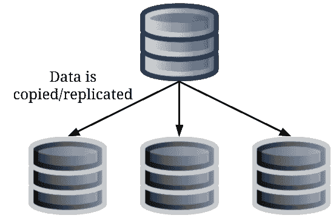
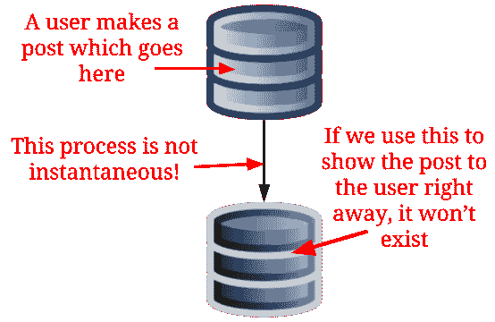
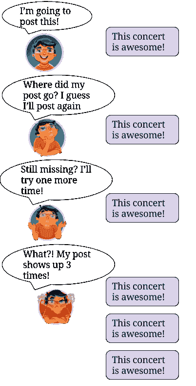
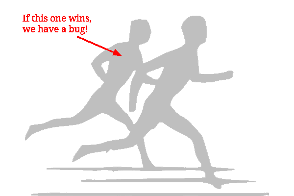

# 最糟糕的虫子

> 原文:[https://dev.to/pbeekums/the-worst-kind-of-bugs](https://dev.to/pbeekums/the-worst-kind-of-bugs)

我之前简单地谈过开发人员患有[“它作用于我的机器思维](https://blog.professorbeekums.com/2017/01/software-developers-should-have.html)。结果是错误不会出现在开发人员的机器上，但会出现在用户面前。然而，还有一类更糟糕的错误影响着公司的每个人:“当我在办公室尝试的时候，它就工作了”

这有什么不同？在实时 web 应用程序中，事情会变得相当复杂。大量的变量意味着用户完全有可能看到公司里没有人能重现的错误。不是开发商。不是 UX 设计师。不是客户支持。不是管理。

由于公司中没有人能够重现该问题，因此很容易认为问题出在用户身上，无法解决。

这对一家公司来说意义重大。当用户数量很少时，即使有，也只会有少量的错误报告。这些是最容易被认为是用户错误的错误。但是，很大一部分用户可能会看到这个问题，并选择不提交错误报告。他们只是选择不使用该产品，并告诉他们的朋友不要使用它。

对于一个拥有大量用户的公司来说，大量的 bug 报告会出现在公司里没有人能看到的地方。这很难被认为是用户错误，因为很多人都遇到了同样的错误。然而，如果没有能力重现它，试图找出这个问题是非常令人沮丧的。

那么这些问题是什么，如何解决呢？

一种叫做复制延迟。让我们假设您的产品正在使用 SQL 数据库。在开发产品时，系统只需要一台数据库服务器，也就是 master 数据库。

[T2】](https://res.cloudinary.com/practicaldev/image/fetch/s--vQHv17Qv--/c_limit%2Cf_auto%2Cfl_progressive%2Cq_auto%2Cw_880/https://blog.professorbeekums.com/img/2017/6/database.png)

当用户达到一定数量后，这台服务器开始感到压力。幸运的是，对于大多数读操作多于写操作的应用程序来说，这并不太难管理。

《脸书邮报》就是一个例子。一个人在他们的新闻订阅源中写了一篇文章，这导致了对数据库的一次写入。100 个人阅读那个帖子，导致 100 人阅读数据库。

在这种情况下，我们可以使用一种叫做“读奴隶”的东西轻松地卸载 SQL 数据库需要做的工作。这些是其他数据库服务器，它们的唯一目的是从主数据库复制数据。

[T2】](https://res.cloudinary.com/practicaldev/image/fetch/s--MnsSWU2u--/c_limit%2Cf_auto%2Cfl_progressive%2Cq_auto%2Cw_880/https://blog.professorbeekums.com/img/2017/6/replication.png)

每当有人需要读取这些数据时，比如阅读帖子，我们可以通过读取从数据库而不是主数据库来获取数据。如果我们像上面的例子一样，每次写操作都有 100 次读操作，这可以大大减少主数据库的工作量。

简单对吗？

这就是事情变得令人沮丧的地方。从主数据库到读取从数据库的复制需要时间。通常这是几毫秒的时间，几乎察觉不到。因此，用户可以发送一个 post，该 post 向主数据库写入数据，然后我们可以让他们通过读取从数据库来查看该数据。

[T2】](https://res.cloudinary.com/practicaldev/image/fetch/s--ilJKq1ol--/c_limit%2Cf_auto%2Cfl_progressive%2Cq_auto%2Cw_880/https://blog.professorbeekums.com/img/2017/6/replicationdelay.png)

问题是当大量写入开始发生时，将数据复制到读从机的时间会增加。假设一个非常大的事件正在发生，成千上万的人在很短的时间内发帖。根据硬件质量等多种因素，将数据从主数据库复制到从数据库可能需要几秒钟或更长时间。

如果你在脸书上发一个帖子，你需要多长时间才能看到？不到一秒钟？如果数据不在读从机上，会发生什么？

没有意识到这种情况会发生的开发人员不会为此采取任何保护措施。结果是，在特定的时间段内，用户可以发布帖子，但看不到它。这可能是一个令人沮丧的经历，因为他们可能认为它没有成功发布，所以他们可能会再次发布，并有许多重复的帖子。

[T2】](https://res.cloudinary.com/practicaldev/image/fetch/s--ECiI9QQ5--/c_limit%2Cf_auto%2Cfl_progressive%2Cq_auto%2Cw_880/https://blog.professorbeekums.com/img/2017/6/duplicateposts.png)

或者应用程序会崩溃，这对用户来说从来都不是好事。

[T2】](https://res.cloudinary.com/practicaldev/image/fetch/s--smFNKVRu--/c_limit%2Cf_auto%2Cfl_progressive%2Cq_auto%2Cw_880/https://blog.professorbeekums.com/img/2017/6/error.png)

所以你得到了这些错误报告。开发商开始调查需要多长时间？一个小时？一天？当有人开始调查时，事件可能已经结束了。复制延迟又回到了几毫秒。公司里任何试图重现这一问题的人都将无能为力。你现在正在等待一个开发者有一个“尤里卡！或者在开发人员开始关注这个问题的同时，一个重大事件偶然发生。呸！

这个 bug 属于一类叫做“竞争条件”的 bug。之所以这样称呼它，是因为有两个独立运行的动作:一个运行者将数据写入数据库，而另一个运行者读取数据并将其传递给用户。如果一个跑步者赢了，我们的应用程序就运行得很好。如果另一个跑者赢了，我们就有一个 bug。[T2】](https://res.cloudinary.com/practicaldev/image/fetch/s--oPI1j5vB--/c_limit%2Cf_auto%2Cfl_progressive%2Cq_auto%2Cw_880/https://blog.professorbeekums.com/img/2017/6/runners.png)

如果这场比赛是固定的，并且总是有一个人获胜，那就好了。这将防止我们看到的错误。不幸的是，我们的跑步者有点太道德了。混蛋们。

还有其他竞争条件的例子。如果一个人试图在原作者删除帖子的同时对该帖子进行评论，该怎么办？

当一个人试图和另一个人同时修改谷歌文档中的某些内容时会发生什么？

或者，如果电子商务网站上的卖家在买家从购物车走向结账页面的过程中改变了商品的价格，该怎么办？你会改变买方的价格吗？你告诉卖家价格变化会有延迟吗？

在所有这些情况下，我们都有可能产生负面的用户体验。用户不知道与他们同时发生的还有另一个动作，这没有任何帮助。事物只是从他们的角度来看是破碎的。

例如，如果购物车和收银台之间的价格发生了变化，错误报告不会说“看起来当我正在收银时价格发生了变化，而与此同时，卖家也改变了价格。”

错误报告更可能会说:

**“你*******骗了我这个东西的价格！！！我再也不和你一起逛街了。”**

这是对这个问题的信息描述吗？有人能接受这一点并说“我知道发生了什么！可能不会，除非他们以前遇到过非常类似的问题。

我还没有提到任何关于如何修复或防止这些问题的解决方案。这是因为在大多数情况下，任何解决方案都会影响产品的功能，并具有 UX 的含义。在电子商务网站上改变价格就是一个很好的例子。

这使得这些不仅仅是发展问题。它们是产品问题，需要整个团队参与解决。每个产品都是独一无二的，需要有自己的定制解决方案。

*本帖最初发表于[blog.professorbeekums.com](https://blog.professorbeekums.com/worst-bugs/)T3】*