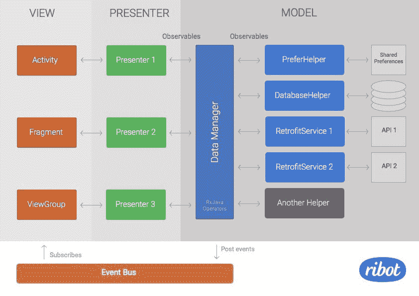

# 确保 Android 上的代码质量

> 原文:[https://dev.to/ditn/ensuring-code-quality-onandroid](https://dev.to/ditn/ensuring-code-quality-onandroid)

每个人都喜欢认为他们输出了高质量的代码，但是你如何确保你的团队成员在同一页上呢？以下是我多年来使用的一些技巧。这个博客主要是针对团队领导或与 3 人以上一起工作的资深人士，但一些提示可能对单个贡献者/OSS 项目有用。

* * *

# 格式化&一致性

就我个人而言，我对代码中的格式非常顽固。即使只是错误或缺少空格也是一个大问题，但谢天谢地有工具可以防止这种普遍的烦恼。

## 代码样式规则

第一步是确保你的团队都在读同一首赞美诗。有些人可能比其他人更强调一致性，但至少你应该选择一种代码风格并坚持下去。对于许多人来说，仅仅使用默认的 IntelliJ/Android Studio 代码风格就足够了；许多人使用 Google Java 代码风格。

不管你是使用默认设置还是一些疯狂的自定义设置，为什么不简化每个人的生活，把你的设置和你项目的 git repo 捆绑在一起呢？这让你在新成员入职时不必去探究 IntelliJ 的偏好，也为那些不遵守标准的人少提供了一个借口。

[T2】](https://res.cloudinary.com/practicaldev/image/fetch/s--ykfd5L6M--/c_limit%2Cf_auto%2Cfl_progressive%2Cq_66%2Cw_880/https://cdn-images-1.medium.com/max/1600/1%2A-xD77ULjNPo84ullru4C4Q.gif)

## 自举

更好的是，为什么不让您的项目为您安装您的代码风格呢？这个想法是无耻地从优秀的 [Kickstarter 应用程序](https://github.com/kickstarter/android-oss)中剽窃来的，在那里他们有一个`scripts`文件夹，其中包含一个 bash 文件，为您设置项目——复制他们的代码风格 xml，删除默认文件头，运行`git submodule update --init --recursive`,甚至检查他们的密钥库是否存在，如果没有找到就警告用户。

我们已经在[区块链 Android 应用](https://github.com/blockchain/My-Wallet-V3-Android/blob/master/scripts/bootstrap.sh)上利用了这个想法，它使新开发人员的加入和对开源回购的贡献变得更加容易。或者，如果你更喜欢的话，你也可以把它写成一个 Gradle build 脚本。

## 安卓指南

IntelliJ/Android Studio 的格式化规则只能让你到此为止 RxJava 操作符的格式化呢？资源命名约定？你希望你的团队使用不带括号的条件句吗？

为此，我建议你编写或派生一个更完整的风格指南，比如由 [Ribot](https://github.com/ribot/android-guidelines) 团队编写的优秀指南。这就明确了你希望你的团队如何编写你的代码，我给[留了一个我编辑过的版本](https://github.com/ditn/android-guidelines/blob/master/project_and_code_guidelines.md)钉在 Chrome 上，当我忘记一些愚蠢的事情时可以参考。最近我们开始在产品中使用 Kotlin，但我发现官方指南有点欠缺，所以[我也为此写了一个基本指南](https://github.com/ditn/KotlinStyleGuide)。在你的`README.md`中链接到这些指导方针，从此不再有关于换行的争论。

## 强制执行

你已经做了所有这些，但你想确保人们真的遵守你制定的规则——你该怎么做呢？

谢天谢地，有工具可以让你验证这些东西。Checkstyle 是最常用的工具；只要确保`checkstyle`任务在 CI 中运行(您有 CI，不是吗？)并在必要时使构建失败。

您可能会发现最初让构建通过是非常痛苦的，因为您可能不得不编辑一些规则来实施您自己的风格选择。因此，我们目前没有在区块链中使用它，但如果有机会，我会 100%在新项目中使用它。

* * *

# 稳健

如果代码损坏或无法维护，那么漂亮、一致的代码有什么用呢？如何确保您的代码相对健壮？

## 测试

在 Android 上进行测试曾经绝对是一场噩梦。现在，假设您已经选择了一个合理的架构并保持了合理的设计选择(如控制反转),这是相对简单的。因此，没有理由不进行测试:它们增强了对代码的信心，捕捉到了你可能没有设计到的边缘情况(如果测试写得很好的话),并且看到你的覆盖率上升总的来说是令人满意的。

每当代码被推送到远程分支时，您都应该在 CI 上运行单元测试。这有助于在开发过程中捕捉 bug，并确保没有太可怕的事情被推到`master`。在这种情况下，我们还设置了一个不同的 CI 服务器来运行集成测试，在`develop`或`master`中创建一个拉请求。由于这些比较慢，我们不需要每次推送都运行它们。

我们还利用了[受保护的分支](https://help.github.com/articles/about-protected-branches/)，这防止了懒惰的开发人员强制推送到`master`，并且不允许我们合并 pr，直到所有的检查都通过了(单元&集成测试，加上通过 Jacoco + [的代码覆盖。io](https://coveralls.io/) )。

## 建筑

对于一个可测试的应用程序，你会想要使用某种形式的架构惯例，比如 MVP、MVVM、MVI、Redux 或者任何你喜欢的方式。这有助于将 Android 层(很难测试)从核心业务逻辑中分离出来，如果做得明智，可以使应用程序更具可测试性。我们在区块链使用 [MVP](https://github.com/blockchain/My-Wallet-V3-Android/tree/master/app/src/main/java/piuk/blockchain/android/ui/base) (尽管你可以在这里看到我们正在远离 MVVM)。

我们还大量使用了 [Dagger2](https://google.github.io/dagger/) ，它有一个非常陡峭的学习曲线，但是使得处理依赖项的创建和注入更加容易，因此也使得测试更加简单。我肯定会建议花些时间学习如何使用它。

[T2】](https://res.cloudinary.com/practicaldev/image/fetch/s--PglCA1U7--/c_limit%2Cf_auto%2Cfl_progressive%2Cq_auto%2Cw_880/https://cdn-images-1.medium.com/max/1600/1%2AysGRkJrlpqZCDyhaykrv4A.jpeg)

这也是在你的回购中有一个公司指导方针可能是确保团队坚持你的架构的最简单的方法。回到 Ribot，他们的风格指南还包括一个令人敬畏的[架构图](https://github.com/ribot/android-guidelines/blob/master/architecture_guidelines/android_architecture.md)，以及他们为什么选择他们所做的层和结构的推理。如果你正在考虑转换到类似 MVP 的东西，写出一个类似的图表，因为你可能会发现它很有帮助，然后编写一个简单的例子供团队参考。

## 虫子

当然，测试只能到此为止；会有很多你可能没有发现的错误。同样，这里有工具可以帮你一把。Lint 是一个很大的工具，它可以从命令行运行(因此也可以从 CI 运行),并为您输出结果。如果你愿意，你也可以定制你的 lint 规则，并在你的回购协议中捆绑它们。

你应该致力于减少你在构建时看到的 lint 错误的数量，但多年来这很难实施，因为要么一个错误会使你的构建失败，要么你只是简单地将`lintOptions.abortOnError false`添加到你的构建中。幸运的是，Android 团队添加了一个[工具，允许你设置基线](https://developer.android.com/studio/write/lint.html#snapshot)，并将其保存在你的报告中——这意味着从那时起，任何新的错误都会导致构建失败。

不利的一面是，Lint 只在生成发布版本时运行，而当您面临将版本发布到 QA 或其他地方的压力时，这可能不是修复错误的最佳时机。解决方案很简单:将 Lint 任务添加到您的 CI 流程中(您注意到模式了吗？).就像`./gradlew lint`一样简单，尽管保存输出会因您的 CI 提供者而异。

另一个优秀的工具是 [FindBugs](http://findbugs.sourceforge.net/) ，它可以发现与安全性、性能和一般代码正确性相关的各种问题。这是一个很棒的工具，我很惭愧地承认我还没有把它添加到 CI 中，但是每月至少手动运行一次，以获得一般代码正确性的感觉。我彻底推荐。再次，添加任何自定义过滤器到您的回购，以便每个人都可以访问。

## 崩溃

尽管有世界上所有的工具和谨慎，有时漏洞还是会漏网。我们如何处理这些？

首先，不要仅仅依赖谷歌 Play 商店。错误报告必须由用户手动上传，根据我的经验，这意味着不到 0.1%的崩溃被报告。由于谷歌对此事的新立场(所有事情都会自动报告)，这种情况将会改变，但你仍然不希望依赖 Play Store 仪表盘来搜索 bug。

为此，我一直使用 [Crashlytics](https://try.crashlytics.com/) ，这是一个例外。我也用过 Firebase 的解决方案，一般般，但是 Firebase/Google now 还是建议你换成 Crashlytics，这将在下个月纳入他们的指标。如果您目前没有崩溃报告库；现在就把这个加进去，准备好被羞辱吧。

## [釜底抽薪](#kotlin)

如果没有提到科特林，它就不是一个 Android 博客———但是非常严肃地说；据估计，Android 应用程序中 60%的崩溃都是空指针异常。Kotlin 的可空类型处理有助于显著减少这种情况，应该考虑它对应用程序可靠性(以及整体开发人员生产力和快乐)的改善。

对此需要注意的是，许多静态分析工具目前并不支持 Kotlin，Lint 本身的检查也较少。不过，我预计这种情况会在接下来的六个月内发生变化，因为这种语言会大受欢迎，谷歌会投入他们的力量和专业知识来支持它。

* * *

# 其他工具

Sonarqube 是另一个成熟的工具，它试图为您提供代码质量的概览。它给你一个技术债务、代码覆盖率、代码味道和一堆其他有用的度量标准。我不能说它的质量，但它是我想在某个时候集成的东西。

当然，确保好的代码发布给消费者的主要防线是同行评审。关于如何着手审查他人的代码已经写了很多，所以我在这里就不多说了，除了你绝对需要把拉请求作为你的编程工作流的一个关键部分，如果你还没有这样做的话。莱纳斯定律指出:

> 如果有足够多的测试人员和合作开发人员，几乎每个问题都会很快被描述出来，修复方法对某些人来说也很明显。

或者更简洁地说:给足眼球，所有的 bug 都是浅的。虽然你一个人工作不会有很多人关注，但是在撰写和合并公关之间给自己一个“冷却”期也是非常宝贵的。

该工作流程还允许您作为团队领导关注每个团队成员的表现，并帮助那些处于困境中的成员，允许低年级学生向高年级学生学习，并应为所有人提供一个交流想法和意见的公平竞争环境，而不是强加的评判。

* * *

你可能不希望所有人都使用我在这里写的所有想法，但我希望你们中的一些人会觉得有用。前进，创造美丽的，一致的，可靠的代码！