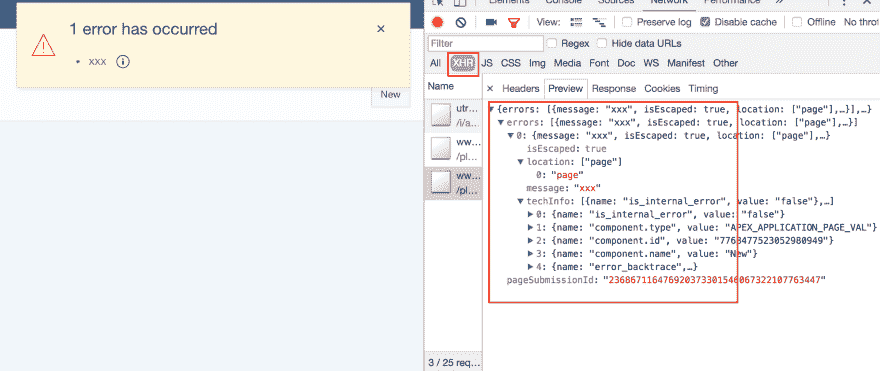
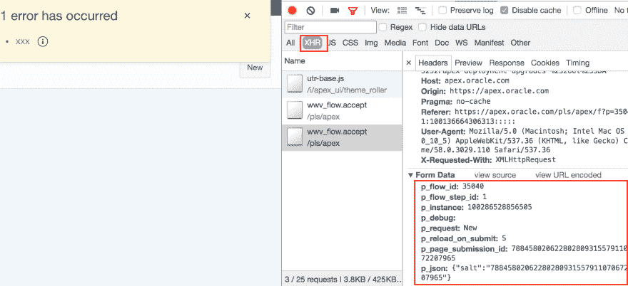
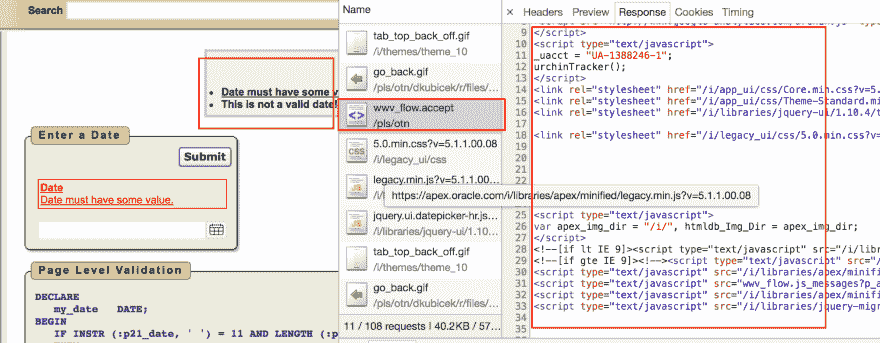
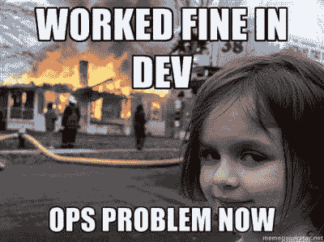

# orclapex 5.x 页面验证(升级概念)

> 原文:[https://dev . to/isabolic 99/orclapex-5x-page-validations-upgraded-concept](https://dev.to/isabolic99/orclapex-5x-page-validations-upgraded-concept)

首先，让我明确这是观察站和某种解决方法。上周，我分析了在 apex 4.x 上创建并导入 apex 5 的 apex 应用程序。应用程序已成功导入，我知道我**不能使用通用主题功能**(例如模板选项)。现在是有趣的部分，那就是**验证过程/执行**。这改变了 apex 5 中的**，但对于导入的应用程序，它并没有停留在 **apex 4“模式”**。
以下是解释:
在 apex 4.x 中验证在页面提交后呈现为 html 区域，但在 apex 5 中验证实际上是由 javascript 应用的。在提交页面之前，有一个 AJAX 调用返回带有错误的 JSON 数组。看看下面的例子..**

 **apex 中的示例 5:
[](https://res.cloudinary.com/practicaldev/image/fetch/s--xsi_9xU6--/c_limit%2Cf_auto%2Cfl_progressive%2Cq_auto%2Cw_880/https://thepracticaldev.s3.amazonaws.com/i/v49wh1deiv7oscchn2yi.png)
[](https://res.cloudinary.com/practicaldev/image/fetch/s---fgQ9oNw--/c_limit%2Cf_auto%2Cfl_progressive%2Cq_auto%2Cw_880/https://thepracticaldev.s3.amazonaws.com/i/pf8r2qm39v5cma1hwx1q.png)
apex 中的示例 4:
[](https://res.cloudinary.com/practicaldev/image/fetch/s--MhiKNGJL--/c_limit%2Cf_auto%2Cfl_progressive%2Cq_auto%2Cw_880/https://thepracticaldev.s3.amazonaws.com/i/e7gz7xsf7jv9ka8ynrpf.png)
[](https://res.cloudinary.com/practicaldev/image/fetch/s--cSvPqN41--/c_limit%2Cf_auto%2Cfl_progressive%2Cq_auto%2Cw_880/https://thepracticaldev.s3.amazonaws.com/i/555zi8h9yqzth3pdi46r.png)

现在，在我们基于 apex 4 构建的应用程序中，我们隐藏了验证区域，并在页面提交后使用**jquery jgrow 插件**显示验证。

*   [jquery jgrow github 链接](https://github.com/stanlemon/jGrowl)
*   [jgrow 的例子](http://jsbin.com/iqipox/1/edit?html,output)

当我们迁移到 apex 5 时，没有显示消息，原因是 AJAX 调用..

```
<script type="text/javascript"> 
$(document).ready(function() { 
  $.jGrowl($('#static-id-of-val-region').html()); 
}); 
</script> 
```

<svg width="20px" height="20px" viewBox="0 0 24 24" class="highlight-action crayons-icon highlight-action--fullscreen-on"><title>Enter fullscreen mode</title></svg> <svg width="20px" height="20px" viewBox="0 0 24 24" class="highlight-action crayons-icon highlight-action--fullscreen-off"><title>Exit fullscreen mode</title></svg>

解决方案是我将页面初始化的代码(上面的代码片段)改为:

```
<script type="text/javascript"> 
apex.message.setThemeHooks({
    beforeShow: function(){ 
        $.jGrowl($('#static-id-of-val-region').html()); 
    }
}); 
</script> 
```

<svg width="20px" height="20px" viewBox="0 0 24 24" class="highlight-action crayons-icon highlight-action--fullscreen-on"><title>Enter fullscreen mode</title></svg> <svg width="20px" height="20px" viewBox="0 0 24 24" class="highlight-action crayons-icon highlight-action--fullscreen-off"><title>Exit fullscreen mode</title></svg>

在验证显示之前，我在 **apex.messages** 上应用了回调。
关于这个的更多信息可以在 [apex JS 文档](https://docs.oracle.com/database/apex-5.1/AEAPI/apex-message-namespace.htm#AEAPI-GUID-35AF8B30-48DF-44CC-9329-90C054C3D666)中找到

我还发现，在页面登录时，他们使用“旧”的方法，他们呈现验证区域，所以 **setThemeHooks** 在这里不起作用...

我做了一些思考，想出了这个关于 apex js API 的场景:
你在开发环境上有 apex 5。(因为开发速度更快)和一些旧的 apex 4 生产环境。由于某种原因，它不会在近期功能升级。您使用一些仅在 apex 5 中可用的特定 apex JS API，并将该代码部署到 apex 4 生产环境中。然后有趣的事情开始了，:D

[T2】](https://res.cloudinary.com/practicaldev/image/fetch/s--3y-wxi6C--/c_limit%2Cf_auto%2Cfl_progressive%2Cq_auto%2Cw_880/https://thepracticaldev.s3.amazonaws.com/i/adxe164qnpk076pm23dj.jpg)

非常感谢我们糟糕的组织，我们只在生产上直接支持我们的客户...；)**