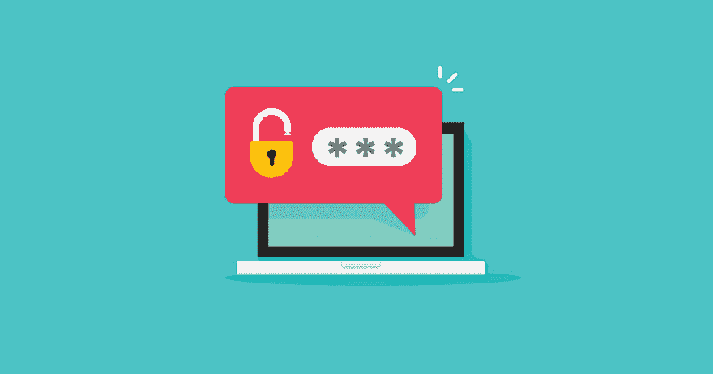
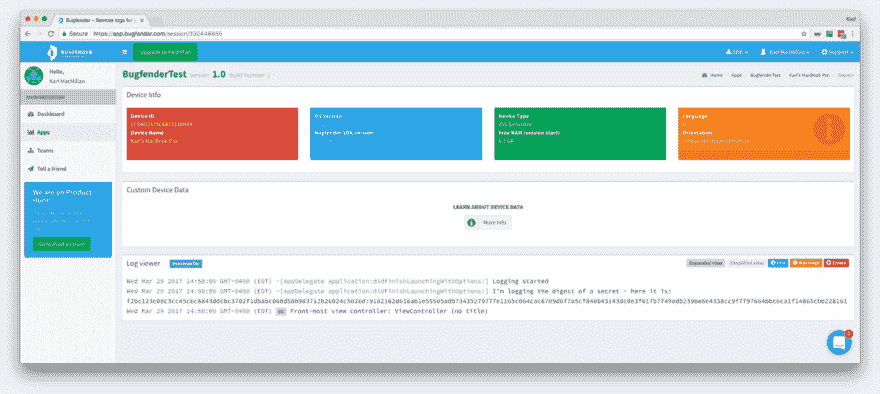

# 远程调试移动应用程序时不要记录什么

> 原文:[https://dev . to/bugfenderapp/what-not-to-log-when-remote-debugging-mobile-apps](https://dev.to/bugfenderapp/what-not-to-log-when-remotely-debugging-mobile-apps)

在 Bugfender，我们显然认为记录是一个好主意。这就是为什么我们想讨论不记录什么可能会令人惊讶，但这就是本文的主题(以及记录敏感信息的替代方法，有助于调试)。有些东西过于敏感(如访问令牌)，而其他东西则受隐私或安全法规的约束(如医疗信息或信用卡——在美国分别由 [HIPPA](https://en.wikipedia.org/wiki/Health_Insurance_Portability_and_Accountability_Act) 和 [PCI DSS](https://en.wikipedia.org/wiki/Payment_Card_Industry_Data_Security_Standard) 监管)。

## 但是 Bugfender 不安全吗？

当然啦！在 Bugfender 我们非常重视安全。当您使用我们的 web 应用程序查看日志时，我们会小心地对移动设备和 Bugfender 之间传输的数据进行加密。此外，所有日志数据都是私有的，只能由您帐户上的授权用户查看(尽管在特殊情况下——如客户支持或维护—[,如有必要，我们可能会查看日志](http://support.bugfender.com/security-and-compliance/do-bugfender-staff-have-access-to-my-logs))。

但是，限制安全关键数据或私有数据的存储位置仍然是一个好主意。部分原因是它减少了发生违规时暴露的机会。还因为开发人员或管理员可能不会像保护密码数据库或数据库中的个人信息那样保护日志。将日志数据粘贴到电子邮件中或附加到错误报告中实在是太容易了。如果你的日志没有敏感信息，那么日常管理起来就容易多了。

涉及的系统越多，法规遵从性也越复杂。虽然我们的内部版本[包括 HIPPA 合规性的技术保护措施](http://support.bugfender.com/security-and-compliance/hipaa-compliance)，但自助云版本尚未满足所有非技术要求。此外，我们目前在多个地点的数据中心运营(目前在[和](http://support.bugfender.com/security-and-compliance/in-which-country-are-logs-stored)美国和欧洲)，这可能会使法规合规性变得复杂。如果您有特定的安全要求，请[联系我们](#)(继续阅读可能满足您部分要求的提示)。但总的来说，不记录敏感信息更容易避免监管问题。

[T2】](https://res.cloudinary.com/practicaldev/image/fetch/s--BsBZ5eTZ--/c_limit%2Cf_auto%2Cfl_progressive%2Cq_auto%2Cw_880/https://bugfender.com/wp-content/uploads/2017/06/what-not-to-log-passwords.jpg)

## 不应记录的信息

那么我们谈论的不记录的是什么样的敏感信息呢？这里有一个简短的列表可以帮助你开始。

**明文密码或 API 秘密**–你应该[永远不要在任何系统上存储明文密码](http://blog.moertel.com/posts/2006-12-15-never-store-passwords-in-a-database.html)。不仅会削弱你系统的安全性，而且由于[用户经常重复使用密码](https://www.entrepreneur.com/article/246902)，会削弱其他系统的安全性。

**API 机密和数据库密码**–API 机密用于向您自己的或第三方 API 验证您的应用，应与明文密码类似对待(尽管它们需要存储一次，以便您可以使用)。永远记住，如果可能的话，在你的移动应用中使用 API 令牌的公共版本(例如， )。

**访问令牌**–您提供给用户用于验证后续会话的任何令牌或 cookie 通常不应记录或存储在除您的数据库和需要它们的客户端之外的任何地方。

**个人身份信息**–尽可能不要存储除您分配给他们的用户 id 之外的用户信息。对于电话号码、地址和政府 ID 号等信息来说尤其如此。此外，美国法规，如 [COPA](https://en.wikipedia.org/wiki/Child_Online_Protection_Act) 有时会限制与第三方共享孩子的个人信息。

**银行账户或支付信息**–不应记录信用卡号码或其他支付信息。

**用户输出的信息不在收集范围内**–这取决于管辖区域和应用程序，但切记不要记录用户选择不收集的任何信息。如果用户要求不被跟踪，这可能包括某些形式的活动和会话信息。

[T2】](https://res.cloudinary.com/practicaldev/image/fetch/s--G6ScUjAX--/c_limit%2Cf_auto%2Cfl_progressive%2Cq_auto%2Cw_880/https://bugfender.com/wp-content/uploads/2017/06/what-not-to-log-debugging.jpg)

## 不会日志怎么调试？

现在，遵循这些建议有时会使调试变得非常痛苦。如果我需要知道访问令牌是否存储正确，或者在不记录用户姓名或电子邮件地址的情况下识别用户，该怎么办？

一种解决方案是存储数据的散列而不是数据本身。这允许您在不记录实际数据的情况下，验证客户机是否拥有您认为它拥有的数据。相反，您记录散列函数的输出，即摘要，让您检查数据的有效性。

请注意，要做到这一点，您还必须知道在查看日志时要验证的数据。这不是加密。您必须知道这些数据，这样您才能独立地对其进行哈希处理，以便与客户端记录的摘要进行比较。

### 哈希日志条目如何工作

假设您在客户机上存储了一个秘密(例如，“某个秘密”)。你不想记录它，因为那会泄露秘密。因此，您可以用秘密的摘要(例如，“4a 4184 feb 9301962444895 AC 72e 15 cc 17 a 73 b 82 b”)来替换它，并记录下来。

因为您也知道这个秘密，所以当您查看日志时，您可以独立地散列这个秘密，并将摘要与记录的内容进行比较。如果摘要匹配，您就知道客户机正确地存储了秘密。如果没有，那么你可以去做一些调试工作。

就示例 iOS 代码而言，它看起来像这样(我们稍后将看到其背后的实现):

```
BFLog(@"Logging started");
// HashLogEntry hashes the input string and returns the digest
NSString *digestOfSecretToBeLogged = HashLogEntry(@"SOME_SECRET");
BFLog(@"I'm logging the digest of a secret - here it is: %@", digestOfSecretToBeLogged);
```

And the log output looks like this:

```
2017-03-29 14:57:59.549 BugfenderBlog[9383:403] Logging started
2017-03-29 14:57:59.554 BugfenderBlog[9383:403] I'm logging the digest of a secret - here it is: f2bc123c08c3cc45c6c8843ddcbc3702f1dbabc068d58b903712b26024c5026d:9182162d616ab1e55505adb73439279777e1165c064cac6709d6f7a5cf840043143dc0e3f617b7f49edb239be6e4338cc9f7f97664bbc6ca1f14865cbb228161

```

您会在 Bugfender 仪表板中看到同样的内容:

[T2】](https://res.cloudinary.com/practicaldev/image/fetch/s--nUceLglU--/c_limit%2Cf_auto%2Cfl_progressive%2Cq_auto%2Cw_880/https://bugfender.com/wp-content/uploads/2017/06/what-not-to-log.jpg)

然后，您可以从日志中复制散列秘密，然后检查它(这里使用一个小 Python 脚本):

```
./check_hash.py "SOME_SECRET" "f2bc123c08c3cc45c6c8843ddcbc3702f1dbabc068d58b903712b26024c5026d:9182162d616ab1e55505adb73439279777e1165c064cac6709d6f7a5cf840043143dc0e3f617b7f49edb239be6e4338cc9f7f97664bbc6ca1f14865cbb228161"
hash matches
```

输出“hash matches”表示日志包含传递给脚本的相同秘密。

### 为什么记录散列(通常)是安全的

散列背后的基本思想是用散列函数将输入值映射到输出摘要。这就是您最喜欢的编程语言的哈希表、映射或字典中经常使用的哈希函数的工作方式。它们允许您用固定大小的摘要(只是一个十六进制的长数字)替换一个值——无论该值是一个简单的数字、一长串文本还是大量的二进制数据。

[加密哈希](https://en.wikipedia.org/wiki/Cryptographic_hash_function)的工作方式相同，只是它们有一些在安全上下文中有用的附加属性:

*   单向——给定一个值的散列，确定输入是不可行的。“不可行”是密码学家喜欢说的低调说法，“这需要一个巨大的数据中心长时间工作”。"
*   抗冲突——找到映射到散列摘要的两个不同的输入是不可行的(这个词又出现了)。
*   输入的小变化会导致摘要的大变化，使输入看起来不相关。

这些属性使得攻击者很难获取摘要并确定输入是什么。这正是我们在这里所需要的:我们需要能够以一种不暴露我们已经记录的内容的方式记录输出。

现在，有一个很大的警告。虽然“从哈希值确定输入是不可行的，但是如果您知道输入可能是什么，您基本上可以猜测它是否是您认为的那样。这就是密码破解的工作原理。[因为人们倾向于使用相似的密码](http://www.networkworld.com/article/2872085/microsoft-subnet/25-most-commonly-used-and-worst-passwords-of-2014.html)(“123456 有人吗？qwerty？老实点！)，可以编写软件，根据散列密码数据库尝试所有常用密码及其变体。所以不要在容易猜测的数据上使用这种技术。

密码哈希还使用各种技巧来增加破解密码的难度。我不打算在这里详细介绍它是如何工作的——如果你有兴趣的话，请随意阅读。

### 示例代码

下面是与上面描述相匹配的示例代码。请随意在您的任何项目中使用它。

[gist.github.com/adchsm/39c4cfe60eba0749580acd84c34fa862](https://gist.github.com/adchsm/39c4cfe60eba0749580acd84c34fa862)

[gist.github.com/adchsm/9febef7b62198c89f0c75a4fc04a7b32](https://gist.github.com/adchsm/9febef7b62198c89f0c75a4fc04a7b32)