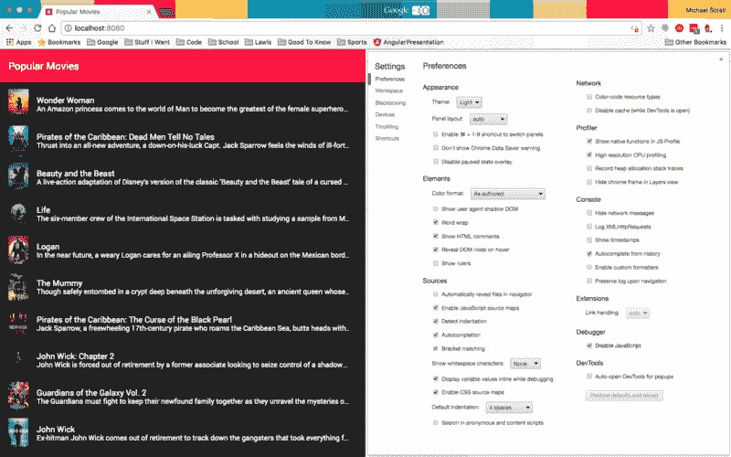
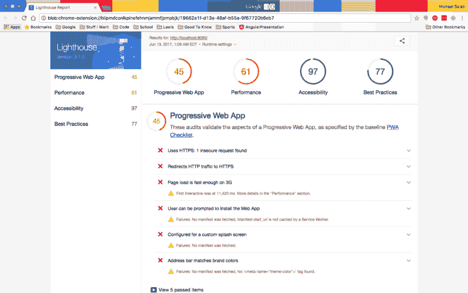
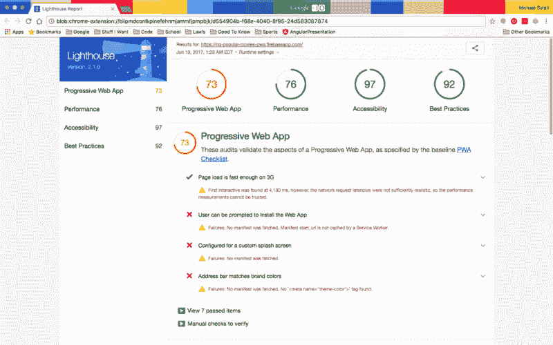

# 有角度的 PWAs:速度快

> 原文：<https://dev.to/michaelsolati/pwas-with-angular-beingfast>

本周早些时候，我们开始将一个基本的 Angular 应用程序转变为一个渐进式的 Web 应用程序([你可以在这里赶上](https://dev.to/michaelsolati/pwas-with-angular-beingreliable))。现在我们有了一个*可靠*的应用程序，即使没有网络也能从缓存中加载内容，让我们的应用程序变得更快吧！

* * *

```
git clone --branch v1.0 https://github.com/MichaelSolati/ng-popular-movies-pwa.git
cd ng-popular-movies-pwa
npm install 
```

*这个应用依赖于[电影](https://www.themoviedb.org/)的 API。获取一个 API 键( [check this out](https://www.themoviedb.org/faq/api?language=en) )并将其作为 moviedb 环境变量放入您的* `src/environments/environment.ts` *和* `src/environments/environment.prod.ts` *中。*

让我们运行我们的应用程序`npm run start:pwa`，然后在浏览器中禁用 JavaScript。我们用户得到的只是一个黑屏:

[T2】](https://res.cloudinary.com/practicaldev/image/fetch/s--A2FLZd_---/c_limit%2Cf_auto%2Cfl_progressive%2Cq_auto%2Cw_880/https://cdn-images-1.medium.com/max/800/1%2AGajqzGUfO8nvCuWVxivk-Q.png)

这绝对不是 PWA 的行为，实际上这又回到了我们上一个关于拥有一个*可靠的*应用程序的话题。所以让我们用上次添加到应用程序中的`ng-pwa-tools`包中的一个工具来解决这个问题。具体来说，我们将使用`ngu-app-shell`工具。

首先，我们将进入`src/app/app.module.ts`文件，并将第 22 行的`BrowserModule`导入更改为`BrowserModule.withServerTransition({ appId: 'ng-popular-movies-pwa' })`。(`withServerTransition()`函数将我们基于浏览器的应用程序配置为从预先呈现的页面进行转换，细节将在后面介绍)现在让我们运行我们的`ngu-app-shell`。

```
./node_modules/.bin/ngu-app-shell --module src/app/app.module.ts 
```

你应该看到登录到你的终端我们的整个家庭路线呈现出来！我们所有的 HTML、CSS 甚至数据都是从 MovieDB 中抓取的。我们的`ngu-app-shell`所做的是以与 [Angular Universal](https://universal.angular.io/) 相同的方式预先绘制出我们的索引路线。

有了预先呈现的回家路线，我们就不必担心用户是否禁用了 JavaScript，或者下载和执行 JS 包是否需要一段时间。我们已经将内容呈现为 HTML。所以我们可以使用`ngu-app-shell`用一个呈现出来的页面替换空的`dist/index.html`。

```
./node_modules/.bin/ngu-app-shell --module src/app/app.module.ts \
   --out dist/index.html 
```

现在，让我们将我们的`npm`脚本更新如下。

```
{
    "ng": "ng",
    "start": "ng serve",
    "start:pwa": "npm run build && cd dist && http-server",
    "build": "ng build --prod && npm run ngu-app-shell && npm run ngu-sw-manifest",
    "test": "ng test",
    "lint": "ng lint",
    "e2e": "ng e2e",
    "ngu-app-shell": "./node_modules/.bin/ngu-app-shell --module src/app/app.module.ts --out dist/index.html",
    "ngu-sw-manifest": "./node_modules/.bin/ngu-sw-manifest --module src/app/app.module.ts --out dist/ngsw-manifest.json"
} 
```

[T2】](https://res.cloudinary.com/practicaldev/image/fetch/s--rmxT5-0Y--/c_limit%2Cf_auto%2Cfl_progressive%2Cq_auto%2Cw_880/https://cdn-images-1.medium.com/max/800/1%2AMW2Lgt1KeF17YKw8weVSXg.png)

当我们的用户禁用 JavaScript 时，这不仅是一个更好的体验，也是一个本质上更快的过程。当我们将已经呈现的页面传递给用户时，我们不需要等待代码运行。相反，我们在 HTML 加载时就给用户一些东西，然后让我们的`BrowserModule`在我们的 Angular 应用程序中转换，以替换呈现的内容。

* * *

另一种提高应用程序速度的方法是“延迟加载”应用程序的某些部分。在 Angular 中，我们可以延迟加载模块，这实质上意味着我们可以将相关的代码片段组合在一起，并按需加载这些片段。延迟加载模块减少了启动时间，因为它不需要一次加载所有内容，只需要用户*在应用首次加载时需要*看到的内容。

在我们当前的结构中，我们只有两条路线，一个模块，和本质上的两个组件(我排除了`AppComponent`，因为它所做的只是提供我们的导航栏)。因此，让我们为我们的`HomeComponent`和`MovieComponent`创建一个新模块，并将组件放入这些模块中。

```
ng g m home
ng g m movie 
```

接下来让我们把`src/app/home/home.module.ts`改成这样。

```
import { NgModule } from '@angular/core';
import { CommonModule } from '@angular/common';
import { MaterialModule } from '@angular/material';
import { RouterModule } from '@angular/router';

import { HomeComponent } from './home.component';

@NgModule({
  declarations: [
    HomeComponent
  ],
  imports: [
    CommonModule,
    MaterialModule,
    RouterModule.forChild([
      { path: '', pathMatch: 'full', component: HomeComponent }
    ])
  ]
})
export class MovieModule { } 
```

现在我们将改变我们的`src/app/movie/movie.module.ts`，使它类似于我们的`HomeModule`。

```
import { NgModule } from '@angular/core';
import { CommonModule } from '@angular/common';
import { MaterialModule } from '@angular/material';
import { RouterModule } from '@angular/router';

import { MovieComponent } from './movie.component';

@NgModule({
  declarations: [
    MovieComponent
  ],
  imports: [
    CommonModule,
    MaterialModule,
    RouterModule.forChild([
      { path: '', pathMatch: 'full', component: MovieComponent }
    ])
  ]
})
export class MovieModule { } 
```

我们还应该更新`src/app/app-routing.module.ts`,以反映我们将从我们的模块中延迟加载我们的路线。

```
import { Routes, RouterModule } from '@angular/router';

const routes: Routes = [
  {
    path: '',
    loadChildren: 'app/home/home.module#HomeModule'
  }, {
    path: 'movie/:id',
    loadChildren: 'app/movie/movie.module#MovieModule'
  }, {
    path: 'movie',
    redirectTo: '/',
    pathMatch: 'full'
  }, {
    path: '**',
    redirectTo: '/'
  }
];

export const routing = RouterModule.forRoot(routes); 
```

最后，我们将更新我们的`src/app/app.module.ts`来反映我们的新`routing`，并删除我们组件的任何引用。

```
import { BrowserModule } from '@angular/platform-browser';
import { BrowserAnimationsModule } from '@angular/platform-browser/animations';
import { NgModule } from '@angular/core';
import { HttpModule } from '@angular/http';
import { MaterialModule } from '@angular/material';

import { MoviesService } from './services/movies.service';
import { NavbarService } from './services/navbar.service';

import { routing } from './app-routing.module';
import { AppComponent } from './app.component';

@NgModule({
  declarations: [
    AppComponent
  ],
  imports: [
    BrowserModule.withServerTransition({ appId: 'ng-popular-movies-pwa' }),
    HttpModule,
    BrowserAnimationsModule,
    MaterialModule,
    routing
  ],
  providers: [
    MoviesService,
    NavbarService
  ],
  bootstrap: [AppComponent]
})
export class AppModule {
  constructor(private _moviesService: MoviesService, private _navbarService: NavbarService) { }
} 
```

* * *

通过预渲染我们的家庭路线以及延迟加载我们所有的路线，我们不仅能够使我们的应用程序*更快*，而且能够使*更可靠*！虽然这个应用程序可能没有多少路径可以让延迟加载从我们的初始加载时间中节省几秒钟，但是对于更大的应用程序来说，它肯定可以。

通过在我们当前的应用程序上运行 Lighthouse 测试，我们可以看到我们的 PWA 和性能分数分别从 36 分(采用上一篇文章中没有使用部署的应用程序的分数)上升到 45 分和 61 分。

[T2】](https://res.cloudinary.com/practicaldev/image/fetch/s--bSBsDB0m--/c_limit%2Cf_auto%2Cfl_progressive%2Cq_auto%2Cw_880/https://cdn-images-1.medium.com/max/800/1%2Aumit5ddO5DumvUlq-OI0Ow.png)

* * *

你可以点击这里查看我们在代码中所做的修改。此外，如果您在我们应用程序的部署版本上运行 Lighthouse，您将开始得到如下所示的结果:

[T2】](https://res.cloudinary.com/practicaldev/image/fetch/s--pNvb10o0--/c_limit%2Cf_auto%2Cfl_progressive%2Cq_auto%2Cw_880/https://cdn-images-1.medium.com/max/800/1%2A2D9NiKu1sl5-vaXLlaHFRg.png)

* * *

该系列的最后一部分名为“有角度的 PWAs:正在进行中”，可在此处获得[。](https://dev.to/michaelsolati/pwas-with-angular-being-engaging)