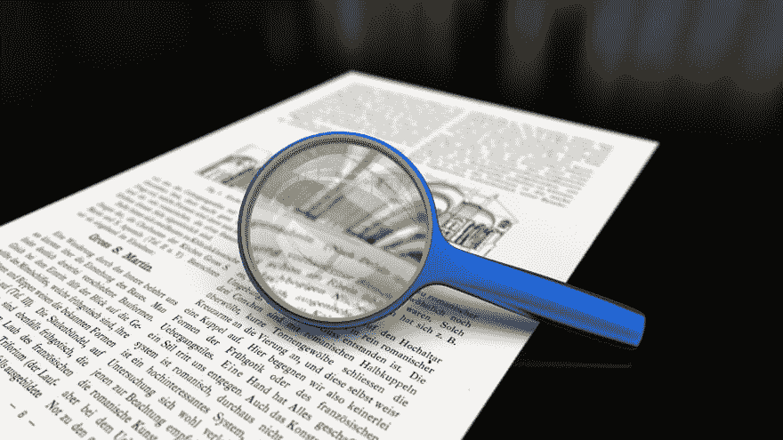
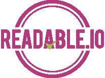
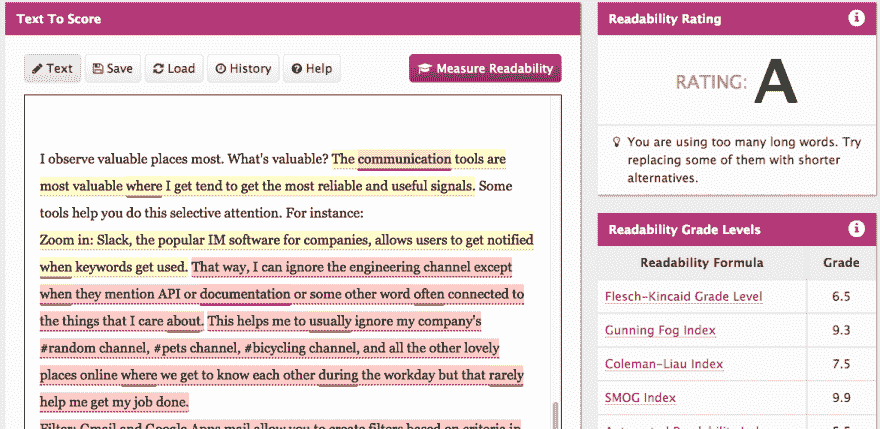

# 酷炫的可读性工具

> 原文:[https://dev.to/ryanhaber/cool-readability-tools](https://dev.to/ryanhaber/cool-readability-tools)

[T2】](https://res.cloudinary.com/practicaldev/image/fetch/s--l2xQlJqv--/c_limit%2Cf_auto%2Cfl_progressive%2Cq_auto%2Cw_880/http://api-ambassador.ghost.io/conteimg/2017/06/Magnifying_glass_with_focus_on_glass.jpg)

如果你想知道你的写作有多好，不要再想了。这里有两个很好的应用程序可以帮助你评估你的写作。

[T2】](http://www.hemingwayapp.com/)

海明威应用程序旨在提高你的写作水平。当然要半信半疑，因为是机器。请记住，你可能正试图完成一些不同于它试图做的事情。一般来说，它似乎有助于你写出非常干净、生动的散文。比如海明威。如果你想要华丽的诗歌，那么你应该在某个地方寻找狄更斯的应用程序。虽然我确实喜欢狄更斯，但他的作品并不是技术写作的好榜样。尤其是海明威应用程序，它给出了很多关于如何写出好的、干净的散文的好建议。

[T2】](https://readable.io/text/)

[Readable.io](https://readable.io/text/) 根据不同的学术尺度给你各种我不懂的评分来评估文本。但我所理解的是它给出的简单的字母等级。

它也给你一些统计反馈，比如你的单词中副词的百分比。

[T2】](https://res.cloudinary.com/practicaldev/image/fetch/s--oajxObcQ--/c_limit%2Cf_auto%2Cfl_progressive%2Cq_auto%2Cw_880/http://api-ambassador.ghost.io/conteimg/2017/06/readingScore.png)

没错，笨蛋。我得了 a。

一般来说，好的科技写作应该达到八到十年级的阅读水平。这是因为，如果没有对非常具有挑战性的文本进行持续的练习，我们的阅读水平往往会回到那个等级。这不是一件坏事。大多数在高中学习过《T2》的人仍然能够理解。但是对大多数人来说这很难，现在仍然如此。如果你在向人们解释技术材料，很容易让人觉得很复杂。那是偶然发生的。需要深思熟虑和技巧的是把复杂的事情搞清楚。

是的，我将把这些工具添加到[资源中，以学习科技写作](https://dev.to/ryanhaber/resources-to-learn-tech-writing-temp-slug-6364548)。

*本帖原载于[API-ambassador . ghost . io](http://api-ambassador.ghost.io/cool-readability-tools/)T3】*