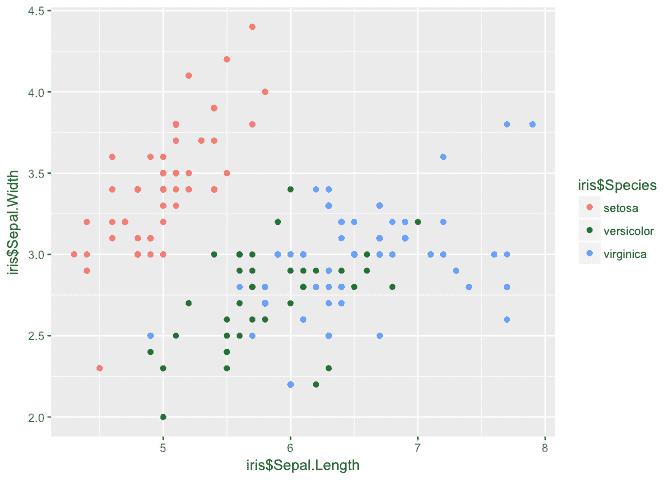
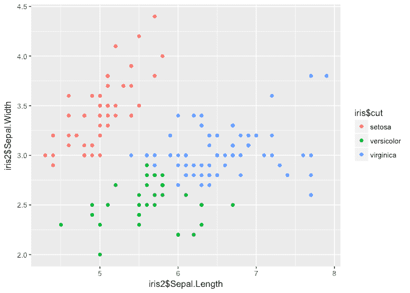
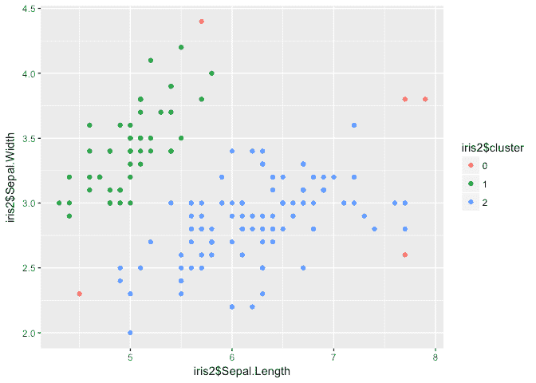
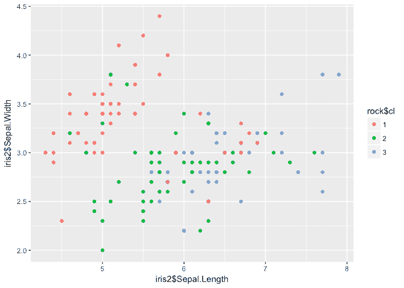

# R 中的聚类

> 原文:[https://dev.to/realest8agent/clustering-in-r](https://dev.to/realest8agent/clustering-in-r)

*最初发表于 [Wordpress。](realdataweb.wordpress.com)T3】*

大家好！在过去的几周里，我一直想发一篇新的博文。在那段时间里，我一直在研究集群。聚类或聚类分析是一种数据挖掘方法，它将相似的观察结果组合在一起。分类和聚类非常相似，但是聚类更关注探索而不是实际结果。

注意:这篇文章并没有详尽地介绍集群的所有功能。查看本指南了解更多信息。我正在读 Aggarwal 的[数据挖掘](http://www.springer.com/us/book/9783319141411)，内容非常丰富。

```
data("iris")  head(iris) 
```

```
##   Sepal.Length Sepal.Width Petal.Length Petal.Width Species
## 1          5.1         3.5          1.4         0.2  setosa
## 2          4.9         3.0          1.4         0.2  setosa
## 3          4.7         3.2          1.3         0.2  setosa
## 4          4.6         3.1          1.5         0.2  setosa
## 5          5.0         3.6          1.4         0.2  setosa
## 6          5.4         3.9          1.7         0.4  setosa 
```

为了简单起见，我们将使用`iris`数据集。我们将尝试使用数字数据，按照物种对观察结果进行正确分组。数据集中每个物种有 50 个，所以理想情况下，我们最终会有三个 50 个的集群。

```
library(ggplot2)  ggplot()  +  geom_point(aes(iris$Sepal.Length,  iris$Sepal.Width,  col  =  iris$Species)) 
```

[T2】](https://res.cloudinary.com/practicaldev/image/fetch/s--XjVvpx-7--/c_limit%2Cf_auto%2Cfl_progressive%2Cq_auto%2Cw_880/https://thepracticaldev.s3.amazonaws.com/i/lx09d22op1zcvhdlfdg7.png)

如您所见，已经有一些分组出现。让我们先使用[层次聚类](https://en.wikipedia.org/wiki/Hierarchical_clustering)。

```
iris2  <-  iris[,c(1:4)]  #not going to use the `Species` column.  medians  <-  apply(iris2,  2,  median)  mads  <-  apply(iris2,2,mad)  iris3  <-  scale(iris2,  center  =  medians,  scale  =  mads)  dist  <-  dist(iris3)  hclust  <-  hclust(dist,  method  =  'median')  #there are several methods for hclust  cut  <-  cutree(hclust,  3)  table(cut) 
```

```
## cut
##  1  2  3 
## 49 34 67 
```

```
iris  <-  cbind(iris,  cut)  iris$cut  <-  factor(iris$cut)  levels(iris$cut)  <-  c('setosa',  'versicolor',  'virginica')  err  <-  iris$Species  ==  iris$cut  table(err) 
```

```
## err
## FALSE  TRUE 
##    38   112 
```

```
ggplot()  +  geom_point(aes(iris2$Sepal.Length,  iris2$Sepal.Width,  col  =  iris$cut)) 
```

[T2】](https://res.cloudinary.com/practicaldev/image/fetch/s--INcNrh5Y--/c_limit%2Cf_auto%2Cfl_progressive%2Cq_auto%2Cw_880/https://thepracticaldev.s3.amazonaws.com/i/3zbzrxhuf2jyo2l2mnd1.png)

这里的分组不错，但看起来算法在确定云芝色和弗吉尼亚色之间有些困难。如果我们用这些信息对观察结果进行分类，我们会得到大约 0.25 的错误率。让我们尝试另一种集群技术:DBSCAN。

```
library(dbscan) 
```

```
db  <-  dbscan(iris3,  eps  =  1,  minPts  =  20)  table(db$cluster) 
```

```
## 
##  0  1  2 
##  5 48 97 
```

```
iris2  <-  cbind(iris2,  db$cluster)  iris2$cluster  <-  factor(iris2$`db$cluster`)  ggplot()  +  geom_point(aes(iris2$Sepal.Length,  iris2$Sepal.Width,  col  =  iris2$cluster)) 
```

[T2】](https://res.cloudinary.com/practicaldev/image/fetch/s--u8vc-pB0--/c_limit%2Cf_auto%2Cfl_progressive%2Cq_auto%2Cw_880/https://thepracticaldev.s3.amazonaws.com/i/gl94ty69kkpkvdhignij.png)

DBSCAN 根据密度将点分为三个不同的类别:核心点、边界点和噪点。因此，云芝/海滨锦鸡儿集群被视为一个群体。由于我们的数据不是以密度有意义的方式构造的，所以 DBSCAN 在这里可能不是一个明智的选择。

让我们看看最后一个算法:岩石。不，不是那个摇滚。

```
library(cba) 
```

```
distm  <-  as.matrix(dist)  rock  <-  rockCluster(distm,  3,  theta  =  .02) 
```

```
## Clustering:
## computing distances ...
## computing links ...
## computing clusters ... 
```

```
iris$rock  <-  rock$cl  levels(iris$rock)  <-  c('setosa',  'versicolor',  'virginica')  ggplot()  +  geom_point(aes(iris2$Sepal.Length,  iris2$Sepal.Width,  col  =  rock$cl)) 
```

[T2】](https://res.cloudinary.com/practicaldev/image/fetch/s--G-ni0P6c--/c_limit%2Cf_auto%2Cfl_progressive%2Cq_auto%2Cw_880/https://thepracticaldev.s3.amazonaws.com/i/li2y4eoua2ocwshep56p.png)

```
err  <-  (iris$Species  ==  iris$rock)  table(err) 
```

```
## err
## FALSE  TRUE 
##    24   126 
```

虽然看起来可能不像，但岩石似乎在确定这些数据中的聚类方面做得最好——错误率降至 16%。通常这个方法是为分类数据保留的，但是因为我们使用了`dist`,所以它不会引起任何问题。

我一直在做一个项目，使用这些(和类似的)数据挖掘程序来探索空间数据和搜索不同的组。虽然对`iris`数据进行聚类可能并不那么有意义，但我认为这说明了聚类的威力。我还没有尝试过更高维的聚类技术，这可能会表现得更好。

有什么意见吗？有问题吗？对以后岗位的建议？我总是很高兴收到读者的来信；请联系我！

快乐聚类，

基弗