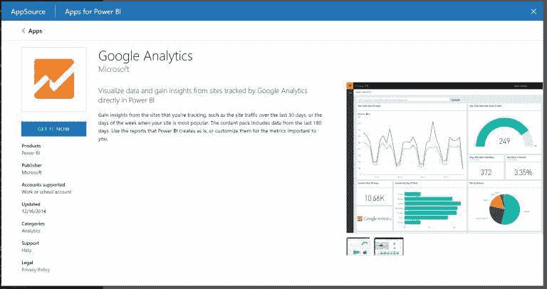

# 如何将 Power BI 数据添加到网页中？

> 原文:[https://dev . to/funky si1701/how-do-I-add-power-bi-data-to-a-网页-49f1](https://dev.to/funkysi1701/how-do-i-add-power-bi-data-to-a-webpage-49f1)

上周我谈到了 Power BI，它是什么，以及你可以使用它的一些不同的服务。本周，让我们将一些数据添加到一个简单的网页中。

对于这个例子，我将从这个网站的谷歌分析数据添加到这个页面。

第一次登录你的电源 BI[https://app.powerbi.com/](https://app.powerbi.com/)

单击左下角的获取数据链接。

单击我的组织，调出应用搜索框。

[T2】](https://res.cloudinary.com/practicaldev/image/fetch/s--NXEDcfgw--/c_limit%2Cf_auto%2Cfl_progressive%2Cq_auto%2Cw_880/https://dev-to-uploads.s3.amazonaws.com/uploads/articles/46c1lyxy053xcq66fowf.jpg)

点击应用选项卡，在搜索框中搜索“谷歌”，然后你应该看到谷歌分析，点击这个，然后点击立即获取按钮。

登录您的 google 帐户。如果你有多个谷歌账户，我发现最好注销所有账户，或者在一个匿名窗口运行。

登录后，您应该会看到您拥有的不同 google analytics 数据的列表，选择您想要使用的数据，然后单击导入。

Power BI 将离开并开始加载数据。

加载后，转到报告，并选择已经加载的谷歌分析。如果你有不止一个，给每个重新命名是个好主意，比如公司网站谷歌分析，博客谷歌分析，这样你就不会搞混了。

在“文件”菜单中选择“发布到 web ”,并同意您可以将其公开。

然后你会得到一段以< iframe 开始的 HTML 代码，把它复制到你的网页上。重新加载你的网页，你应该会看到类似下面我的东西。

应该注意的是，虽然您可以将包含 iframe 的网页隐藏在登录页面之后，但是如果您知道 iframe 中包含的 url，数据仍然可以被访问，这就是为什么链接可以通过电子邮件发送并继续工作。