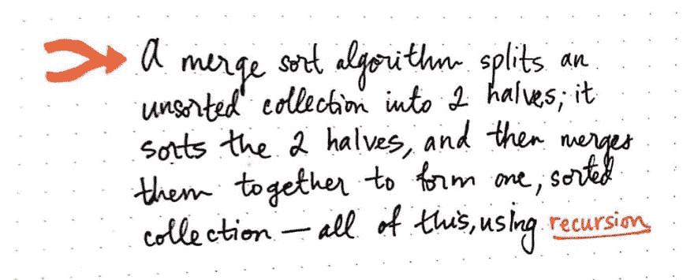
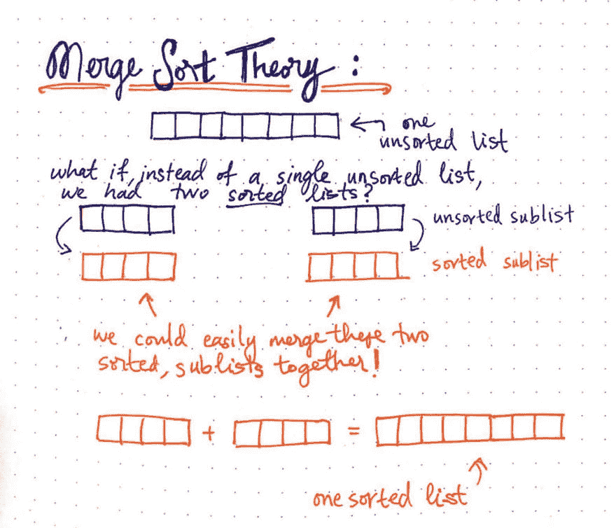
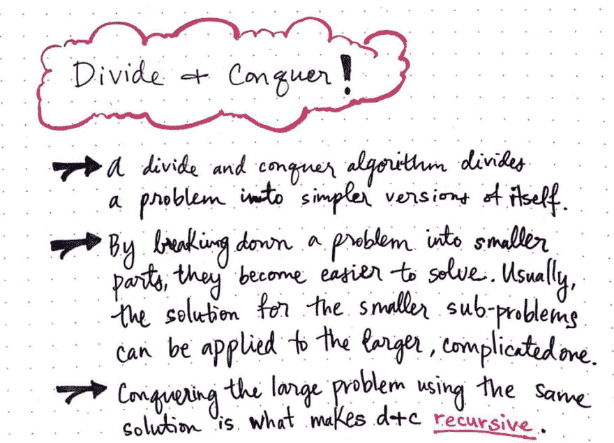
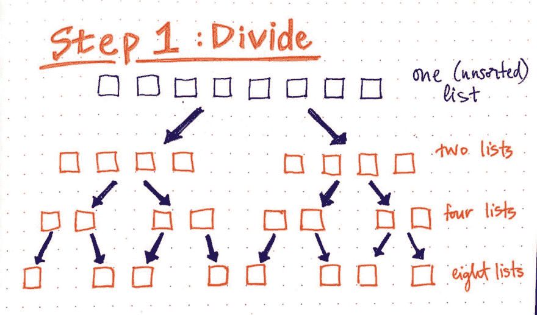
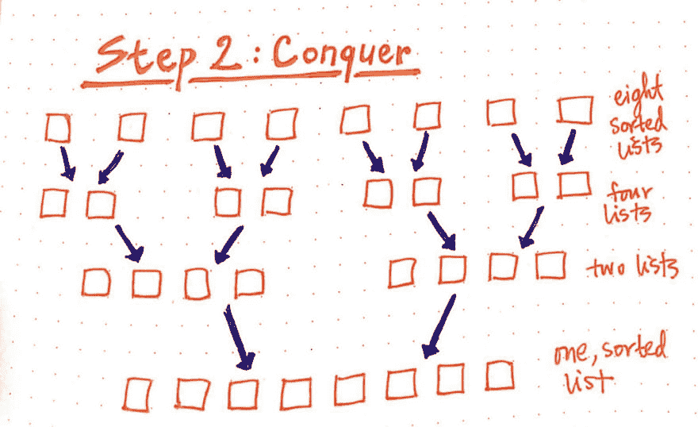
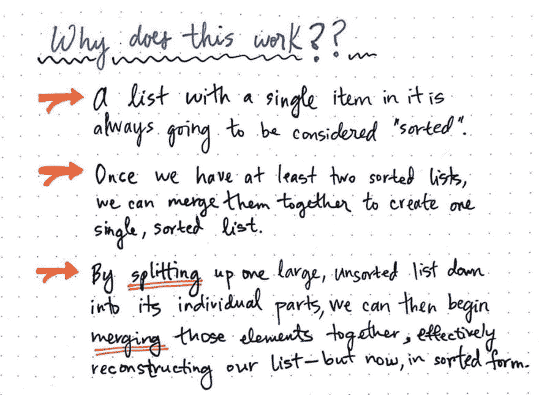
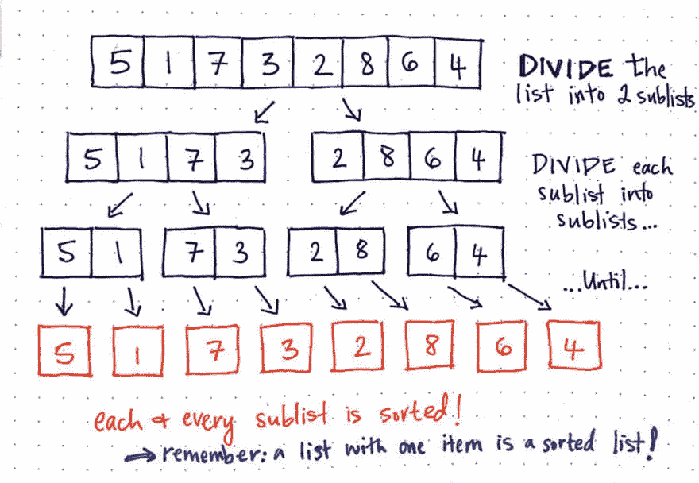
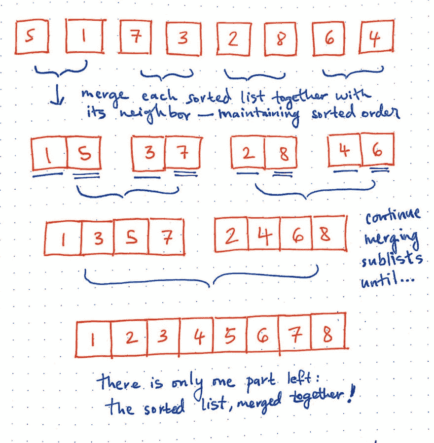
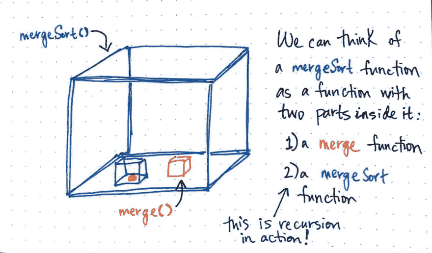
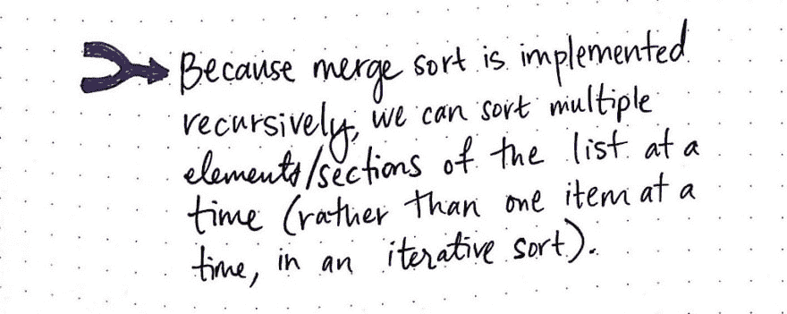

# 理解合并排序[第 1 部分]

> 原文:[https://dev . to/vaidehijoshi/making-sense-of-merge-sort-part-1](https://dev.to/vaidehijoshi/making-sense-of-merge-sort-part-1)

如果你一直在按顺序阅读这个系列，那么在过去的几周里，你很有可能已经比以前更多地思考了排序问题！至少，对我来说是这样的。我还没有开始梦想排序算法，但我期待它可能会很快发生。

你猜怎么着？我们还没有完成这个系列的一半———我们也还没有完成排序算法的一半！然而，我们*正处于*算法冒险的转折点。到目前为止，我们已经讨论了一些最常见的，有时被认为是更“简单”的排序算法。我们已经介绍了、[冒泡排序](https://dev.to/vaidehijoshi/bubbling-up-with-bubble-sorts)和[插入排序](https://dev.to/vaidehijoshi/inching-towards-insertion-sort)。如果你仔细观察这些算法，你可能会注意到一个模式:它们都非常慢。事实上，我们到目前为止探索的所有排序算法都有一个共同点:它们都非常低效！他们中的每一个，尽管有他们的小怪癖和差异，都有一个*二次*的运行时间；换句话说，使用大 O 符号，我们可以说它们的运行时间是*O(n \)*。

这种共性完全是有意的——惊讶吧！我们学习这些主题的顺序实际上非常重要:我们将讨论基于时间复杂度的排序算法。到目前为止，我们已经介绍了具有二次运行时复杂度的算法，但是从现在开始，我们将会看到速度更快、效率更高的算法。我们将从一个最有趣的(尽管有点复杂)排序算法开始。

别担心，我们会一步一步地分解它。我想第一步是告诉你这个算法叫什么！是时候让你见见我的新朋友了:归并排序。

### 分治算法

您可能在技术面试或计算机科学教科书的上下文中听到过对合并排序的讨论或引用。大多数计算机科学课程都花了相当多的时间来讨论这个话题，由于这样或那样的原因，这个特殊的算法似乎经常出现。

然而有趣的是，归并排序只是被发明(发现？)1945 年，由一位名叫[约翰·冯·诺伊曼](http://history-computer.com/ModernComputer/thinkers/Neumann.html)的数学家。总的来说，合并排序仍然是一种相当新的排序算法。但是等一下——我们还不知道它是什么！

好了，该下定义了。 ***归并排序算法*** 是一种将集合分成两半进行排序的排序算法。然后，它对这两部分进行排序，然后将它们合并在一起，以形成一个完全排序的集合。

<figure>[](https://res.cloudinary.com/practicaldev/image/fetch/s--S_zLMpwF--/c_limit%2Cf_auto%2Cfl_progressive%2Cq_auto%2Cw_880/https://cdn-images-1.medium.com/max/1024/1%2AT4lE_CveG7rAkEziwKtpAw.jpeg) 

<figcaption>合并排序:一个定义</figcaption>

</figure>

并且，在大多数合并排序的实现中，它使用*递归*来完成所有这些。但是现在保持这种想法——我们一会儿再回到递归。

> 合并排序背后的基本思想是这样的:对两个较小的排序列表进行排序比对一个较大的未排序列表进行排序容易得多。

我们已经看到，对一个庞大的、未排序的列表进行排序最终会变得很慢。如果我们回想一下[选择排序](https://dev.to/vaidehijoshi/exponentially-easy-selection-sort)，我们会遇到必须多次遍历列表、选择最小的元素并将其标记为“已排序”的问题。使用[冒泡排序](https://dev.to/vaidehijoshi/bubbling-up-with-bubble-sorts)，我们又不得不多次遍历列表；每次，我们一次只比较两个元素，然后交换它们。冒泡排序显然更慢，因为我们必须进行如此多的交换！然后是[插入排序](https://dev.to/vaidehijoshi/inching-towards-insertion-sort)，如果我们的列表已经排序完毕，这是可以接受的。但如果不是，那么我们基本上被迫遍历一个列表，一次一个项目，慢慢地取出最小的元素，并将其插入到排序数组中的正确位置。

这就是合并排序与所有其他排序算法的根本区别。让我们看一个例子来帮助说明这一点。

<figure>[](https://res.cloudinary.com/practicaldev/image/fetch/s--1TlmYNg0--/c_limit%2Cf_auto%2Cfl_progressive%2Cq_auto%2Cw_880/https://cdn-images-1.medium.com/max/1024/1%2AZFpPwH6_ssRu5p8tM9T-vQ.jpeg) 

<figcaption>归并排序理论:它是如何实现的？</figcaption>

</figure>

在这张图片中，我们有一个单一的、未排序的列表。从概念上讲，合并排序断言，对两个*排序的*列表进行排序和合并要容易得多，而不是一个未排序的列表。这个想法是，如果我们可以神奇地得到两个排序的一半，那么我们可以很容易地将这两个排序的子列表合并在一起。最终，如果我们以一种聪明、有效的方式进行合并，我们可以在最后得到一个排序列表。

希望在这一点上，你想知道合并排序是如何“神奇地”将我们的列表分成两半并排序的。

> 等一下——我们是程序员！本质上，我们知道，在一天结束时，这里真的没有魔法。引擎盖下还有别的东西，很可能是别的东西的抽象。

在合并排序的情况下，这种抽象被称为*(有时被称为 ***d & c*** )。分而治之技术实际上是一种*算法设计范例*，这实际上只是一种花哨的说法，它是许多算法使用的一种设计模式！事实上，我们之前已经看到过这个范例，早在我们第一次学习二分搜索法算法的时候。*

 *那么，分而治之的模式到底意味着什么呢？首先，使用分治策略的算法是将问题分成更小的子问题。换句话说，*它将问题分解成更简单的版本*。

d&c 算法的基本步骤可以归结为以下三个步骤:

1.  **划分**将问题分解成尽可能最小的“子问题”，类型完全相同。
2.  征服首先解决最小的子问题。一旦你想出了一个可行的解决方案，使用完全相同的技术来解决更大的子问题——换句话说，递归地解决子问题。
3.  将答案结合起来，构建更小的子问题，直到你最终将相同的解决方案应用到更大、更复杂的问题中。

<figure>[](https://res.cloudinary.com/practicaldev/image/fetch/s--gk9jzT7I--/c_limit%2Cf_auto%2Cfl_progressive%2Cq_auto%2Cw_880/https://cdn-images-1.medium.com/max/1024/1%2A34hoECtIduXaHJOM3I7Z_Q.jpeg) 

<figcaption>各个击破的规则算法</figcaption>

</figure>

分而治之算法的关键在于这样一个事实，即如果你能弄清楚如何将一个复杂的问题分割成更小的部分，那么解决它会容易得多。通过把问题分解成各个部分，问题会变得更容易解决。通常，一旦你想出如何解决一个“子问题”，那么你就可以将那个*精确的*解决方案应用到更大的问题上。正是这种方法使得递归成为 d & c 算法的首选工具，这也是合并排序是递归解决方案的一个很好的例子的原因。

### (算法中的点状递归)百搭

从理论上理解分而治之是一回事，但如果我们能在实践中看到它，它的有用性会更加明显。让我们来看看如何使用递归来分而治之的虚幻合并排序算法！

<figure>[](https://res.cloudinary.com/practicaldev/image/fetch/s--VW1P7z6M--/c_limit%2Cf_auto%2Cfl_progressive%2Cq_auto%2Cw_880/https://cdn-images-1.medium.com/max/1024/1%2A1IIg51aqZDJE2gwnfvJ1pQ.jpeg) 

<figcaption>合并排序:in 练习</figcaption>

</figure>

理论上，我们知道合并排序将一个未排序的列表分开，排序两半，然后将它们合并在一起。

但是这个算法实际上是如何工作的呢？

好了，现在我们知道了幕后的“魔法”到底是什么——也就是说，负责排序两个子列表的抽象——我们终于可以尝试并理解它是如何工作的了。是时候让我们将分而治之的范式应用到合并排序中，并弄清楚这个算法内部到底发生了什么！

我们将从一个简单的例子开始，我们实际上还不会担心对任何值进行排序。现在，让我们试着理解分而治之的方法是如何发挥作用的。我们知道，首先需要将问题分解成尽可能小的完全相同类型的“子问题”。在我们的情况下，最小的可能“子问题”是我们的基本情况——我们已经基本上解决了我们的问题。就排序项目而言，基本情况是一个排序列表。因此，我们可以将我们的大问题(以及未排序的列表)分成最小的可能部分。

<figure>[](https://res.cloudinary.com/practicaldev/image/fetch/s--3h0udH2T--/c_limit%2Cf_auto%2Cfl_progressive%2Cq_auto%2Cw_880/https://cdn-images-1.medium.com/max/1024/1%2AGu7ROST8xBe8mpvwVd0nUg.jpeg) 

<figcaption>第一步:划分</figcaption>

</figure>

在上面的例子中，我们只是继续把我们的问题分成更小的子问题。我们从一个无序的列表开始。然后我们把它分成两个未排序的列表。我们可以进一步划分，分成四个列表。然后我们可以再把它分解成八个列表。此时，我们有八个列表，每个列表中只有*个*项。

这些不能再分了吧？所以，我们已经解决了最小可能的子问题，以及我们的基本情况:一个排序列表，其中只有一个条目。您可能还记得以前的排序算法，根据定义，只有一个条目的列表被认为是已排序的。这是因为没有别的东西——没有别的东西——可以和它相比！

好了，现在我们有八个*排序的*列表，每个列表中只有一个条目。

根据分治法，我们知道下一步是首先解决最小的子问题。一旦我们确定了一个可行的解决方案，我们将应用这个解决方案来解决更大的子问题——换句话说，我们将使用递归。

所以，让我们从一次结合(合并)两个项目开始。因为我们有八个排序列表，让我们把每个列表和它的邻居组合起来。当我们这样做时，我们将把这些项目按照正确的排序顺序排列。

<figure>[](https://res.cloudinary.com/practicaldev/image/fetch/s--qjYhEhWP--/c_limit%2Cf_auto%2Cfl_progressive%2Cq_auto%2Cw_880/https://cdn-images-1.medium.com/max/1024/1%2AweVLB4M6m9J7wiPZXDasrg.jpeg) 

<figcaption>第二步:征伐！</figcaption>

</figure>

不错！那真是太酷了。我们将八个排序列表合并在一起，创建了四个排序列表。然后我们把*那些*四个列表，合并在一起形成两个排序列表。

哦，等等——两个排序列表？等等……听起来很熟悉。我想我们刚刚发现了合并排序背后的“魔力”！多棒啊。！

现在，既然我们有两个排序列表，我们可以通过将它们合并到一起来完成合并排序。

<figure>[](https://res.cloudinary.com/practicaldev/image/fetch/s--mPmJI7Ie--/c_limit%2Cf_auto%2Cfl_progressive%2Cq_auto%2Cw_880/https://cdn-images-1.medium.com/max/1024/1%2AsqF24VkW6zydJ0yNnieq7w.jpeg) 

<figcaption>归并排序如何与递归一起工作？</figcaption>

</figure>

分而治之在实现合并排序时如此有效有几个原因。首先，根据定义，一个只有一个条目的列表是一个“排序的”列表，这个事实让我们很容易知道什么时候遇到了最小的可能的“子问题”。当这个算法在代码中实现时，这最终成为确定递归何时结束的基本情况。我们之前已经在[二叉树](https://dev.to/vaidehijoshi/leaf-it-up-to-binary-trees)的上下文中讨论过递归；在这种情况下，基本情况是单个叶节点——换句话说，当您无法将子树分解成任何更小的部分时。同样的想法也适用于此:当我们无法将列表分解成任何更小的部分，并且只有一个条目被排序时，我们就遇到了递归的基本情况。

分而治之的另一个原因是，一旦我们知道如何将两个项目合并在一起，并找出背后的逻辑，我们基本上可以继续重用相同的逻辑，并继续将其应用于我们合并在一起的每个构建的子列表。

> 这正是递归如此强大的原因:一旦我们知道了如何解决将两个列表合并在一起的问题，无论列表是只有一个元素还是有一百个元素都没有关系——我们可以在两种情况下重用相同的逻辑。

让我们再看一个例子——这一次，我们将使用我们试图排序的实际数字。在下图中，我们有一个包含八个数字的未排序列表。我们可以从将未排序的集合分成两个子列表开始。我们将继续分裂，直到我们找到基本情况。

<figure>[](https://res.cloudinary.com/practicaldev/image/fetch/s--g2Ld9HSC--/c_limit%2Cf_auto%2Cfl_progressive%2Cq_auto%2Cw_880/https://cdn-images-1.medium.com/max/1024/1%2Ap6pvuQ0mKCYkx3ZXv6ufgw.jpeg) 

<figcaption>合并排序进行中:步骤 1“划分</figcaption>

</figure>

好了，现在我们来看可能最小的子问题:八个列表，每个列表中都有一个排序后的条目。现在，我们只需要合并两个列表。我们将把每个排序列表和它的邻居合并在一起。当我们合并它们时，我们将检查每个列表中的第一项，并将两个列表组合在一起，以便每个元素都处于正确的排序顺序中。

很简单！我们有这个。

<figure>[](https://res.cloudinary.com/practicaldev/image/fetch/s--CvJuHzqJ--/c_limit%2Cf_auto%2Cfl_progressive%2Cq_auto%2Cw_880/https://cdn-images-1.medium.com/max/1024/1%2AV1QaE66T3SgIIO-jv0-fHw.jpeg) 

<figcaption>合并排序进行中:步骤 2“合并”</figcaption>

</figure>

太好了！一旦我们开始合并两个列表，当合并两个有序的子列表时，我们不需要考虑太多，不是吗？我们使用相同的技术来合并四个条目的列表，就像我们合并只有一个条目的列表一样。

好吧，插图很棒——但是这在代码中会是什么样子呢？如果我们在野外看到一个合并排序算法，我们怎么能发现它的递归部分呢？

### 递归在起作用

我们已经知道，递归算法是一种在概念上使用*相同的解决方案*来解决问题的算法。说到代码，这可以有效地转化为一个*自称的函数。*

在下面的代码中——改编自 Rosetta Code 的合并排序的 JavaScript 实现——我们可以看到合并排序函数实际上是*调用自己。*

```
function mergeSort(array) {
  // Determine the size of the input array.
  var arraySize = array.length;

  // If the array being passed in has only one element
  // within it, it is considered to be a sorted array.
  if (arraySize === 1) { 
    return; 
  }

  // If array contains more than one element,
  // split it into two parts (left and right arrays).
  var midpoint = Math.floor(arraySize / 2);
  var leftArray = array.slice(0, midpoint);
  var rightArray = array.slice(midpoint);

  // Recursively call mergeSort() on 
  // leftArray and rightArray sublists.
  mergeSort(leftArray);
  mergeSort(rightArray);

  // After the mergeSort functions above finish executing,
  // merge the sorted leftArray and rightArray together.
  merge(leftArray, rightArray, array);

  // Return the fully sorted array.
  return array;
}

function merge(leftArray, rightArray, array) {
  var index = 0;

  while (leftArray.length && rightArray.length) {    
    if (rightArray[0] < leftArray[0]) {
      array[index++] = rightArray.shift();
    } else {
      array[index++] = leftArray.shift();
    }
  }

  while (leftArray.length) {
    array[index++] = leftArray.shift();
  }

  while (rightArray.length) {
    array[index++] = rightArray.shift();
  }
} 
```

这里有几件事情，我们今天不会全部深入讨论(不要担心，我们下周会回来讨论它！).现在，让我们看看是什么使得这个算法在本质上是递归的。我们可以看到，我们接受一个输入数组，并尽可能靠近中心分割它，在这种情况下，我们称之为中点。

然后，我们取这两半(leftArray 和 rightArray)，我们实际上把它们作为新的输入数组传递给对 mergeSort 的内部调用。你猜怎么着？这是递归在起作用！

我们可以认为递归有点像[俄罗斯头巾娃娃—](https://www.google.com/search?q=babushka+dolls&source=lnms&tbm=isch&sa=X&ved=0ahUKEwiNwtCnhafUAhXIKWMKHYpvC8EQ_AUICygC&biw=1280&bih=634#imgrc=pv0kNXKNcXWAMM:)——或者像里面有小盒子的盒子。

<figure>[](https://res.cloudinary.com/practicaldev/image/fetch/s--OL6-euxD--/c_limit%2Cf_auto%2Cfl_progressive%2Cq_auto%2Cw_880/https://cdn-images-1.medium.com/max/1024/1%2Az5MT4e1sp1Lx3VBCrAgAWA.jpeg) 

<figcaption>在 mergeSort 函数的实现中递归是如何工作的</figcaption>

</figure>

mergeSort 函数最终包含两个函数:

1.  一个合并函数，它实际上将两个列表组合在一起，并按正确的顺序排序
2.  还有一个 mergeSort 函数，它会一次又一次地递归分割输入数组，也会一次又一次地递归调用 merge。

事实上，它是*,因为*合并排序是递归实现的，这使得它比我们迄今为止看到的其他算法更快。

<figure>[](https://res.cloudinary.com/practicaldev/image/fetch/s--P9QmWxUM--/c_limit%2Cf_auto%2Cfl_progressive%2Cq_auto%2Cw_880/https://cdn-images-1.medium.com/max/1024/1%2AoXvb3coX1acjONgeJqbJkQ.jpeg) 

<figcaption>递归 vs 迭代解法</figcaption>

</figure>

但这是为什么呢？合并排序到底要快多少？下周你会得到这两个问题的答案！在本系列的第 2 部分中，我们将研究合并排序的运行时复杂性，这种递归如何使它更有效，以及合并排序如何与其他算法相比较。在那之前——快乐融合！

### 资源

合并排序在计算机科学课程、技术面试甚至教科书中出现得相当多。对于这个特殊的算法，有大量的参考资料，因为它是一个更难理解的排序算法。如果其中一些对你来说仍然没有意义，或者如果你想看更多的例子，试着看看下面这些不同的资源。

1.  [二分搜索法&合并排序](https://www.andrew.cmu.edu/course/15-110-m12/applications/ln/Unit05PtBPtC.pdf)，卡耐基梅隆大学计算机科学系
2.  伊恩·福斯特
3.  [合并排序](https://www.youtube.com/watch?v=sWtYJv_YXbo)，哈佛 CS50
4.  [归并排序算法](https://www.youtube.com/watch?v=TzeBrDU-JaY)，mycodeschool
5.  [外部排序](http://www.geeksforgeeks.org/external-sorting/)，GeeksForGeeks

* * *

*本帖最初发表于[medium.com](https://medium.com/basecs/making-sense-of-merge-sort-part-1-49649a143478)T3】**