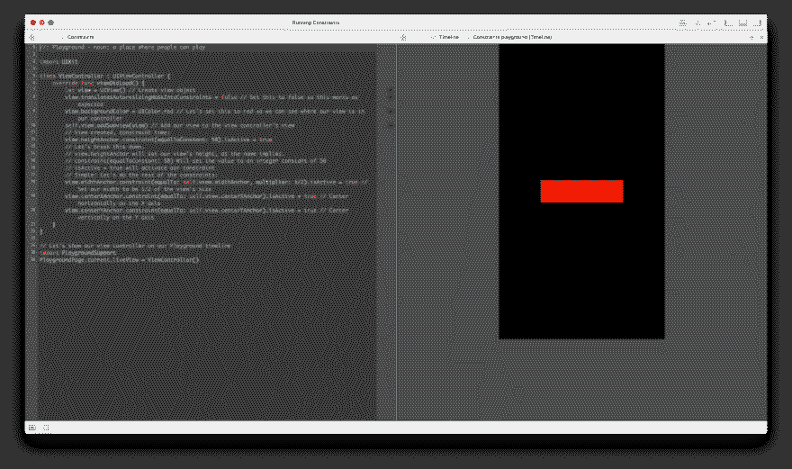
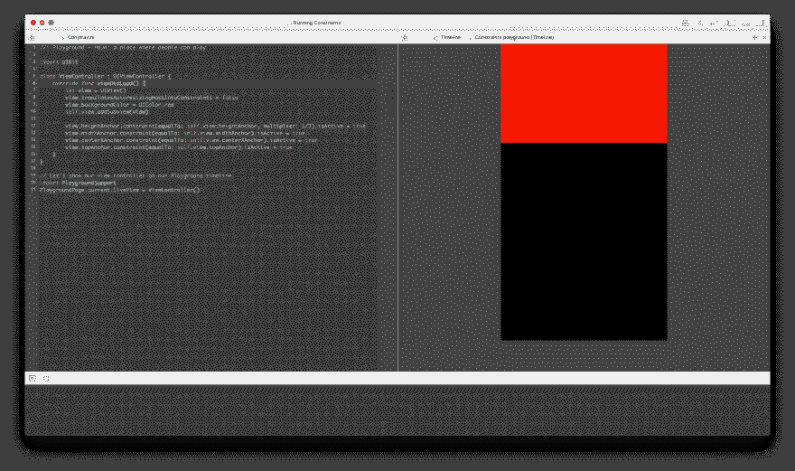
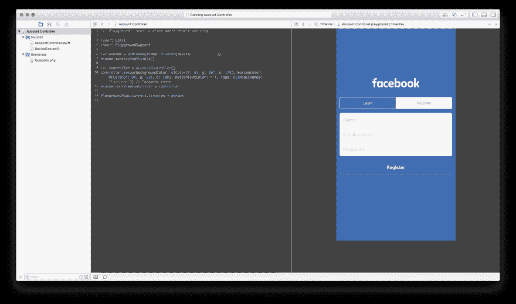
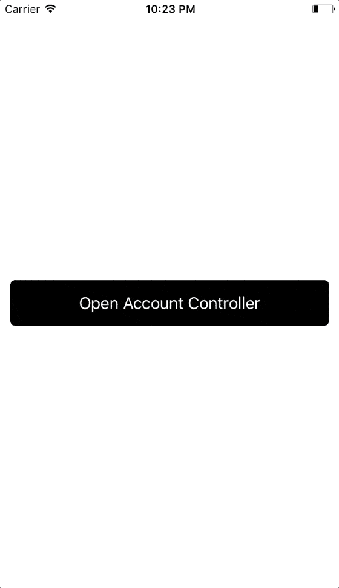

# 从故事板到 iOS 中的代码

> 原文:[https://dev . to/jordanosterberg/from-story boards-to-code-in-IOs](https://dev.to/jordanosterberg/from-storyboards-to-code-in-ios)

最近，我尝试了一件我害怕了很久的事情:使用代码来创建我的视图，而不是使用传统的故事板。

## 背景

在任何给定的 iOS 编程教程中，你很可能会使用故事板来完成你的任务。

示例:

*   [https://www . raywenderlich . com/114552/uistackview-tutorial-introducing-stack-views](https://www.raywenderlich.com/114552/uistackview-tutorial-introducing-stack-views)
*   [https://www.raywenderlich.com/122139/uiscrollview-tutorial](https://www.raywenderlich.com/122139/uiscrollview-tutorial)
*   [https://www . raywenderlich . com/117249/watch OS-2-tutorial-part-2-tables](https://www.raywenderlich.com/117249/watchos-2-tutorial-part-2-tables)

现在，使用故事板并没有什么本质上的错误。它们非常好，可以完成创建用户界面的工作...

*对吗？*

虽然我上面陈述的第一部分是正确的，但是当在有许多视图控制器的大项目中或者在有许多元素和子视图的视图中工作时，故事板有时会有所欠缺。

## 问题

我现在最大的项目在一个故事板中有 20-30 个视图控制器。每当我打开故事板时，我的老式 MacBook Pro 都会很难加载故事板。我需要根据代码的变化快速迭代我的视图，故事板加载时间超过 10 秒不是一个理想的情况。

*注意:我后来转而使用多个故事板，这(大部分)消除了这个问题，但是拥有多个故事板，并且每个故事板上都有故事板引用出口，这确实令人困惑。*

当故事板中的视图控制器有多个视图时，如果它们相互覆盖或者作为子视图存在，那么选择正确的视图就变得很困难。这是可能的，但这是一个我想避免的乏味的任务。

我也想尝试一些新的东西，杀死故事板听起来很有趣。

## 我的解决方案

代码很棒。如果我已经在我的项目中使用了一些代码，为什么不使用“全代码”呢？

但是等等...没有故事板=直到运行时才可见...当我甚至看不到自己在做什么的时候，我该如何快速迭代呢？！？

几年前，我读到一篇关于一个相当大的应用程序如何开源并详细说明他们的设计迭代过程的文章。他们使用 Swift Playgrounds 实时查看控制器，同时修改代码。太好了，我们走吧！

行...那么，在没有故事板的情况下，我如何使用自动布局和约束呢？通过一些研究，我发现了如何在代码中使用约束。

Swift 3 示例:

```
let view = UIView() // Create view object
view.translatesAutoresizingMaskIntoConstraints = false // Set this to false so this works as expected
view.backgroundColor = UIColor.red // Let's set this to red so we can see where our view is in our controller
self.view.addSubview(view) // Add our view to the view controller's view
// View created, constraint time:
view.heightAnchor.constraint(equalToConstant: 50).isActive = true
// Let's break this down.
// view.heightAnchor will set our view's height, as the name implies.
// constraint(equalToConstant: 50) Will set the value to an integer constant of 50
// isActive = true will activate our constraint
// Simple! Let's do the rest of the constraints:
view.widthAnchor.constraint(equalTo: self.view.widthAnchor, multiplier: 1/2).isActive = true // Set our width to be 1/2 of the view's size
view.centerXAnchor.constraint(equalTo: self.view.centerXAnchor).isActive = true // Center horizontally on the X axis
view.centerYAnchor.constraint(equalTo: self.view.centerYAnchor).isActive = true // Center vertically on the Y axis
// And... done! 
```

<svg width="20px" height="20px" viewBox="0 0 24 24" class="highlight-action crayons-icon highlight-action--fullscreen-on"><title>Enter fullscreen mode</title></svg> <svg width="20px" height="20px" viewBox="0 0 24 24" class="highlight-action crayons-icon highlight-action--fullscreen-off"><title>Exit fullscreen mode</title></svg>

再来看看我们的操场:

[](https://res.cloudinary.com/practicaldev/image/fetch/s--iyD_fcdA--/c_limit%2Cf_auto%2Cfl_progressive%2Cq_auto%2Cw_880/http://i.imgur.com/IRSyJLb.png)

厉害！让我们试试这些约束，让我们的视图出现在控制器的顶部。

```
let view = UIView()
view.translatesAutoresizingMaskIntoConstraints = false
view.backgroundColor = UIColor.red
self.view.addSubview(view)

view.heightAnchor.constraint(equalTo: self.view.heightAnchor, multiplier: 1/3).isActive = true
view.widthAnchor.constraint(equalTo: self.view.widthAnchor).isActive = true
view.centerXAnchor.constraint(equalTo: self.view.centerXAnchor).isActive = true
view.topAnchor.constraint(equalTo: self.view.topAnchor).isActive = true 
```

<svg width="20px" height="20px" viewBox="0 0 24 24" class="highlight-action crayons-icon highlight-action--fullscreen-on"><title>Enter fullscreen mode</title></svg> <svg width="20px" height="20px" viewBox="0 0 24 24" class="highlight-action crayons-icon highlight-action--fullscreen-off"><title>Exit fullscreen mode</title></svg>

这里我使用了一个新的项目:**to anchor**

将其设置为等于视图控制器的视图的 topAnchor(这太拗口了！)将导致我们的视图驻留在视图控制器视图的顶部。

我还将我们的宽度设置为等于视图的宽度，将我们的视图水平居中，并将我们的高度设置为父视图高度的 1/3。

让我们看看这对我们的视图做了什么:
[](https://res.cloudinary.com/practicaldev/image/fetch/s--t2SvjvcD--/c_limit%2Cf_auto%2Cfl_progressive%2Cq_auto%2Cw_880/http://i.imgur.com/naAcIxG.png)

太酷了！只用几行代码，我们就在视图控制器的顶部创建了一个视图。

为了更好地了解如何使用这些约束，我决定使用在我的故事板中创建的现有视图控制器，并用代码重新创建它。

实际上，我最终创建了一个简单的视图控制器/工具，名为“AccountController ”,可以很容易地修改它来显示登录和注册页面。整洁！

[](https://res.cloudinary.com/practicaldev/image/fetch/s--z5Isgtrl--/c_limit%2Cf_auto%2Cfl_progressive%2Cq_auto%2Cw_880/https://raw.githubusercontent.com/JordanOsterberg/AccountController/master/Example1.png)
[T6】](https://res.cloudinary.com/practicaldev/image/fetch/s--rLXx-1NT--/c_limit%2Cf_auto%2Cfl_progressive%2Cq_66%2Cw_880/https://raw.githubusercontent.com/JordanOsterberg/AccountController/master/Example2.gif)

这里有一个 GitHub 链接，供任何想尝试的人使用。

另外，你可以随意修改它，它是在麻省理工学院的许可下的！我计划修复一些问题，并随着时间的推移对它进行改进，但请随时通过 pull request 为我修复错误和改进它！

感谢阅读！

仅供参考，我才 15 岁(快 16 岁了！)所以如果我的语法或措辞很差，我道歉:)