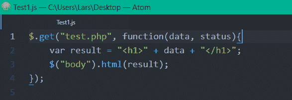

# 在 Ajax 响应中输出 HTML 的最佳方式

> 原文:[https://dev . to/Lars waechter/best-way-to-output-html-in-Ajax-response](https://dev.to/larswaechter/best-way-to-output-html-in-ajax-reponse)

# 场景:

您向服务器发送一个 Ajax get 请求，并希望以 html 格式打印一些内容。

### 你把你的 HTML 代码添加到你的结果的什么地方？

服务器端，在这里你打印你的结果和你服务器上所有的 HTML 代码(这里是 PHP)？
[T3】](https://res.cloudinary.com/practicaldev/image/fetch/s--FyBfWilo--/c_limit%2Cf_auto%2Cfl_progressive%2Cq_auto%2Cw_880/https://www2.pic-upload.de/img/33274554/test1.png)

然后简单地将 Ajax 结果添加到正文中:

或者在客户端，您将 HTML 部分添加到 Ajax 结果中，该结果包含 JS 中的普通结果？
[T3】](https://res.cloudinary.com/practicaldev/image/fetch/s--H39Arhde--/c_limit%2Cf_auto%2Cfl_progressive%2Cq_auto%2Cw_880/https://www2.pic-upload.de/img/33274563/test3.png)

那么，你更喜欢哪种方式或者哪种方式更好呢？