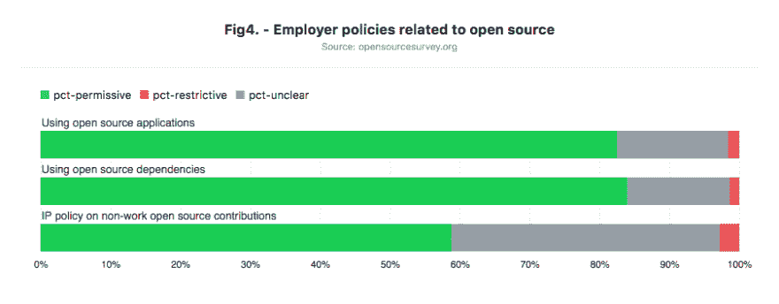

# Github 发布了 2017 年开源调查的结果

> 原文:[https://dev . to/walker/github-releases-results-from-its-2017-开源-调查](https://dev.to/walker/github-releases-results-from-its-2017-open-source-survey)

如果你正在 Firefox 上阅读这篇文章，或者使用 Linux 操作系统，你就是开源软件的受益者。在更广泛的层面上，开源工具可能会促进你的各种日常行为，这使得 [Github 今天发布的年度开源软件调查](http://opensourcesurvey.org/2017/)成为对技术领域内一个主要概念的重要评估。

通过调查他们网站上来自开源回购的 5000 多名受访者，Github 收集了一个“关于那些使用、构建和维护开源软件的人的态度、经历和背景的公开数据集。”

这里有很多值得挖掘的东西 Github 为那些想要自己分析的人提供了原始数据——所以我们将在未来几周发布一系列帖子来研究各个主题。一些见解并不令人鼓舞，因为困扰整个技术世界的问题，如骚扰和性别多样性，在开源项目中即使没有被夸大，也是存在的。

但是今天，我们将关注一个积极的发现:开源软件的日益普及和接受。如下图所示，绝大多数受访者表示他们在工作中使用开源软件。此外，“大多数人报告说，他们的雇主接受或鼓励在他们的代码库中使用开源应用程序(82%)和依赖项(84%)。

[T2】](https://res.cloudinary.com/practicaldev/image/fetch/s--U5ZclX7g--/c_limit%2Cf_auto%2Cfl_progressive%2Cq_auto%2Cw_880/https://d1ax1i5f2y3x71.cloudfront.net/items/2B2O3T3d3h0J2N2l1s13/Image%25202017-06-02%2520at%25201.18.07%2520PM.png%3FX-CloudApp-Visitor-Id%3D2119651%26v%3D0c4a093d)

这些数字说明了开源软件在过去 20 年中的旅程，从一个有问题的标准到一个被广泛容忍的东西，即使今天不是首选。正如《纽约时报》报道的那样，“在 2000 年，开源操作系统 Linux 被许多公司视为古怪的创造，甚至在法律上有风险，因为开源的精神倾向于分享想法而不是拥有它们。”

不过，企业的整体基调已经发生了变化。如今，“自由、协作软件项目曾经是独立开发者抵制企业计算的旗帜，今天甚至像埃克森美孚、沃尔玛和富国银行这样的公司也在通过 Wired 发布他们自己的开源工具。

从调查结果来看，还有很多东西需要讨论，所以请留意 [dev.to](https://dev.to/) 上的更多帖子，或者最好是自己写。我将深入研究[数据](https://dev.to/t/data)和 [ossurvey](https://dev.to/t/ossurvey) 标签下的数据。让我们继续谈话。