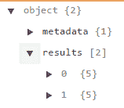
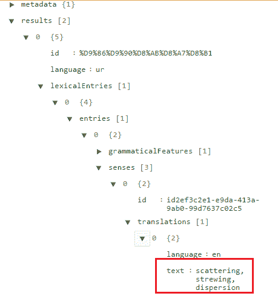

# 机器人如何用英语发布乌尔都语单词的意思

> 原文:[https://dev . to/aninditabasu/how-bots-tweet-urdu-word-meanings-in-English](https://dev.to/aninditabasu/how-bots-tweet-urdu-word-meanings-in-english)

在这篇文章中，我将谈论机器人如何将乌尔都语翻译成英语。

> TL；博士:1。使用文档齐全的牛津字典 API 免费返回的 JSON 数据。
> 2。推文赞[@ _ alfa az _](https://twitter.com/_alfaaz_%5D)[T5】1](https://dev.tonote-1)

[为什么这个 bot](https://dev.towhy-this-bot)
[bot 如何工作](https://dev.tohow-the-bot-works)
- [牛津字典 API 如何工作](https://dev.tohow-the-oxford-dictionary-api-works)
- [使用 API 的困难](https://dev.tothe-difficulties-in-using-the-api)
- [变通办法](https://dev.tothe-workarounds)
-[tweets 是如何发生的](https://dev.tohow-do-the-tweets-happen)
[代码在哪里](https://dev.towhere-is-the-code)
[为什么这个 bot，又来了](https://dev.towhy-this-bot-again)

* * *

### 为什么是这个 bot

我懂乌尔都语。至少，我认为我懂乌尔都语，主要是因为我知道几乎所有流行的印度电影歌曲的歌词。但是电影歌曲是...诗歌，还有一种叫做诗歌许可证的东西，然后，并不是所有的单词都是我认为的意思。

我并不孤单。我周围的几十个人，随着印度的主要宗教(即“电影”)长大，知道并即兴引用歌词，但并不总是知道某些单词的确切含义。例如，我(和数百名其他人)经历了青少年和我们的余生，认为 *jigar* 意味着心。并没有。没有。

所以，当我偶然发现牛津字典 API，其中包括一个乌尔都语字典端点，我想，“为什么不做一个推特机器人？”

### 机器人如何工作

它从我给它的列表中一个接一个地挑选乌尔都语单词，将这些单词提供给牛津词典 API 端点，获取 JSON 响应，解析响应以挑选翻译，并在推特上发布乌尔都语单词及其英语翻译。

其要求如下:

*   连接到互联网的计算机
*   来自 Twitter 的令牌、令牌秘密、消费者密钥和消费者秘密
*   牛津词典中的应用 ID 和应用密钥
*   编写和运行 bot 代码的脚本环境

#### 牛津字典 API 如何工作

它通过记录良好的 REST 端点 [2](https://dev.tonote-2) 提供 JSON 响应。

单词的实际翻译包含在字典对象列表中；这个列表叫做`results`。

[T2】](https://res.cloudinary.com/practicaldev/image/fetch/s--saPsg30o--/c_limit%2Cf_auto%2Cfl_progressive%2Cq_auto%2Cw_880/https://thepracticaldev.s3.amazonaws.com/i/202thh03ilygxxjtunto.PNG)

这个`results`列表中的每个字典对象都有一个名为`lexicalEntries`的键。如果从那里往下钻，最终会到达一个名为`translations`的列表，其中一个名为`text`的字典键包含实际的翻译。下图显示了完整的序列，翻译在红色框中高亮显示:

[T2】](https://res.cloudinary.com/practicaldev/image/fetch/s--iO7Dygqg--/c_limit%2Cf_auto%2Cfl_progressive%2Cq_auto%2Cw_880/https://thepracticaldev.s3.amazonaws.com/i/4mxrq0561yvno539bt4d.PNG)

一个词可以有几种意思，因此也有几种翻译。一个人如何知道有多少种意义存在？那么，我们可以查看`results`列表中每个字典对象在`senses`列表中的条目数量。下面是`senses`:
T3 的等级划分

#### 使用该 API 的难点

剧本。难的是剧本。

印度日常使用的乌尔都语和印地语没有什么区别。乌尔都语，写的时候，是用一种叫做纳斯塔利克的文字写的。不知道 Nastaliq [3](https://dev.tonote-3) 怎么读。牛津字典 API 只接受 Nastaliq 脚本中的输入。啊哦！

#### 变通办法

1.  了解如何阅读 Nastaliq。是的，没错，最重要的是。因为我不知道那种文字，所以到目前为止我还不能查字典，但是，在这个世界大同的时代，肯定有更简单的方法？毕竟，我花了很大力气也能辨认出字母，这就足够了吧？
2.  使用音译服务。[ **但是**我搜过了，但是什么也没找到。Google 音译 API 已被弃用。Python(我可以编写代码的语言)有一个`polyglot`库，但是它拒绝`pip`安装在我的机器上。我没有找到一个资源可以接受用梵文写的单词，并以编程方式在 Nastaliq 中给出该单词。
3.  从包含乌尔都语单词及其音译英语形式的在线词典资源之一中提取乌尔都语单词，就像普拉特词典 [4](https://dev.tonote-4) 所做的那样:ú*jigar*。[ **但是** ]这些网络资源都不是 XML 或 JSON 之类的结构化格式。一个都没有。
4.  建立我自己的音译。但是我甚至可以不用查教科书就能写出两行代码...但是等等。我在 Medium [5](https://dev.tonote-5) 上找到了一个 Nastaliq 到 Roman 的映射表。我想，也许我可以在推特上做些类似的事情，然后把这个想法放在一边。但这并没有帮助我得到语言词典可以识别的拼写完美的音译。
5.  使用现成的单词表。但是牛津词典提供了现成的英语单词表。但不是乌尔都语。

因为这些解决方法都不可行，所以我不得不手动生成一个单词列表。我用普拉特的字典来列我的单词表。我会用罗马字体输入乌尔都语单词，并在我的单词列表中复制它的 Nastalikh 版本。

#### 推文是如何发生的

1.  该机器人使用令牌向 Twitter 和牛津词典认证自己。
2.  它从单词列表中选择一个单词，并从牛津词典中获取翻译。
3.  它将翻译放在一个可在推特上发布的图片上，同时将该单词的所有字母分解并映射到它们的梵文对应物上(见*变通办法*下的#4)。然后它会在推特上发布这张图片。
4.  [增强，随后添加]它获取该单词的梵文版本(出现在同一个单词列表中)，从牛津词典中获取印地语含义，并在推特上发布这些含义。
5.  它还将这个单词输入到 Platt 的字典中，获取搜索结果的 URL，并在 tweets 上发布该 URL。
6.  然后它会休眠一个小时，并根据单词列表中的单词重复步骤 2 到 5。

### 代码在哪里

为什么，当然是在 GitHub 上。还有哪里？

### 为什么又是这个 bot？

因为其他资源-机器人推文，电子邮件 WOTDs，非机器人推文-要么无聊，要么势不可挡。这个机器人的设计目标是:

*   不要压倒 noob
*   将一个词与每个 noob 追随者都可能知道的有趣的上下文联系起来。

这就是我的第一个推特机器人的故事。你怎么想呢?

* * *

###### 注 1。

alfaaz 是一个乌尔都语单词，意思是“单词”。(乌尔都语对单数词‘单词’有不同的说法；它就是 *lafz* 。)

###### 注二。

[牛津词典 API 文档](https://developer.oxforddictionaries.com/documentation)

###### 注 3。

就其口语形式而言，乌尔都语与印地语几乎没有区别。然而，对于书写，两种语言使用不同的文字。印地语使用梵文；乌尔都语使用纳斯塔利克语。每种语言中的句子完全相同，但用两种完全不同的写作风格写成，它们的主要区别是:

*   Nastaliq 是从右向左书写的；梵文，从左到右。
*   Nastaliq 经常不用元音标记；梵文总是语音的，并且总是带有元音标记。

###### 注 4。

约翰·普拉特的乌尔都语、古典印地语和英语词典

###### 注 5。

[用 Python 把乌尔都语音译成罗马乌尔都语](https://medium.com/@itsShanKhan/transliterate-urdu-to-roman-urdu-in-python-614953b1a4d5)

* * *