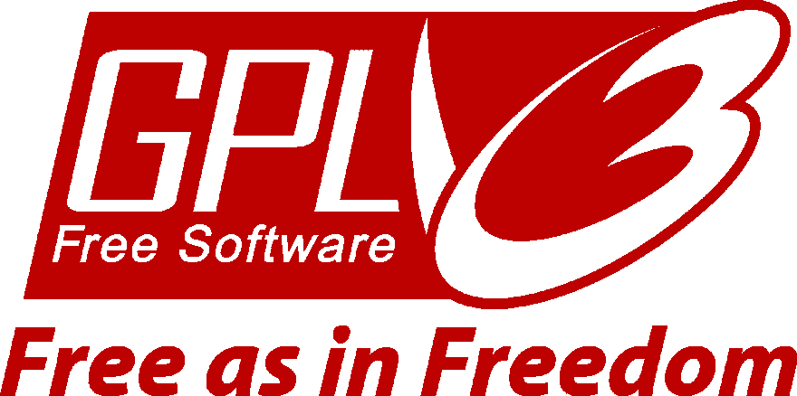
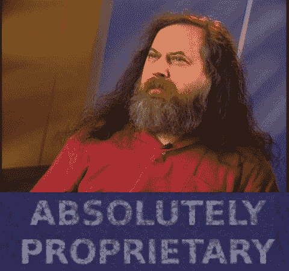

# GNU 公共许可证几乎是免费的，你不应该使用它

> 原文：<https://dev.to/matteojoliveau/gnu-public-license-is-all-but-free-and-you-should-never-use-it-3fk>

[T2】](https://res.cloudinary.com/practicaldev/image/fetch/s--Ax2uXYJc--/c_limit%2Cf_auto%2Cfl_progressive%2Cq_auto%2Cw_880/https://upload.wikimedia.org/wikipedia/commons/thumb/9/93/GPLv3_Logo.svg/1200px-GPLv3_Logo.svg.png)

自由软件基金会及其萌芽 GNU 项目是自由和开源软件运动的核心要素。

他们引领了软件开发的新时代，在这个时代，作为一个社区的共享和改进比销售专有软件更有价值(也许是因为我们[完全停止销售软件](https://matteojoliveau.com/from-product-makers-to-service-providers)并开始销售服务)。

但是在世界上最流行的免费许可证中有一个关键的东西，一个关键的问题，让我质疑这个许可证是否是真正的免费，或者它是否带来了一个扭曲的自由概念。

这是一个影响 GNU 公共许可证版本 [2.0](https://www.gnu.org/licenses/old-licenses/gpl-2.0.html) 和 [3.0](https://www.gnu.org/licenses/gpl.html) 的问题。

给开发者设限的许可证真的“免费”吗？

理查德·斯托尔曼和 FSF 想要的软件自由不是真正的自由，就像共产主义不是真正的分享和相爱。

共产主义更像是在坑的底部，强迫每个人呆在那里，只是因为你不想被那些设法爬上来的人甩在后面。

按照斯塔尔曼的思维方式，软件自由不是关于自由，而是关于你自己不做任何事情。

没有商业软件，没有你为自己保留的代码，没有办法以一种让你保密的方式使用它。这很好，对吗？

不完全是。一点也不。

* * *

### 自由不自由

整篇文章的一个重点是关于自由的定义。以下是我的观点 ，并不反映*自由*的任何“官方”定义。

在我的软件自由愿景中，*自由软件*意味着我被允许在我的日常工作中使用它，在我的项目中使用库和程序。我的意思是，这是我首先做开源的全部原因。当我开始开发 [PlugFace 框架](https://plugface.org)时，我决定在麻省理工学院的许可下发布它，因为我认为它可能对其他需要在其软件中使用插件的人有用。我想到了与我处境相同的其他开发人员，他们需要用一个简单而健壮的解决方案来模块化他们的 monolitic 应用程序。我不在乎你是否想在专有软件中使用它，相反，我会为此感到荣幸。

GPL 不会允许这种事情发生。T3】

在 GPL 下发布的 PlugFace 框架从来没有在企业环境中使用过，因为它要求用户在相同的许可下发布他们的软件。即使 LGPL 允许软件链接到专有软件，也不是很理想，因为任何定制(即验证插件的专有安全功能？)不可能一直保密。

所以如果我正在开发一个库，我为什么要使用类似 GPL 的许可证呢？

**为了限制其他开发者的自由，我为什么要选择免费许可？**

[T2】](https://res.cloudinary.com/practicaldev/image/fetch/s--5Ag2WS1c--/c_limit%2Cf_auto%2Cfl_progressive%2Cq_auto%2Cw_880/https://i.warosu.org/data/g/img/0559/26/1470396293115.jpg)

> 但是，如果没有强大的版权许可，Matt 可以窃取你的作品，并在上面印上他们的名字出售，而你一分钱也拿不到。

我已经听到你这样回答了。

我的答案是: ***这正是我想要的。*T3】**

如果你正在读这篇文章，而你是一家软件公司，请 ***拿走我的孩子软件，用它做你想做的事。*T3】**

如果我的目标是赚钱，我就不会做开源，我会尝试更容易的东西。比如外汇交易、冰激凌制作或地下毒品交易。

相反，我做开源软件是因为我想让人们使用它，用它来解决问题。我想象像我这样的专业软件开发人员被一个问题困住，找到我的 GitHub 账户并想“该死的，这个家伙做了一个完全符合我需要的库”。

它会下载下来，连接到他的软件上，继续工作，我会通过原力给他发送一个精神上的“不客气，伙计”。

这就是为什么，如果你写软件库，你应该**永远不要使用 GPL 许可证**。最好的企业软件都是在弱版权许可下发布的，像 [Kubernetes](https://kubernetes.io) 、 [Docker](https://docker.com) 、 [Google Guava](https://github.com/google/guava) 、 [FreeBSD](https://www.freebsd.org/) 等等。

cLinux 不算。Linux 是最终产品，不是中间件。但是，请记住，如果没有弱许可和 Linux 作为唯一的开源操作系统，像 PlayStation 4 和 T2 任天堂 Switch T3 这样的产品将会非常不同。

* * *

### 请选择另一个许可证

有很多很棒的许可证是真正免费的。他们会让 Stallman 生气(这可能是我真正喜欢的事情)，但他们也会让许多开发人员感到高兴和感激。我最喜欢的是[阿帕奇许可证 2.0](https://opensource.org/licenses/Apache-2.0) 和[麻省理工许可证](https://opensource.org/licenses/MIT)。我在这两个许可下发布我的所有作品(对于完整的产品，还有 [MPL 2.0](https://opensource.org/licenses/MPL-2.0) ，也就是说不是库)。如果你想要一个完整的列表，请查看 GitHub 的[这个很棒的网站](https://choosealicense.com/licenses/)，并在*条件*栏中寻找没有*相同许可证*标签的许可证。它们是[弱复印左](https://en.wikipedia.org/wiki/Copyleft#Strong_and_weak_copyleft)的。

* * *

目前就这些。谢谢大家的关注，祝编码愉快！<3