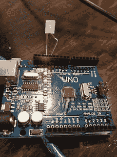

# Blinky -你好机器人世界

> 原文:[https://dev.to/kaydacode/blinky-你好-机器人世界](https://dev.to/kaydacode/blinky---hello-world-of-robotics)

嘿你们！我希望你喜欢我的第一篇机器人帖子，并准备开始你自己的帖子！原创文章在[我的博客](http://www.kimarnett.com/blog/?p=140)

这是对你的 Arduino Uno 的介绍。我自己对机器人技术还是个新手，但是我们一起会成功的。我希望把我知道的传下去，你也能把你知道的传下去，很快我们都成专家了，对吧？！

每当你学习一个新的软件平台时，你就创建一个“Hello World”应用程序。嗯，在硬件界的对等词叫做“Blinky”。本教程是 Arduino 平台的介绍。我将使用 Arduino Uno R3 和一个 LED 灯泡，这是我的“学习焊接”工具包附带的。

## 下载 Arduino IDE

这里:[arduino.cc/en/Main/Software](https://www.arduino.cc/en/Main/Software)
*本教程使用的是 Arduino 1.8.1

作为一个初学者，我在 Windows 10 平台上使用的运气比我的 2015 MacBook Pro 要好。我在 Mac 上遇到了一个驱动问题，在试图修复它的时候可能下载了一个日本病毒。哎呀。

## 快速 IDE 简介:

<center>1        2        3        4        5
</center>

[T2】](https://res.cloudinary.com/practicaldev/image/fetch/s--q8U5r-Qa--/c_limit%2Cf_auto%2Cfl_progressive%2Cq_auto%2Cw_880/http://www.kimarnett.com/blog/wp-content/uploads/2017/05/Capture.png)

1.  验证-编译代码，看看是否有任何正确的失败或错误。
2.  上传-把代码放到 Arduino 上。只要有电，代码就会立即开始运行。
3.  新建-创建新文档
4.  打开-打开现有文档
5.  保存-将文档保存到您的计算机上

## 准备 Uno

1.  将它插入您的 USB 插槽

2.  板子会亮，表示有电

3.  找到一个 LED——将正极(LED 内部最长的引脚/最小的部分)插入第 13 号引脚。将负极插入 GND(接地)引脚。

4.  应该看起来像这样

[T2】](https://res.cloudinary.com/practicaldev/image/fetch/s--weEN45FF--/c_limit%2Cf_auto%2Cfl_progressive%2Cq_auto%2Cw_880/https://i1.wp.com/www.kimarnett.com/blog/wp-content/uploads/2017/05/IMG_7491.jpg)

## 代码

当你创建一个新文件或者默认文件时，你会看到两种方法:Setup 和 Loop。安装程序在程序开始时由硬件运行一次，然后连续的代码进入循环函数，你猜对了。在文件的开头，我们将引用 LED 所在的引脚:

```
int led = 13; 
```

<svg width="20px" height="20px" viewBox="0 0 24 24" class="highlight-action crayons-icon highlight-action--fullscreen-on"><title>Enter fullscreen mode</title></svg> <svg width="20px" height="20px" viewBox="0 0 24 24" class="highlight-action crayons-icon highlight-action--fullscreen-off"><title>Exit fullscreen mode</title></svg>

在设置功能中，我们将用
将 LED 定义为输出

```
pinMode(led, OUTPUT); 
```

<svg width="20px" height="20px" viewBox="0 0 24 24" class="highlight-action crayons-icon highlight-action--fullscreen-on"><title>Enter fullscreen mode</title></svg> <svg width="20px" height="20px" viewBox="0 0 24 24" class="highlight-action crayons-icon highlight-action--fullscreen-off"><title>Exit fullscreen mode</title></svg>

最后在循环函数中，我们将告诉灯闪烁。我们向引脚(13)发送一个信号，该信号要么为高电平，要么为低电平。该信号对应于提供给该引脚的电压。高的话灯会亮，低的话灯会灭。我们也想在开灯和关灯之间延迟、等待。下面是循环函数的代码:

```
 digitalWrite(led, HIGH); 

 delay(5000); 

 digitalWrite(led, LOW); 

delay(1000); 
```

<svg width="20px" height="20px" viewBox="0 0 24 24" class="highlight-action crayons-icon highlight-action--fullscreen-on"><title>Enter fullscreen mode</title></svg> <svg width="20px" height="20px" viewBox="0 0 24 24" class="highlight-action crayons-icon highlight-action--fullscreen-off"><title>Exit fullscreen mode</title></svg>

## 保存- >验证- >上传

按下顶部的验证按钮(勾号)。这将检查您的代码，并确保没有突出的问题存在。

注意:如果您在 Windows 上看到此错误(ser_open():无法打开设备“\”。\ COM[x]"
打开设备管理器- >端口- >，确定 Uno 在哪个端口上。然后进入工具- >端口- >然后选择正确的端口。

如果一切正常，选择上传按钮。

一旦程序编译完成，Uno 将会刷新，你的程序现在应该正在运行。灯将亮 5 秒钟，熄灭 1 秒钟。

[Github 上的代码](https://github.com/karnett/Blink)

[原文教程在此。](https://www.arduino.cc/en/tutorial/blink)