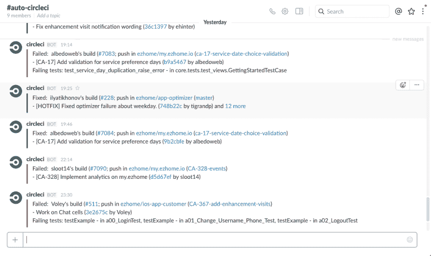
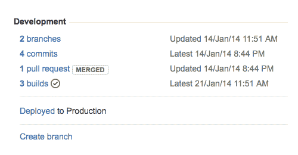

# 远程工作:我们如何让它工作。

> 原文:[https://dev.to/cyberomin/remote-work-how-we-make-it-work](https://dev.to/cyberomin/remote-work-how-we-make-it-work)

在过去的几年里，远程工作以及它如何 a)提高员工的工作效率和 b)迅速成为工作的未来得到了大力提倡。科技公司，尤其是初创公司，将远程工作作为他们的福利之一。

但是在遥远的土地上，事情并不总是美好的。我见过太多次的问题之一是沟通和可见性，解决这个问题的方法是过度沟通。说出每一个动作。物理办公室提供了一些远程工作时几乎不存在的好处，例如，面对面的交流再怎么强调也不为过。

在同一个地方工作，并且能真正看到和你一起工作的人，这有很大的好处。这种好处在相互交流时变得很明显，像语调和肢体语言这样的东西增加了技术无法跨越的细微差别。

____________

如果没有合适的工具和流程，领导一个远程团队可能会令人望而生畏。尽早获得正确的工具将为团队省去大量麻烦，同时也提高了生产率。我的意思是，只有当你有合适的工具时，你才能做得最好。在本文中，我将重点介绍我的团队日常使用的一些工具，以及我们为什么使用它们。

松弛:松弛是奇迹发生的地方。我认为这个工具就像我们的指挥中心。这几乎是我们一天开始和结束的地方。在神奇的机器人和集成的帮助下，Slack 的可能性是无穷的。我们使用 Slack 进行日常站立、文件共享、语音通话等等。我个人使用 Slack 作为某种私人助理；我用时差提醒来提醒我应该在特定时间回去做的事情。Slack 的 slash 命令提供了一套丰富的操作，可以直接从应用程序中执行。

除了日常交流，我们还将 Slack 应用于我们团队对 ChatOps 的内部改编；高度关注可见性的透明工作流程。例如，当在我们的 JIRA 项目板上创建或移动一个标签时，就会向 Slack 我们的 *#developers* Slack channel 发送一个通知，这样，团队中的每个人都知道在每个时间点发生了什么，以及谁在工作或负责什么。当一个评论被添加到 GitHub pull 请求中时，Slack 会将这个评论通知给一个通道，相关方可以使用 Slack 继续对话，也可以将其转移到 GitHub。

> 什么是 ChatOps？对话，投入工作。ChatOps 是一个协作模型，它将人员、工具、流程和自动化连接到一个透明的工作流中。这个流程将所需的工作、正在发生的工作以及在由人员、机器人和相关工具组成的持久位置中完成的工作联系起来。[资料来源:Atlassian](https://www.atlassian.com/blog/software-teams/what-is-chatops-adoption-guide)

我们是敏捷方法的忠实信徒，因此，我们非常重视持续集成和部署。春季策划、回顾和单口相声都发生在 Slack 上。

CircleCI: CircleCI 是一款无价且几乎不可或缺的工具。对我们来说，它不仅仅是另一个 CI 工具，它还是我们的真理之源。CircleCI 在我们的开发周期和部署管道中起着关键作用。它有助于运行我们的测试套件，并进行自动部署。这个工具的美妙之处在于它如何与我们的工作流和其他工具完美地集成在一起。例如，当一个构建中断时，CircleCI 不仅会给整个团队发电子邮件，还会向团队发送一个 Slack 通知。由于我们在 GitHub 配置文件上使用几乎相同的 Slack 句柄，所以*构建违规者*——一个破坏构建的人……这是我编的——会立即得到通知，这有助于改善我们的周转时间，并且还鼓励透明度和问责制。

CirleCI 还允许我们执行一些定义的标准，如编码风格，它包含了我们所有的代码，这一过程有助于保持我们的代码库整洁并促进一致性。

 * CircleCI/Slack 整合。图片来源:伊戈尔·达维登科*

**JIRA 和 GitHub:** 是我们广泛使用的其他工具。我们在工作流程中使用特征分支，这意味着每个 JIRA 票证都是一个分支。JIRA 和 GitHub 之间的集成允许我们直接从 JIRA 的票到 GitHub 分支，由于我们有一个 *PULL_REQUEST_TEMPLATE* 要求我们包含 JIRA 的票 ID，我们可以很容易地从 GitHub 返回 JIRA。

当一个分支被推入 GitHub 时，JIRA 会自动将它链接到指定的票证。

[T2】](https://res.cloudinary.com/practicaldev/image/fetch/s--XLv6XzxG--/c_limit%2Cf_auto%2Cfl_progressive%2Cq_auto%2Cw_880/http://cyberomin.github.io/assets/article_images/slack/jira.png)

*JIRA 票证，显示相关的 GitHub 分支、提交数量和拉请求状态*

偶尔，人们在技术问题上需要帮助，这是绝对正常的。当一个团队成员在某个问题上受阻并需要帮助时，某个空闲的人或对该问题最有经验和知识的团队成员会跳到 Scree Hero 和 pair 上。这样做的好处之一是形成了更强的结合和联系。

#### 我们是怎么到这里的？

一开始，事情并不总是这样，需要一点点的尝试和错误来找到最佳的工作流程。我们开始使用 Slack 只是为了交流，但很快发现很多人并不完全知道在每个时间点发生了什么。所以，不要问“你在做什么？我们时常利用我们的工具，让它们为我们说话。这样，我们可以最大限度地减少用户干扰，专注于完成工作。

作为一个分布式团队，我们使用这些工具来弥补我们缺乏面对面交流的不足。这可能有点烦人，坦白地说，令人沮丧，必须在任何时间点检查一个人正在做什么任务，还要检查票证状态。我们将此任务委托给 Slack，当票证状态发生变化时，Slack 会发出通知。如果一个标签从*进行中的*移动到*代码审查*，作者不需要手动通知团队审查他们的工作，Slack 会处理这个问题，并且节省了一些额外的击键。大家都开心:)

#### 改进？

我们没有达到我想要的目标，但是说实话，我不认为我们会达到目标。这将是一个不断改进的例子。将来，我希望看到我们通过 Slack 触发手动部署，并通过 Slack 获得性能指标。我们可能会用 Hubot 这样的工具进行实验，看看它们是否适用于我们的团队。

此外，我们还将探索定制集成，以利用我们使用的第三方工具的 API。例如，我们将探索构建与 AWS 的集成，这样，如果我们工作的地区出现服务质量下降，Slack 可以近乎实时地通知我们。这个工具还可以扩展到 GitHub 状态通知等。有了这一点，我们将更加积极主动，而不是被动应对问题。

> PS:你是远程办公吗？我想知道你是如何工作的。

*本帖原载于[cyber omin . github . io](http://cyberomin.github.io/work/2017/05/30/remote-work.html)T3】*