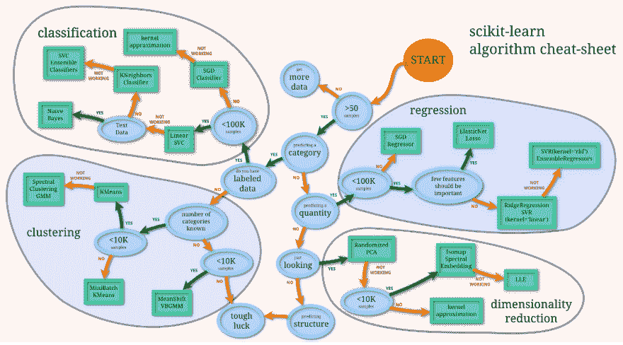

# 神经网络被高估了

> 原文:[https://dev.to/mobbsdev/neural-networks-are-overrated](https://dev.to/mobbsdev/neural-networks-are-overrated)

好吧，好吧，很抱歉这个标题。我想对这篇文章更恰当的介绍应该是“神经网络**(个人项目)**被高估了”。在我在德克萨斯大学奥斯汀分校[上第一堂机器学习课之前，我试图自学各种 ML 技术。我虔诚地观看了](http://ianmobbs.com/) [Sirajology](https://www.youtube.com/channel/UCWN3xxRkmTPmbKwht9FuE5A) 视频。我尝试了重新训练 [Tensorflow 的 Inception-v3 网络](https://www.tensorflow.org/tutorials/image_recognition)。我一有空闲就浏览[神经网络和深度学习](http://neuralnetworksanddeeplearning.com)。我在寻找一个更实际而不是理论性的介绍，这些资源做得很好——但是有一个问题。这些资源都称赞神经网络是机器学习的巅峰。虽然它们可能是一个强大的工具，但并不适合用来解决每一个问题。机器学习新手需要学习基础知识。除非你正在进行大规模的工作，否则几乎总是应该使用可靠的算法(比如那些在 [scikit-learn](http://scikit-learn.org/) 中找到的)。

机器学习的世界远不止神经网络，假设神经网络应该用来解决每个问题是一种危险的心态。这里有一个很好的 StackOverflow 讨论关于什么时候使用遗传算法和神经网络。如果你想了解更多，我建议[点击这里](http://bfy.tw/BvIt)。除了上面提到的，神经网络(根据定义)是[深度学习](https://en.wikipedia.org/wiki/Deep_learning)的首选工具:

> 深度学习是一类机器学习算法，使用多层非线性处理单元的级联进行特征提取和转换。

然而对于大多数个人项目来说，神经网络是不需要的。我将通过分析来自[谋杀问责项目](https://www.kaggle.com/murderaccountability)的数据集[凶杀报告，1980-2014](https://www.kaggle.com/murderaccountability/homicide-reports) ，他们在 [Kaggle](https://kaggle.com/) 上托管他们的数据。

## 数据

该数据包含全国范围内的 638，454 起凶杀案记录以及每起凶杀案的以下信息:

*   记录 ID
*   机构代码
*   机构名称
*   代理类型
*   城市
*   状态
*   年
*   月
*   事件
*   犯罪类型
*   破案了
*   受害者性别
*   受害者年龄
*   受害者种族
*   受害者种族
*   犯罪者性行为
*   犯罪者年龄
*   犯罪者种族
*   犯罪者种族
*   关系
*   武器
*   受害者人数
*   犯罪者人数
*   记录源

```
# Imports import time
import pandas as pd
import numpy
from sklearn.metrics import accuracy_score

# Inline graphics %pylab inline

# Read data df = pd.read_csv('database.csv')
df[:5] 
```

从 numpy 和 matplotlib 填充交互式名称空间

`/Library/Frameworks/Python.framework/Versions/3.6/lib/python3.6/site-packages/IPython/core/interactiveshell.py:2683: DtypeWarning: Columns (16) have mixed types. Specify dtype option on import or set low_memory=False. interactivity=interactivity, compiler=compiler, result=result)`

|  | 记录 ID | 机构代码 | 机构名称 | 代理类型 | 城市 | 状态 | 年 | 月 | 事件 | 犯罪类型 | ... | 受害者种族 | 犯罪者性行为 | 犯罪者年龄 | 犯罪者种族 | 犯罪者种族 | 关系 | 武器 | 受害者人数 | 犯罪者人数 | 记录源 |
| --- | --- | --- | --- | --- | --- | --- | --- | --- | --- | --- | --- | --- | --- | --- | --- | --- | --- | --- | --- | --- | --- |
| Zero | one | AK00101 | 安克雷奇 | 市政警察 | 安克雷奇 | 阿拉斯加 | One thousand nine hundred and eighty | 一月 | one | 谋杀或过失杀人 | ... | 未知的 | 男性的 | Fifteen | 美洲原住民/阿拉斯加原住民 | 未知的 | 相识 | 钝器 | Zero | Zero | 联邦调查局 |
| one | Two | AK00101 | 安克雷奇 | 市政警察 | 安克雷奇 | 阿拉斯加 | One thousand nine hundred and eighty | 三月 | one | 谋杀或过失杀人 | ... | 未知的 | 男性的 | forty-two | 怀特（姓氏） | 未知的 | 相识 | 勒死 | Zero | Zero | 联邦调查局 |
| Two | three | AK00101 | 安克雷奇 | 市政警察 | 安克雷奇 | 阿拉斯加 | One thousand nine hundred and eighty | 三月 | Two | 谋杀或过失杀人 | ... | 未知的 | 未知的 | Zero | 未知的 | 未知的 | 未知的 | 未知的 | Zero | Zero | 联邦调查局 |
| three | four | AK00101 | 安克雷奇 | 市政警察 | 安克雷奇 | 阿拉斯加 | One thousand nine hundred and eighty | 四月 | one | 谋杀或过失杀人 | ... | 未知的 | 男性的 | forty-two | 怀特（姓氏） | 未知的 | 相识 | 勒死 | Zero | Zero | 联邦调查局 |
| four | five | AK00101 | 安克雷奇 | 市政警察 | 安克雷奇 | 阿拉斯加 | One thousand nine hundred and eighty | 四月 | Two | 谋杀或过失杀人 | ... | 未知的 | 未知的 | Zero | 未知的 | 未知的 | 未知的 | 未知的 | Zero | one | 联邦调查局 |

## 问题

为了证明其他机器学习技术可以像神经网络一样强大，并且没有成本，我们将使用我们的数据解决一个简单的分类问题(这些列中的每一列都包含分类数据，因此很难进行任何回归分析——但是如果有人有问题希望我解决，我很乐意！).

> 对于任何犯罪，我们能根据其他信息来预测犯罪者的种族吗？

一旦你确定了你的问题，`scikit-learn`的人已经创建了一个[优秀的备忘单](http://scikit-learn.org/stable/tutorial/machine_learning_map/)，告诉你如何选择一个算法来使用:

[T2】](https://res.cloudinary.com/practicaldev/image/fetch/s--je8ofAzd--/c_limit%2Cf_auto%2Cfl_progressive%2Cq_auto%2Cw_880/https://thepracticaldev.s3.amazonaws.com/i/9d02tjhhj1dvjyv4y51p.png)

根据图表，我们将使用一个 [SGD 分类器](http://scikit-learn.org/stable/modules/sgd.html)。为了根据其他数据对犯罪者种族进行分类，我决定手动查看 dataframe 列，并使用我认为重要的特征。**这是可怕的做法**。我这样做是因为，由于庞大的数据量，对每一个功能进行训练，然后分离出重要的部分，对我的小电脑来说太难了。本文的重点是强调神经网络和算法达到类似结果所需的训练时间的差异，而不是创建一个完美的分类器。

## 数据清理

为了清理和分割我们的数据，我们自己做了一点预处理，让 [patsy](http://patsy.readthedocs.io/en/latest/API-reference.html) 处理剩下的事情。我们改变我们的数据集，只包含行凶者种族**已知而犯罪**已破**的凶杀案。这是因为是否解决了一个犯罪对犯罪者种族没有影响(尽管相反可能是正确的)，我们不能在未知数据上进行训练。在此之后，我们使用隔离的特性编写一个公式，创建一些设计矩阵，并将我们的数据分成训练和测试数据。**

```
from patsy import dmatrices
from sklearn.model_selection import train_test_split

# Isolate data where perpetrators race is known and crime is solved start = time.time()
data = df[(df['Perpetrator Race'] != 'Unknown') & (df['Crime Solved'] == 'Yes')] # Race known, case solved - Training data end = time.time()
print("Time taken separating data:", end - start)

# Create patsy formula using different information geographicInfo = "City + State"
crimeInfo = "Q('Crime Type') + Weapon + Incident"
victimInfo = "Q('Victim Sex') + Q('Victim Age') + Q('Victim Race') + Q('Victim Ethnicity') + Relationship"
formula = "Q('Perpetrator Race') ~ 0 + " + " + ".join([geographicInfo, crimeInfo, victimInfo])

# Split data into design matrices start = time.time()
_, X = dmatrices(formula, data, return_type='dataframe')
y = data['Perpetrator Race']
end = time.time()
print("Time taken creating design matrices:", end - start)

# Split data into training and testing data start = time.time()
X_train, X_test, y_train, y_test = train_test_split(X, y, test_size=0.33, random_state=1)
end = time.time()
print("Time taken splitting data:", end - start)

print("Total data size:", len(data))
print("Training data size:", len(X_train))
print("Testing data size:", len(X_test))
baseline = data['Perpetrator Race'].value_counts()[0] / data['Perpetrator Race'].value_counts().sum()
print("Baseline accuracy: ", baseline) 
```

```
Time taken separating data: 0.21260476112365723
Time taken creating design matrices: 58.753602027893066
Time taken splitting data: 5.484054088592529
Total data size: 442123
Training data size: 296222
Testing data size: 145901
Baseline accuracy:  0.493432822993 
```

### SGD 分类器

用`scitkit-learn`创建一个 SGD 分类器非常容易——正如你所看到的，用你的分类器实例化、训练和预测只需要三行代码。它的性能有所欠缺(但同样，我们选择这些特性不是为了最大化准确性，而是为了比较准确性与训练时间的关系)。虽然 82%的准确率很低，但比我们的基线提高了 33%。对 296，000 行数据的 17 秒训练时间令人印象深刻。

```
from sklearn import linear_model

start = time.time()
classifier = linear_model.SGDClassifier()
classifier.fit(X_train, y_train)
end = time.time()
print("SGDClassifier Training Time:", end - start)

start = time.time()
predictions = classifier.predict(X_test)
end = time.time()
print("SGDClassifier Prediction Time:", end - start)

print("SGDClassifier Accuracy:", accuracy_score(predictions, y_test)) 
```

```
SGDClassifier Training Time: 17.512683868408203
SGDClassifier Prediction Time: 0.7582650184631348
SGDClassifier Accuracy: 0.827568008444 
```

### 神经网络

为了让神经网络(你可以在这里读到[和](http://scikit-learn.org/stable/modules/neural_networks_supervised.html#regression))在我的 Macbook Pro 上以一种有点及时的方式进行训练，我不得不通过调整它的隐藏层大小和迭代次数来显著抑制它的能力。即使在这些定制之后，训练也花了 387 秒——大约是 SGDClassifer 的 22.7 倍(T2 ),而准确性只提高了 4.5%(T5)。

```
from sklearn.neural_network import MLPClassifier

start = time.time()
classifier = MLPClassifier(hidden_layer_sizes=(10,), max_iter=100)
classifier.fit(X_train, y_train)
end = time.time()
print("Neural Network Training Time:", end - start)

start = time.time()
predictions = classifier.predict(X_test)
end = time.time()
print("Neural Network Prediction Time:", end - start)

print("Neural Network Accuracy:", accuracy_score(predictions, y_test)) 
```

```
Neural Network Training Time: 387.71303701400757

Neural Network Prediction Time: 1.6371817588806152

Neural Network Accuracy: 0.872084495651 
```

## 
 [T3】
结论](#conclusion) 

很明显，SGD 分类器优于神经网络。我希望这篇简短的文章表明，机器学习不仅仅是神经网络，而且在解决一个 ML 问题时，应该考虑所有的选择。如果你在寻找机器学习的实用介绍，我用的书(我强烈推荐)是[梅勒](http://amueller.github.io/)和[圭多](http://www.oreilly.com/pub/au/6105)的[《Python 机器学习简介:数据科学家指南》](https://smile.amazon.com/Introduction-Machine-Learning-Python-Scientists/dp/1449369413/ref=sr_1_4?ie=UTF8&qid=1495839877&sr=8-4&keywords=machine+learning+python)。

如果你有任何反馈，请告诉我！您可以在我的[网站](http://ianmobbs.com)上找到我的网络状态。

*本文最初发表于[ianmobbs.com](http://ianmobbs.com/projects/neural-networks-are-overrated)。*