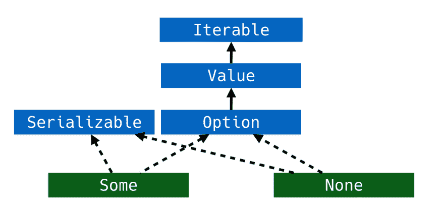

# 赞扬 Vavr 的选择

> 原文:[https://dev.to/koenighotze/in-praise-of-vavrs-option](https://dev.to/koenighotze/in-praise-of-vavrs-option)

`Null`有时被认为是[十亿美元的错误](https://www.infoq.com/presentations/Null-References-The-Billion-Dollar-Mistake-Tony-Hoare)。人们可能会对此争论不休，但是可以肯定的是，`null`已经导致了许多糟糕的代码。

大多数函数式编程语言都提供了一个叫做*选项*或者*也许是*的概念来处理值的存在或不存在，从而避免了`null`。维基百科将*选项*类型定义为[跟随](https://en.wikipedia.org/wiki/Option_type):

> 在编程语言(函数式编程语言更是如此)和类型理论中，选项类型或可能类型是表示可选值封装的多态类型；例如，它被用作函数的返回类型，这些函数在被应用时可能返回也可能不返回有意义的值。

这篇短帖对 Vavr 版的`Option`给予了好评。我们展示如何使用它，并展示它相对于 JDK8 `Optional`的优势。

# Vavr -电梯间距

[Vavr](http://vavr.io) ，之前被称为 [Javaslang](http://blog.vavr.io/javaslang-changes-name-to-vavr/) ，是一个轻量级的库，为 Java 8 项目带来了类似 Scala 的特性。它专注于通过一致的 API 和丰富的文档提供出色的开发人员体验。

Vavr 提供了许多抽象，如函数数据结构、值类型(如`Lazy`和`Either`)和结构分解(也称为对象上的模式匹配)。这里我们将只强调 Vavr `Option`。

如果你曾经渴望真正好的不可变的和持久的集合，工作值类型，但是不能转移到 Scala 和 friends，因为你正在做一个棕色地带的项目...那么 Vavr 可能就是你的解决方案。

# 可选 FTW

Java 8 引入了`Optional`来处理值的缺失或存在。没有`Optional`，当你面对这样的方法

```
public User findUser(String id) {
  ...
} 
```

<svg width="20px" height="20px" viewBox="0 0 24 24" class="highlight-action crayons-icon highlight-action--fullscreen-on"><title>Enter fullscreen mode</title></svg> <svg width="20px" height="20px" viewBox="0 0 24 24" class="highlight-action crayons-icon highlight-action--fullscreen-off"><title>Exit fullscreen mode</title></svg>

如果该方法返回一个`null`，您需要依靠 Javadoc 或类似`@NotNull`的注释来解密。

使用`Optional`可以非常明确地陈述事情:

```
public Optional<User> findUser(String id) {
  ...
} 
```

<svg width="20px" height="20px" viewBox="0 0 24 24" class="highlight-action crayons-icon highlight-action--fullscreen-on"><title>Enter fullscreen mode</title></svg> <svg width="20px" height="20px" viewBox="0 0 24 24" class="highlight-action crayons-icon highlight-action--fullscreen-off"><title>Exit fullscreen mode</title></svg>

这字面意思是*“有时不返回用户”*。安全。向`NullPointerExceptions`说“再见”。

## 然而...

和所有 Java 8 的函数接口一样，`Optionals` API 相当斯巴达式，只有十几个方法，还有像
这样的“亮点”

```
Optional.ofNullable(user) 
```

<svg width="20px" height="20px" viewBox="0 0 24 24" class="highlight-action crayons-icon highlight-action--fullscreen-on"><title>Enter fullscreen mode</title></svg> <svg width="20px" height="20px" viewBox="0 0 24 24" class="highlight-action crayons-icon highlight-action--fullscreen-off"><title>Exit fullscreen mode</title></svg>

如果你习惯了 Scala 的`Option`的表现力，那么你会发现`Optional`相当令人失望。

此外，`Optional`不可序列化，既不能用作参数类型，也不能存储为字段——至少根据 JDK 专家的设计目标是这样的([http://mail . open JDK . Java . net/piper mail/JDK 8-dev/2013-September/003274 . html](http://mail.openjdk.java.net/pipermail/jdk8-dev/2013-September/003274.html))。

## Vavr `Option`前来救援

Vavr `Option`采取了不同的方法。请参见下图，该图阐释了类型层次结构。

[T2】](https://res.cloudinary.com/practicaldev/image/fetch/s--88vN0_oy--/c_limit%2Cf_auto%2Cfl_progressive%2Cq_auto%2Cw_880/https://thepracticaldev.s3.amazonaws.com/i/kz9iowo2wasrtd8j9nia.png)

`Option`沿用了其他函数式编程语言的设计，分别用截然不同的类`None`和`Some`来表示缺席和在场。从而避免了`ofNullable`的废话。

```
Option.of(user) 
```

<svg width="20px" height="20px" viewBox="0 0 24 24" class="highlight-action crayons-icon highlight-action--fullscreen-on"><title>Enter fullscreen mode</title></svg> <svg width="20px" height="20px" viewBox="0 0 24 24" class="highlight-action crayons-icon highlight-action--fullscreen-off"><title>Exit fullscreen mode</title></svg>

结果可能是一个`Some<User>`或一个`None<User>`。

在内部缺勤被表示为`null`，所以你如果你想包装一个`null`，你需要使用

```
Option.some(null) 
```

<svg width="20px" height="20px" viewBox="0 0 24 24" class="highlight-action crayons-icon highlight-action--fullscreen-on"><title>Enter fullscreen mode</title></svg> <svg width="20px" height="20px" viewBox="0 0 24 24" class="highlight-action crayons-icon highlight-action--fullscreen-off"><title>Exit fullscreen mode</title></svg>

虽然我不推荐这种方法。试试下面的片段，你就会明白我的意思了

```
Option.<String>some(null)
      .map(String::toUpperCase); 
```

<svg width="20px" height="20px" viewBox="0 0 24 24" class="highlight-action crayons-icon highlight-action--fullscreen-on"><title>Enter fullscreen mode</title></svg> <svg width="20px" height="20px" viewBox="0 0 24 24" class="highlight-action crayons-icon highlight-action--fullscreen-off"><title>Exit fullscreen mode</title></svg>

`Option`与 Vavr 的`Value`和`Iterable`类型紧密集成。这允许一个非常一致的 API。您基本上可以将`Option`视为一个包含零个或一个元素的集合。

这听起来可能是一件小事，但是考虑一下这个 JDK8 `Optional`的例子。
我们有一个用户列表。

```
List<User> users = new ArrayList<>(...); 
```

<svg width="20px" height="20px" viewBox="0 0 24 24" class="highlight-action crayons-icon highlight-action--fullscreen-on"><title>Enter fullscreen mode</title></svg> <svg width="20px" height="20px" viewBox="0 0 24 24" class="highlight-action crayons-icon highlight-action--fullscreen-off"><title>Exit fullscreen mode</title></svg>

现在我们想把一个`Optional<User>`添加到列表中。

```
Optional<User> optionalUser = Optional.ofNullable(user);

optionalUser.map(users::add); 
```

<svg width="20px" height="20px" viewBox="0 0 24 24" class="highlight-action crayons-icon highlight-action--fullscreen-on"><title>Enter fullscreen mode</title></svg> <svg width="20px" height="20px" viewBox="0 0 24 24" class="highlight-action crayons-icon highlight-action--fullscreen-off"><title>Exit fullscreen mode</title></svg>

这种意图在 JDK8 `Collection`和`Optional` API 强制执行的巴洛克语法中消失了。

Vavr 的`Option`允许更干净的语法(注意我们使用的是`io.vavr.collection.List<T>`而不是`java.util.List<T>`)。

```
List<User> users = List.of(...);

Option<User> optionUser = Option.of(user);

List<User> moreUsers = users.appendAll(optionUser); 
```

<svg width="20px" height="20px" viewBox="0 0 24 24" class="highlight-action crayons-icon highlight-action--fullscreen-on"><title>Enter fullscreen mode</title></svg> <svg width="20px" height="20px" viewBox="0 0 24 24" class="highlight-action crayons-icon highlight-action--fullscreen-off"><title>Exit fullscreen mode</title></svg>

Vavr 将`Some<T>`视为一个包含一个元素的集合，将`None<T>`视为一个空集合，从而使代码更加简洁。此外，注意创建了一个新的列表，因为 Vavr 集合是不可变的和持久的——这是另一天的主题。

`Option`对我们来说有更多的语法好处:

```
Option<String> driverName = Option.when(age > 18, this::loadDrivingPermit)
                                  // Option<DrivingPermit>
                                  .peek(System.out::println)
                                  // Print it to the console
                                  .map(DrivingPermit::getDriverName)
                                  // Fetch the driver's name
                                  .peek(System.out::println);
                                  // Print it to the console 
```

<svg width="20px" height="20px" viewBox="0 0 24 24" class="highlight-action crayons-icon highlight-action--fullscreen-on"><title>Enter fullscreen mode</title></svg> <svg width="20px" height="20px" viewBox="0 0 24 24" class="highlight-action crayons-icon highlight-action--fullscreen-off"><title>Exit fullscreen mode</title></svg>

当然，正如我所说的，这个*基本上是*糖，但是任何减少样板代码的东西都是非常受欢迎的。

与 Vavr 的整体 API 和架构紧密集成。你可以很容易地将它与 Vavr 的`Try` monad 结合起来，这有助于以函数的方式处理异常。举下面这个例子。

```
Option<Configuration> config = Try.of(Configuration::load)
                                  .toOption(); 
```

<svg width="20px" height="20px" viewBox="0 0 24 24" class="highlight-action crayons-icon highlight-action--fullscreen-on"><title>Enter fullscreen mode</title></svg> <svg width="20px" height="20px" viewBox="0 0 24 24" class="highlight-action crayons-icon highlight-action--fullscreen-off"><title>Exit fullscreen mode</title></svg>

我们`Try`加载一个`Configuration`并将结果转换为`Option`。如果抛出异常，则
结果为`None`，否则为`Some`。

最后可以用 Vavr 的模式匹配来分解一个`Option`

```
Match(option).of(
   Case($Some($()), String::toUpperCase),
   Case($None(),    () -> "")); 
```

<svg width="20px" height="20px" viewBox="0 0 24 24" class="highlight-action crayons-icon highlight-action--fullscreen-on"><title>Enter fullscreen mode</title></svg> <svg width="20px" height="20px" viewBox="0 0 24 24" class="highlight-action crayons-icon highlight-action--fullscreen-off"><title>Exit fullscreen mode</title></svg>

如果你曾经用函数式编程语言编写过代码，那么这应该是你所熟悉的。我们基本上针对两种模式`$Some($())`和`$None()`选择`Match`。根据匹配的模式，我们要么将字符串转换为大写，要么返回一个空字符串。

使用 [Vavr Jackson](https://github.com/vavr-io/vavr-jackson) 你甚至可以通过网络使用`Option`和所有其他 Vavr 数据类型。对于 Spring Boot 项目，您只需声明模块，如:

```
@Bean
public Module vavrModule() {
    return new VavrModule();
} 
```

<svg width="20px" height="20px" viewBox="0 0 24 24" class="highlight-action crayons-icon highlight-action--fullscreen-on"><title>Enter fullscreen mode</title></svg> <svg width="20px" height="20px" viewBox="0 0 24 24" class="highlight-action crayons-icon highlight-action--fullscreen-off"><title>Exit fullscreen mode</title></svg>

# 总结

我希望这篇短文能说明 Vavr 及其`Option`抽象的用处。

Vavr 作为一个库，为 Java 中的对象函数编程提供了许多惊人的扩展，甚至为棕色地带项目。您可以在有意义的地方利用它的实用程序，而不需要迁移到 Scala 或类似的平台来获得函数式编程的至少一些好处。

当然，这都是句法糖。但正如任何好的库一样，Vavr 修复了一些东西，核心 JDK 无法在不破坏大量代码的情况下轻松处理。

未来的帖子将涵盖它的其他惊人特性，如模式匹配、基于属性的测试、集合和其他功能增强。