# 堆栈溢出作业搜索初探

> 原文:[https://dev . to/aurelgasser/a-dive-into-stack-overflow-jobs-search](https://dev.to/aurelgasser/a-dive-into-stack-overflow-jobs-search)

大约两年前，Stack Overflow 发生了一件大事:一个名为 Providence 的新系统发布了。普罗维登斯将让我们知道访问者对哪些技术感兴趣，并衡量访问者和工作之间的“适合度”。

更广泛地说，Providence 的发布标志着 Stack Overflow 不断努力变得“更聪明”并投资数据科学的一个垫脚石。如果你想了解更多，这里有一系列关于普罗维登斯的博客文章。去读吧，我等着。

作为乔布斯团队的一名开发人员，我开始致力于使用这种新的力量来帮助你找到一份新的、更好的工作。我在这样做的过程中的冒险将是这篇博客文章的主要内容。

[T2】](https://res.cloudinary.com/practicaldev/image/fetch/s--Coj_fbLY--/c_limit%2Cf_auto%2Cfl_progressive%2Cq_auto%2Cw_880/https://cdn-images-1.medium.com/max/2000/0%2A_0YK_J9L-qaAI8fX.)

<figcaption>On your Stack Overflow profile, job match preferences give us hints about your interests</figcaption>

### 如何立即失败

工作匹配。有趣的工作。推荐工作。不管我们叫它们什么，它们都很难弄对。每个人都有不同的要求和偏好。有些人想从美国搬到挪威，有些人不会考虑离家超过 5 英里的工作。有些人不想在创业公司工作；有些人*专门*想在创业公司工作。你明白我的意思了:没有一个解决方案适合所有情况。但这就是我们努力要做的。

[T2】](https://res.cloudinary.com/practicaldev/image/fetch/s--0kdU0Bnu--/c_limit%2Cf_auto%2Cfl_progressive%2Cq_auto%2Cw_880/https://cdn-images-1.medium.com/max/2000/1%2A-iJSjw2yO-IsKwzldpoxTw.png)

<figcaption>Cover letters are as diverse as the humans behind them</figcaption>

在我们引入个性化工作搜索结果("*工作* *匹配"*)之前，[堆栈溢出工作](https://stackoverflow.com/jobs?utm_source=so-owned&utm_medium=blog&utm_campaign=gen-blog&utm_content=blog-link)的默认排序是“最近的”还可以，但不太好。它的一个问题是，不管你的兴趣是什么，它都会向你显示刚刚发布的工作，即使这些工作在地球的另一端。我们显然可以做得更好。

有了普罗维登斯，我们的工具箱里现在有了一个新工具。我们可以为每份工作确定一个 0 到 1 之间的分数，代表一份工作的技术与访问者的技术有多匹配。与其首先显示最近的工作，为什么不显示在技术方面非常适合的工作呢？它也不完美，但至少和 *you* 相关，所以应该表现更好吧？

不完全是。我们的第一个 A/B 测试显示 CTR(点击率)大幅下降。点击搜索结果的访问者减少了近 50%!第一次失败开启了一个问题的大门，这个问题比看起来要难…

[T2】](https://res.cloudinary.com/practicaldev/image/fetch/s--3udKC8kf--/c_limit%2Cf_auto%2Cfl_progressive%2Cq_auto%2Cw_880/https://cdn-images-1.medium.com/max/2000/0%2AVqUr-t4SFccUlBlL.)

<figcaption>Evidence of massive failure</figcaption>

### 究竟是什么让工作变得有趣？

我们知道单靠普罗维登斯是不行的(就技术而言，用户与工作的匹配)。但是我们也知道大多数最近的工作也不怎么样。那么，该何去何从呢？

我们知道距离是一个重要的因素:大多数人想在他们居住的地方附近工作。也许展示最近的工作并没有*那么*糟糕:毕竟，它比我们新奇的“普罗维登斯价值函数”表现得更好。

所以我们就这么做了:我们将用户与工作的距离(我们从用户的 IP 地址获得了用户的位置)乘以工作的时间(自发布以来的天数)。这给了我们一个“分数”，我们按照*和*对工作进行分类。

```
// The formula of the first matching algorithm.
// distance and age are normalized between 0 and 1
score = (1 - distance) * (1 -age) 
```

这次，成功了！实际上，效果很好。

[T2】](https://res.cloudinary.com/practicaldev/image/fetch/s--sKmvxclh--/c_limit%2Cf_auto%2Cfl_progressive%2Cq_auto%2Cw_880/https://cdn-images-1.medium.com/max/2000/0%2AA_C0zH1VbCZjcQc3.)

<figcaption>Much better. More people clicked on an apply button (+42% sessions)</figcaption>

我们现在知道两件事:

*   工作的年龄很重要
*   用户和工作之间的距离也很重要

但是*用什么衡量*？距离和年龄一样重要吗？距离 3 倍更重要吗？为了回答这个问题，我们制作了一系列*图表，如下所示:*

[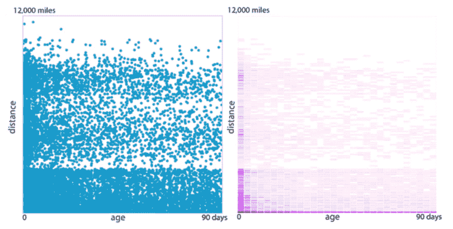T2】](https://res.cloudinary.com/practicaldev/image/fetch/s--2DnP8497--/c_limit%2Cf_auto%2Cfl_progressive%2Cq_auto%2Cw_880/https://cdn-images-1.medium.com/max/1500/1%2ATcy53GBZwv6IotkXgT5aEA.png)

<figcaption>The distribution of job applications (U.S. visitors). You might notice there's a distance after which job applications become much more sparse: that's the distance between NYC and LA.</figcaption>

右图(紫色)告诉我们，应用程序的密度随着距离的增加而降低。这是有道理的:游客更喜欢附近的工作。工作的年龄没有太大的影响，除了*最近的工作(在最后一天发布)会收到很多申请。*

使用这些密度数据，我们执行了[线性回归](https://en.wikipedia.org/wiki/Linear_regression)来根据(距离、年龄)对预测用户申请的可能性。

[T2】](https://res.cloudinary.com/practicaldev/image/fetch/s--JJW7oEFb--/c_limit%2Cf_auto%2Cfl_progressive%2Cq_auto%2Cw_880/https://cdn-images-1.medium.com/max/1500/1%2Ali-_mgeRowfHi-ZnazUX8A.png)

<figcaption>Source code and output of linear regression in R</figcaption>

[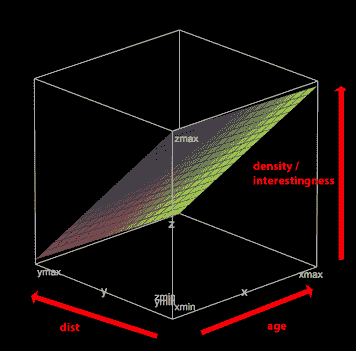T2】](https://res.cloudinary.com/practicaldev/image/fetch/s--u2tni-cU--/c_limit%2Cf_auto%2Cfl_progressive%2Cq_auto%2Cw_880/https://cdn-images-1.medium.com/max/1500/1%2AjQUHjBSXk_U6g1jUoGquzA.png)

<figcaption>Plot of formula obtained with linear regression</figcaption>

由于应用程序的数量随着距离的增加呈指数形式减少(而不是 T2 线性减少)，我们需要使用一个稍微复杂一点的指数方程:

```
// The matching algorithm formula
score = Math.exp(A * distance + B * age + C * (1 – distance) * (1 – age)) 
```

请注意，这仍然是线性回归:我们只是预测了申请数量的对数*，而不是之前的原始申请数量。)*

[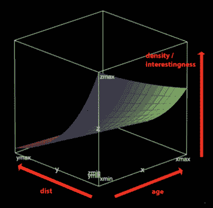T2】](https://res.cloudinary.com/practicaldev/image/fetch/s--XkmAe2y6--/c_limit%2Cf_auto%2Cfl_progressive%2Cq_auto%2Cw_880/https://cdn-images-1.medium.com/max/2000/1%2A6LFoBe5ckQZBNRRd3I3Eeg.png)

<figcaption>The interestingness of a job declines sharply with distance.</figcaption>

### 天意，我们还没有放弃你

所以，现在我们有了一个基于最近和距离的公式，它显示了与访问者相关的工作。太好了！但“有趣的工作”的全部意义不就是利用天意的力量吗(天意告诉我们一份工作在技术方面有多适合访问者)？

在未能正确使用普罗维登斯之后，我们有一段时间偏离了轨道。但我们仍然相信，我们的最新工具可以给我们一些关于我们的访问者的特殊见解。现在我们准备再试一次。

此时，重新引入普罗维登斯只是在我们的密度分析和公式中增加了一个新的参数。计算机仍然负责决定我们对三个参数(通过“线性回归”)的重视程度:距离、年龄和现在的普罗维登斯分数。(现在，让我们远离线性回归，转而使用[泊松回归](https://en.wikipedia.org/wiki/Poisson_regression):这是一种更相关的技术，因为我们试图预测应用程序的数量，一个自然数。)

最后，为什么只有三个参数？在决定你对哪份工作感兴趣时，还有许多其他重要因素。

[T2】](https://res.cloudinary.com/practicaldev/image/fetch/s--lOtlrMJC--/c_limit%2Cf_auto%2Cfl_progressive%2Cq_auto%2Cw_880/https://cdn-images-1.medium.com/max/1500/1%2AS2wRNNchuZN-hTa8XPqPfQ.png)

<figcaption>New ingredients make the matching algorithm tastier</figcaption>

### 工作匹配偏好

我们知道还有更多维度可能会让一份工作与你相关，比如*资历、薪资、行业、开发人员类型(“全栈”、“移动”)*等等。为了表达这些，我们引入了[工作匹配偏好](https://stackoverflow.com/users/jobsearch/current?utm_source=so-owned&utm_medium=blog&utm_campaign=gen-blog&utm_content=blog-link)。

正如您从上面回忆的那样，我们的“兴趣度”公式中的每个参数都有一个关联的*权重*。它决定了该参数对匹配分数(也称为兴趣分数)的影响程度。最初，我们没有任何数据:工作匹配偏好非常新，因此大部分是空的。由于缺乏数据，我们无法计算这些新参数的权重(就像我们之前用泊松回归所做的那样)。所以我们增加了重量。我们称它们为“yay weights ”,为什么不呢？

[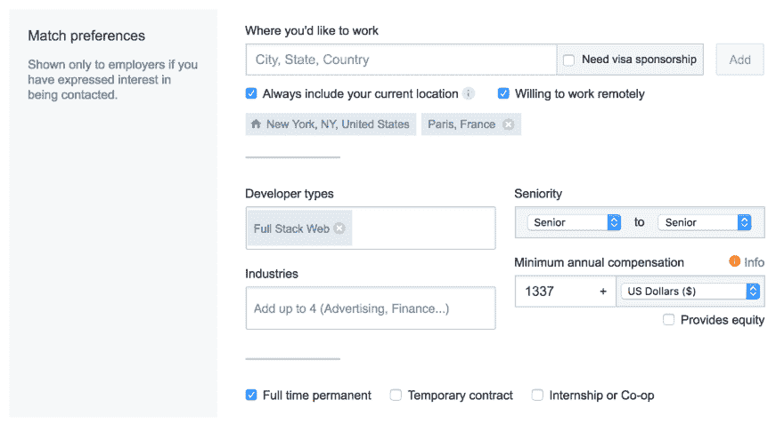T2】](https://res.cloudinary.com/practicaldev/image/fetch/s--bU_tO15P--/c_limit%2Cf_auto%2Cfl_progressive%2Cq_auto%2Cw_880/https://cdn-images-1.medium.com/max/2000/0%2AiNDH7WiviQI20F9p.)

<figcaption>Job match preferences are used to surface interesting jobs</figcaption>

然而，随着时间的推移，用户确实填充了他们的匹配偏好。它为我们提供了足够的数据来识别用户匹配偏好、工作列表和工作申请之间的相关性。我们能够使用该数据运行泊松回归并计算新的权重。

我们已经实现了我们的目标:我们不必选择每个参数如何影响工作的趣味性。相反，数据分析可以*告诉我们*。

但是我们仍然有一个问题:兴趣公式受到工作可用性的影响。例如，让我们假设数据库中 95%的工作应用程序是远程工作(允许远程工作的工作)。我们的方法会推断远程作业比非远程作业更有趣。但那不一定是真的！这可能意味着我们的数据库包含的远程作业比非远程作业多得多！按照同样的逻辑，我们对趣味性公式中的一些参数给予了过多(或过少)的重视。我们通过根据工作可用性对申请数量进行标准化来纠正这一问题。

[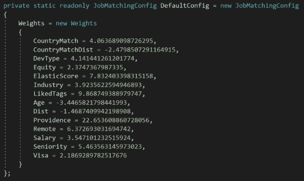T2】](https://res.cloudinary.com/practicaldev/image/fetch/s--b9DapUA3--/c_limit%2Cf_auto%2Cfl_progressive%2Cq_auto%2Cw_880/https://cdn-images-1.medium.com/max/2000/1%2A_hrlGQsW6oDy_vrBxxMsPQ.png)

<figcaption>The weight assigned to each parameter. (This is very secret, please do not leak)</figcaption>

### 模拟和遗传算法

匹配算法正在改进，我们看到了更多的参与。

[T2】](https://res.cloudinary.com/practicaldev/image/fetch/s--7jSRDDk3--/c_limit%2Cf_auto%2Cfl_progressive%2Cq_auto%2Cw_880/https://cdn-images-1.medium.com/max/2000/0%2AGqHJ1sIJ-py8QybL.)

<figcaption>An uncompressed dataset for the learning process weighs around 800MB</figcaption>

通常，我们会对匹配算法进行某种修改(添加一个新参数，比如“salary”或“industry”)，或者修复输入数据集生成过程中的一个错误。

在这种情况下，我们将重新运行学习过程(泊松回归，记得吗？)并收集一组新的权重。我们无法保证这些新的砝码比以前的*好*。我们基本上只是希望如此。我们交叉手指，开始了 A/B 测试，这将需要几周的时间来检测改善，大多数时候它没有检测到任何东西。我们改进匹配算法的过程非常缓慢，我们浪费了大量时间。

所以我们采取了新的方法。对于过去的每一份工作申请，我们模拟了申请访问者的搜索结果。

[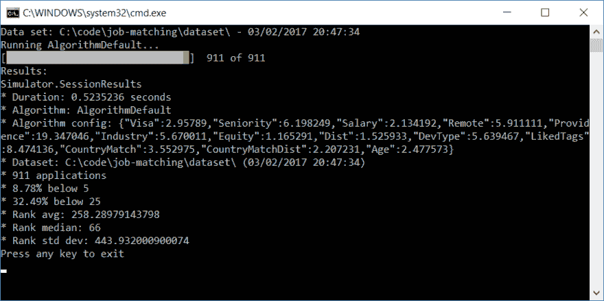T2】](https://res.cloudinary.com/practicaldev/image/fetch/s--oDbxmlEQ--/c_limit%2Cf_auto%2Cfl_progressive%2Cq_auto%2Cw_880/https://cdn-images-1.medium.com/max/2000/0%2AeMaurhQS-4pxzKZU.)

<figcaption>In this run of the job matching simulator, we were able to position the job applied to on the first page of search results in 32.49% of cases. The run took a total of 0.5 seconds, versus 2 weeks for an A/B test.</figcaption>

以下是工作匹配模拟器的工作原理:

*   取一组权重，例如`{ age: 0.2, distance: 1.42, industry: 3.08Â … }`
*   对于每个过去的工作申请，对于申请时正在运行的每个工作列表，使用这组权重计算得分，即`score = 0.2 * AgeDays + 1.42 * LogDistanceMiles + 3.08 * IndustryMatch …`
*   按分数降序排列职位，并检查候选人申请的职位在排序列表中的位置:这给出了一个*排名*。例如:“对于应用程序 123，我们将该作业排在第 6 位”
*   计算所有工作申请的平均排名

对等级进行平均将会给我们一个匹配算法性能的*度量。*平均排名越小，我们对工作的排序就越好。*我们可以尝试许多有趣公式的变体，许多不同的权重组合，运行模拟，并在几秒钟内*获得我们在排序工作*方面有多好的度量。比等待几周的 A/B 测试结果好多了！*

平均等级只是我们用来评估匹配算法性能的度量之一。相反，我们目前使用的是“这个等级的工作被点击的概率”——基于实际测量的等级点击量(见下图)

[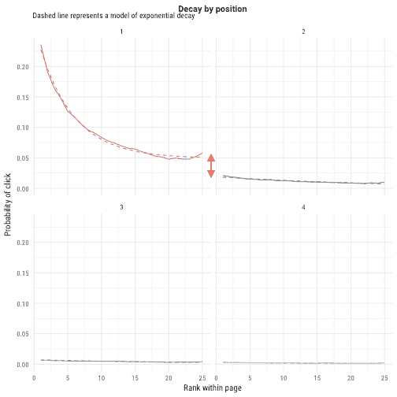T2】](https://res.cloudinary.com/practicaldev/image/fetch/s---bOnVR1g--/c_limit%2Cf_auto%2Cfl_progressive%2Cq_auto%2Cw_880/https://cdn-images-1.medium.com/max/2000/0%2AEPFBAyutf_C6dc3m.)

<figcaption>The higher a job is in the list of results, the more clicks it gets. Each graph represents a page (page 1, page 2, …) Notice how the last result on the first page gets more clicks than the first result of page 2.</figcaption>

我们现在能够尝试一组新的权重，并获得对其性能的几乎即时的测量:为什么不利用它呢？我们开发了一种[遗传算法](https://en.wikipedia.org/wiki/Genetic_algorithm)，它会尝试数千组可能的权重，并只保留最好的一组。直到最近，这才是我们获得生产中使用的匹配算法权重的方法。

[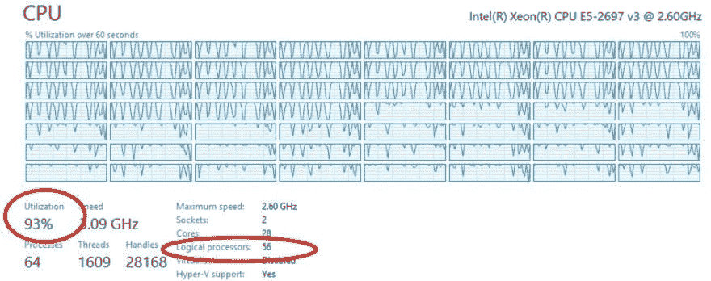T2】](https://res.cloudinary.com/practicaldev/image/fetch/s--2WOu4dKS--/c_limit%2Cf_auto%2Cfl_progressive%2Cq_auto%2Cw_880/https://cdn-images-1.medium.com/max/1500/0%2A30lkJ9vZnJqcBecf.)

<figcaption>Genetic algorithm running on 56-core machine</figcaption>

[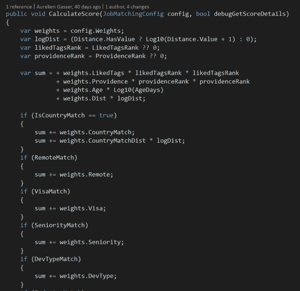T2】](https://res.cloudinary.com/practicaldev/image/fetch/s--bDo0jBak--/c_limit%2Cf_auto%2Cfl_progressive%2Cq_auto%2Cw_880/https://cdn-images-1.medium.com/max/2000/1%2AtH7TnL9-4nWA0DLVtO8NKQ.png)

<figcaption>The matching algorithm: combining parameters to calculate the score for a job</figcaption>

### 火柴，到处都是火柴

工作匹配日趋成熟，我们准备充分利用它。我们比以往任何时候都更有信心，相信它有潜力帮助我们的用户找到他们梦想的工作。我们知道这可以给堆栈溢出作业带来竞争优势。因此，我们做了一些改变，使工作匹配在我们的功能中更加突出。

在那之前，匹配算法只在堆栈溢出作业的主页上使用。换句话说，只要你输入一个像“C++”这样的关键词或者一个像“初级职位”这样的过滤器，匹配算法就不再使用了。相反，我们使用底层搜索引擎 Elasticsearch 对工作进行分类。我们决定让“匹配”排序成为所有搜索的默认排序选项:A/B 测试证实这一变化增加了工作视图和应用程序的数量。耶。

[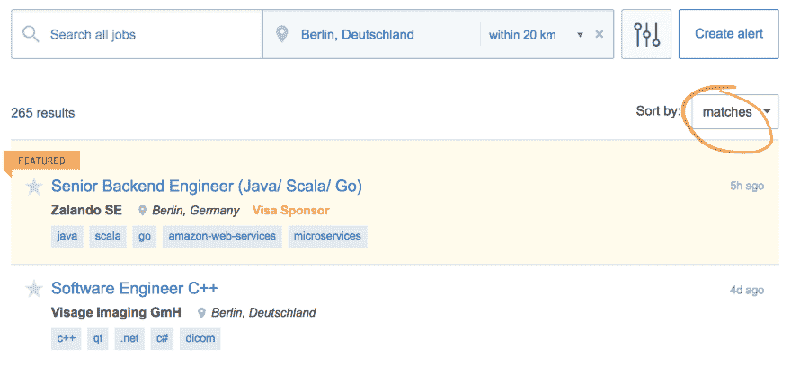T2】](https://res.cloudinary.com/practicaldev/image/fetch/s--3gkzPGFV--/c_limit%2Cf_auto%2Cfl_progressive%2Cq_auto%2Cw_880/https://cdn-images-1.medium.com/max/2000/0%2AZbvZrqEU2o80wpNo.)

<figcaption>The matching algorithm powers all job searches</figcaption>

允许你直接在你的电子邮件收件箱中接收新的工作列表的工作提醒，已经被更新以利用匹配算法。这意味着最有趣的工作现在会首先显示在电子邮件中。想试试吗？[输入您的搜索条件](https://stackoverflow.com/jobs?utm_source=so-owned&utm_medium=blog&utm_campaign=gen-blog&utm_content=blog-link)并点击“创建提醒”

[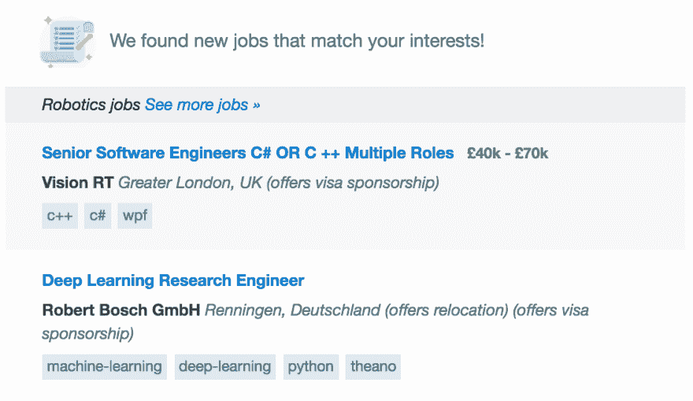T2】](https://res.cloudinary.com/practicaldev/image/fetch/s--o3HwVqZh--/c_limit%2Cf_auto%2Cfl_progressive%2Cq_auto%2Cw_880/https://cdn-images-1.medium.com/max/2000/0%2AifHyhKBwzPO2LI0v.)

<figcaption>The job alert email shows the most interesting jobs first</figcaption>

大约在同一时间，我们对工作搜索进行了许多其他改进，包括大量新的搜索过滤器和改进的、更高效的用户界面。

### R 和优化

使用遗传算法来寻找最佳的工作匹配权重非常有效，但是效率非常低。事实上，只有当我们发现一个更好的选择时，我们才意识到它实际上是多么低效。

为匹配算法寻找权重的最佳组合是一个优化问题:我们的目标是最小化申请职位的中位数排名。排名中值越低，我们就越能预测访问者将要申请的工作。有许多解决最优化问题的技术。最有效的是 R 语言提供的 [optim](https://stat.ethz.ch/R-manual/R-devel/library/stats/html/optim.html) 函数。它使用了一种叫做[梯度下降](https://en.wikipedia.org/wiki/Gradient_descent)的技术，在我们的例子中，这种技术比遗传算法表现得好得多。它找到的权重稍微好一点，更重要的是，它比*快了大约 70 倍*。具体来说，找到最佳的权重组合现在只需要 10 分钟，而使用遗传算法需要 12 个小时！

[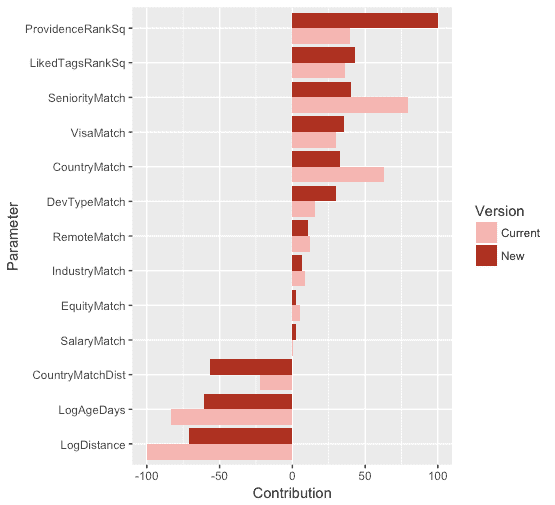T2】](https://res.cloudinary.com/practicaldev/image/fetch/s--7_siW6Xi--/c_limit%2Cf_auto%2Cfl_progressive%2Cq_auto%2Cw_880/https://cdn-images-1.medium.com/max/2000/0%2ALjq1IAWhLeLyRWm2.)

<figcaption>The relative contribution of parameters in the interestingness score. "Current" and "New" refer to versions of the matching algorithm.</figcaption>

用 C#编写我们自己的遗传算法是个坏主意。我们花了几周时间来实施、测试和优化。更不用说所有等待结果的时间了。一直以来都有更好的解决方案(R 中的 optim 函数)。因为没有做适当的调研，所以忽略了，耽误了时间。*叹息。*

从 C#实现切换到 R 提供了其他好处，比如创建漂亮的 [R Markdown](http://rmarkdown.rstudio.com/) 报告的可能性，以及使用原生矩阵操作的更快模拟。事实上，由于兴趣度分数是一个线性组合(`score = a * Distance + b * Age + c * ProvidenceScore…`)，我们可以一次计算出*所有* *用户工作组合的分数。*

我们可以通过将用户作业参数矩阵(维度 M x N)乘以权重向量(维度 N)来实现，其中:

*   M 是我们数据集中用户-作业对的数量(M \u 1500 万)
*   N 是匹配参数的数量(N \u\u 14:距离、年龄、ProvidenceScore、…)

一旦我们计算了一组新的权重(或“版本”)，我们就衡量它与以前的版本相比表现如何。我们通过在测试数据集上运行两次模拟来做到这一点:一次使用旧的权重，一次使用新的权重。此外，我们使用一种叫做 [bootstrapping](https://en.wikipedia.org/wiki/Bootstrapping_(statistics)) 的技术，在这种技术中，我们让新旧版本在一场涉及测试数据集子集的比赛中竞争。我们记录下哪个版本“赢”的次数更多。

[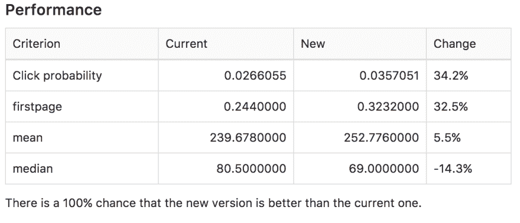T2】](https://res.cloudinary.com/practicaldev/image/fetch/s--4uQBut4y--/c_limit%2Cf_auto%2Cfl_progressive%2Cq_auto%2Cw_880/https://cdn-images-1.medium.com/max/2000/0%2AwgMwsQbgVx_EqRRa.)

<figcaption>Comparing the performance of the current matching weights vs. the proposed new weights. The "100%" number is obtained programmatically with bootstrapping. Here, the new version won all its 10,000 matches against the old version.</figcaption>

### 表现

在堆栈溢出时，[性能是一个特性](https://blog.codinghorror.com/performance-is-a-feature/)。我们总是竭尽全力让事情变得更快，求职当然也不例外。

[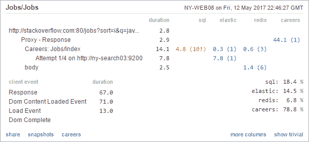T2】](https://res.cloudinary.com/practicaldev/image/fetch/s--gLz36eXL--/c_limit%2Cf_auto%2Cfl_progressive%2Cq_auto%2Cw_880/https://cdn-images-1.medium.com/max/2000/0%2Aq2gL8k3_z4qU7OiQ.)

<figcaption>We use MiniProfiler to keep track of request timings</figcaption>

大约两年前，为了找工作，我们离开了 SQL Server。相反，我们开始使用基于 Apache Lucene 的搜索引擎 [Elasticsearch](https://github.com/elastic/elasticsearch) 。它提供了诸如[词干](http://nlp.stanford.edu/IR-book/html/htmledition/stemming-and-lemmatization-1.html)和[建议](https://www.elastic.co/guide/en/elasticsearch/reference/current/search-suggesters.html)的强大功能。在典型的求职中，会执行以下步骤:

1.  (0 毫秒)将查询字符串(例如 query=java&location=london)转换成表达式树
2.  (5 到 60 毫秒)将表达式树传递给 Elasticsearch，并检索匹配工作标识符的列表(持续时间取决于结果的数量)
3.  (0 ms)从高速缓存中检索所述标识符的作业细节:从 web 服务器的内部存储器(L1)或从 redis (L2)中。由于 L1 几乎总是有人居住，所以这种操作实际上是免费的。
4.  (1 到 10 毫秒)使用匹配算法对内存中的作业进行排序，并返回所需的结果页面(持续时间取决于结果数量)

从 Elasticsearch 检索作业 id 是最昂贵的步骤。这是因为，由于我们希望使用匹配算法对作业进行排序，我们需要 Elasticsearch 返回给定搜索的所有结果*(而不仅仅是第 n 页结果)。换句话说:最有趣的工作可能是 Elasticsearch 返回的任何工作，所以如果有疑问，我们需要将它们全部返回。我们计划通过*将匹配算法作为弹性搜索插件*运行来加快速度，允许我们在一个步骤中执行步骤 2、3 和 4(并且只返回想要的结果页面)。*

[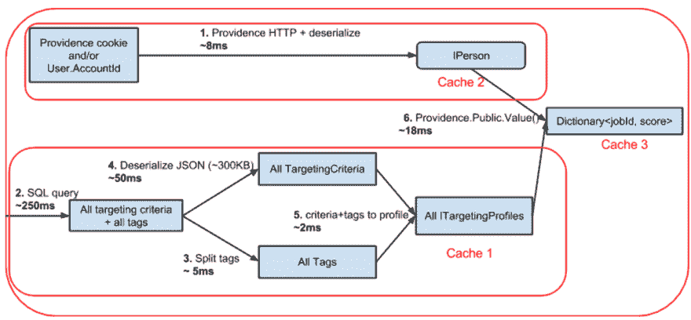T2】](https://res.cloudinary.com/practicaldev/image/fetch/s--9vI7g2RV--/c_limit%2Cf_auto%2Cfl_progressive%2Cq_auto%2Cw_880/https://cdn-images-1.medium.com/max/2000/0%2ATMgWvkvzM--9t2F4.)

<figcaption>An ancient round of performance optimization.</figcaption>

几周前，我们发布了另一项优化:我们现在直接在网络服务器的内存 (L1 缓存)中执行所有非关键词搜索*，完全消除了对 Elasticsearch(针对这些类型的搜索)的需求。*

“用户信息呢？”我听到你问:

*   获取+反序列化用户的作业首选项(存储在 SQL 中的 JSON)需要不到 1 毫秒的时间
*   获取+反序列化访问者的 Providence 配置文件(从内部 API 检索的 JSON)需要不到 5 毫秒的时间
*   在这两种情况下，数据都缓存在 web 服务器的内存(L1)中，因此来自同一个用户的后续请求可以免费获得这些数据。

### 未来的工作

在过去的几年里，Stack Overflow 的求职经历了漫长的发展，从几乎没有智能到复杂的匹配算法。还有很多事情要做。

最近，我们尝试通过使用[标签同义词](http://stackoverflow.com/tags/synonyms)来更智能地处理工作标签。我们还尝试将自您上次访问以来发布的职位进行了表面处理。不幸的是，这些尝试都没有成功地显示更相关的结果..

但是其他一些想法是成功的。

我们分析了最常搜索的术语，并优化了我们的搜索结果，以解释同一短语的变体。例如，搜索“ [ML](https://stackoverflow.com/jobs?sort=i&q=ml&utm_source=so-owned&utm_medium=blog&utm_campaign=gen-blog&utm_content=blog-link) ”会得到与“[机器学习](https://stackoverflow.com/jobs?sort=i&q=machine+learning&utm_source=so-owned&utm_medium=blog&utm_campaign=gen-blog&utm_content=blog-link)”相同的结果此外，我们还将 Elasticsearch 的内部分数整合到了我们的匹配算法中，因此兴趣度分数考虑了工作列表与用户输入的关键字的匹配程度。

另一个想法是利用来自用户[开发者故事](http://stackoverflow.com/users/story/join)的经验标签:如果用户有一个使用 redis 的开源项目，并且最近有 Java 方面的专业经验，那么这个用户对 Java / redis 工作感兴趣的可能性会增加。这是我们长期以来一直想做的事情，现在已经搁置了。它应该在 6 到 8 周内准备好。

最后，匹配算法*针对申请*进行了优化:它展示了我们认为你会感兴趣的工作。但你知道什么会更好吗？为*招聘*进行优化。如果我们能收集到更多关于哪些申请会被录用的信息，我们不仅可以了解你可能申请的职位，还可以了解你可能在被录用的*职位。*

感谢您对[元堆栈溢出](https://meta.stackoverflow.com/questions/tagged/jobs)的所有反馈和错误报告。这对我们来说非常有价值，我们非常感谢您的帮助。

*找新工作？浏览关于[堆栈溢出作业](https://stackoverflow.com/jobs?utm_source=so-owned&utm_medium=blog&utm_campaign=gen-blog&utm_content=blog-link)的新机会。*