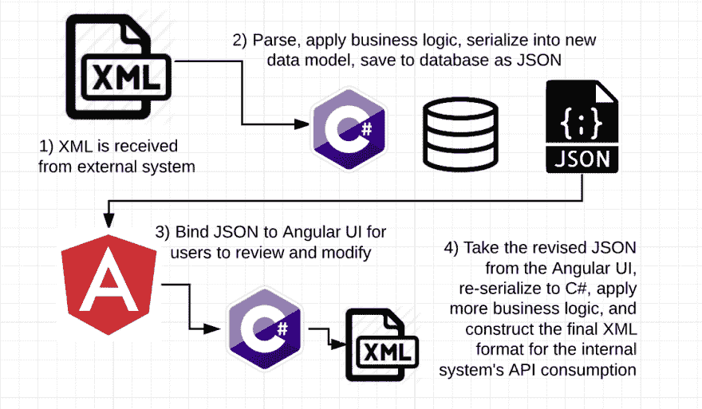

# 使用 XML 和 JSON 构建一个很棒的界面

> 原文：<https://dev.to/cesar_codes/using-xml-and-json-to-build-an-awesome-interface>

在这篇文章中，我将展示我和我的团队是如何利用两种通常不会一起使用的不同技术的优势，来开发一个出色的软件解决方案的...

你看，在我们的行业中，竞争技术的对抗是很常见的，只要看看常见的序列化格式 **XML** 和 **JSON** 就可以看到一个很好的例子。

在使用过 XML 及其相关技术的程序员和使用过 JSON 及其相关技术的程序员之间似乎有一条分界线。以至于某些程序员要么停滞在他们所知道的东西上，而其他程序员拒绝学习好的技术，仅仅是因为它不是这个月的潮流。

因此....几个月前，我开始从事一个相当大的中间件项目，在这个项目中,*的基本思想是从外部系统接收 XML 数据负载，解析它，应用业务逻辑，然后创建新的对象，这些对象将被序列化为 XML 消息，供内部系统 API 使用。像这样:*

[T2】](https://res.cloudinary.com/practicaldev/image/fetch/s--uU4BbE6j--/c_limit%2Cf_auto%2Cfl_progressive%2Cq_auto%2Cw_880/http://cesarcodes.com/conteimg/2017/05/1.png)

和大多数项目一样，这个项目的需求也在发展，我们能够通过利用 **XML 和 JSON** 的优势使我们的产品更加丰富。

你会问，怎么会这样？嗯，我们意识到，如果我们在最终将 XML 序列化为我们内部系统的 API 之前，包含一个用户可以查看数据模型的 UI，我们可以为用户带来大量的价值。此外，我们意识到我们可以使用角度绑定的强大功能来快速开发现代 UI，但问题是我们使用的数据格式是 XML。因此，我们想到了将初始的 XML 有效载荷解析成 C#数据模型，然后序列化成 JSON(Json.NET 很快就完成了；-D)，将其存储在我们的数据库中，然后让一个 Angular UI 从该数据库绑定它，供用户查看。一旦用户在 UI 上做了必要的修改，我们就可以将修改后的 JSON 对象从 Angular 重新序列化为 C#并最终还原为 XML。像这样:

[T2】](https://res.cloudinary.com/practicaldev/image/fetch/s--uEwYry4H--/c_limit%2Cf_auto%2Cfl_progressive%2Cq_auto%2Cw_880/http://cesarcodes.com/conteimg/2017/05/2b.png)

现在你知道了，我们能够超越最初的期望，通过结合两种技术的力量，迅速为我们的用户带来现代的角度应用体验，这两种技术通常被认为是竞争对手而不是合作伙伴。