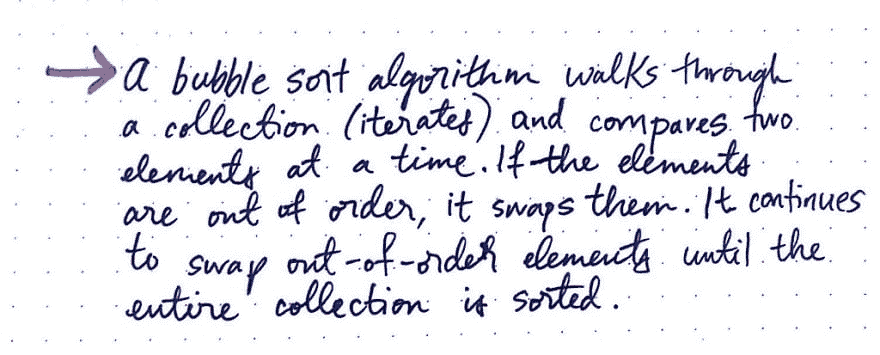
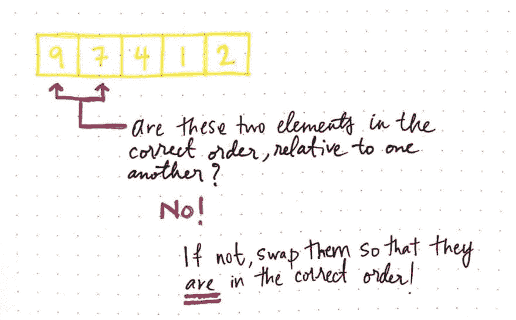
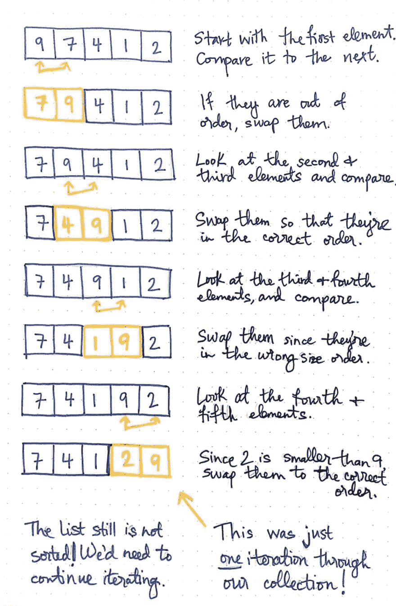
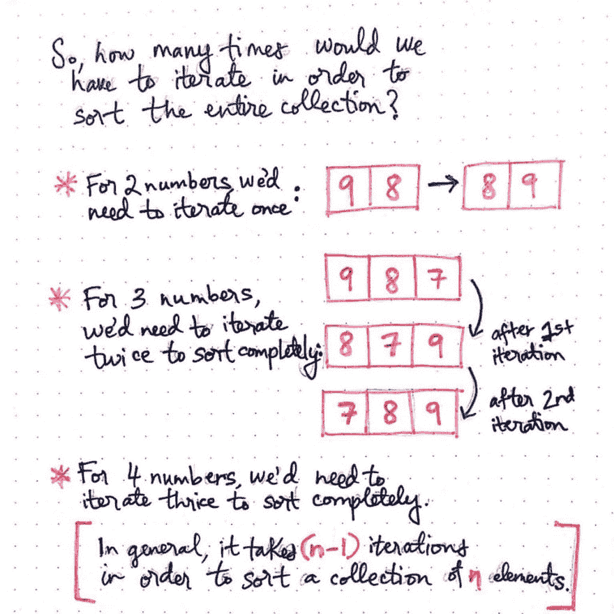
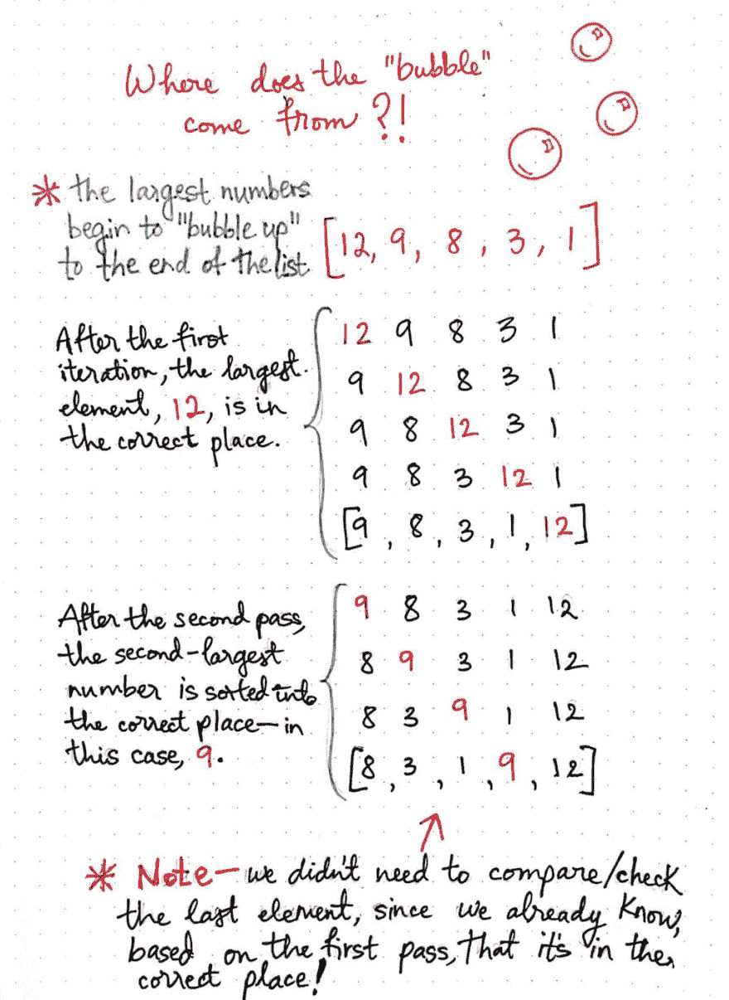
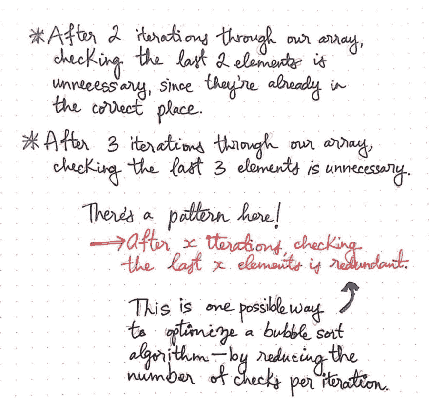
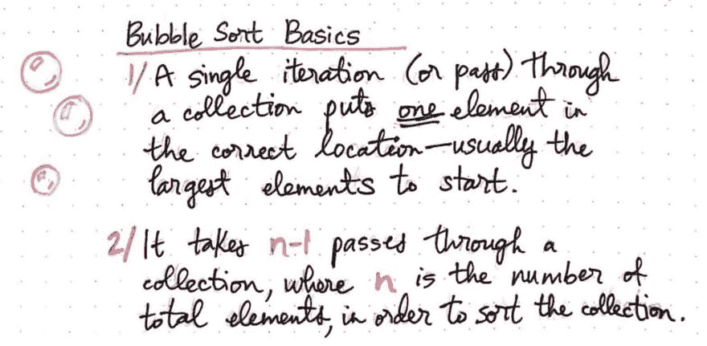
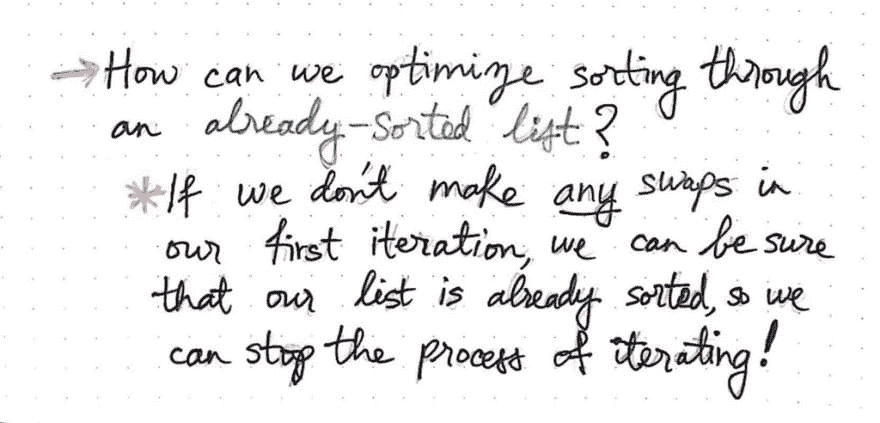
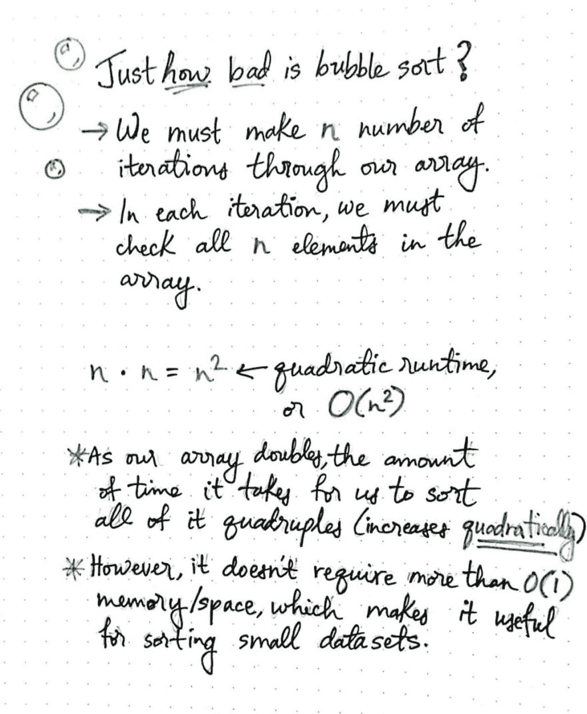
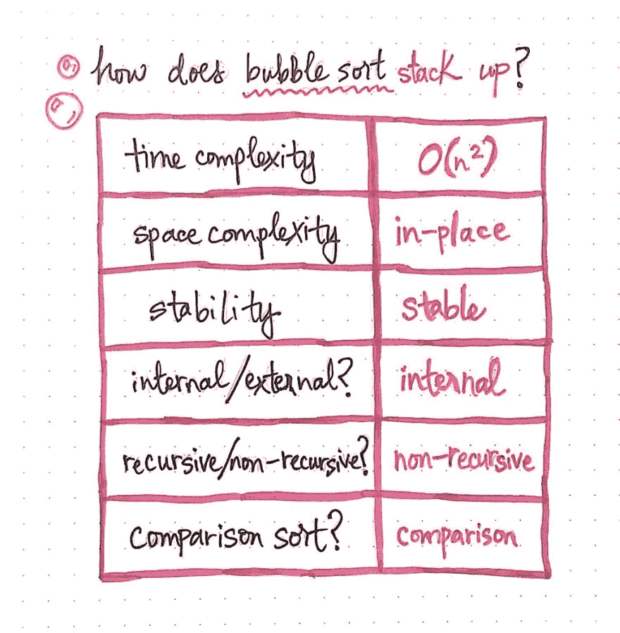

# 冒泡排序

> 原文:[https://dev.to/vaidehijoshi/bubbling-up-with-bubble-sorts](https://dev.to/vaidehijoshi/bubbling-up-with-bubble-sorts)

在编程社区中似乎有一个超越语言、库或框架的笑话——每个人似乎都知道冒泡排序不是一个好主意。我记得多年前第一次听到有人拿这个开玩笑；他们在嘲笑冒泡排序，嘲笑它是排序算法最糟糕的实现，他们不明白为什么有人会使用它。

这些年来，我一次又一次地听到这个笑话，有一段时间，我只是表面上接受了它。有时候，当别人开泡泡玩笑时，我甚至会跟着一起笑，不知道为什么人们会觉得这很糟糕。我通常认为，对某件事做出自己的决定比只是听别人的意见并把它们当作真理来接受更好。我用冒泡排序法做了很长时间。但是我不认为这是一个好的实践。

只有当我开始这个系列的时候，我才决定把这些都放在一边。也许冒泡排序真的是一个糟糕的算法。或者可能只是被误解了，或者没有被很好地利用。也许它甚至可以做得更好，更优化。除非我亲自了解，否则我怎么会知道这些事情呢？

所以，今天我们要做的就是:我们要独立思考。是时候结束所有关于冒泡排序的谣言了。

### 冒泡基础知识

在我们真正对冒泡排序算法做出任何公正的判断之前，我们需要理解它*到底做了什么*，以及它是如何工作的。一种 ***冒泡排序算法*** 遍历给定的列表或数组，按大小比较列表中每对相邻元素。如果这些元素的顺序不正确，它会交换它们，然后移到下一对元素。

<figure>[](https://res.cloudinary.com/practicaldev/image/fetch/s--IDajN8o6--/c_limit%2Cf_auto%2Cfl_progressive%2Cq_auto%2Cw_880/https://cdn-images-1.medium.com/max/1024/1%2AgxRwophEo5u22AaSgt8JXg.jpeg) 

<figcaption>气泡排序:一个定义</figcaption>

</figure>

定义是一个很好的起点，但对我来说，只有当我在实践中看到它们时，事情才真正得到巩固。因此，让我们从实用主义的角度来看看这个定义实际上意味着什么。在这个例子中，我们有一组需要排序的无序数字:9，7，4，1，2。冒泡排序将如何处理这个问题？

<figure>[](https://res.cloudinary.com/practicaldev/image/fetch/s--audAmmO3--/c_limit%2Cf_auto%2Cfl_progressive%2Cq_auto%2Cw_880/https://cdn-images-1.medium.com/max/1024/1%2AQwwOCWragt_NIJ3cX0slFw.jpeg) 

<figcaption>如何比较两个元素的气泡排序</figcaption>

</figure>

我们知道冒泡排序会一次比较两对。很自然，它将开始比较我们列表中的前两个元素——第一对。该算法查看第一对(在本例中是 9 和 7)，并确定第一个元素是否在正确的位置。实际上，它只是使用>或

由于 9 大于 7，算法知道它应该在 7 之后。因为这两个数字相对于另一个的顺序*不正确，它将交换它们，这将改变列表中这两个元素的顺序。请记住，它不知道 9 是否是列表中最大的数字——它在任何给定时间点只知道两个数字，因为算法不能像我们一样用眼睛快速浏览列表。*

好，这就是冒泡排序算法在一次比较两个元素时的作用。但是它实际上是如何对整个列表进行排序的呢？让我们看看算法接下来会做什么，使用我们示例中完全相同的一组数字:

<figure>[](https://res.cloudinary.com/practicaldev/image/fetch/s--OHKTxl0y--/c_limit%2Cf_auto%2Cfl_progressive%2Cq_auto%2Cw_880/https://cdn-images-1.medium.com/max/1024/1%2A0G-HWCiByHVPedrKXwS8iQ.jpeg) 

<figcaption>冒泡排序的单遍/迭代</figcaption>

</figure>

我们首先比较前两个元素——9 和 7——因为它们的顺序不对，所以我们交换它们。

接下来，我们比较第二个和第三个元素:9 和 4。数字 9 肯定比 4 大，所以应该在后面。这意味着我们也必须交换这两个元素。

下两个元素是 9 和 1。同样，9 应该在 1 之后，而不是之前，这意味着我们需要再次交换*。最后，我们在这个迭代中的最后两个元素:9 和 2。数字 2 肯定应该在 9 之前，所以我们将交换这两个元素，使它们的顺序正确。*

 *唷！这只是冒泡排序的一次迭代。我们的列表*甚至还没有排序*。我们需要一次又一次地重复这组动作，直到整个元素集合被排序。如果这只是一次*单次*迭代，那么我现在有一个大问题:为了对整个集合进行排序，我们需要迭代多少次？想象一下，如果我们有一个 10、20 或 50 个未排序元素的列表——我真的不想为了知道要做多少工作而遍历每个集合！

相反，让我们试着看看我们是否能找到一个模式，并抽象出给定一个有 *n* 个元素的数组，我们需要进行多少次迭代。

<figure>[](https://res.cloudinary.com/practicaldev/image/fetch/s--xkCOuLFy--/c_limit%2Cf_auto%2Cfl_progressive%2Cq_auto%2Cw_880/https://cdn-images-1.medium.com/max/1024/1%2AlRoU4JrRQBH-AZoT0-YSnA.jpeg) 

<figcaption>概括冒泡排序的迭代次数</figcaption>

</figure>

我们可以从一个简单的例子开始。对于一个只有两个数字的未排序列表，我们只需要迭代一次，因为在一次遍历中，我们比较组成列表的一对数字。

对于一个包含三个数字的数组，我们需要迭代两次才能完全排序——第一次迭代，我们将一个数字移动到正确的位置，第二次迭代将对整个列表进行排序。

我没有在这里画出来，但是对于一个四个数字的数组，我们需要迭代三次才能完全排序。希望这几个小例子能帮助你看到这里出现的一种模式！

> 通常，给定 n 个未排序元素的集合，使用冒泡排序算法对列表进行排序需要(n-1)次迭代。

当我们给定一个大的数组时，这种一般化对我们非常有帮助，我们想知道如果我们计划使用冒泡排序作为我们的排序算法，我们需要迭代多少次。

### 最优冒泡

既然我们已经看到了冒泡排序中出现的一种模式，那么抓住另外两种模式应该会容易一些。冒泡排序有一个非常有趣的特征，这也是冒泡排序得名的原因！

让我们看一个例子，从一个未排序的数组开始:

<figure>[](https://res.cloudinary.com/practicaldev/image/fetch/s--CHV3PJDJ--/c_limit%2Cf_auto%2Cfl_progressive%2Cq_auto%2Cw_880/https://cdn-images-1.medium.com/max/1024/1%2AiejMNghYoOs4d7bw_cAUrA.jpeg) 

<figcaption>是什么让泡泡排序？</figcaption>

</figure>

在这个例子中，每次迭代负责将最大的未排序元素移动到它在数组中的正确位置。例如，第一次迭代有效地将最大的数字 12 移动到列表的末尾。第二次迭代将第二大的数字(或最大的未排序的数字)9 移动到列表中正确的位置。

> 这就是冒泡排序得名的原因:最大的数字开始“冒泡到它们所属的列表末尾”。

当然，根据冒泡排序的实现方式，这也可以反过来，这样最小的数字就会“冒泡到列表的前面”。无论如何，在这两种情况下，数字的冒泡来自冒泡排序在遍历集合时比较和交换每对元素的方式。

我们还可以在这里看到另一个图案。请注意，在第二次迭代中，我们不需要比较最后两个元素 9 和 12；它们在我们第一次遍历数组时就已经被有效地排序了。

<figure>[](https://res.cloudinary.com/practicaldev/image/fetch/s--OQbRnSX---/c_limit%2Cf_auto%2Cfl_progressive%2Cq_auto%2Cw_880/https://cdn-images-1.medium.com/max/1024/1%2AJr_uC0fr4iyppSm6yw8RYA.jpeg) 

<figcaption>经过 x 次迭代，检查最后 x 个元素是否多余</figcaption>

</figure>

让我们再次尝试概括这个模式，并尝试找到一个我们遵循的规则。

我们看到，在对数组进行两次迭代之后，检查最后两个元素是不必要的，因为它们已经被排序了。

如果我们写出第三次迭代，我们会看到在第三次循环中我们会以[3，1，8，9，12]结束，最后三个元素被排序。这意味着我们不需要检查最后三个元素。

您大概可以预测接下来会发生什么:在第四次迭代中，最后四个元素将在第二次传递中被排序。我们在这里看到的模式可以总结为以下规则:

> 在 x 次迭代之后，检查集合中的最后 x 个元素是多余的。

知道这一点很好，因为这是优化冒泡排序的一种方式！如果我们知道最后的 *x* 元素不需要进行比较，我们就可以停止迭代，节省一些时间和内存！

既然我们已经非常仔细地研究了冒泡排序，我们可以对这个算法做一些更大的推广。

<figure>[](https://res.cloudinary.com/practicaldev/image/fetch/s--CBbwYqe_--/c_limit%2Cf_auto%2Cfl_progressive%2Cq_auto%2Cw_880/https://cdn-images-1.medium.com/max/1024/1%2APbgxvjaYg7n6bLcbQ70p0w.jpeg) 

<figcaption>泡排序基础知识</figcaption>

</figure>

关于冒泡排序，需要记住的一点是，单次迭代会将一个元素(通常是最大的未排序元素)放在数组中正确的位置。记住它需要 *(n-1)* 遍历一个集合，其中 *n* 是元素的总数，以便对整个东西进行排序。

### 多少泡泡才算太多泡泡？

好了，是时候说一下房间里的大象(吹泡泡)了:泡泡排序的低效率。我不会对你撒谎——它肯定又慢又没效率。但是，我不鼓励你仅仅相信我的话。相反，让我们一起找出*为什么*速度慢、效率低！

我认为实际查看冒泡排序算法的速度和效率的最佳方式是实现并运行它。下面是我的冒泡排序实现，基于 Rosetta Code 的 [JavaScript 版本](https://rosettacode.org/wiki/Sorting_algorithms/Bubble_sort#JavaScript)，我修改了它:

```
function bubbleSort(array) {
  var isSorted = false;

  while (!isSorted) {
    isSorted = true;

// Iterate until we get to the last element
    for (var index = 1; index < array.length; index++) {
      console.log("comparing " + array[index] + " and " + array[index - 1]);

      // If the element to the left is bigger, then swap the element
      // that we're currently looking at with its left neighbor.
      if (array[index - 1] > array[index]) {
        isSorted = false;

console.log("SWAPPING " + array[index] + " and " + array[index - 1]);

        // Swap elements by creating a temporary reference.
        var temporaryReference = array[index - 1];
        array[index - 1] = array[index];
        array[index] = temporaryReference;
      }

console.log('array is now ', array);
    }

console.log(" **one full pass through array**");
    console.log("***is array sorted? ", isSorted);
  }

  return array;
} 
```

我添加了一些 console.log 来帮助我们了解这里到底发生了什么。如果你好奇，你可以自己运行这个算法，在你的浏览器上使用 JavaScript 控制台！出于我们的目的，我们将使用与本文开始时相同的数组:[9，7，4，1，2]。

```
var myArray = [9, 7, 4, 1, 2];

bubbleSort(myArray); 
```

当我们调用 bubbleSort 函数时，控制台中显示的内容如下:

```
> comparing 7 and 9
> SWAPPING 7 and 9
> array is now (5) [7, 9, 4, 1, 2]
> comparing 4 and 9
> SWAPPING 4 and 9
> array is now (5) [7, 4, 9, 1, 2]
> comparing 1 and 9
> SWAPPING 1 and 9
> array is now (5) [7, 4, 1, 9, 2]
> comparing 2 and 9
> SWAPPING 2 and 9
> array is now (5) [7, 4, 1, 2, 9]
> **one full pass through array**
> ***is array sorted? false
> comparing 4 and 7
> SWAPPING 4 and 7
> array is now (5) [4, 7, 1, 2, 9]
> comparing 1 and 7
> SWAPPING 1 and 7
> array is now (5) [4, 1, 7, 2, 9]
> comparing 2 and 7
> SWAPPING 2 and 7
> array is now (5) [4, 1, 2, 7, 9]
> comparing 9 and 7
> array is now (5) [4, 1, 2, 7, 9]
> **one full pass through array**
> ***is array sorted? false
> comparing 1 and 4
> SWAPPING 1 and 4
> array is now (5) [1, 4, 2, 7, 9]
> comparing 2 and 4
> SWAPPING 2 and 4
> array is now (5) [1, 2, 4, 7, 9]
> comparing 7 and 4
> array is now (5) [1, 2, 4, 7, 9]
> comparing 9 and 7
> array is now (5) [1, 2, 4, 7, 9]
> **one full pass through array**
> ***is array sorted? false
> comparing 2 and 1
> array is now (5) [1, 2, 4, 7, 9]
> comparing 4 and 2
> array is now (5) [1, 2, 4, 7, 9]
> comparing 7 and 4
> array is now (5) [1, 2, 4, 7, 9]
> comparing 9 and 7
> array is now (5) [1, 2, 4, 7, 9]
> **one full pass through array**
> ***is array sorted? true
>> (5) [1, 2, 4, 7, 9] 
```

哇，那真是太多了。让我们来看看这是怎么回事。我们可以看到，该算法正在做我们每次迭代时正在做的事情——它只是比我们做得更快！我们可以看到它一次比较两个元素。如果我们在数组**中寻找* *的实例，我们可以看到数组在单次迭代结束时的样子。考虑到这个数组中只有五个元素需要排序，这里目前进行了 16 次比较。那似乎…不太好。

这个实现也根本没有被优化:你会注意到，即使在第一次迭代之后，我们还是会一次又一次地看到这个输出:比较 9 和 7。这有点傻，这也是为什么冒泡排序算法很慢的部分原因；它进行了大量的比较，但不一定是以智能的方式进行比较。

还有另一个问题:如果我们的列表已经排序了呢？冒泡排序的简单实现将遍历整个列表，即使列表已经排序，也要花费大量的时间和内存。

<figure>[](https://res.cloudinary.com/practicaldev/image/fetch/s--df2g_BZ_--/c_limit%2Cf_auto%2Cfl_progressive%2Cq_auto%2Cw_880/https://cdn-images-1.medium.com/max/1024/1%2APfplDsnnIzG8_k236zYevw.jpeg) 

<figcaption>如何优化已经排序的列表的排序？</figcaption>

</figure>

然而，我们可以做一件简单的事情来避免不必要工作的疯狂重复。我们可以检查并查看我们是否在第一次迭代中进行了任何交换；如果不是，我们知道列表必须被排序，我们可以停止迭代。

如果我们回头看看我们的 JavaScript 实现，我们会注意到我们实际上正在这样做！isSorted 变量作为一个标志，当我们开始迭代时，我们设置它。

```
var isSorted = false;

isSorted = true; 
```

如果我们在第一次迭代中没有交换元素，我们知道这个数组已经排序了。isSorted 标志最初设置为 true，永远不会关闭——因此，我们知道数组在第一次通过时就已排序，我们可以跳出循环，而不必进行大量不必要的迭代。

但是很明显，即使我们已经在代码中添加了这种优化，它仍然非常慢，而且看起来重复。

<figure>[](https://res.cloudinary.com/practicaldev/image/fetch/s--nDsh_QFF--/c_limit%2Cf_auto%2Cfl_progressive%2Cq_auto%2Cw_880/https://cdn-images-1.medium.com/max/1024/1%2Ax4RU6LfTVRAPFZgUfylnEg.jpeg) 

<figcaption>到底泡沫排序有多糟糕？</figcaption>

</figure>

如果冒泡排序不好，我们也许应该弄清楚它到底有多糟糕。我们知道，为了对一个包含 *n* 个元素的数组进行排序，我们必须进行 *n* 次迭代。我们还知道，在每次迭代中，我们必须检查数组中的所有 *n* 元素。

乘法会告诉我们，如果我们遍历所有的 *n* 元素，并且在每次迭代中，检查所有的 *n* 元素，我们基本上是在乘以 *n x n* ，也就是*n*。

在时间复杂性的背景下，我们可以说冒泡排序算法的大 O 符号是***O(n \)***。

基于我们在上周关于[选择排序](https://medium.com/basecs/exponentially-easy-selection-sort-d7a34292b049)的帖子中所学到的，我们还知道如果我们在一个算法中有一个循环嵌套在另一个循环中，这是一个很好的指标，表明该算法的大 O 符号将是*二次*。也就是说，当我们的数组规模翻倍时，我们对其进行排序所需的时间将会是*的四倍*。

然而，与选择排序类似，冒泡排序具有二次时间复杂度，但具有*常数*(或，***【O(1)***)空间复杂度。

让我们看看冒泡排序与我们已经看过的其他算法相比的其他一些方式，使用我们已经学过的分类。

<figure>[](https://res.cloudinary.com/practicaldev/image/fetch/s--wQauOn2N--/c_limit%2Cf_auto%2Cfl_progressive%2Cq_auto%2Cw_880/https://cdn-images-1.medium.com/max/1024/1%2AHttdxcZxCegVmAPkup6DiA.jpeg) 

<figcaption>冒泡排序如何堆积？</figcaption>

</figure>

我们知道，冒泡排序的时间复杂度是 ***二次*** ，或者用大 O 表示为 O(n \)。冒泡排序在运行时不需要那么多额外的内存——它一次只需要几个指针来保持对它正在寻找的对的引用，并且可能交换(例如，在我们的代码中，temporaryReference 变量)。由于它只需要 O(1)个常数空间，我们可以说它是一个 ***在位算法*** ，直接对输入的数据进行运算。

冒泡排序也是一种 ***稳定的*** 算法，这意味着它保留了元素的相对顺序。如果我们仔细想想，这是有意义的:想象一个数组有一个数字的两个实例:[4，2，3，3]。当比较 3 的两个实例时，如果左边的不大于右边的，算法不会交换它们。因此，它们的相对顺序将保持不变。

这种算法也是一种 ***内部*** 排序，这意味着所有的数据都存储在计算机的主存中。这对于冒泡排序是至关重要的，因为当算法处理数据时，它需要所有的数据都存在于一个块中；如果这个算法是外部的，它将导致比现在更差的性能，因为它将不得不引用可能到处存储的内存块。

最后，我们已经知道冒泡排序既是 ***非递归*** (相反，是迭代的)，又是 ***比较*** 排序，因为根据定义，它遍历一个数组，一次比较两个元素。

基于所有这些条件，我们就更容易理解为什么冒泡排序会受到指责。相当慢，做了很多比较，花了很长时间。但是这是一个相当容易理解的算法，如果你不关心一个算法要花多少时间，或者如果你有一个非常小的数据集要排序，它可能是有用的。然而，大多数时候，情况并非如此，这意味着大多数时候，如果你想使用冒泡排序，你应该避免使用它。

似乎每个人都知道泡沫排序通常是坏消息——甚至巴拉克·奥巴马在 2008 年担任参议员时也知道这一点:

但是你猜怎么着？现在你知道*为什么*这是一个坏主意，如何优化它，以及如何说服别人不要使用它。不过，希望你永远都不需要这么做！

### 资源

因为冒泡排序是一种臭名昭著的算法，所以你可以在上面做很多阅读。然而，我发现视频对这个算法特别有帮助，因为它们真的有助于说明“冒泡的发生”。我在下面的链接中列出了几个好的。快乐冒泡！

1.  [冒泡排序](http://interactivepython.org/runestone/static/pythonds/SortSearch/TheBubbleSort.html)，互动 Python
2.  [排序算法/冒泡排序](https://rosettacode.org/wiki/Sorting_algorithms/Bubble_sort)，Rosetta 代码
3.  [算法:冒泡排序](https://www.youtube.com/watch?v=6Gv8vg0kcHc)，HackerRank
4.  [冒泡排序算法](https://www.youtube.com/watch?v=Jdtq5uKz-w4&t=20s)，mycodeschool
5.  [冒泡排序](https://www.youtube.com/watch?v=8Kp-8OGwphY)，哈佛 CS50

* * *

*本帖最初发表于[medium.com](https://medium.com/basecs/bubbling-up-with-bubble-sorts-3df5ac88e592)T3】**