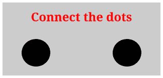

# 辅导方面的一些经验教训

> 原文:[https://dev.to/pbeekums/some-lessons-learned-on-mentoring](https://dev.to/pbeekums/some-lessons-learned-on-mentoring)

指导是我最喜欢的活动之一。没有一个合理复杂的系统可以由一个开发人员来构建。这需要一个团队。从长远来看，帮助团队的其他成员减少了我自己的工作量，即使这在短期内会增加工作量。最终，我发现自己喜欢这项活动，而不仅仅是为了减轻自己的工作量。我开始把它当作一项需要提高的技能。以下是我从惨痛的经历中学到的一些教训。

[T2】](https://res.cloudinary.com/practicaldev/image/fetch/s--YuGQFKi0--/c_limit%2Cf_auto%2Cfl_progressive%2Cq_auto%2Cw_880/https://blog.professorbeekums.com/img/2017/5/mentoring.jpg)

我听到的关于指导的最常见的建议是避免给某人答案。如果学员自己想明白了会更好。导师应该问一些问题，比如“你首先想到的是什么？以及“你将如何解决这个问题？“，直到他们搞清楚为止。这很有意义，因为它迫使学员思考问题，而不是把别人当作拐杖。

我可以用一个问题来总结这种策略的最大问题:如果您的 web 应用程序开始崩溃并且日志中没有任何内容，您会怎么办？

大多数有经验的开发人员都会有某种答案，但那是因为**他们在如何解决这个问题上有很强的知识基础**。

对于没有这个基础的人来说，事情会变得更加困难。不知道复制延迟的人不会简单地知道它正在发生。症状将特定于他们的应用程序，因此搜索它没有帮助。如果你不知道应该在谷歌中输入“复制延迟”,你就无法获得复制延迟的解决方案。

更糟糕的是，常见的指导问题只会让学员感到沮丧。人们只能回答“想到了什么？在失去理智之前什么都没做。“想到了什么？是为了迫使学员把事情联系起来。

[T2】](https://res.cloudinary.com/practicaldev/image/fetch/s--w18voCf2--/c_limit%2Cf_auto%2Cfl_progressive%2Cq_auto%2Cw_880/https://blog.professorbeekums.com/img/2017/5/connectdots.png)

但是，如果没有坚实的知识基础，这个问题会要求学员在没有点的情况下将点连接起来。

[T2】](https://res.cloudinary.com/practicaldev/image/fetch/s--j-pwpr87--/c_limit%2Cf_auto%2Cfl_progressive%2Cq_auto%2Cw_880/https://blog.professorbeekums.com/img/2017/5/nodots.png)

导师需要认识到什么时候没有点。这就是提问变成提供解释的地方。在这里给出答案是可以接受的，只要答案带有一些基础知识，以便学员下次能够自己解决问题。

提供基础知识也为事情发生的**【为什么】**和**【为什么】**提供了答案，有些事情是重要的。**“我为什么要在乎？”**是学员需要回答的最重要的问题之一。当你不知道你为什么需要做某事时，你很难有动力。

在尝试实施预防性实践时，回答**“为什么”**甚至更为重要。人们很容易理解是什么导致了问题。对于一个没有经历过问题的人来说，理解预防问题的重要性变得更加困难。

有一篇关于为什么专家会成为糟糕的老师的很棒的文章。专家是经历了许多艰难的教训的人。他们亲身经历了这些问题。那些经历将被组合成抽象的概念。对于专家来说，这些抽象的概念节省了时间。他们认为，如果首先教授抽象概念，节省的时间将转移给新手。

他们错了。

艰难地学习一件事并不是浪费时间。它提供了理解抽象概念所必需的基本背景。一个例子是[创建可维护的代码。如果没有经历过不可维护代码的多个实例，理解是什么使得代码可维护是非常困难的。这些经历为真正可维护的东西提供了背景。没有这些经验，程序员写的代码他们**认为**是可维护的，但通常是令人费解的。](https://blog.professorbeekums.com/learning-to-make-maintainable-code/)

人们需要多种经验作为例子，只有这样，他们才应该被引入这样的想法，即那些例子都联系在一起成为一个抽象的概念。这些经历还有一个好处，就是为“为什么某事重要”提供了一个内在的解释。在这一点上，导师不需要花费太多的精力来解释“为什么某事很重要”。学员将从他们的经历中看到，并凭直觉开始理解“为什么”。

然而，并不是所有的经历都是值得的。这是导师们面临的挑战:如何确定一段经历什么时候有价值，什么时候实际上是浪费时间。这就是成为专家的原因，因为并不是所有专家的经验都是有价值的。专家可以利用这一点来区分和筛选学员的经历，让他们拥有最有价值的经历。

这包括让人们失败。

一个常见的说法是为人们的成功做准备。在许多情况下，这是真的。你希望学员培养自信。你想让他们赢，这样他们就能学会喜欢你教的手艺。

不过，还有一个常见的说法。我们从错误中学习。事实上，我们从错误中学到了很多。就我个人而言，我知道我从错误中学到的比我的成功要多得多。我的成功主要是通过应用我从错误中吸取的教训得到的验证。试图确保被辅导者*只会*看到成功，就是拒绝给他们很好的学习机会。从长远来看，这会使他们变得更弱。他们建立的信心将是虚假的信心。

这并不是说让人们失败。但是人们确实需要尝试自己做事情。我曾经遇到过这样的情况，我的团队中有一个人被分配到一个功能上，但是他在软件设计上需要帮助。我决定做个傻瓜，为他设计了整个系统。

猜猜结果如何？

他经常来找我帮忙。因为设计是我的，所以我知道所有的背景。我有直觉，知道如何填充在高层次设计中没有涵盖的所有次要细节。这也意味着任何时候需要做出决定，我都必须做出。他本质上是我的打字员，而不是软件开发员。

这不对。这让他很沮丧，因为他没有被授权，也没有学到任何东西。这让我很沮丧，因为它花费的时间几乎和我自己刚刚构建的功能一样多。

我从那个错误中吸取了教训。在一个高压项目中，我认为即使整个团队都在一起工作，我的团队自己获得一些数据建模的经验也是很重要的。尽管时间紧迫，但让其他开发人员制作数据模型是值得的。我还并行地为系统做了一个数据模型。这听起来像重复的工作，但我想看看其他开发人员想出了什么，在最坏的情况下，我想有一个备份计划。

猜猜结果如何？

我们的数据模型几乎相同。原来我抓住了他错过的一件事，他也抓住了我错过的一件事。更重要的是，他有机会将自己的技能付诸实践。如果我们一起创建了数据模型，他很可能会扮演一个被动的角色，让我来说大部分的话。我们可能会忽略一个我在数据模型中没有考虑到的问题。

在接下来的几个月里，这种做法得到了成倍的回报。这位开发人员不仅在自己的工作中更有效率，而且他开始与团队的其他成员一起承担领导角色。这减轻了我的许多工作负担，也确保了我不会成为我的团队在回答问题或做决策时的瓶颈。

所以这种情况最终得到了很好的解决，但我一开始并不知道。老实说，我实际上并没有把成功的几率想得那么大。我还是抓住了机会。在最坏的情况下，开发人员会通过实践和获得反馈学到一些东西。在最好的情况下，我这个导师学到了一些东西。

这就引出了下一点。仅仅因为你是导师并不意味着你必须总是对的。你是导师，因为你有宝贵的经验可以传授。你不是导师，因为你是无所不能的全知存在。

这看似显而易见，符合逻辑，但情绪并不符合逻辑。被学员指出你的错误，尤其是如果学员是一名实习生，会引发很多情绪。即使讨论的是小事，这种情况也会发生。

我曾经犯过一个错误，就是变得过于自我保护，最终说服一个实习生以我的方式看待事情。因为我错了，所以我们都变弱了。我认识到，当学员在与我的辩论中获胜时，这并不是一件尴尬的事情。这是值得骄傲的一点。这是导师知道自己工作出色的方式。导师的工作不是高人一等。导师的工作是让别人变得更好。

这引出了我的最后一点:你就是问题所在。一直都是。

事实上并不总是这样。关键是要有一个在哪里的态度。指责学员不够聪明很容易。太容易了。当你第一次做出这个决定时，它会让你更容易再次做出这个决定。再一次。再一次。这会让导师自满。更重要的是，这也意味着导师无能为力。

假设问题出在你身上，你就承认你有能力改善事情。这种态度可以激发创造力，让你想出解决方案，如果你过早放弃学员，你永远也不会想到。即使它对特定学员不起作用，而且你会遇到它不起作用的情况，但你现在有了另一个可以在未来使用的工具。这会让你成为他人更好的导师。

你有其他建议吗？我很想收到你的来信。

*本帖最初发表于[blog.professorbeekums.com](https://blog.professorbeekums.com/mentoring/)T3】*