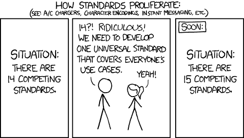

# 社区驱动的软件标准

> 原文：<https://dev.to/leog/community-driven-software-standards>

# TL；速度三角形定位法(dead reckoning)

我热衷于收集软件最佳实践，并将其作为一个开源项目，与 GitHub 标准一起形成标准。下表显示了迄今为止我在概念验证 Javascript 标准方面的收获:

| 需要 | 描述 | 图表类型 |
| --- | --- | --- |
| 是 | IDE 配置( [`.editorconfig`](http://editorconfig.org/) 推荐):为了在任何 IDE 上开发时保持一定程度的一致性。这也与林挺点有关。 | 父母 |
| 是 | 林挺方法( [`.eslint`](http://eslint.org/) 推荐):为了保证整个代码一定程度的一致性。 | 父母 |
| 是 | 需要有一个 [`package.json`](https://docs.npmjs.com/files/package.json) 文件来描述项目的基本信息。强制属性有:`name`、`version`、`main`、`private`、`description`和`repository`。`version`需要遵循[永远](https://semver.org)的惯例。 | 父母 |
| 不 | 代码模块化(commonjs via webpack 推荐):为了组织你的代码，并在整个项目中提供一种干净的依赖方式。它是可选的，因为不是每个 Javascript 项目都需要模块化。 | 应用程序，库 |
| 是(3) | 运行脚本:为了使项目对其他人可用。如果存在`package.json`，这些脚本应该根据项目的类型而存在:

*   /`start` is required to start the node process/server, which does not involve building/requiring app.
*   /`test` is required to run the unit test (if there is no available test, configure it to run `echo \"Error: no test specified\" && exit 1`)/parent is not required.
*   /`build` is not needed to prepare for the client build (it is recommended to use the webpack build setting). /app, library
*   You don't need/`dev` to prepare for the client build and *to monitor any changes of files* . You can also choose to start the development server, such as webpack-dev-server. /app, library
*   It is necessary to `lint` run the Lin Ting tool ( [`.eslint`](http://eslint.org/) recommended). / parent

 | 父母 |
| 不 | 使用 ES2017(建议使用 babel 和 ES2017 预设):为了拥有最好的工具来开发具有最新有效附加功能的 Javascript 项目。它是可选的，因为不是每个人都知道最新的 ES 标准，也不是每个项目都需要最新的工具来有效地工作。 | 父母 |
| 是 | 处理`devDependencies`和`dependencies`中的依赖关系，这取决于它们是设置项目环境还是项目本身的内容所需要的。

*   Both of them need to be declared by SemVer instead of branches, but it depends on the conventions of the dependencies themselves.
*   Dependencies should well document their purpose and return to the mainstream version of the exit and/or emergency plan.
*   Use [`npm shrinkwrap`](https://docs.npmjs.com/cli/shrinkwrap) to make sure that the dependency will not change.

 | 父母 |

请随时在这里 < <对 Javascript 标准提案> >[做出贡献。](https://github.com/standards/meta/issues/6)

# 简介

有一段时间，确切地说是 4 年，我一直在一家大公司从事多个项目。至少可以说，这是一次过山车，我记得当不得不创建一个新的软件时，我经历的最多的感觉是(现在仍然是)同样的:不确定性。

不知何故，我和我的团队需要设计一个应用程序或库，它应该尽可能好地工作，尽可能完美地覆盖所有用例，尽可能多地进行测试，并尽可能灵活地为事件的任何变化做好准备。似乎这还不够，它应该拥有与第三方应用程序或库交互的最佳方式，而不必花时间去弄清楚它是如何构造的，甚至不知道哪个第三方应用程序或库可能需要这样做。

几年过去了，这种情况依然存在。但是后来，这家公司决定改变它的 DNA:从基于许可证到基于订阅。随之而来的是一种全新的看待软件的方式。简而言之，要在这种新的 DNA 上取得成功，最重要的事情是同行之间的合作，以实现产品之间的最佳协同作用。

这个新方向听起来真的很好，我肯定想成为其中的一部分，无论如何都不会错过...但不幸的是，我感到的不确定性并没有那么容易消失。我想为此做点什么，不仅仅是为了我自己，如果可以的话，也是为了其他同事。然后，我想起了我最近经历的另一个 DNA 变化。

我通过 Globant 为这家大公司工作，它最近也改变了自己的 DNA，以便不仅像我们成长过程中所做的那样为客户注入创新，而且“创造对数百万用户至关重要的数字旅程”。

[T2】](https://res.cloudinary.com/practicaldev/image/fetch/s--EoqGBnin--/c_limit%2Cf_auto%2Cfl_progressive%2Cq_auto%2Cw_880/https://cdn-images-1.medium.com/max/1000/1%2ASjIRZrEjDZ8uHrJq4hQxQg.png)

在这种情况下，我有兴趣为我的同事们做这件事，因为好的客户体验始于好的员工体验，并且，好的客户体验始于好的开发人员体验。就这样，我急切地开始思考一个能消除我根深蒂固的不确定性的计划，一个可行的计划，容易扩展，可伸缩性惊人。如果你问我，这不是一件容易的任务，但是我喜欢挑战。

这是我想出来的...标准形式的基本规则。

# 什么是标准？

根据维基百科，一个[软件标准](https://en.wikipedia.org/wiki/Software_standard)是:

> "[..]文件的通用格式[..]在一个或多个计算机程序上工作时被一个或多个软件开发人员接受和使用。软件标准实现了不同开发者开发的不同程序之间的互操作性

该计划的关键概念是“互操作性”。能够生成一个遵循我们都同意的预设约定的软件:

*   以某种方式衡量质量；
*   帮助开发人员理解软件提供了什么，以便于使用；
*   为任何类型的项目提供一种可理解和普遍接受的协作方式；
*   在遵循协作指南的情况下，推广扩展任何软件的健康方式；
*   通过阅读所应用的标准来帮助新开发人员提高速度。

本质上，标准应该描述最佳实践，考虑如何开发一个软件的最新趋势，使它尽可能好地工作。它应该尽可能地描述创建最具互操作性的软件的每一个过程，包括可以保证其质量的过程，以及发布程序，以便它可供使用。

# 应该如何运作？

首先，这些标准需要由开发人员社区来开发，每个人都在他们所了解的任何标准的任何方面做出建设性的贡献，以便能够为生成有效的、最新的和可用的标准做出贡献。

第二，由于其协作的性质，一个标准不能被强加、单独制定和作为一条戒律分发。任何感兴趣的一方都应该能够自由地做出贡献，遵循协作指南提出修改，其他人可以投赞成票或给出任何类型的反馈，以便最终某些指定的作者可以批准将这些修改包含到标准中。

最后但并非最不重要的一点是，标准需要在其社区内得到推广和传播，这样其他人就可以知道它们的存在，投入到现有的标准中，或者创建新的标准并应用它们。如果只是一群人知道他们的存在，并在他们的项目中采用它，那是没有用的，越多越好。我们都知道[标准相关的 XKCD](https://xkcd.com/927/) 。

[T2】](https://res.cloudinary.com/practicaldev/image/fetch/s--RJjtUme5--/c_limit%2Cf_auto%2Cfl_progressive%2Cq_auto%2Cw_880/https://imgs.xkcd.com/comics/standards.png)

更不用说，理想情况下，任何使用你的软件的第三方应用或库都需要知道他们使用的是制作精良、安全稳定的东西，等等。

所以，总结一下:

*   社区范围
*   社区驱动
*   社区推动的

让我们深入探讨如何解决这些问题。

# 社区范围

当我们谈论开发人员社区时，我一直在考虑哪种工具最合适。肯定不是 Wiki 页面，它们很难维护，对开发者来说也不是很直观。Github 是一个非常直观的开发工具。开发人员已经知道如何使用它，有一个很好的既定方法来通过拉请求进行协作，版本控制是内置的，它提供了一种在需要时通过 Github 页面生成可视和可展示内容的方法，并且它处理细粒度的权限和安全性。所以，为了让大部分受众了解整个社区，使用 Github 是一条必由之路。

# 群体驱动

如前所述，有一个很好的既定方法来通过拉请求进行协作。此外，Github Issues 以存储库的形式提供了一种与标准交互的好方法。这些 Github 问题可以用标签分类，并促进健康的讨论。基本上，开发人员可以拥有自己的想法并轻松分享，从而推动整个计划向前发展。

# 社区推广

让他人了解该倡议非常重要，不仅要通过点对点的互动，还要包括视觉辅助工具；这就是我之前提到的徽章。这是为了让其他人可以验证某个库是否遵循了一组专业人员协作制定的最佳实践，同时也是为了激发做同样事情并应用或创建一个标准的冲动。
这种行为已经安装在 Github 社区上，它使用徽章:

[T2】](https://res.cloudinary.com/practicaldev/image/fetch/s--frSGgMOR--/c_limit%2Cf_auto%2Cfl_progressive%2Cq_auto%2Cw_880/https://cdn-images-1.medium.com/max/1000/1%2AsBcuf6n1G0dUXU50B56PAg.png)

这些小图片说明了一些非常具体的事情，并被添加到自述文件的顶部。

# 接下来是什么

*   接收关于该计划的反馈，以调整必要的内容
*   让其他人感到兴奋并愿意帮助这项计划
*   研究一些概念验证标准，这也有助于形成元标准。目前，第一个标准提案是针对 Javascript 项目的。

# 有用链接:

*   [Javascript 标准提案](https://github.com/standards/meta/issues/6)
*   [网站](https://standards.github.io)
*   [吉特](https://gitter.im/standards/Lobby)
*   [Github 组织](https://github.org/Standards)
*   [推特](https://twitter.com/GitHubStandards)
*   [原 Medium.com 关于此事的文章](https://medium.com/@leog/universal-software-standards-ftw-cc4771ef3d3)