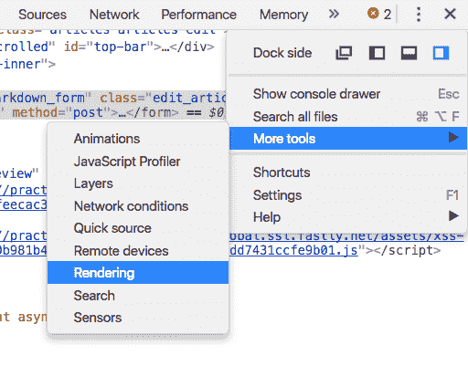

# 我在浏览器性能、边框半径和实时视频流方面的神秘冒险

> 原文:[https://dev . to/Ben/my-mystery-adventure-through-browser-performance-border-radius-and-live-video-streams](https://dev.to/ben/my-mysterious-adventure-through-browser-performance-border-radiuses-and-live-video-streams)

昨天，我灵机一动，决定在 [dev.to](https://dev.to/) 主页上添加一个 Google I/O 的实时提要。

我希望这个平台成为发现和讨论正在发生的事情的目的地，甚至比现在更是如此，这是一种实验。因为网站的设计对这种添加是友好的，所以基本上只是在主页上添加一个 YouTube 嵌入，并利用我们现有的功能切换基础设施来管理它。

> 我觉得在 https://t.co/E4yHRJkeOg[主页上展示主题演讲会很有趣。从构思到发布只需 5 分钟。编码是乐趣 pic.twitter.com/lsilQMCqGVðÿ˜š](https://t.co/E4yHRJkeOg)
> 
> — Ben Halpern (@bendhalpern) [May 17, 2017](https://twitter.com/bendhalpern/status/864906227746209793)

## 但事情没那么简单

网站变成了 *janky* 。邱建是当浏览器的帧速率低于公认的 60 帧/秒的阈值时，事情变得有点奇怪。浏览器的帧率，以及其他用于调试这类东西的工具可以在 Chrome 的开发工具中找到。其他浏览器也有类似的设置。

[T2】](https://res.cloudinary.com/practicaldev/image/fetch/s--v_6Zqw5o--/c_limit%2Cf_auto%2Cfl_progressive%2Cq_auto%2Cw_880/https://thepracticaldev.s3.amazonaws.com/i/mgiy2hvql1gmj4ufkgzm.png)

像通常情况一样，jank 是通过添加像 YouTube 播放器这样有分量的嵌入程序带来的。除了抱怨，我们也无能为力。

> Google:请创建轻量级的、无 jank 的、加载速度快的网站。谷歌:使用我们超级棒的 Youtube 标签、广告和跟踪脚本。pic.twitter.com/ZnFv3wcVKs
> 
> — The Practical Dev ([@thepracticaldev](https://dev.to/thepracticaldev) ) [April 2, 2017](https://twitter.com/ThePracticalDev/status/848569465709244417)

但是这个页面变得非常简单。所以它不仅仅是 YouTube 的嵌入。如果我在一个普通的 HTML 页面上添加一个 YouTube 播放器，jank 会很小。肯定还有更多。

那是我第一次打开我的开发工具。窗户的侧板打开了，我开始工作。

但是 jank 不见了

没错。当我打开我的开发工具时，问题消失了。这怎么可能？当该面板打开时，浏览器处于不同的状态，这取决于您在工具中运行的内容。于是我四处打探，试图找到答案。我不能。

*什么鬼？*

我切换了一些设置，改变了一些东西，但就是不知道到底是怎么回事—**但后来我想通了！**不是开发工具解决了问题，而是另一个变量:侧面板打开带来的更薄的窗口尺寸解决了问题。当窗户更小的时候，没有 jank。

但是为什么呢？

起初，我认为页面侧边栏上的某些东西一定是导致 jankiness 的原因。当侧边栏消失时，事情会变得更好。但事实并非如此。然后我想这可能与一些只适用于某些媒体查询的超级低效的 CSS 有关。这让我更接近了。jank 的突破点是 850 像素。这实际上是当页面的布局在细长外观和“桌面”外观之间变化时。

看着 CSS 在不同的媒体询问中是如何变化的，我不明白是什么引起了这么多的恶作剧。很明显，使用“边界层”开发工具，浏览器处理渲染的方式有很大的不同。超过 850 像素，每当我滚动的时候，浏览器就变得更加困难。

因此，面对这种不确定性，我做了任何专业软件工程师都会做的事情。

> 没有哪本书或哪位老师能比得上四处闲逛这种古老的好方式。[pic.twitter.com/4JjAYA6p8G](https://t.co/4JjAYA6p8G)
> 
> — The Practical Dev ([@thepracticaldev](https://dev.to/thepracticaldev) ) [April 13, 2016](https://twitter.com/ThePracticalDev/status/720257210161311744)

我打开和关闭 CSS 行，直到发生了一些事情。我运行了大约十个循环的切换然后检查，没有结果。

*然后就发生了*

```
border-radius: 3px; 
```

那是台词。注释掉它解决了我所有的问题。他妈的圆角。主页的主要“文章列表”区域在桌面视图中有一个 3px 的边框半径。小于 850px，列表刚好占满整个屏幕，没有圆角。

这不是我第一次参加竞技表演。实际上，我知道边框半径和框阴影以及其他一些看似无害的 CSS 属性在某些情况下会导致 jank，但我不认为一个圆角元素会在实践中导致这种问题。

### ðÿ'元素之一的ðÿ'与ðÿ'圆角ðÿ'

尝试告诉设计师他们不能使用圆角，因为这会导致页面基本上无法使用。尝试进行这样的对话。我有过这样的对话。他们不容易拥有，因为浏览器的一些规则是如此违反直觉。有时候我可以每秒重新计算 1000 个值，渲染复杂的视觉效果，有时候我不能用他妈的圆角。

> 我们可以把一个人送上月球，但是我们不能有效地给一个 pic.twitter.com/AJHq83QgYTðÿ˜加圆角
> 
> — The Practical Dev ([@thepracticaldev](https://dev.to/thepracticaldev) ) [May 18, 2017](https://twitter.com/ThePracticalDev/status/865014187558305793)

我觉得具有讽刺意味的是，这种体验是通过试图展示谷歌工程师和高管登上舞台，谈论疯狂的人工智能的未来，令人惊叹的新浏览器功能，以及赞美网络的神奇而产生的，而我却坐在这里试图渲染他妈的圆角。

[T2】](https://res.cloudinary.com/practicaldev/image/fetch/s--vV_7UF-9--/c_limit%2Cf_auto%2Cfl_progressive%2Cq_auto%2Cw_880/https://thepracticaldev.s3.amazonaws.com/i/m8ugapvo6pfkunpiyy2w.png)

但是这篇文章不是关于为什么我们不能拥有美好的事物，而是关于学习和做得更好。诚然，我们不能拥有美好的东西，但肯定有一些外卖。

## ðÿ"'雇佣有丁字技能的人

正是这种情况让我想雇佣拥有 T 型技能的人并与之共事。也就是说，他们有他们的专业，但他们也有广泛的理解。在这种情况下，如果我和一个设计师一起工作，我希望他们对浏览器如何处理渲染的某些问题有一个基本的了解，以及它是如何违反直觉的，在不同的浏览器上有不同的处理方式。他们不需要知道每一个细节，但在这种情况下，把东西扔过墙的设计师是非常无益的。

<center>

### t 型技能

</center>

[T2】](https://res.cloudinary.com/practicaldev/image/fetch/s--0sUKLkY7--/c_limit%2Cf_auto%2Cfl_progressive%2Cq_auto%2Cw_880/http://www.irisclasson.com/wp-content/uploads/2013/07/T_shaped.jpg)

同样，不尊重设计师需求的工程师也同样于事无补。很容易否决设计师的决定，而不是与他们合作达成妥协。就我而言，我身兼两职，我必须和自己讨论这个问题。这不是一个很长的讨论。我去掉了圆角，实际上我更喜欢这样。

## ðÿ"'知道自己的工具并使用它们

我的另一个收获是，了解你的工具并尽早使用它们是值得的。我在过去遇到过这样的情况，我表现得目瞪口呆，让一个问题持续存在，仅仅是因为我真的不知道如何处理它。有了更多使用这些工具的经验，我能够更快地处理这些问题。通过在问题出现时处理它，而不是认为它“现在已经足够好了”，当它还在我脑海中时，就更容易解决。

## ðÿ"'编码很好玩

我最后要说的是，编码很有趣。我很高兴我有机会抓住这个机会，心血来潮地发布了这个特性。你不能总是这样做，但我很高兴我的团队信任我这样做。我认为，通过尝试这个平台的用途，我们会学到很多东西。

快乐编码