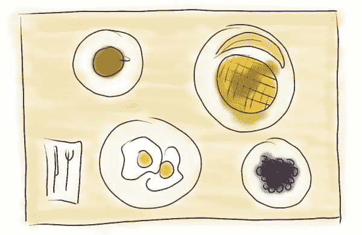

# 迭代对象和数组:常见错误

> 原文:[https://dev . to/Victoria/iterating-over-objects-and-arrays-frequency-errors](https://dev.to/victoria/iterating-over-objects-and-arrays-frequent-errors)

下面是一些抱怨的代码，这些代码不止一次让我困惑。我听说即使是非常有经验的开发人员也会经常遇到这种情况，所以如果你在喝第三杯咖啡的时候发现自己在挠头，为什么你的代码正在做你告诉它做的事情(而不是你*想要*它做的事情)，也许这篇文章可以帮助你。

示例代码是 JavaScript，因为这是我最近一直在做的工作，但是我相信这些概念是相当通用的。(这篇文章的原标题是“JavaScript 糟透了”,但是我决定我不想引起*的争论...)*

给定一个看起来像这样的早餐对象:

```
var breakfast = {
    'eggs': 2,
    'waffles': 2,
    'fruit': {
        'blueberries': 5,
        'banana': 1,
    },
    'coffee': 1
} 
```

<svg width="20px" height="20px" viewBox="0 0 24 24" class="highlight-action crayons-icon highlight-action--fullscreen-on"><title>Enter fullscreen mode</title></svg> <svg width="20px" height="20px" viewBox="0 0 24 24" class="highlight-action crayons-icon highlight-action--fullscreen-off"><title>Exit fullscreen mode</title></svg>

或者像这样:
[](https://res.cloudinary.com/practicaldev/image/fetch/s--CfMeHaCG--/c_limit%2Cf_auto%2Cfl_progressive%2Cq_auto%2Cw_880/https://thepracticaldev.s3.amazonaws.com/i/yo2at457s4ctf8spy6wo.jpg)

## 迭代对象属性

我们可以使用 for 循环遍历每个早餐项目，如下所示:

```
for (item in breakfast) {
    console.log('item: ', item);
} 
```

<svg width="20px" height="20px" viewBox="0 0 24 24" class="highlight-action crayons-icon highlight-action--fullscreen-on"><title>Enter fullscreen mode</title></svg> <svg width="20px" height="20px" viewBox="0 0 24 24" class="highlight-action crayons-icon highlight-action--fullscreen-off"><title>Exit fullscreen mode</title></svg>

这产生:

```
item: eggs
item: waffles
item: fruit
item: coffee 
```

<svg width="20px" height="20px" viewBox="0 0 24 24" class="highlight-action crayons-icon highlight-action--fullscreen-on"><title>Enter fullscreen mode</title></svg> <svg width="20px" height="20px" viewBox="0 0 24 24" class="highlight-action crayons-icon highlight-action--fullscreen-off"><title>Exit fullscreen mode</title></svg>

## 获取对象属性值

我们可以像这样访问属性或嵌套属性的值(在本例中是项目的数量):

```
console.log('How many waffles? ', breakfast['waffles'])
console.log('How many bananas? ', breakfast['fruit']['banana']) 
```

<svg width="20px" height="20px" viewBox="0 0 24 24" class="highlight-action crayons-icon highlight-action--fullscreen-on"><title>Enter fullscreen mode</title></svg> <svg width="20px" height="20px" viewBox="0 0 24 24" class="highlight-action crayons-icon highlight-action--fullscreen-off"><title>Exit fullscreen mode</title></svg>

或等效语法:

```
console.log('How many waffles? ', breakfast.waffles)
console.log('How many bananas? ', breakfast.fruit.banana) 
```

<svg width="20px" height="20px" viewBox="0 0 24 24" class="highlight-action crayons-icon highlight-action--fullscreen-on"><title>Enter fullscreen mode</title></svg> <svg width="20px" height="20px" viewBox="0 0 24 24" class="highlight-action crayons-icon highlight-action--fullscreen-off"><title>Exit fullscreen mode</title></svg>

这产生:

```
How many waffles?  2
How many bananas?  1 
```

<svg width="20px" height="20px" viewBox="0 0 24 24" class="highlight-action crayons-icon highlight-action--fullscreen-on"><title>Enter fullscreen mode</title></svg> <svg width="20px" height="20px" viewBox="0 0 24 24" class="highlight-action crayons-icon highlight-action--fullscreen-off"><title>Exit fullscreen mode</title></svg>

## 从值中获取对象属性

相反，如果我想通过值访问属性，例如，找出哪些项目是成对提供的，我可以这样迭代:

```
for (item in breakfast) {
    if (breakfast[item] == 2) {
        console.log('Two of: ', item);
    }
} 
```

<svg width="20px" height="20px" viewBox="0 0 24 24" class="highlight-action crayons-icon highlight-action--fullscreen-on"><title>Enter fullscreen mode</title></svg> <svg width="20px" height="20px" viewBox="0 0 24 24" class="highlight-action crayons-icon highlight-action--fullscreen-off"><title>Exit fullscreen mode</title></svg>

这给了我们:

```
Two of:  eggs
Two of:  waffles 
```

<svg width="20px" height="20px" viewBox="0 0 24 24" class="highlight-action crayons-icon highlight-action--fullscreen-on"><title>Enter fullscreen mode</title></svg> <svg width="20px" height="20px" viewBox="0 0 24 24" class="highlight-action crayons-icon highlight-action--fullscreen-off"><title>Exit fullscreen mode</title></svg>

## 改变嵌套属性值

说我想增加早餐水果的数量，因为糖对我不好，我喜欢对我不好的东西。我可以这样做:

```
var fruits = breakfast['fruit'];
for (f in fruits) {
    fruits[f] += 1;
}
console.log(fruits); 
```

<svg width="20px" height="20px" viewBox="0 0 24 24" class="highlight-action crayons-icon highlight-action--fullscreen-on"><title>Enter fullscreen mode</title></svg> <svg width="20px" height="20px" viewBox="0 0 24 24" class="highlight-action crayons-icon highlight-action--fullscreen-off"><title>Exit fullscreen mode</title></svg>

这给了我们:

```
{ blueberries: 6, banana: 2 } 
```

<svg width="20px" height="20px" viewBox="0 0 24 24" class="highlight-action crayons-icon highlight-action--fullscreen-on"><title>Enter fullscreen mode</title></svg> <svg width="20px" height="20px" viewBox="0 0 24 24" class="highlight-action crayons-icon highlight-action--fullscreen-off"><title>Exit fullscreen mode</title></svg>

# 阵列

给定一组如下所示的华夫饼:

```
var wafflesIAte = [ 1, 3, 2, 0, 5, 2, 11 ]; 
```

<svg width="20px" height="20px" viewBox="0 0 24 24" class="highlight-action crayons-icon highlight-action--fullscreen-on"><title>Enter fullscreen mode</title></svg> <svg width="20px" height="20px" viewBox="0 0 24 24" class="highlight-action crayons-icon highlight-action--fullscreen-off"><title>Exit fullscreen mode</title></svg>

或者像这样:
[](https://res.cloudinary.com/practicaldev/image/fetch/s--ylNB8Dhg--/c_limit%2Cf_auto%2Cfl_progressive%2Cq_auto%2Cw_880/https://thepracticaldev.s3.amazonaws.com/i/xrezq0xpzvn4t1bk3x3o.jpg)

## 遍历数组项

我们可以使用 for 循环遍历数组中的每一项:

```
for (var i = 0; i < wafflesIAte.length; i++) {
    console.log('array index: ', i);
    console.log('item from array: ', wafflesIAte[i]);
} 
```

<svg width="20px" height="20px" viewBox="0 0 24 24" class="highlight-action crayons-icon highlight-action--fullscreen-on"><title>Enter fullscreen mode</title></svg> <svg width="20px" height="20px" viewBox="0 0 24 24" class="highlight-action crayons-icon highlight-action--fullscreen-off"><title>Exit fullscreen mode</title></svg>

这产生:

```
array index:  0
item from array:  1
array index:  1
item from array:  3
array index:  2
item from array:  2
array index:  3
item from array:  0
array index:  4
item from array:  5
array index:  5
item from array:  2
array index:  6
item from array:  11 
```

<svg width="20px" height="20px" viewBox="0 0 24 24" class="highlight-action crayons-icon highlight-action--fullscreen-on"><title>Enter fullscreen mode</title></svg> <svg width="20px" height="20px" viewBox="0 0 24 24" class="highlight-action crayons-icon highlight-action--fullscreen-off"><title>Exit fullscreen mode</title></svg>

有些事情要记住:
`i`在上面的上下文中是占位符；我们可以用任何我们喜欢的东西来代替(`x`、`n`、`underpants`等等)。它只是表示迭代的每个实例。

`i < wafflesIAte.length`告诉我们的 for 循环继续，只要`i`小于数组的长度(在本例中为 7)。

`i++`相当于`i+1`,意味着我们在数组中每次递增 1。例如，我们也可以使用`i+2`来处理数组中的所有其他项目。

## 按索引项访问数组

我们可以使用数组索引指定数组中的一个项，写成`wafflesIAte[i]`，其中`i`是数组的任意索引。这将给出该位置的项目。

数组索引总是从`0`开始，用`wafflesIAte[0]`访问。使用`wafflesIAte[1]`给出了数组中的第二项，即“3”。

## 混合数组的方法

记住`wafflesIAte.length`和数组中最后一项的索引是不同的。前者是 7，后者是`6`。

递增`i`时，记住`[i+1]`和`[i]+1`是不同的:

```
console.log('[i+1] gives next array index: ', wafflesIAte[0+1]);
console.log('[i]+1 gives index value + 1: ', wafflesIAte[0]+1); 
```

<svg width="20px" height="20px" viewBox="0 0 24 24" class="highlight-action crayons-icon highlight-action--fullscreen-on"><title>Enter fullscreen mode</title></svg> <svg width="20px" height="20px" viewBox="0 0 24 24" class="highlight-action crayons-icon highlight-action--fullscreen-off"><title>Exit fullscreen mode</title></svg>

产生:

```
[i+1] gives next array index:  3
[i]+1 gives index value + 1:  2 
```

<svg width="20px" height="20px" viewBox="0 0 24 24" class="highlight-action crayons-icon highlight-action--fullscreen-on"><title>Enter fullscreen mode</title></svg> <svg width="20px" height="20px" viewBox="0 0 24 24" class="highlight-action crayons-icon highlight-action--fullscreen-off"><title>Exit fullscreen mode</title></svg>

暂时就这样吧！如果您有任何更正、最佳实践或其他常见错误需要我添加，请告诉我！