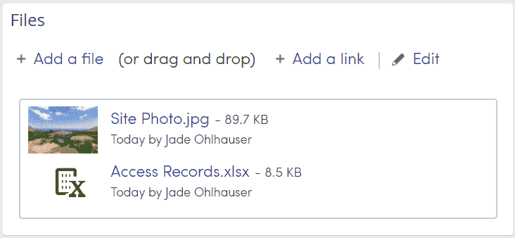
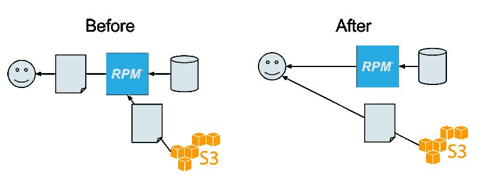
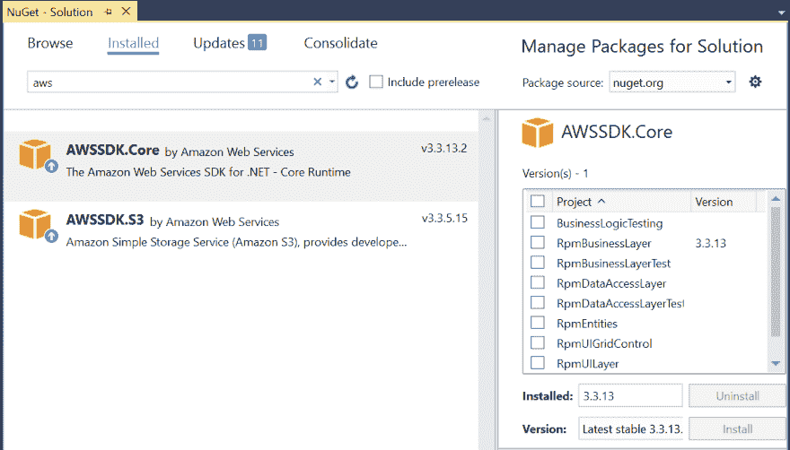

# 我们的用户如何跳过我们的服务器，直接从亚马逊 S3 安全下载

> 原文：<https://dev.to/jadeonly/how-our-users-skip-our-servers-and-download-securely-right-from-amazon-s3>

我们的。NET web 应用程序允许用户将文件附加到事物上。我们使用亚马逊简单存储服务来存储这些文件。我们希望用户能够直接从亚马逊下载文件，而不是通过我们的服务器，但我们也让用户控制他们可以访问哪些文件。仅仅因为用户今天可以看到一个文件，并不意味着他们明天也可以。解决方案是预先签名的 URL，我们可以发送到用户的浏览器，给他们临时的读取权限，直接从 Amazon 下载文件。

[T2】](https://res.cloudinary.com/practicaldev/image/fetch/s--E_NwlPkE--/c_limit%2Cf_auto%2Cfl_progressive%2Cq_auto%2Cw_880/https://thepracticaldev.s3.amazonaws.com/i/nd90r4146n1owc0w02l7.png)

我们只使用预先签名的网址下载文件。文件上传通过我们的应用程序，因此我们可以获取元数据，记录用户的动作，如果是图像，还可以生成缩略图。

[T2】](https://res.cloudinary.com/practicaldev/image/fetch/s--jn-13Irx--/c_limit%2Cf_auto%2Cfl_progressive%2Cq_auto%2Cw_880/https://thepracticaldev.s3.amazonaws.com/i/zie2ce0vrpvw4r8g056c.png)

### 套餐

在 Visual Studio 中，转到工具> NuGet 包管理器>管理解决方案的 NuGet 包…添加 Amazon 包 AWSSDK。Core 和 AWSSDK。S3 到你的项目。
[T3】](https://res.cloudinary.com/practicaldev/image/fetch/s--2ndnYl56--/c_limit%2Cf_auto%2Cfl_progressive%2Cq_auto%2Cw_880/https://thepracticaldev.s3.amazonaws.com/i/0toi183anhb9t4uymc7p.png)

### 设置

亚马逊需要对你的账户进行一些设置。我们使用一个`Web.config`，你的应用程序可以使用一个`App.config`文件。AWS SDK 知道加载这些值，只要它们有正确的名称，您不必添加代码来读取它们。

```
web.config <appSettings> 
```

```
<add key="AWSAccessKey" value="xxxxxxxx" />
<add key="AWSSecretKey" value="xxxxxxxx" />
<add key="AWSRegion" value="us-west-1" /> 
```

您可以从列表中找到您所在地区[的 AWSRegion 代码。](http://docs.aws.amazon.com/general/latest/gr/rande.html#s3_region)

### 方法

我们将代码分成两个方法。我们所有与 S3 交互的代码都使用 S3 客户端生成，包括文件上传、下载和预签名 URL 生成。

```
using Amazon.S3;
using Amazon.S3.Model;
using System;
using System.Collections.Generic;
using System.IO;
using System.Threading.Tasks;

namespace RpmBusinessLayer.Utility
{
    public class AmazonWebServices
    {
        private static IAmazonS3 s3Client;

        private const int READWRITE_TIMEOUT_SECONDS = 300;
        private const int CONNETION_TIMEOUT_SECONDS = 3600;
        private const int MAX_RETRIES = 4;

        private IAmazonS3 GetS3Client()
        {
            if (s3Client == null)
                s3Client = new AmazonS3Client(new AmazonS3Config()
                {
                    SignatureVersion = "4",
                    Timeout = TimeSpan.FromSeconds(CONNETION_TIMEOUT_SECONDS),
                    ReadWriteTimeout = TimeSpan.FromSeconds(READWRITE_TIMEOUT_SECONDS),
                    MaxErrorRetry = MAX_RETRIES
                });

            return s3Client;
        } 
```

然后，我们在同一个文件中有一个方法，用于为给定对象生成预先签名的 URL。

```
 public string GeneratePreSignedURLForDownload(string keyName, string fileName)
        {
            try
            {
                GetPreSignedUrlRequest request = new GetPreSignedUrlRequest
                {
                    BucketName = S3Bucket,
                    Key = keyName,
                    Expires = DateTime.Now.AddMinutes(5)
                };
                request.ResponseHeaderOverrides.ContentDisposition = "attachment; filename=\"" + fileName + "\"";

                return GetS3Client().GetPreSignedURL(request);
            }
            catch (AmazonS3Exception ex)
            {
                throw CreateExceptionForS3Exception(ex);
            }
        } 
```

请注意`Expires`属性。这就是你如何让用户现在下载文件，而不是以后。链接是独立于我们的系统的，例如，用户可以通过电子邮件发送给某人，这就是为什么它过期是很重要的。

### 重定向到下载

我们的 URL 将在 5 分钟后过期，但是如果用户打开页面的时间超过 5 分钟怎么办？我们不希望他们点击下载链接并得到一个错误。为了解决这个问题，我们不在页面中呈现预先签名的 URL。相反，我们提供指向 FileDOwnload.aspx 的链接，然后它按需生成 S3 URL，并将用户重定向到该 URL。

```
FileAttachment fileAttachment = FileAttachment.Load(rpmUser, fileAttachmentID);

if ( fileAttachment == null )
    TransferToMistakePage(Problem.FileDoesNotExist);

    ResultAndMessage result = fileAttachment.CheckDownloadAccess(rpmUser, forType, forID);

    if (result.Problem != Problem.NoProblem)
        TransferToMistakePage(result.Problem, result.Message);

MiscTools.GetHttpContext().Response.Redirect(fileAttachment.GetPresignedURLFromS3(rpmUser)); 
```

这也允许我们记录下载事件。GetPresignedURLFromS3 生成我们的路径并返回 GeneratePreSignedURLForDownload 的结果，这是预签名的 URL。

### 使其下载为下载

要让浏览器将 URL 作为下载进行处理，用户可以选择保存它，响应需要设置内容处理和类型头。默认情况下，S3 将返回相同的标题。这对于类型来说很好，但是我们希望在下载时设置处置。首先，因为它控制着下载行为，我们希望下载行为根据我们交付文件的方式而变化。第二，对于文件名。我们用索引文件名保存 S3 上的文件，并在下载时应用自定义文件名。

所以下载那个例子 XLSX 文件作为下载
[](https://res.cloudinary.com/practicaldev/image/fetch/s--QEg6B4SH--/c_limit%2Cf_auto%2Cfl_progressive%2Cq_auto%2Cw_880/https://thepracticaldev.s3.amazonaws.com/i/p7rbwfdt8j0o615ukial.png)

响应必须包括此标题

```
response-content-disposition:attachment; filename="0001 Access Records.xlsx" 
```

这是我们从一个类似

```
https://s3.amazonaws.com/xxxxxxx/123.xlsx?AWSAccessKeyId=xxxxxxx&Expires=1494967927&response-content-disposition=attachment%3B%20filename%3D%220001%20Access%20Records.xlsx%22&Signature=xxxxxxx 
```

您希望 S3 使用的自定义响应头在请求中被传递给 S3。作为一个已签名的请求，你不能只是把它添加到 URL 中，你需要把它包含在签名中。这是来自`GeneratePreSignedURLForDownload`的重要一行

```
request.ResponseHeaderOverrides.ContentDisposition = "attachment; filename=\"" + fileName + "\""; 
```

Firefox 要求文件名用引号括起来。Chrome 不在乎。

### 让它在更新的区域工作

> 不支持您提供的授权机制。请使用 AWS4-HMAC-SHA256。

因此，您的预签名 URL 代码在一个地区运行良好，但当您在另一个地区使用 URL 时，就会出现授权错误。问题是一些旧的 S3 地区允许您使用旧的签名方法，而新的地区需要新的方法。这里有两个潜在的令人困惑的问题:

1.  您可能已经在较新的区域很好地处理了文件，只有当您想要使用预签名的 URL 时才会看到此错误。这抓住了我们的部署。
2.  仅仅指示 S3 客户端使用版本 4 的`SignatureVersion`，您还必须指定一个地区。这一点没有明确记载。这对我们来说是个问题，因为我们没有指定一个地区，而是使用了`ServiceURL`。

关键线在`GetS3Client`，不在`GetPreSignedUrl`。

```
SignatureVersion = "4", 
```

和`web.config`中的区域

```
<add key="AWSRegion" value="us-west-1" > 
```

所有地区都支持 signature version 4，因此您应该总是使用它，您的代码将在任何地区工作。

### 在关闭

允许我们的用户直接从 S3 下载文件为我们的用户提供了更好的下载性能，并为我们节省了文件传输成本。请随时在 twitter 上联系我。你可以在 [RPM 软件](http://rpmsoftware.com/)了解更多关于我们的应用。

【更新 2017-05-18】新增了“重定向到下载”重要章节。
[Update 2017-09-19]由于内联代码呈现的更改，修复了格式