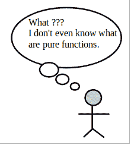

# 函数式编程很好玩！！(第一部分)

> 原文：<https://dev.to/saurabhgiv/functional-programming-is-fun-part1>

这篇文章最初发表在 Medium 上。你可以在这里看一下。

实际上函数式编程不仅仅是有趣。

> 即使有人用命令式或面向对象的语言编程，函数式编程概念也很重要。

它有许多概念可以在程序中使用，不管一个人用什么语言编程。
我们一个一个来。

**什么时候函数被称为纯函数？**

[T2】](https://res.cloudinary.com/practicaldev/image/fetch/s--tYJdGaNp--/c_limit%2Cf_auto%2Cfl_progressive%2Cq_auto%2Cw_880/https://cdn-images-1.medium.com/max/800/1%2AX-IznQeGUHls3LlMPZFCGg.png)

如果一个函数对于相同的参数值总是返回相同的结果，那么这个函数称为纯函数。
我们通过一个例子来了解一下

```
x = 5    # global variable 
sum_impure(y){
    y = x+ y    # adds the value of global variable
    return y
} 
```

Enter fullscreen mode Exit fullscreen mode

代码块 2

```
sum_pure(a, b){
    return a + b
} 
```

Enter fullscreen mode Exit fullscreen mode

上面写的两个函数可能看起来很相似，但事实并非如此。
下面的例子解释了不同之处:

```
x = 5 
sum_impure(3)    # returns 8 
x = 6            # changed value of global variable to 6 sum_impure(3)    # returns 9 
```

Enter fullscreen mode Exit fullscreen mode

`sum_impure`是一个不纯的函数，因为给它相同的输入 3 作为参数，它在每次调用中给出不同的输出。

但是`sum_pure`函数就不是这样了。

```
sum_pure(4, 9): 13
sum_pure(4, 9): 13 
```

Enter fullscreen mode Exit fullscreen mode

给定 4，9 作为`sum_pure`的参数，无论何时何地在程序中调用它，它总是返回 13。

*你明白`sum_impure`和`sum_pure`函数的区别了吗？*

`sum_impure`函数使用全局变量的值来计算输出，但是如果程序的某个部分改变了全局变量的值，对于相同的输入，`sum_impure`函数的输出也会改变。

`sum_pure’s`输出不依赖于程序的状态。它只对输入起作用，除了来自调用它的程序的参数之外，不需要任何信息。

### 但是我为什么要使我的函数变得纯粹呢？

#### 更容易测试

测试`sum_impure`函数并不容易，因为`sum_impure`函数必须知道全局变量 x 的值才能执行。这也称为与功能相关联的状态或上下文。

其次，你不能将`sum_impure`的结果与某个固定值进行比较，因为它的返回值会根据全局变量 x 的值而变化。

现在你明白我们为什么模仿数据库了吧？

如果函数定义中有数据库读/写，我们就不能在不模拟数据库的情况下测试该函数。
**数据库类似于状态，函数执行数据库读/写的结果取决于执行期间数据库中的内容。**

> *不纯函数需要状态才能运行和测试。*

#### 预见性

我们可以推理一个纯函数在做什么，因为它的结果是可预测的。给定相同的输入，它总是给出相同的输出。

> *一个纯函数的结果不依赖于程序的状态。*

`sum_impure(3)`的结果不可预测。因此，如果用相同的参数在程序中的两个地方调用了`sum_impure`,它可能会在这两个地方给出不同的结果。

```
x = 4
sum_impure(3)    # returns 7 
x = 7
sum_impure(3)    # returns 10 
```

Enter fullscreen mode Exit fullscreen mode

我们将在本系列的下一篇文章中学习与纯函数相关的更多优势，如并行化、内存化。

如果你喜欢这篇文章，请与他人分享。