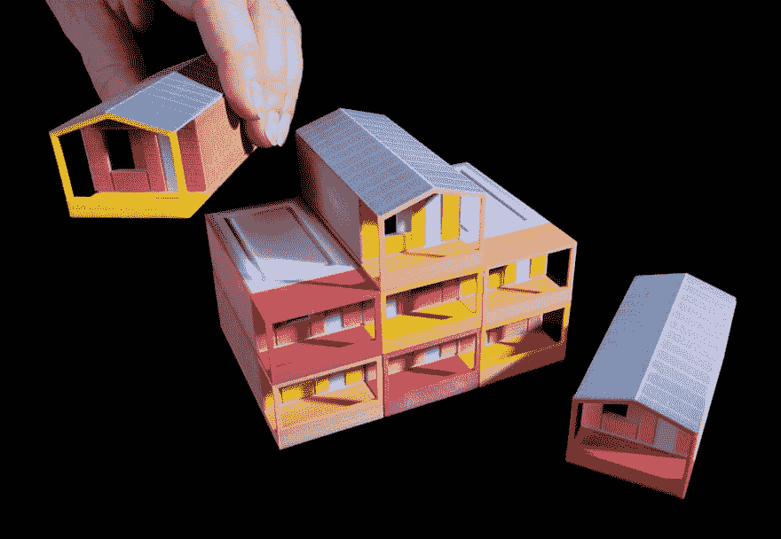
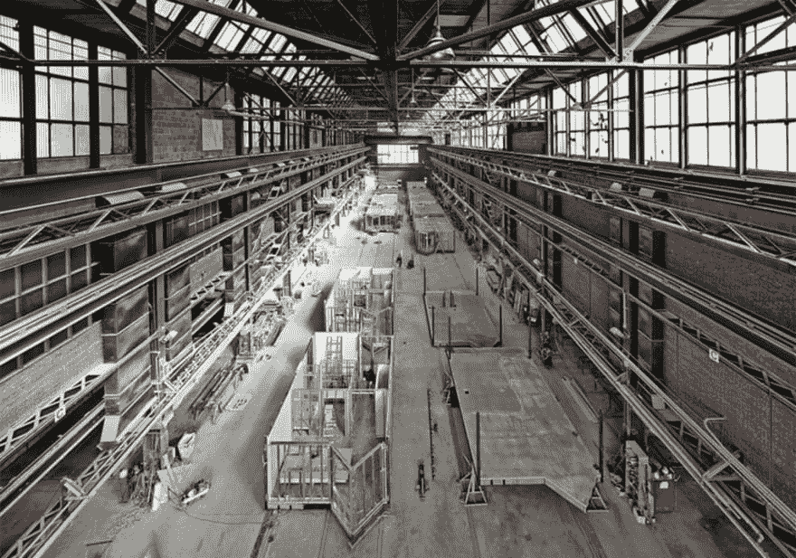
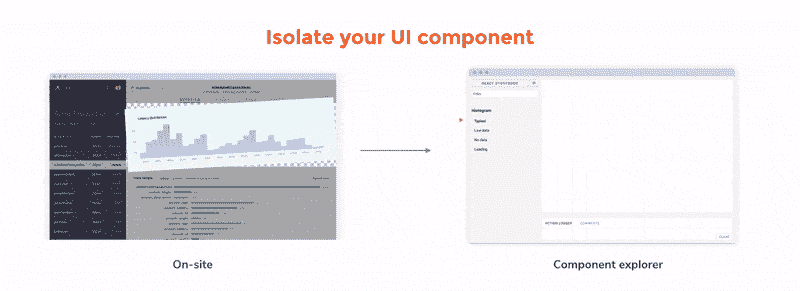
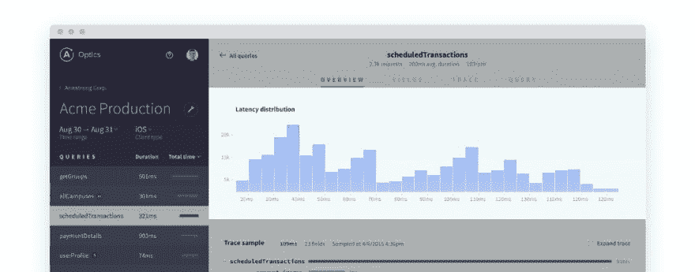
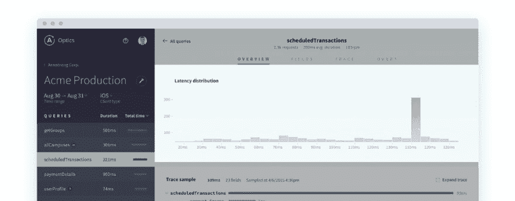
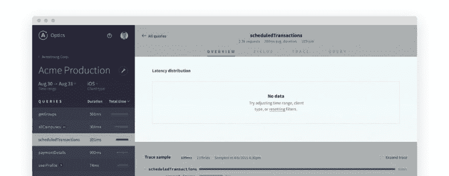
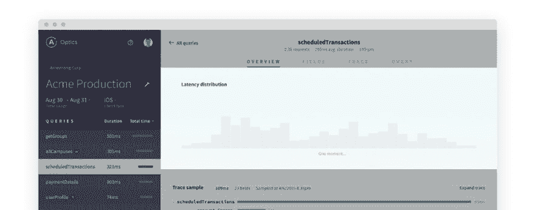
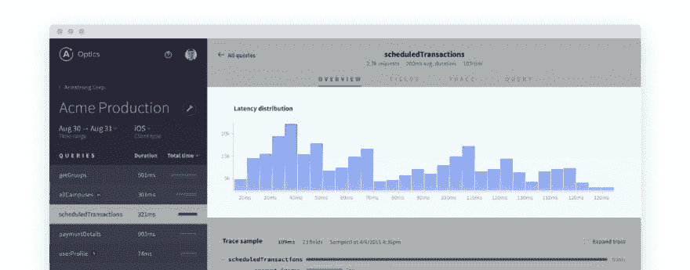
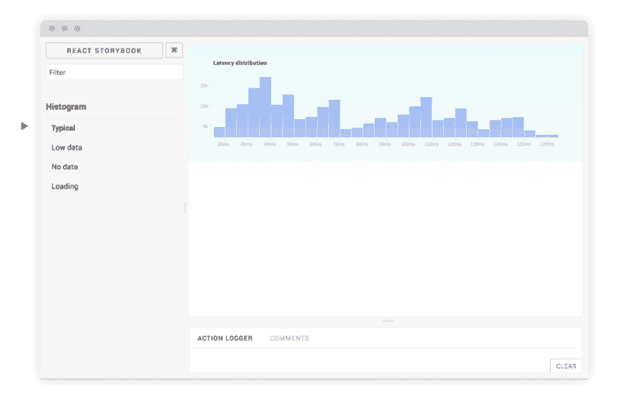

# 预制组件——独立构建 UI 组件的案例

> 原文:[https://dev . to/chroma/prevented-components-the-case-for-building-ui-components-in-isolation-447](https://dev.to/chroma/prefabricated-components-the-case-for-building-ui-components-in-isolation-447)

[](https://res.cloudinary.com/practicaldev/image/fetch/s--Y6ak-Dtx--/c_limit%2Cf_auto%2Cfl_progressive%2Cq_auto%2Cw_880/https://cdn-images-1.medium.com/max/1024/1%2Av0v4Hn8m5itjSUP5qeWC5w.jpeg) 

<figcaption>Y:Cube by [罗杰斯 Stirk Harbour+βPartners](https://www.rsh-p.com/projects/ycube/)</figcaption>

我最喜欢的电视节目之一是“大设计”。这是一个英国房屋建筑展，主持人凯文·麦克劳德观察人们建造各种各样的房屋。如果你像我一样一直在关注这个节目，有一个趋势是很难忽视的。

住房项目，尤其是那些成本较低、速度较快的项目，越来越多地使用预制(“预制”)材料。预制的想法是在工厂建造房屋的组件，然后将它们运送到工作现场，在那里将它们连接在一起。它取代了在建筑工地上用原材料建造房屋的传统方法(将木头锤打在一起，浇筑混凝土等)。).

如果你使用现成的预制材料，比如特定“商品尺寸”的墙板，成本可以进一步降低。任何建造过宜家厨房的人可能都熟悉这个想法。

为什么预制是一个如此具有变革性的概念？不难理解，在像工厂一样的受控条件下一次建造一件东西，会使建造变得快速而容易。

所有这些与构建软件用户界面(ui)有什么关系？Prefab 类似于从组件开发 ui 的过程。我们只需要一个“工厂”来“异地”制造我们的组件。那个工厂就是**组件浏览器**。

[](https://res.cloudinary.com/practicaldev/image/fetch/s--MjScRpD8--/c_limit%2Cf_auto%2Cfl_progressive%2Cq_auto%2Cw_880/https://cdn-images-1.medium.com/max/1024/1%2AVzVs2p6NvmfAWTb2smZiiQ.jpeg) 

<figcaption>大楼*公寓住宅*隔离(Capsys)</figcaption>

### 组件浏览器

一个[组件浏览器](https://blog.hichroma.com/the-crucial-tool-for-modern-frontend-engineers-fb849b06187a)是一个工具，它允许你在**隔离**中使用你的应用程序中的单个组件。因此，与其在应用程序屏幕上第一次使用的地方构建一个组件，不如使用一个工具来隔离这个组件。

[](https://res.cloudinary.com/practicaldev/image/fetch/s--_FLIlYz7--/c_limit%2Cf_auto%2Cfl_progressive%2Cq_66%2Cw_880/https://cdn-images-1.medium.com/max/800/1%2AxI4ULfnT3i19RdcU0LbUaw.gif) 

<figcaption>组件资源管理器帮助你孤立地构建组件</figcaption>

为此，您必须记录您感兴趣的组件的状态。这意味着，与其将您的开发应用程序操作到正确的配置来查看您的组件，不如明确地写下您所关心的状态。

组件浏览器是组件的工厂。

### 现场建造与预制:案例分析

预制的想法是在工厂而不是在不可预测的条件下在现场为墙壁装框、隔热、布线、涂灰泥和油漆。您不需要大量的构建经验就能明白为什么这种方法有意义。事实上，如果你像我一样(我想也是大多数软件工程师)，你现在可能会认为用其他方式做这件事是疯狂的。

如果您对预制 UI 组件的想法没有相同的反应，也许我们需要更仔细地研究一下这两种方法。

**让我们考虑一个案例研究:**为分析产品构建一个复杂的直方图，在各种上下文中使用，以显示各种延迟分布。

[](https://res.cloudinary.com/practicaldev/image/fetch/s--5yv0Si6W--/c_limit%2Cf_auto%2Cfl_progressive%2Cq_auto%2Cw_880/https://cdn-images-1.medium.com/max/1024/1%2A_k5Oj-0ODdt9adWaE9fu6Q.jpeg) 

<figcaption>**我们举例直方图分量**</figcaption>

#### 现场

如果我在“现场”构建直方图，那么我将从使用直方图的一个屏幕开始。

我将从思考组件最明显的用例开始，然后用一些典型的数据填充我的数据库。我将直接在它应该存在的屏幕上构建组件。

```
for (i = 20; i <= 120; i+= 10) {
  db.latencyCounts.insert({
    queryId: 'abc-123',
    latency: i,
    count: 5000 * Math.random() * 15000,
  });
} 
```

[](https://res.cloudinary.com/practicaldev/image/fetch/s--kUq9hDkB--/c_limit%2Cf_auto%2Cfl_progressive%2Cq_auto%2Cw_880/https://cdn-images-1.medium.com/max/1024/1%2A2jblc8K8-A3hsO9MGBaQhw.jpeg) 

<figcaption>查询生成一些测试数据；这些数据看起来像什么——在原地</figcaption>

现在，我可能会考虑一种不同风格的数据，也许是一个测量数据有限的新用户。我将从我的数据库中删除一些数据，并调整组件以确保它看起来仍然正常。

```
for (i = 20; i <= 120; i+= 10) {
  if (i !== 110) {
    db.latencyCounts.update({
      queryId: 'abc-123',
      latency: i,
    },
    {
      $set: {
        count: Math.random() * 1000,
      }
    });
  }
} 
```

[](https://res.cloudinary.com/practicaldev/image/fetch/s--3qTjz1aM--/c_limit%2Cf_auto%2Cfl_progressive%2Cq_auto%2Cw_880/https://cdn-images-1.medium.com/max/1024/1%2AKZw-bEb9pPDaTido4PBZQw.jpeg) 

<figcaption>**低数据分辨率**</figcaption>

不过，我最好检查一下我在步骤 1 中创建的数据，以确保我的更改不会对我最初的实现产生负面影响。

没有数据的时候怎么办？让我们尝试一下(确保我们根据步骤 1 和 2 的数据检查任何实现更改)。

```
db.latencyCounts.remove({ queryId: 'abc-123' }); 
```

[](https://res.cloudinary.com/practicaldev/image/fetch/s--mOCcD8zg--/c_limit%2Cf_auto%2Cfl_progressive%2Cq_auto%2Cw_880/https://cdn-images-1.medium.com/max/1024/1%2AT6AhAgeAzOdAz9aawWwMdQ.jpeg) 

<figcaption>**无数据**</figcaption>

让我们把这个东西交给 QA，我们将部署到一个临时服务器上。哦！我们注意到它在加载状态下渲染不好。我们如何在当地看到这一点？也许我们需要黑掉我们的服务器，让它“挂起”,这样我们就可以在加载状态下工作。最好也对照步骤 1-3 检查我们的更改。

[](https://res.cloudinary.com/practicaldev/image/fetch/s--AmHN2FIG--/c_limit%2Cf_auto%2Cfl_progressive%2Cq_auto%2Cw_880/https://cdn-images-1.medium.com/max/1024/1%2AB6cierqXZt_s4b9OyXadGA.jpeg) 

<figcaption>**加载**</figcaption>

基于他们的测试，Design 又回来了一堆复杂的视觉调整(我们确定他们测试了我们工作过的所有状态吗？希望如此！).让我们进行这些更改，然后确保它们不会破坏步骤 1-4 中的状态

[](https://res.cloudinary.com/practicaldev/image/fetch/s--WF18dK_d--/c_limit%2Cf_auto%2Cfl_progressive%2Cq_auto%2Cw_880/https://cdn-images-1.medium.com/max/1024/1%2ACifScw824hLaziFG4CWolw.jpeg) 

<figcaption>**最后一刻设计调整**</figcaption>

**6** 在部署到生产环境后，一位用户报告说，对于他们独特、不寻常的数据集来说，图表看起来很糟糕！最好(匿名)将数据导入我们的本地数据库并修复它。哦，我们应该再次运行步骤 1-5 的状态。

这个过程会持续很长一段时间，所以当我们进行到第 6 步时，要记住重现第 1 步的命令可能并不容易(或有趣)。老实说，很有可能我们不会真的检查它！

我们编写测试来编码已知的用例并避免回归——但是[为 ui 编写测试是困难的](https://blog.hichroma.com/visual-testing-the-pragmatic-way-to-test-uis-18c8da617ecf)。

> 当用例被遗忘或忽略时，回归就发生了。

#### 预制

当预制一个组件时，我们不是间接地操纵我们的组件进入我们想要工作的状态，而是仔细地详述我们感兴趣的确切状态。组件资源管理器是一个工具，它允许我们独立地体验这些状态**中的组件**。

通常，这意味着每一步都更简单；我们不需要弄乱数据库或者仔细裁剪我们的开发账户来包含正确的信息，我们只需要记录我们想要试验的状态。

```
import { storiesOf } from '@kadira/storybook';
import Histogram from './Histogram';

const latencies = [];
for (var i = 20; i <= 120; i += 20) {
  latencies.push(i);
}

storiesOf('Histogram')
  .add('Typical', () => <Histogram data={latencies.map(latency => ({
    latency,
    count: 5000 + Math.random() * 15000,
  }))} />)
  .add('Low data', () => <Histogram data={latencies.map(latency => ({
    latency,
    count: latency === 110 ? 5000 + Math.random() * 15000 : Math.random() * 1000,
  }))} />)
  .add('No data', () => <Histogram data={latencies.map(latency => ({latency, count: 0}))} />)
  .add('Loading', () => <Histogram loading={true} />); 
```

预先列出状态有助于我们清楚地思考直方图支持的状态。每次你处理一个新的状态，你就编码了一个永久的版本。每当我们需要检查我们以前工作过的状态时，只需在组件浏览器中单击 back 即可。

[T2】](https://res.cloudinary.com/practicaldev/image/fetch/s--S1I1PcMS--/c_limit%2Cf_auto%2Cfl_progressive%2Cq_66%2Cw_880/https://cdn-images-1.medium.com/max/1024/1%2AodZ7Yu2GXPh-wq9PIyBfVQ.gif)

像一组测试一样，这是我们项目中的一组积累的工件，它将使我们能够随着时间的推移保持质量并避免退化。我们还可以向我们的设计师展示每个状态以进行改进，而且是免费的！在大多数情况下，构建一个状态比操纵应用程序进入正确的配置更容易。

### 预制障碍

就像建筑行业的人们可能反对预制(“这不是我们做事的方式”)，开发人员有时会抵制孤立地构建组件。有各种常见的担忧；这里有一个简短的列表(如果你还有其他的，请告诉我！)，以及为什么它们的问题比你想象的要少的一些原因。

#### 工作太多

构建状态就像编写测试一样。这是许多开发人员认为他们“应该做，但在时间压力下，推迟”的事情。

正如我提到的，像测试一样，组件状态是一种累积的好处。然而，根据我们和许多其他人的经验，孤立地开发通常比在上下文中开发要少——通常少得多。只是少了些大惊小怪。

不要以为完成了上述案例研究中的第一步，工作就完成了！虽然感觉上你可以快速构建组件，但很少情况下你不需要不断地重新访问它，为了正确地做这件事，你需要检查你过去考虑过的所有状态。

#### 难以分离的成分

一些编码模式，或者仅仅是时间限制，导致组件很难独立呈现。它们需要某种应用程序上下文(“环境”)，这使得它们很难在组件资源管理器中分离出来。

孤立地开发自然会引导你远离像这样编写组件。除了更容易重用和测试之外，这种独立于环境的组件通常是很好的开发实践。

[T2】](https://res.cloudinary.com/practicaldev/image/fetch/s--2iI6AEoD--/c_limit%2Cf_auto%2Cfl_progressive%2Cq_auto%2Cw_880/https://cdn-images-1.medium.com/max/468/1%2A2at8wthhIE7RwdXU_Y_kUQ.jpeg)

### 结论

我相信，一旦你开始独立地处理组件，你很快就会预制出你的应用程序的要素——甚至可能是整个屏幕！

如果你只是尝试一下，最好的隔离实验是在你的下一个*复杂的*组件构建上。上面的直方图是一个很好的例子，因为它有许多不同的输入，都需要检查其正确性。所以，下次你开始做一个小东西的时候，[试试组件浏览器](https://blog.hichroma.com/the-crucial-tool-for-modern-frontend-engineers-fb849b06187a)！

使用组件资源管理器隔离组件还有很多其他的好处，比如团队内部的交流和可视化测试。在 Chroma，我们非常支持这种方式的开发(我们称之为"[组件驱动开发](https://blog.hichroma.com/component-driven-development-ce1109d56c8e)")，如果你想了解更多的好处，请注册我们的邮件列表。

[https://medium . com/media/e6ea 71d 37 DD 27 a6 a 941 e 5 c 78 EC 8d 8 BF 4/href](https://medium.com/media/e6ea71d37dd27a6a941e5c78ec8d8bf4/href)

* * *

*本帖最初发表于[blog.hichroma.com](https://blog.hichroma.com/prefabricated-components-2932bfc992ba)T3】*